```{r, echo=FALSE, message=FALSE, warning=FALSE}
library(ggplot2)
library(ggdist)
library(moments)
library(fitdistrplus)
library(nortest)
library(tseries)
library(fBasics)
library(dplyr)
library(tidyr)
library(tibble)
library(purrr)
library(scales)
library(lubridate)
library(vroom)
library(zoo)
library(palmerpenguins)
```

# Presentando mis datos: Dashboards (Shiny) y apps web

Como no podía ser de otra manera, vamos a culminar este viaje en el entendimiento del análisis de datos con la creación de reportes presentables a otras personas. Cuando nosotros hacemos cálculos en los datos que hemos creado, creamos resúmenes de tablas, gráficos o incluso mapas, no podemos solo soltar esa información en crudo al púbico objetivo (coordinadores de otras áreas no relacionadas a datos, ejecutivos, o el público general). Siempre debemos buscar crear una visualización general de la información que estamos transmitiendo, procurando que esta sea amigable y entendible para las demás personas. Uno mismo como analista de datos entiende qué significan los cálculos realizados en un data frame, o los coeficientes devueltos por un modelo estadístico/modelo de ML, lo que es lógico al ser nosotros quienes creamos el proceso, pero ¿y las demás personas? ¿Cómo podemos validar, por ejemplo, ante un jefe de área, que un proyecto en la empresa no es viable?, ¿o que una cuenta tiene el potencial para duplicar los ingresos? Todas estas respuestas pueden ser respondidas con la creación de un dashboard (tablero) o un reporte.

¿Qué diferencia hay entre un dashboard (tablero) y un reporte? Básicamente, un dashboard tiene el propósito de mostrarnos múltiples métricas y datos fáciles de entender en una sola vista, lo que nos ayudará a tener un conocimiento más general de un negocio, área o tópico específico, mientras que un reporte será mucho más específico, procurando explicar ciertas métricas o resultados obtenidos de una forma mucho más meticulosa.

El capítulo final del presente libro tendrá como objetivo las siguientes dos tareas:

1.  Entender, crear, customizar y llevar al límite los dashboards creados mediante la librería `shiny` de R, así como explotar el funcionamiento de estos programas no solo con la creación de tableros de datos, si no para otras situaciones, como la automatización de tareas.
2.  Comprender cómo estructurar aplicaciones creadas con shiny, desde la organización de sus archivos hasta la construcción de interfaces, servidores, módulos, filtros, gráficos y tablas interactivas. Este libro no tiene como objetivo revisar únicamente ejemplos básicos, por lo que buscaremos entender cómo convertir nuestros códigos de R en aplicaciones funcionales, reutilizables y relativamente complejas.

Sin más que añadir a la presentación del capítulo final, ¡comencemos con ello!

## Shiny

El método por excelencia para crear dashboards diréctamente en R es a través de la librería `shiny`, la cual nos brindará las herramientas no solo para crear el tablero que necesitemos, sino también para customizarlo, añadirle todas las funcionalidades que podamos imaginar, combinarlo con múltiples librerías e incluso con otros lenguajes de programación, como JavaScript.

Propiamente, la librería `shiny` no se enfoca únicamente en la creación de un dashboard, en realizad se utiliza para crear **aplicaciones web**. Una aplicación web no es más que un programa que, a partir de ciertos parámetros establecidos por el usuario, le devuelve un resultado en específico. Es importante que sepamos diferenciar a las aplicaciones web de dashboards como los creados en Power BI. Mientras que en este último solo podremos crear informes basados en datos y, como mucho, exportar los datos en crudo a un archivo excel, una aplicación web es más maleable y versatil. Con `shiny` no solo podemos crear dashbaords, también podremos crear procesos de automatización, vistas de modelos estadísticos, e inclusive creación en tiempo real de reportes en, por ejemplo, formatos PDF, excel, etc. El límite de uso para una aplicación web solo será el que te permita tu imaginación.

### ¿Cómo funciona una *Shiny app*?

Una *Shiny app* se basa en **inputs** (información de entrada) y **outputs** (resultados), lo que dicho de otra manera, implica que a partir de los parámetros de entrada que el usuario introduzca (input), el programa va a generar los cálculos pertinentes en el *backend*[^21] para devolver un resultado (output), el cual puede ser de cualquier tipo, como una cadena de texto, un número, un gráfico, una tabla o una simple notificación [@R-shiny]. Gráficamente:

[^21]: El *backend* es la parte de una aplicación o programa que el usuario no ve, donde se ejecutan los códigos para devolver los cálculos finales.

{#fig-relacion fig-align="center" width="440"}

La app que construyamos siempre va a incluir estos tres elementos:

1.  **Información global**: Los datos que vamos a cargar, las librerías a utilizar y las opciones generales que vamos a establecer por default.
2.  **UI**: Conocido también como el *User Interface* o interfaz de usuario (conocida también como *frontend*), será el lienzo sobre el cual nosotros customizaremos el programa, le daremos estilo y mostraremos tanto los *inputs* como los *outputs*.
3.  **Server**: El servidor de nuestro programa o *backend*, donde se establecerá la lógica de los cálculos de nuestro programa, para poder mostrar los *outputs* en el *UI*.

A pesar de que estos elementos pueden ir en el mismo archivo o en archivos separados, siempre serán lo mínimo necesario para poder crear una aplicación web. Más adelante veremos elementos adicionales, cómo los módulos, llamado a códigos específicos, etc, pero por el momento nos centraremos en estos tres pilares fundamentales.

### Comenzando a construir mi primer programa

Generalmente, el orden lógico para construir nuestro programa será:

$$
 Global \rightarrow UI \rightarrow Server
$$

En una sección global, típicamente comenzaremos cargando las librerías necesarias, por ejemplo:

```{r, eval=FALSE}
library(shiny)
library(dplyr)

options(...)

datos_generales <- read.csv("misdatos.csv")
```

Para después pasar a diseñar la interfaz de usuario.

En ciertos casos tendremos que crear una carpeta adicional dentro del directorio del projecto, denominada **www**. Esta carpeta tendrá como objetivo el guardar elementos adicionales que después vamos a referenciar en la app, como pueden ser imágenes, logotipos, código HTML/CSS, etc. Más adelante veremos algunos ejemplos de uso de esta carpeta.

### UI

Una interfaz de usuario típicamente estará contenida dentro de una función `fluidPage()`, la cual no es más que un contenedor basado en HTML. De hecho, si nosotros ejecutamos de forma separada la función, podremos notar que el resultado es código en HTML:

```{r}
library(shiny)

as.character(fluidPage())
```

Usualmente las funciones que más vamos a utilizar para customizar nuestra interfaz son:

-   `fluidPage()`: Para crear páginas que se adapten al tamaño de la pantalla (ya sea de computadora o celular).

-   `fixedPage()`: Para crear páginas basadas en un tamaño fijo de pantalla.

-   `navbarPage()`: Para crear barras de navegación. Usualmente va dentro de funciones como `fluidPage()`, `fixedPage()` o `bootstrapPage()`.

-   `column()`: Para crear contenedores `div` dentro de un contenedor (`fluidPage()`, por ejemplo) de tipo columna. Requiere establecer el tamaño de la columna mediante el argumento `width`, con valores que van de 1 a 12 (12 para abarcar toda la pantalla).

-   `fluidRow()`: Para crear filas en las que se pueden introducir de forma alineada columnas.

Existen otros tipos de contenedores más enfocados a dashbaords, los cuales estarán proporcionados por librerías como `shinydashboard`, `shinydashboardPlus`, `bs4Dash`, `argonDash`, entre otros, pero esas dependencias serán analizadas más adelante con detalle. Por ahora comenzaremos por dar un entendimiento a la forma en la que funciona la customización básica de una aplicación web.

Empecemos creando un contenedor simple con `fluidPage()`. Supongamos que en ese contenedor queremos introducir 4 columnas diferentes, por lo que, sabiendo que el ancho máximo de una columna es 12, entonces tendremos que dividir ese número entre 4 para poder generar esas columnas en la misma línea, es decir:

```{r, eval=FALSE}
fluidPage(
  column(width = 3), column(width = 3), column(width = 3), column(width = 3)
)
```

Si en lugar de establecer una anchura igual a *3*, esta fuera igual *4*, entonces la última columna se enviaría debajo del resto de contenedores, esto ya que la suma de anchos de las primeras tres ya daría el valor máximo de *12*.

Es posible anidar contenedores `column()` para crear subsecciones dentro de nuestro programa. En un caso en el tengamos una columna con un ancho de, por ejemplo, *6*, si creamos otra columna dentro de la primera, esta última va a interpretar el espacio como su 100% de hoja, por lo que si nosotros establecemos un `width = 12` en la columna secundaria, esta tendrá el tamaño total de la columna superior con `width = 6` (manteniendo un margen de espaciado). Si estableciéramos el ancho de la columna secundaria en `width = 6`, esto sería el equivalente a un `width = 3` para una columna exterior, debido al ancho del contenedor superior. Gráficamente:

{fig-align="center" width="400"}

El código en este caso es bastante sencillo, ya que solo escribiremos columnas dentro de otras:

```{r, eval=FALSE}
fluidPage(
  column(
    width = 6,
    column(width = 6),
    column(width = 6)
  )
)
```

Además del espaciado y funciones básicas de HTML, nosotros también podemos aplicar estilo CSS a una aplicación web, por ejemplo: Por default, una columna siempre alineará los elementos contenidos dentro de ella, como textos o gráficos, a la izquierda, por lo que podemos aplicar una justificación con el argumento `align = "center"`, es decir:

```{r, eval=FALSE}
fluidPage(
  column(width = 6, align = "center")
)
```

Así como cambiar parámetros de estilo, como el color de fondo, por ejemplo:

```{r,eval=FALSE}
fluidPage(
  column(width = 6, align = "center",
         style = "background-color: red")
)
```

Vayamos a un ejemplo más interesante: Supón que queremos crear una página donde el título se encuentre centrado hasta arriba, existan dos columnas y, dentro de la segunda columna, existan dos secciones, una debajo de la otra, es decir, lo visto en la figura 9.2. Para crear esta vista, simplemente tendremos que anidar los contenedores de tal forma que podamos establecer dicha vista. En este caso, las columnas diseñadas aplicadas de la siguiente forma:

```{r, eval=FALSE}
fluidPage(
    column(width = 12, align = "center", h1("Título del programa")),
    column(width = 6, align = "center", p("Primer columna")),
    column(width = 6,
      column(
        width = 12, align = "center", p("Primer subcolumna"), 
        style = "background-color: #c96b73"
      ),
      column(
        width = 12, align = "center", p("Segunda subcolumna"),
        style = "background-color: #70c96b"
      )
    )
  )
```

{fig-align="center" width="380"}

Si nosotros cargamos esta interfaz en nuestro navegador (o el visualizador local de RStudio), el aspecto de esa vista será:

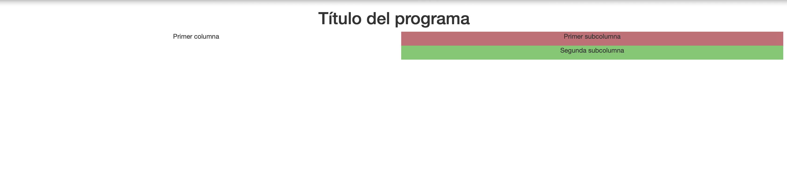{fig-align="center" width="420"}

Nótese que, para introducir el título, usamos otro tipo de contenedor HTML `h1()`, mientras que para textos de cada columna, usamos un contenedor simple de texto `p()`. Además de lo anterior, también podemos notar que el texto de la segunda subcolumna se encuentra prácticamente pegado al de la primera, esto ocurre ya que, al no existir elementos dentro del espaciado entre ambas columnas, el contenedor de texto se introducirá en la parte superior. En cuanto añadamos algunos otros *inputs* y *outputs*, podremos comenzar a ver la diferencia entre espacios de cada contenedor.

Como ya te habrás dado cuenta, una ventaja notable del uso de shiny para crear apps web es la facilidad para crear una interfaz muy rápidamente. Si nosotros tradujéramos este código a HTML, tendríamos:

```{r, eval=FALSE}
<div class="container-fluid">
  <div class="col-sm-12" align="center">
    <h1>Título del programa</h1>
  </div>
  <div class="col-sm-6" align="center">
    <p>Primer columna</p>
  </div>
  <div class="col-sm-6">
    <div class="col-sm-12" align="center">
      <p>Primer subcolumna</p>
    </div>
    <div class="col-sm-12" align="center">
      <p>Segunda subcolumna</p>
    </div>
  </div>
</div>
```

Algo más complicado de interpretar para alguien que no tenga mucha experiencia con la creación de páginas web.

Regresemos a la pantalla que estamos creando.

#### Inputs

Una vez establecido el diseño de nuestra app, podemos comenzar a introducir los elementos con los que el usuario va a interactuar, como lo son selectores y botones. Estos inputs serán una forma de interactuar dinámicamente con las funciones del servidor. Los principales *inputs* que vamos a utilizar serán:

-   `selectInput()`: Para seleccionar un elemento de una lista desplegable.
-   `numericInput()`: Para introducir valores numéricos como inputs.
-   `textInput()`: Para introducir cadenas de texto como inputs.
-   `sliderInput()`: Para introducir valores numéricos dentro de un rango establecido.
-   `dateInput()`: Para introducir fechas individuales.
-   `dateRangeInput()`: Para introducir rangos de fechas (fecha inicial y fecha final).
-   `fileInput()`: Para subir archivos como inputs (Ej. Documentos excel o csv).
-   `checkboxInput()`: Para retornar valores booleanos como inputs.
-   `radioButtons()`: Para seleccionar un elemento concreto. Recomendable en lugar de un `selectInput()` cuando tenemos pocos elementos a escoger.
-   `actionButton()`: Para retrasar la renderización de un output hasta dar click a un evento (botón).

Estos inputs son las versiones nativas de la librería `shiny`, sin embargo, existen versiones mucho más customizables y amigables a la vista, provenientes de la librería `shinyWidgets`, por ejemplo: `pickerInput()` como equivalente de `selectInput()`, o `airDatepickerInput()` como equivalente de `dateInput()` y `dateRangeInput()` (si tenemos el parámetro `range = TRUE`), entre otros elementos. Poco a poco iremos viendo cada uno de ellos.

Ahora, ¿cómo usamos estos *inputs* para interactuar con el servidor? Dependiendo de cada input, se requerirán ciertos parámetros específicos, por ejemplo, en el caso de un `selectInput()`, tendremos que añadir las opciones a escoger dentro de un vector, mientras que un `textInput()` no requerirá que añadamos necesariamente ninguna opción (aunque si podemos establecer una sugerencia predefinida), ya que este último tiene la intención de aceptar un texto libre como input. A pesar de esas diferencias, todos los *inputs* necesariamente requerirán un elemento: El **InputID**. Un InputID no es más que un nombre único que utilizaremos como identificador para llamar del lado del servidor y que, en consecuencia, permita obtener correctamente las selecciones o parámetros que el usuario haga con ese input específico, por ejemplo:

```{r, eval=FALSE}
selectInput(
  inputId = "mis_opciones",
  label = "Opciones",
  choices = c("Opcion 1", "Opcion 2", "Opcion 3")
)
```

En este caso, para nosotros poder llamar a este input en el lado del servidor, lo haremos mediante el código `input$mis_opciones`. Necesariamente debemos hacer uso de `input$` para seleccionar el objeto en cuestión, ya que de esta forma el programa identifica que se trata de un input dinámico y no de un objeto preestablecido en la sesión.

Los *inputs* (dependiendo del caso) devuelven las respuestas seleccionadas como un vector, por lo que si hay una selección múltiple en alguno de ellos, lógicamente podremos acceder a cada uno de sus elementos mediante indexación, por ejemplo, `input$mis_opciones[1]`. Más adelante veremos las implicaciones de vectores múltiples del lado del servidor y cómo trabajarlos correctamente.

#### Outputs

Así como los inputs son solo una cara de la moneda, siendo *aquello que el usuario introduce como parámetro(s)*, podemos definir a los *outputs* como aquellos elementos que serán retornados a partir de la información establecida, siendo resultados dinámicos con los que podremos interactuar en mayor o menor medida, dependiendo del tipo de elemento devuelto. Dicho en otras palabras, un *output* no es mas que el objeto resultante de todo el procesamiento de información realizada en el *backend*, a partir de los parámetros que se hayan introducido. Típicamente, los *outputs* en aplicaciones web suelen ser: cadenas de texto, gráficos, mapas y elementos interactivos (*outputs* de los que podemos obtener más información), y estarán en función de lo que queramos mostrar en nuestro programa.

Estos objetos resultantes son mucho más sencillos de entender dentro del `UI` que sus contrapartes (*inputs*), ya que suelen estar basados únicamente en tres parámetros: *OutputID* (identificador único del elemento resultante que queremos mostrar), *width* (anchura del elemento) y *height* (altura del elemento). Veamos un ejemplo:

```{r, eval=FALSE}
fluidPage(
  column(
    width = 3,
    selectInput(
      inputId = "mis_opciones",
      label = "Opciones",
      choices = c("Opcion 1", "Opcion 2", "Opcion 3")
      )
  ),
  column(
    width = 9,
    plotOutput("mi_grafico", width = "400px", height = "600px")
  )
)
```

Del código mostrado anteriormente, podemos darnos cuenta de que cada elemento, ya sean *inputs* o *outputs*, tiene un identificador único, con el que podremos interactuar con esos elementos en particular, pero ¿cómo exactamente logramos que las entradas y salidas de nuestro programa se conecten entre si? Aquí es donde entra en juego el corazón de nuestro programa: **El servidor** o **server**.

### Server

Hasta ahora, hemos visto rápidamente cómo funciona una interfaz en shiny, así como el manejo que podemos hacer para customizar la aplicación que el usuario final va a ver en su computadora, pero esta sección nos ayudará a entender cómo funciona la magía en nuestra programa, es decir, la forma en la que haremos que los parámetros establecidos nos den un resultado específico. Al principio será un tema bastante sencillo, pero poco a poco se irá complicando, por lo que procuraré ser lo más simple posible en las explicaciones de la lógica utilizada en esta parte.

Primero, comencemos por entender el servidor en si. Un código o *script* en R no es interactivo en si, ya que necesitamos establecer objetos y valores para obtener resultados, ¿cómo podemos hacerlo dinámico? Simplemente convirtiendo ese *script* en una función, donde los objetos y valores sean parámetros de ella. El servidor de una aplicación web no es más que una función con dos parámetros: *input* y *output*, principalmente. Habrá aplicaciones en las que establezcamos un tercer parámetro: *session*, el cual veremos con detalle más adelante, cuando profundicemos en la reactividad del servidor.

Típicamente, el servidor se verá de la siguiente manera:

```{r, eval=FALSE}
server <- function(input, output){
  
}
```

#### Conectando la interfaz: Reactividad

Como recordarás, anteriormente te mencioné que la forma en la que nosotros podremos acceder a un elemento de un *input* o un *output* será mediante su ID, al cual llamaremos con un signo `$`. Regresemos al ejemplo anterior, es decir:

```{r, eval=FALSE}
fluidPage(
  column(
    width = 3,
    selectInput(
      inputId = "mis_opciones",
      label = "Opciones",
      choices = c("Opcion 1", "Opcion 2", "Opcion 3")
      )
  ),
  column(
    width = 9,
    plotOutput("mi_grafico", width = "400px", height = "600px")
  )
)
```

Obviamente, la idea de esa interfaz es mostrar un gráfico (identificado por el ID `mi_grafico`) que estará en función de una de las opciones del input `mis_opciones`. Para nosotros poder referirnos a ese gráfico en el lado del servidor, vamos a crear un objeto que lo renderice con la función `renderPlot()`, tal que:

```{r, eval=FALSE}
server <- function(input, output){
  
  output$mi_grafico <- renderPlot({
    plot(x, y)
  })
  
}
```

Nótese que, además del uso del paréntesis, también utilicé corchetes dentro de la función `renderPlot()`, ya que eso me permitirá una mayor flexibilidad al momento de escribir códigos más complejos cuando quiera renderizar otro tipo objeto.

En de la función `renderPlot()` es donde vamos a hacer uso de funciones menos dinámicas para generar el gráfico, siendo en este caso `plot()`. Todas las librerías de gráficos, mapas y objetos interactivos que esten habilitadas para trabajar con aplicaciones web siempre tendrán una función con el prefijo `render`, la cual será aquella que estableceremos en el servidor para generar el objeto que necesitemos. Ahora, las funciones de estilo `render` son elementos *reactivos*, es decir, aquellos que cambian su valor dependiendo de los elementos de entrada (*inputs*), como lo mencioné anteriormente.

#### *Intermedio*: Un ejemplo práctico

Ahora que tenemos un conocimiento más general del funcionamiento de una aplicación web, vamos a hacer una breve pausa con las explicaciones, para poner en práctica lo aprendido hasta ahora con un ejemplo real. Utilicemos el [el siguiente set de datos](https://github.com/Jorge-hercas/r-para-inteligencia-de-negocios/blob/main/CSV/english_education.csv), proveniente de la *Oficina para estadísticas nacionales de UK*, el cual tiene como objetivo el medir los niveles educativos de diferentes ciudades y pueblos de UK. Comencemos por visualizar los datos en cuestión:

```{r, eval=FALSE}
uk_data <- read.csv("https://raw.githubusercontent.com/Jorge-hercas/
                    r-para-inteligencia-de-negocios/main/CSV/
                    english_education.csv")

uk_data |> 
  head()
```

```{r, echo=FALSE}
uk_data <- read.csv("https://raw.githubusercontent.com/Jorge-hercas/r-para-inteligencia-de-negocios/main/CSV/english_education.csv")

uk_data |> 
  as_tibble() |> 
  head()
```

Supongamos que de ese conjunto de datos queremos visualizar el promedio de población registrada en 2011 (`population_2011`) por región de la localidad `rgn11nm`. Esa tarea es en realidad muy sencilla, ya que simplemente podemos crear un gráfico con `ggplot2` que nos muestre la información que queremos, tal que:

```{r, eval=FALSE}
uk_data |> 
  group_by(rgn11nm) |> 
  summarise(promedio = mean(population_2011, na.rm = T)) |> 
  na.omit() |> 
  arrange(desc(promedio)) |> 
  ggplot(aes(x = promedio, y = forcats::fct_reorder(rgn11nm, promedio) ))+
  geom_col(fill = "darkred") + 
  theme_minimal() +
  ylab(label = "Region")
```

La parte interesante comienza cuando queremos realizar múltiples vistas accionables por un usuario ajeno a nuestro código. Supongamos que queremos filtrar nuestros datos dinámicamente por tipo de ciudad (`size_flag`), aquí tenemos dos opciones: Generar un filtro que acepte solo un argumento (`==`) o un filtro múltiple (`%in%`). Comencemos con un filtro de un solo argumento, el cual vamos a implementar en una app que nos permita realizar esta operación a partir de un `selectInput()`. Primero, nuestro selector necesitará obtener las opciones de tamaños de ciudad disponibles en nuestros datos, por lo que podemos hacer uso de una función `unique()`, tal que:

```{r, eval=FALSE}
selectInput(inputId = "ciudad", label = "Tipo de ciudad", 
            choices = unique(uk_data$size_flag))
```

Además, podemos reordenar los valores por orden alfabético:

```{r, eval=FALSE}
selectInput(inputId = "ciudad", label = "Tipo de ciudad", 
            choices = sort(unique(uk_data$size_flag)))
```

El `inputId` del selector es *ciudad*, por lo que para aplicar el filtro dentro del código del gráfico, tendremos que llamarlo en una función `filter()` de la siguiente manera:

```{r, eval=FALSE}
uk_data |> 
  filter(size_flag == input$ciudad) |>
  group_by(rgn11nm) |> 
  summarise(promedio = mean(population_2011, na.rm = T)) |> 
  na.omit() |> 
  arrange(desc(promedio)) |> 
  ggplot(aes(x = promedio, 
             y = forcats::fct_reorder(rgn11nm, promedio) ))+
  geom_col(fill = "darkred") + 
  theme_minimal() +
  ylab(label = "Region")
```

Obviamente, este código de forma individual no funciona, para que la orden pueda ser ejecutada necesariamente debe estar dentro de una función de renderización, es decir:

```{r, eval=FALSE}
output$grafico <- renderPlot({
      
    uk_data |> 
      filter(size_flag == input$ciudad) |> 
      group_by(rgn11nm) |> 
      summarise(promedio = mean(population_2011, na.rm = T)) |> 
      na.omit() |> 
      arrange(desc(promedio)) |> 
      ggplot(aes(x = promedio, 
                 y = forcats::fct_reorder(rgn11nm, promedio) ))+
      geom_col(fill = "darkred") + 
      theme_minimal() +
      ylab(label = "Region")
      
    })
```

La cual estará conectada a la interfaz del programa a partir del *ID* del gráfico, siendo en este caso:

```{r, eval=FALSE}
plotOutput("grafico")
```

Vamos a generar una vista centrada del gráfico y selector, que además incluya un breve título:

```{r, eval=FALSE}
fluidPage(
    column(
      width = 12,
      align = "center",
      h1("Mi primer shiny app"),
      br(),
      selectInput("ciudad", "Tipo de ciudad", 
                  choices = unique(uk_data$size_flag)),
      br(),
      plotOutput("grafico", width = "900px")
    )
  )
```

Nótese que en este caso, para centrar completamente los elementos de la interfaz, generamos una columna de tamaño completo, en la cual separamos los elementos de forma vertical mediante un `br()`, equivalente a `<br/>` en HTML.

Finalmente, para nosotros poder ejecutar nuestra aplicación, haremos uso de la función `shinyApp()`, por lo que el código en conjunto será:

```{r, eval=FALSE}
# Librerías
library(ggplot2)
library(dplyr)
library(shiny)

# Datos
uk_data <- read.csv("https://raw.githubusercontent.com/Jorge-hercas/
                    r-para-inteligencia-de-negocios/main/CSV/
                    english_education.csv")
# UI
frontend <- fluidPage(
    column(
      width = 12,
      align = "center",
      h1("Mi primer shiny app"),
      br(),
      selectInput("ciudad", "Tipo de ciudad", 
                  choices = unique(uk_data$size_flag)),
      br(),
      plotOutput("grafico", width = "900px")
    )
  )
# SERVER
backend <- function(input, output){
    
    output$grafico <- renderPlot({
      
      uk_data |> 
        filter(size_flag == input$ciudad) |> 
        group_by(rgn11nm) |> 
        summarise(promedio = mean(population_2011, na.rm = T)) |> 
        na.omit() |> 
        arrange(desc(promedio)) |> 
        ggplot(aes(x = promedio, 
                   y = forcats::fct_reorder(rgn11nm, promedio) ))+
        geom_col(fill = "#ad3d42") + 
        theme_minimal() +
        ylab(label = "Region")
      
    })
  }

# App
shinyApp(ui = frontend, server = backend)
```

Siendo la app resultante el de la figura 9.5.

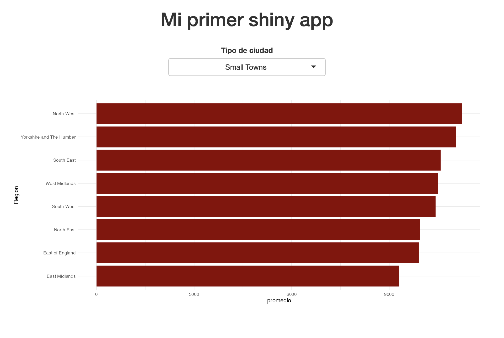{fig-align="center" width="520"}

#### Objetos `reactive()`

Los objetos `reactive()` son una forma en la que nosotros convertiremos nuestros datos a una función dinámica, la cual usaremos después para generar nuestros *outputs*. Este tipo de elementos son convenientes cuando queremos ramificar una cierta operación en múltiples elementos de salida, por ejemplo: Supongamos que queremos generar dos gráficos diferentes que estarán ligados al mismo filtro. Podríamos directamente generar el código en cada uno de los objetos `render`, escribiendo en cada caso el filtro que necesitamos, sin embargo, si queremos escalar este programa, añadiendo cada vez más y más elementos de salida, individualizar esta operación a cada caso hará que nuestro programa se vuelva muy lento. Una forma más eficiente de ejecutar estas operaciones será partiendo de un objeto `reactive()` que ya filtre nuestros datos, para después únicamente llamarlo en cada `render`. Gráficamente:

{fig-align="center" width="280"}

Regresemos a nuestro ejemplo anterior. Vamos a añadir un gráfico adicional que ahora mida el porcentaje de residentes que tienen ingresos altos (arriba de 10,000), divido por zonas con/sin universidades, es decir:

```{r}
uk_data |> 
  group_by(rgn11nm, university_flag) |> 
  summarise(
    promedio_ing = 
      mean(activity_at_age_19_employment_with_earnings_above_10_000, 
           na.rm = T)) |> 
  na.omit() |> 
  ggplot(aes(y = promedio_ing, x = rgn11nm, fill = university_flag)) +
  geom_col(position = position_dodge(width = 0.9), width = 0.7) + 
  theme_minimal()+
  theme(legend.position = "bottom",
        axis.text=element_text(size=7),
        axis.text.x = element_text(angle = 30))+
  scale_fill_manual(values = c("#ad3d42", "#3d4ead"),
                    name = "¿Tiene escuela?") +
  labs(
    x = "Zona",
    y = "Promedio")
```

Supongamos que a este gráfico le queremos aplicar el mismo filtro que estamos usando en el otro elemento, es decir, por tipo de ciudad (`filter(size_flag == input$ciudad)`). Conforme vayamos agregando gráficos y otros elementos, estos partirán de la misma base, que es la tabla de datos filtrada dinámicamente. Vamos a tomar esta base y convertirla en una función `reactive()`, tal que:

```{r, eval=FALSE}
datos_dinamicos <- reactive({
  
  uk_data |> 
        filter(size_flag == input$ciudad)
  
})
```

Por tanto, para cada *output* que utilice como base ese filtro, simplemente utilizaremos el objeto (o función) `datos_dinamicos()`, por ejemplo:

```{r, eval=FALSE}
output$grafico <- renderPlot({
      
      datos_dinamicos() |> 
        group_by(rgn11nm) |> 
        summarise(promedio = mean(population_2011, na.rm = T)) |> 
        na.omit() |> 
        arrange(desc(promedio)) |> 
        ggplot(aes(x = promedio, 
                   y = forcats::fct_reorder(rgn11nm, promedio) ))+
        geom_col(fill = "#ad3d42") + 
        theme_minimal() +
        ylab(label = "Region")
      
    })
```

Lo que hará más eficiente nuestra aplicación. Nótese que, al momento de convertir un objeto en un elemento reactivo, este pasa a ser una función, por lo que ahora debemos llamarlo con `datos_dinamicos()`, en lugar de `datos_dinamicos`.

Vayamos con el código completo, utilizando ahora dos columnas para cada gráfico. Añadiendo la función en el servidor, el código será:

```{r, eval=FALSE}
frontend <- fluidPage(
    column(
      width = 12,
      align = "center",
      h1("Mi primer shiny app"),
      br(),
      selectInput("ciudad", "Tipo de ciudad", 
                  choices = unique(uk_data$size_flag)),
      
    ),
    column(
      width = 6, align = "center",
      plotOutput("grafico", width = "600px")
    ),
    column(
      width = 6, align = "center",
      plotOutput("grafico_2", width = "600px")
    )
  )

backend <- function(input, output){
    
    datos_dinamicos <- reactive({
      
      uk_data |> 
        filter(size_flag == input$ciudad)
      
    })
    
    output$grafico <- renderPlot({
      
      datos_dinamicos() |> 
        group_by(rgn11nm) |> 
        summarise(promedio = mean(population_2011, na.rm = T)) |> 
        na.omit() |> 
        arrange(desc(promedio)) |> 
        ggplot(aes(x = promedio, 
                   y = forcats::fct_reorder(rgn11nm, promedio) ))+
        geom_col(fill = "#ad3d42") + 
        theme_minimal() +
        ylab(label = "Region")
      
    })
    
    output$grafico_2 <- renderPlot({
      
      datos_dinamicos() |> 
        group_by(rgn11nm, university_flag) |> 
        summarise(
          promedio_ing = 
            mean(activity_at_age_19_employment_with_earnings_above_10_000, 
                 na.rm = T)) |> 
        na.omit() |> 
        ggplot(aes(y = promedio_ing, x = rgn11nm, fill = university_flag)) +
        geom_col(position = position_dodge(width = 0.9), width = 0.7) + 
        theme_minimal()+
        theme(legend.position = "bottom",
              axis.text=element_text(size=7))+
        scale_fill_manual(values = c("#ad3d42", "#3d4ead")) +
        labs(
          x = "Zona",
          y = "Promedio")
      
    })
  }

shinyApp(ui = frontend, server = backend)
```

En este caso, la aplicación resultante será:

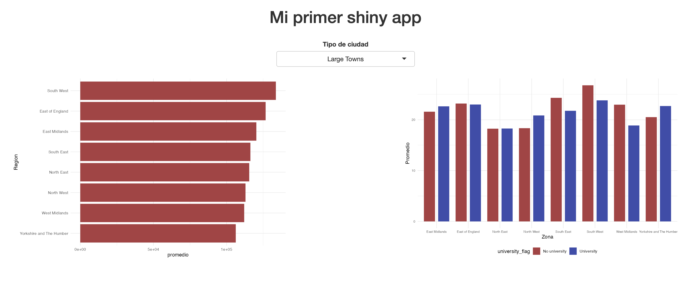{fig-align="center" width="520"}

Al igual que en la funciones comunes, cuando utilizamos un objeto `reactive()`, este necesariamente debe retornar al final de la evaluación el objeto que queremos utilizar globalmente. En el ejemplo anterior únicamente hicimos uso de un filtro y una concatenación de objetos `|>`, pero en situaciones donde hagamos evaluaciones, por ejemplo, con condiciones, será necesario retornar directamente el objeto fuera de esa evaluación. Tomemos como ejemplo el caso anterior, donde hicimos el filtro condicional, supongamos que ahora vamos a aplicar ese filtro solo en caso de que un *input* booleano sea verdadero, en tal caso el objeto `reactive()` será:

```{r, eval=FALSE}
datos_dinamicos <- reactive({
      
      if (input$bool == T){
        resultado <- uk_data |> 
          filter(size_flag == input$ciudad)
      }else{
        resultado <- uk_data
      }
  uk_data
      
    })
```

Donde el objeto resultante de esa evaluación se encuentra hasta el final de la función.

#### Eventos reactivos

Cuando seleccionamos ciertas opciones, no siempre queremos que estas se ejecuten de inmediato. Piensa en una aplicación que tiene tres, cinco o hasta más *inputs* con los que generar un gráfico o elemento cualquiera. Seleccionar todos los parámetros nos va a llevar un tiempo, por lo que para un usuario que esté usando el programa, será bastante incómodo tener que ver múltiples renderizaciones del objeto mientras termina de seleccionar todos los parámetros, por lo que en esa situación lo más óptimo sería utilizar un boton de acción que utilizaremos como **evento**, para que el objeto de salida sea ejecutado únicamente cuando ocurra dicho evento (el botón sea precionado). Una vez más, regresemos a la aplicación que hemos creado hasta ahora, supongamos que queremos renderizar ambos gráficos hasta que presionemos un botón, tal que:

```{r, eval=FALSE}
actionButton(inputId = "graficar", label = "Generar gráficos")
```

Podemos añadir dicho boton en la interfaz de nuestra app, debajo del selector:

```{r, eval=FALSE}
fluidPage(
    column(
      width = 12,
      align = "center",
      h1("Mi primer shiny app"),
      br(),
      selectInput("ciudad", "Tipo de ciudad", 
                  choices = unique(uk_data$size_flag)),
      actionButton(inputId = "graficar", label = "Generar gráficos")
    ),
    column(
      width = 6, align = "center",
      plotOutput("grafico", width = "600px")
    ),
    column(
      width = 6, align = "center",
      plotOutput("grafico_2", width = "600px")
    )
  )
```

Para ligar los gráficos a la acción de presionar el botón, solo debemos englobarlos en una función `observeEvent()`:

```{r, eval=FALSE}
observeEvent(input$graficar,{
  
  output$grafico <- renderPlot({
      
      datos_dinamicos() |> 
        group_by(rgn11nm) |> 
        summarise(promedio = mean(population_2011, na.rm = T)) |> 
        na.omit() |> 
        arrange(desc(promedio)) |> 
        ggplot(aes(x = promedio, 
                   y = forcats::fct_reorder(rgn11nm, promedio) ))+
        geom_col(fill = "#ad3d42") + 
        theme_minimal() +
        ylab(label = "Region")
      
    })
    
  output$grafico_2 <- renderPlot({
      
      datos_dinamicos() |> 
        group_by(rgn11nm, university_flag) |> 
        summarise(
          promedio_ing = 
            mean(activity_at_age_19_employment_with_earnings_above_10_000, 
                 na.rm = T)) |> 
        na.omit() |> 
        ggplot(aes(y = promedio_ing, x = rgn11nm, fill = university_flag)) +
        geom_col(position = position_dodge(width = 0.9), width = 0.7) + 
        theme_minimal()+
        theme(legend.position = "bottom",
              axis.text=element_text(size=7))+
        scale_fill_manual(values = c("#ad3d42", "#3d4ead")) +
        labs(
          x = "Zona",
          y = "Promedio")
      
    })
})
```

El uso de `observeEvent()` no está limitado a un solo elemento. Sencillamente podemos ligar la renderización de un *output* a múltiples accionables, añadiéndolos a una lista, por ejemplo:

```{r, eval=FALSE}
observeEvent(list(input$graficar, input$otro_evento),{
  
  ...
  # Procesos ligados a múltiples eventos
  ...
  
})
```

El hecho de que un proceso se encuentre relacionado a múltipes eventos no significa que todos tengan que ocurrir, si no que al menos uno de ellos se ejecute, sea cual sea este.

Los eventos comunmente están asociados a botones, sin embargo, no es necesario que este sea el caso. De igual forma pueden estar ligados a ciertos *inputs* de otras clases, como selectores o booleanos. Todo dependerá del contexto de la aplicación y lo que necesitemos para mejorar la experiencia del usuario final.

Ahora, debemos considerar que estos eventos suponen que, el accionar el botón o *input* en nuestro programa, mantendrá la renderización activa, es decir, que al nosotros utilizar el botón, cuando volvamos a seleccionar parámetros en el programa, ya no será necesario volver a presionarlo, ya que el *evento esperado* ya ocurrió, por lo que ahora los gráficos se van a ejecutar con normalidad, sin estar ligados a nada. Cuando nosotros queremos asegurarnos de que un objeto únicamente sea renderizado cada que el elemento de acción es ejecutado, independientemente de las veces que hagamos esto, tendremos que utilizar `bindEvent()` en lugar de `observeEvent()`. Para el uso de `bindEvent()`, en lugar de englobar las funciones de renderización, las vamos a concatenar:

```{r, eval=FALSE}
    output$grafico <- renderPlot({
        
        datos_dinamicos() |> 
          group_by(rgn11nm) |> 
          summarise(promedio = mean(population_2011, na.rm = T)) |> 
          na.omit() |> 
          arrange(desc(promedio)) |> 
          ggplot(aes(x = promedio, 
                     y = forcats::fct_reorder(rgn11nm, promedio) ))+
          geom_col(fill = "#ad3d42") + 
          theme_minimal() +
          ylab(label = "Region")
        
      }) |> 
      bindEvent(input$graficar)
```

De esta forma, no importa que ya hayamos ejecutado el evento, para cada nueva renderización del gráfico tendremos que volver a accionarlo.

#### La sesion

A la función que creamos para el servidor de nuestra aplicación también podemos añadirle un tercer argumento: `session`, siendo el código:

```{r, eval=FALSE}
server = function(input, output, session){
  ...
}
```

El elemento `session` nos permitirá acceder al estado individual de cada sesión (valga la redundancia) creada por la aplicación, es decir, cuando nosotros ejecutamos una shiny app, cada vez que abrimos el programa en una pestaña diferente del navegador, esta pestaña representará una sesión individual que responderá únicamente a esa vista, siendo el argumento `session` una forma de acceder a esa información individual e interacturar con ella.

No siempre vamos a querer partir del estado original de una aplicación cuando la ejecutemos de nuevo, sobre todo cuando hay una cantidad considerable de parámetros que ya hemos establecido en el análisis que estemos haciendo. Podemos hacer uso de `session` para, por ejemplo, guardar ciertos parámetros dentro del link de nuestra app y, de manera automática, inicializarla con las opciones que hayamos dejado al finalizar la sesión anterior. Retomemos la aplicación que hemos creado hasta ahora, con el argumento `session` añadido en el servidor; Para poder inicializarla desde un punto específico, simplemente debemos utilizar el argumento `enableBookmarking`, es decir:

```{r, eval=FALSE}
shinyApp(ui = frontend, server = backend, enableBookmarking = "url")
```

Para acceder al link exacto del estado actual de la aplicación, podemos hacer uso del *input* `bookmarkButton()` (añadiéndolo en el UI), que nos permitirá copiar ese link al portapapeles.

El uso de `session` no solo se limita a la información de la sesión actual, si no también a la manipulación dinámica de ella, por ejemplo, con los *inputs*. Pensemos en el *input* que utilizamos en la app de muestra para filtrar datos, este contiene las siguientes opciones:

```{r}
unique(uk_data$size_flag)
```

La tabla de datos también contiene la columna `university_flag`, que es mucho más general, al ser solamente un indicativo de las regiones con universidad. Suponamos que solo queremos mostrar en el selector del filtro aquellas opciones que tienen (o no) universidad, de manera condicional. Podemos cambiar el contenido del selector dinámicamente con la función `updateSelectInput()`, que toma la sesión en consideración para poder modificarla. Supongamos que ahora tenemos como *input* general el selector del indicativo de universidad, es decir:

```{r, eval=FALSE}
selectInput("escuela", "¿Tiene universidad?", 
            choices = unique(na.omit(uk_data$university_flag)))
```

A partir de ese *input* vamos a modificar el otro, tal que:

```{r, eval=FALSE}
function(input, output, session){
  
  observeEvent(input$escuela, {
    # Datos reactivos
    datos_filt <- reactive({
      uk_data |> 
        filter(university_flag == input$escuela)
    })
    # Actualización de la sesión
    updateSelectInput(session = session, inputId = "ciudad", 
                      choices = unique(datos_filt() ))
  })
  
}
```

En este caso, lo único que hicimos fue crear un objeto `reactive` con el data frame filtrado a cierta opción, para después tomar ese objeto y obtener los valores únicos que queden de la columna `size_flag`. Finalmente, el código completo de la app será:

```{r, eval=FALSE}
frontend <- fluidPage(
  column(
    width = 12,
    align = "center",
    h1("Mi primer shiny app"),
    br(),
    selectInput("escuela", "¿Tiene universidad?", 
                choices = unique(na.omit(uk_data$university_flag))),
    selectInput("ciudad", "Tipo de ciudad", 
                choices = unique(uk_data$size_flag)),
    actionButton(inputId = "graficar", label = "Generar gráficos")
    
  ),
  column(
    width = 6, align = "center",
    plotOutput("grafico", width = "600px")
  ),
  column(
    width = 6, align = "center",
    plotOutput("grafico_2", width = "600px")
  )
)

backend <- function(input, output, session){
  
  observeEvent(input$escuela, {
    datos_filt <- reactive({
      uk_data |> 
        filter(university_flag == input$escuela)
    })
    
    updateSelectInput(session = session, inputId = "ciudad", 
                      choices = unique(datos_filt()$size_flag ))
  })
  
  
  datos_dinamicos <- reactive({
    
    uk_data |> 
      filter(size_flag == input$ciudad)
    
  })
  
  observeEvent(input$graficar,{
    
    output$grafico <- renderPlot({
      
      datos_dinamicos() |> 
        group_by(rgn11nm) |> 
        summarise(promedio = mean(population_2011, na.rm = T)) |> 
        na.omit() |> 
        arrange(desc(promedio)) |> 
        ggplot(aes(x = promedio, 
                   y = forcats::fct_reorder(rgn11nm, promedio) ))+
        geom_col(fill = "#ad3d42") + 
        theme_minimal() +
        ylab(label = "Region")
      
    })
    
    output$grafico_2 <- renderPlot({
      
      datos_dinamicos() |> 
        group_by(rgn11nm, university_flag) |> 
        summarise(
          promedio_ing = 
            mean(activity_at_age_19_employment_with_earnings_above_10_000, 
                 na.rm = T)) |> 
        na.omit() |> 
        ggplot(aes(y = promedio_ing, x = rgn11nm, fill = university_flag)) +
        geom_col(position = position_dodge(width = 0.9), width = 0.7) + 
        theme_minimal()+
        theme(legend.position = "bottom",
              axis.text=element_text(size=7))+
        scale_fill_manual(values = c("#ad3d42", "#3d4ead")) +
        labs(
          x = "Zona",
          y = "Promedio")
      
    })
  })
}

shinyApp(ui = frontend, server = backend, enableBookmarking = "url")
```

#### Invalidando la reactividad

No en todas las situaciones en las que queramos ejecutar un evento vamos a necesitar que esta acción ocurra invariablemente (o que ocurra de la misma forma), ya que podemos tener ciertos *inputs* con valores incompatibles, o sin los valores necesarios para ejecutar de la forma correcta el *output* requerido. Regresemos al ejemplo que hemos venido trabajando hasta ahora, donde tenemos el *input* `selectInput()`:

```{r, eval=FALSE}
selectInput("ciudad", "Tipo de ciudad", choices = unique(uk_data$size_flag))
```

Al seleccionar datos individuales, este *input* por default siempre tendrá un valor asignado, sin embargo, si modificáramos el párametro `multiple = T` para aceptar más de un valor (manteniendo vacío el parámetro `selected`):

```{r, eval=FALSE}
selectInput("ciudad", "Tipo de ciudad", choices = unique(uk_data$size_flag),
            multiple = T)
```

Esto permitirá que comencemos nuestra app sin un valor seleccionado por default. Obviamente, al no tener un valor establecido, el gráfico conectado a este *input* no se renderizará, ya que la amplitud del vector a filtrar será igual a cero, por lo que en esta situación podríamos invalidar la renderización de los gráficos en cuestión, esto haciendo uso de las funciones `validate()` (para generar un validador previo que evitará la renderización del objeto) y `need()` (para especificar el *input* a evaluar). El uso de estas funciones es bastante sencillo, siendo que simplemente debemos aplicarlas como un prefijo dentro de la función de renderización del *output*, por ejemplo, con `output$grafico_2`:

```{r, eval=FALSE}
output$grafico_2 <- renderPlot({
  
      validate(
        need(input$ciudad, message = "Escoge un valor!")
      )
      
      datos_dinamicos() |> 
        group_by(rgn11nm, university_flag) |> 
        summarise(
          promedio_ing = 
            mean(activity_at_age_19_employment_with_earnings_above_10_000, 
                 na.rm = T)) |> 
        na.omit() |> 
        ggplot(aes(y = promedio_ing, x = rgn11nm, fill = university_flag)) +
        geom_col(position = position_dodge(width = 0.9), width = 0.7) + 
        theme_minimal()+
        theme(legend.position = "bottom",
              axis.text=element_text(size=7))+
        scale_fill_manual(values = c("#ad3d42", "#3d4ead")) +
        labs(
          x = "Zona",
          y = "Promedio")
      
    })
```

Por lo que, si no tenemos un valor establecido en `input$ciudad`, en lugar de devolver un error, se nos devolverá un mensaje de alerta preestablecido por nosotros:

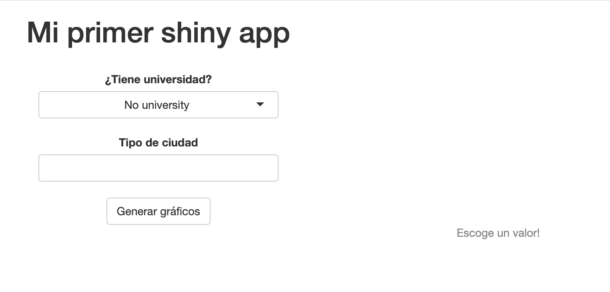{fig-align="center" width="520"}

Sencillamente, también podemos aplicar operaciones en una función `need()`, cuando queremos ser más específicos en las situaciones en las que queremos que no se renderice un objeto, por ejemplo:

```{r, eval=FALSE}
validate(
  need(input$ciudad == "Small Towns", 
       message = "Esta selección es inválida. Escoge otra")
)
```

De esta forma, cuando se seleccione un valor que cumpla con esa condición, a pesar de tener un elemento en el vector del *input*, igualmente nos devolverá un mensaje de alerta en lugar del gráfico a renderizar.

::: callout-warning
## Cuidado

No olvides que un selector múltiple generará un vector de longitud *\>=1*, por lo que necesitarás cambiar el operador de filtro en el objeto `reactive()` de `==` a `%in%`, en este caso:

```{r, eval=FALSE}
datos_dinamicos <- reactive({
    uk_data |> 
      filter(size_flag %in% input$ciudad)
  })
```
:::

Usar `validate()` no es la única manera en la que podemos cancelar la renderización de un elemento, ni la más agradable visualmente, pero si la más sencilla. Veamos algunas formas más interesantes de abordar este problema, utilizando la librería `shinypop` (del [siguiente reporsitorio de Github](https://github.com/dreamRs/shinypop)). Este paquete es una recopilación de funciones escritas en javaScript para mostrar notificaciones y mensajes de alerta, por lo que podemos utilizar estos elementos a nuestro favor para manejar la reactividad.

Comencemos con un ejemplo sencillo: Vamos a evaluar la renderización de los gráficos en la app que estamos construyendo, solo que en esta ocasión lo haremos mediante una estructura `if`, tal que:

```{r, eval=FALSE}
observeEvent(input$graficar,{
    
    if (is.null(input$ciudad)==F){
      
      output$grafico <- renderPlot({
      ...
    })
    
    output$grafico_2 <- renderPlot({
      ...
    })
    
    }
  })
```

En este caso, si no seleccionamos un valor para `input$ciudad` lógicamente el vector resultante será de longitud cero, equivalente a un objeto `NULL`, por lo que al no cumplir esa condición, los gráficos no se crearán y no se devolverá un mensaje de error. Ahora, lo que si queremos que se devuelva es un mensaje de alerta emergente, por lo que podemos añadir a la evaluación una función de la librería `shinypop`, como puede ser `noty(text = "El input 'ciudad' está vacío. Añade un valor", type = "warning")`, resultando en:

```{r, eval=FALSE}
observeEvent(input$graficar,{
    
    if (is.null(input$ciudad)==F){
      
      output$grafico <- renderPlot({
      ...
    })
    
    output$grafico_2 <- renderPlot({
      ...
    })
    
    }else{
      noty(text = "El input 'ciudad' está vacío. Añade un valor", 
           type = "warning")
    }
  })
```

En este caso, para poder visualizar la notificación emergente, tendremos que añadir el código `use_noty()` en la parte inicial de la interfaz, tal que:

```{r, eval=FALSE}
fluidPage(
  use_noty(),
  ...
)
```

Ya que debemos añadir esta dependencia al código HTML de la aplicación, de forma similar a como añadimos dependencias de JavaScript en la sección `<head>` de una plantilla HTML.

Finalmente, al querer obtener el *output* sin valores en el *input*, el resultado gráfico será:

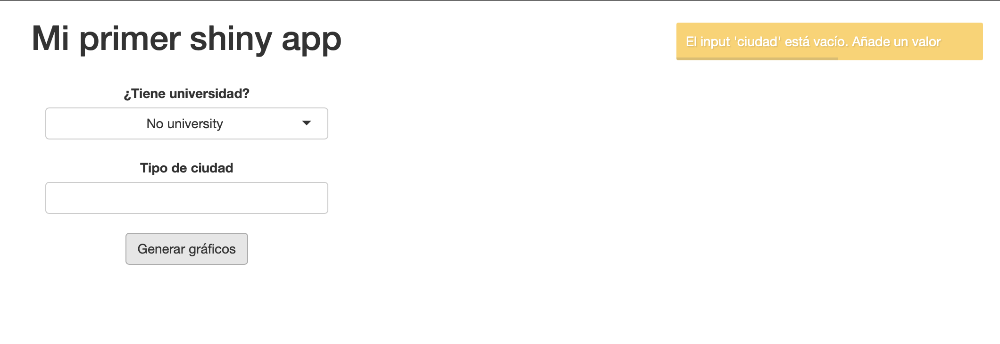{fig-align="center" width="520"}

Estas notificaciones son algo pequeñas y no siempre las más intuitivas, por lo que podríamos utilizar algo un poco más *"llamativo"*, por ejemplo, con una notificación en el centro de la pantalla con la función `nx_report_warning()`. Para poder aplicar esta función, esta vez debemos insertar `use_notiflix_report()` en la parte inicial de la interfaz, tal que:

```{r, eval=FALSE}
fluidPage(
  use_notiflix_report(),
  ...
)
```

Y aplicar `nx_report_warning()` en el servidor, de manera similar a como lo hicimos en el caso anterior:

```{r, eval=FALSE}
observeEvent(input$graficar,{
    
    if (is.null(input$ciudad)==F){
      
      output$grafico <- renderPlot({
      ...
    })
    
    output$grafico_2 <- renderPlot({
      ...
    })
    
    }else{
      nx_report_warning(title = "Cuidado",
                        message = "No se ha seleccionado el input",
                        button = "De acuerdo")
    }
  })
```

Resultando en:

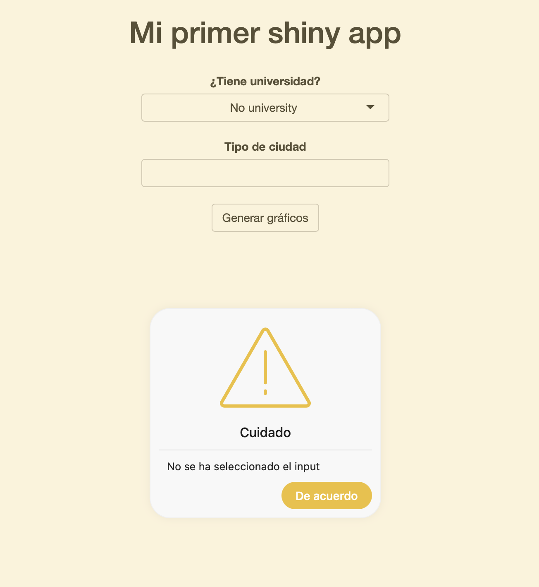{fig-align="center" width="320"}

Una notificación mucho más clara e interactiva para el usuario final. Por supuesto, el uso de de estas notificaciones no es más que un aditamento en una estructura de control para invalidar la renderización de un elemento, siendo que existen muchas otras librerías que nos pueden ayudar a cumplir este mismo propósito, como es el caso de `shinyalert`, `shinytoastr`, `shinyvalidate`, `awn`, entre otros recursos.

### Interfaz dinámica

Los objetos reactivos que pueden ser ejecutados del lado del servidor no solo se limitan a gráficos, textos, tablas o mapas simples. De igual forma, podemos renderizar interfaces completas de forma dinámica, basándonos en otros *inputs*. En la app trabajada hasta ahora, de manera estática establecimos que cada gráfico se mantenga en una columna por separado, ¿qué tal si hacemos de esto una opción para el usuario final? De tal forma que ahora, basados en una selección, podamos establecer la forma en la que visualizaremos ambos gráficos. Comencemos por reemplazar ambas columnas contenedoras de los gráficos por un *output*, así como añadir una selección inicial que nos permita establecer la orientación en la que veremos los elementos:

```{r, eval=FALSE}
frontend <- fluidPage(
  column(
    use_notiflix_report(),
    width = 12,
    align = "center",
    h1("Mi primer shiny app"),
    br(),
    radioButtons("tipo_vista", "Tipo de vista", 
                 choices = c("Horizontal", "Vertical"),
                 inline = T),
    selectInput("escuela", "¿Tiene universidad?", 
                choices = unique(na.omit(uk_data$university_flag))),
    selectInput("ciudad", "Tipo de ciudad", 
                choices = unique(uk_data$size_flag)),
    actionButton(inputId = "graficar", label = "Generar gráficos")
    
  ),
  uiOutput("interfaz")
)
```

Ahora, del lado del servidor, simplemente vamos a trabajar esta parte de la interfaz como cualquier *output*, tal que:

```{r, eval=FALSE}
output$interfaz <- renderUI({
    
    if (input$tipo_vista == "Horizontal"){
      tagList(
        column(
          width = 6, align = "center",
          plotOutput("grafico", width = "600px")
        ),
        column(
          width = 6, align = "center",
          plotOutput("grafico_2", width = "600px")
        )
      )
    }else{
      column(
        width = 12,
        align = "center",
        plotOutput("grafico", width = "600px"),
        br(),
        plotOutput("grafico_2", width = "600px")
      )
    }
    
  })
```

La app resultante será:

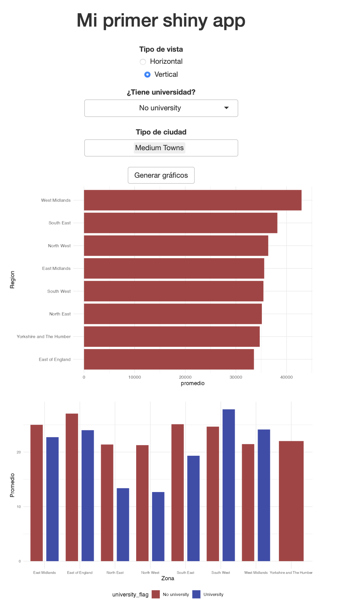{#fig-ver fig-align="center" width="220"}

Nótese que, en el caso donde tenemos dos columnas, las englobamos en una función `tagList()`, ya que el objeto *output* resultante debe ser uno, por lo que al tener dos columnas, de no introducirlas dentro de `tagList()`, se nos devolvería un error.

Así como los roles de trabajo en Power BI, podemos utilizar las interfaces dinámicas para generar páneles que solo se muestren a ciertos usuarios, tema que analizaremos con detalle más adelante, cuando veamos la seguridad en aplicaciones web.

#### Inputs en el servidor

Anteriormente ya vimos como actualizar valores de un *input* en el servidor mediante la sesión, pero también tenemos la opción de crear *inputs* temporales que se generen en el servidor, como es el caso de algunas notificaciones emergentes. Retomemos las notificaciones de la librería `shinypop`, por ejemplo: `nx_confirm()`. Esta notificación se interpreta como un selector de dos elementos, por lo que la podemos aplicar como un *input* temporal que solo es generado bajo una situación específica. Supongamos que en la aplicación trabajada hasta ahora queremos mandar una alerta cada que se seleccione un cierto valor, siendo que, en caso de confirmar la notificación se generen los gráficos correspondientes, es decir:

```{r, eval=FALSE}
observeEvent(input$graficar,{
  
  nx_confirm(
      inputId = "confirmacion",
      title = "¿Seguro que quieres generar el gráfico?",
      button_ok = "Si, ahora",
      button_cancel = "Aún no"
    )
  
})

observeEvent(input$confirmacion,{
  
  if (input$confirmacion == T){
    
      output$grafico <- renderPlot({
        ...
      })
      
      output$grafico_2 <- renderPlot({
        ...
      })
    }
  
})
```

En este caso, al nosotros dar click en el botón para generar el gráfico, se nos devolverá una alerta de confirmación en forma de un *input* temporal, por lo que para poder generar los gráficos correspondientes, dado el evento `input$confirmacion`, simplemente tendremos que establecer las renderizaciones de objetos dentro este mismo.

### Subidas y bajadas de archivos

Los *inputs* y *outputs* no necesariamente deben limitarse a cadenas de texto, números o fechas simples, estos también pueden ser un archivo completo, desde archivos *.xlsx*, *.csv*, hasta documentos *.pdf*, entre muchos otros formatos. Del lado del *input*, el poder cargar un archivo en una shiny app nos permite una mucho mayor flexibilidad para crear ciertos análisis, aunque eso también implica que debemos ser cuidadosos respecto al tipo de archivos que permitiremos que el usuario suba, ya que no en todos los casos van a funcionar de la manera más óptima. Del lado del *output* la cosa se vuelve más sencilla, ya que la descarga de documentos estará más controlada, con el código que establezcamos para generar el documento, lo que nos permitirá minimizar errores en este lado del proceso.

#### File *inputs*

Subir un documento a una shiny app es bastante sencillo, ya que solo necesitaremos aplicar una función `fileInput()`, por ejemplo:

```{r, eval=FALSE}
fileInput(inputId = "archivo_a_subir", 
          label = "Sube tu archivo", 
          placeholder = "doc.xlsx")
```

Al momento de nosotros subir un documento, este se va a interpretar como un *input* que se va a ramificar en varios elementos:

-   **datapath**: Ruta temporal del archivo.
-   **name**: Nombre original del archivo.
-   **size**: Peso total del archivo en bytes.
-   **type**: Tipo de archivo.

Cada uno de elementos nos serán útiles en diferentes situaciones que veremos a continuación, pero principalmente utilizaremos el elemento `datapath`, ya que con este vamos a leer el documento subido mediante otras funciones, como pueden ser `read_excel()`, `read.csv()`, etc.

Vamos a crear un ejemplo sencillo de aplicación para subir documentos. En este ejemplo vamos a utilizar la librería `reactable` [@R-reactable] para crear una tabla condicional basada en el archivo que utilicemos como *input*. Comencemos por la interfaz:

```{r, eval=FALSE}
library(reactable)

frontend <- fluidPage(
    column(
      width = 12, align = "center",
      h1("App para subir archivos")),
    sidebarPanel(
      width = 3,
      align = "center",
      fileInput("archivo", "Archivo a subir"),
      numericInput("filas", "Número de filas a leer", value = 999),
      selectInput("columnas", "Columnas a seleccionar", multiple = T,
                  choices = NULL)),
    column(
      width = 9,
      reactableOutput("tabla_dinamica")
    )
  )
```

Ahora, ¿qué queremos que haga nuestra aplicación? Primero, el *input* `filas` va a determinar la cantidad de filas que vamos a leer de nuestro archivo, siendo que con dicho archivo vamos a actualizar las selecciones del *input* `columnas`, para que ahora nos aparezcan todas las columnas existentes del documento de forma condicional, lo que nos permitirá seleccionarlas para visualizar el *output* `tabla_dinamica`. Vayamos por partes: El documento que vayamos a subir, sea cual sea, será el evento detonante para que, primero, el selector de columnas obtenga valores y, posterior a esto, podamos visualizar la tabla renderizada con las columnas seleccionadas. El primer paso lógico será convertir el documento a subir en un elemento reactivo, es decir:

```{r, eval=FALSE}
data <- reactive({
      data <- readxl::read_excel(input$archivo$datapath, 
                                 n_max = input$filas)
      data
    })
```

Donde utilizamos `input$filas` para limitar la cantidad de filas retornadas.

Lógicamente, `input$archivo` es el evento que nos permitirá actualizar las opciones y la tabla, por lo que vamos a englobar dichos elementos en un `observeEvent()`, tal que:

```{r, eval=FALSE}
observeEvent(input$archivo,{
      
      updateSelectInput(session = session,
                        "columnas", 
                        choices = colnames(data()),
                        selected = colnames(data()))
      
      output$tabla_dinamica <- renderReactable({
        data() |> 
          select(one_of(input$columnas)) |> 
          reactable()
      })
      
    })
```

Donde simplemente utilizamos el dato reactivo que cargamos en nuestra app para obtener y seleccionar los nombres de las columnas, mientras que la renderización de la tabla únicamente se va a basar en estas selecciones, por lo que necesariamente deberá estar englobada dentro del mismo evento.

Dados los pasos anteriores, el servidor de nuestra se conformará simplemente de ambos elementos, de la siguiente manera:

```{r, eval=FALSE}
backend <- function(input, output, session){
    
    data <- reactive({
      data <- readxl::read_excel(input$archivo$datapath, 
                                 n_max = input$filas)
      data
    })
    
    observeEvent(input$archivo,{
      
      updateSelectInput(session,"columnas", 
                        choices = colnames(data()),
                        selected = colnames(data()))
      
      output$tabla_dinamica <- renderReactable({
        validate(
          need(input$columnas, 
               message = "Selecciona al menos una columa"))
        data() |> 
          select(one_of(input$columnas)) |> 
          reactable()
      })
    })
    
  }
```

Esta app nos permite leer cualquier archivo de tipo *excel*, pero esto invariablemente nos conducirá a un pequeño problema: ¿Qué pasaría si el usuario intentara subir otro tipo de archivo? Por ejemplo, un documento *.csv*. La función `read_excel()` es imcompatible con este tipo de archivos, por lo que podemos plantear dos soluciones a esta problemática:

1.  Aplicar una función condicional `tryCatch()`, para que, en caso de fallar con la lectura de un archivo *.csv* mediante `read_excel()`, utilice `read.csv()` en consecuencia. Para ello, simplemente debemos establecer esta última como función a ejecutar en caso de un error en la lectura del documento, siendo:

    ```{r, eval = FALSE}
    data <- reactive({
        data <- 
        tryCatch({
            readxl::read_excel(input$archivo$datapath, 
                               n_max = input$filas)
        }, error = function(e){
           read.csv(input$archivo$datapath, 
                    nrows = input$filas)
        })
      data
    })
    ```

    Sin embargo, esta opción aún da pie a que el usuario introduzca un archivo ajeno a documentos de tipo *.csv* o *.xlsx*, generando otro error en el programa, y obviamente lo último que queremos hacer es crear un `tryCatch()` anidado, por lo que esta no es la solución más óptima.

2.  Limitar las opciones de subida a solamente aquellos documentos con terminación *.csv* o *.xlsx*, es decir:

    ```{r, eval = FALSE}
    fileInput("archivo", "Archivo a subir", accept = ".xlsx")
    ```

    O bien, añadir más de un tipo de archivo disponible a subir, usando un vector como argumento `c(".xlsx", ".csv")`.

::: callout-tip
## Tip

Ambas soluciones son igual de validas, por lo que para escoger la más óptima, es recomendable pensar a partir de los posibles errores que pueda cometer el usuario final en cada caso, siendo la mejor opción la que de pie a menos problemáticas, sobre todo al escalar nuestra app.
:::

Ahora, ¿hay un tamaño máximo permitido para los archivos cargados? Si. Por default, las apps en shiny solo permiten subir archivos no mayores a cinco megabytes (expresado en su equivalente en bytes: cinco millones), número que podemos configurar en el servidor de nuestra app o en la sección global, mediante la opción `shiny.maxRequestSize`, siendo en este caso:

```{r, eval = FALSE}
options(shiny.maxRequestSize = 30000000)
```

El número máximo estará expresado en bytes, por lo que para subir un documento de, por ejemplo, treinta megabytes, será necesario establecer treinta millones de bytes, ya sea que lo hagamos con el número directo o simplificándolo con una multiplicación `30*1000^2`.

#### Descargas

La descarga de archivos en apps shiny no es más que una forma dinámica de obtenerlos, mediante una función `downloadHandler()` llamada por un *input* `downloadButton()` o `downloadLink()`, con la que ejecutaremos funciones más sencillas de exportación, como pueden ser `write.csv()`, `writexl::write_xlsx()`, e incluso algunas basadas en formatos mucho más especializados, como lo son `ggplot2::ggsave()` o `openxlsx::saveWorkbook()`. Esta sección es especialmente interesante, ya que la descarga de archivos es considerablemente más sencilla que la subida de estos, además de que tenemos un control mucho mayor del resultado, por lo que podremos customizarlo de tal forma que sea muy agradable para el usuario final.

Comencemos con un ejemplo básico: Exportar los datos visualizados de nuestra app en una tabla resumida. Para este ejemplo utilizaremos el set de datos `cheeses.csv`, [disponible en el repositorio oficial del libro,](https://github.com/Jorge-hercas/r-para-inteligencia-de-negocios/tree/main/CSV) siendo:

```{r, eval=FALSE}
data <- read.csv("https://raw.githubusercontent.com/Jorge-hercas/
                 r-para-inteligencia-de-negocios/main/CSV/cheeses.csv")
```

Hagamos un ejercicio sencillo de agrupamiento y filtrado de datos, en donde tendremos dos *inputs* principales: Un filtro con los colores existentes de los quesos guardados en el set de datos, así como un selector de columnas que utilizaremos para agrupar los datos y, posteriormente, obtener un conteo de cada grupo. Además de estos selectores, vamos a añadir un **botón de descarga** con un ID igual a `descarga`, objeto que representará el evento con el que importaremos los datos en un formato *.xlsx*. La interfaz en cuestión será:

```{r, eval=FALSE}
frontend <- fluidPage(
    column(
      width = 12, align = "center",
      h1("App para descargar documentos")
    ),
    sidebarPanel(
      width = 3,
      align = "center",
      selectInput("color", "Color del queso:", 
                  choices = unique(data$color),
                  selected = unique(data$color),
                  multiple = T),
      selectInput("agrupacion", "Agrupar por:",
                  choices = colnames(data),
                  selected = "country"),
      downloadButton("descarga", "Descarga tus datos",
                     icon = icon("file-excel"))
    ),
    column(
      width = 9,
      reactableOutput("tabla_resumen")
    )
  )
```

Donde `downloadButton()` será nuestro elemento para descargar los datos. Del lado del servidor, partiremos de un objeto reactivo que tendrá el formato final del resumen, con el cual vamos a generar una tabla para visualizarlo y, con el mismo objeto, generar la descarga:

```{r, eval=FALSE}
resumen <- reactive({
      data |> 
        filter(color %in% input$color) |> 
        group_by_at(input$agrupacion) |>
        summarise(
          Conteo = n()
        ) |> 
        arrange(desc(Conteo))
    })
```

Para obtener estos datos en un documento *.xlsx*, utilizaremos la función `downloadHandler()`, la cual tendrá como argumento dos funciones anónimas: La primer función se encargará asignar un nombre al documento a partir de una cadena de caracteres, mientras que la segunda se encargará de llamar a la función generadora del documento (`writexl::write_xlsx()` en este caso), utilizando como argumento el nombre generado en la función anterior. El código en cuestión será:

```{r, eval=FALSE}
output$descarga <- downloadHandler(
      filename = function(){
        paste0("resumen por ",input$agrupacion,".xlsx")
      },
      content = function(file){
        writexl::write_xlsx(
          x = list(
            Datos = resumen()
          ),
          path = file
        )
      }
    )
```

Donde los *inputs* también pueden ser usados como argumentos para generar el nombre del archivo de una forma muy sencilla.

Finalmente, dada la función anterior, el servidor de nuestra app será:

```{r, eval=FALSE}
backend <- function(input, output){
    
    resumen <- reactive({
      data |> 
        filter(color %in% input$color) |> 
        group_by_at(input$agrupacion) |>
        summarise(
          Conteo = n()
        ) |> 
        arrange(desc(Conteo))
    })
    
    output$tabla_resumen <- renderReactable({
      resumen() |> 
        reactable(
          pagination = F,
          compact = T
        )
    })
    
    output$descarga <- downloadHandler(
      filename = function(){
        paste0("resumen por ",input$agrupacion,".xlsx")
      },
      content = function(file){
        writexl::write_xlsx(
          x = list(
            Datos = resumen()
          ),
          path = file
        )
      }
    )
    
  }
```

#### Dinamizando reportes

La descarga de archivos es genial, si, pero este no es ni de cerca el límite en los documentos descargables que podemos generar. Con la suficiente creatividad podemos generar un reporte completo en, por ejemplo, un archivo de excel, que ya se encuentre graficado y customizado para el usuario final.

En esta sección crearemos desde cero un reporte, utilizando las librerías `openxlsx2` y `mschart`, las cuales nos permitirán hacer la respectiva customización y generación de gráficos. Vamos a trabajar con el set de datos `walmart` (que incluye datos generales sobre ventas por zona, margenes, impuestos, etc), [disponible en el repositorio oficial del libro,](https://github.com/Jorge-hercas/r-para-inteligencia-de-negocios/tree/main/CSV) siendo:

```{r, eval=FALSE}
walmart_data <- read.csv("https://raw.githubusercontent.com/Jorge-hercas/
                         r-para-inteligencia-de-negocios/main/CSV/
                         walmart.csv")
```

```{r, echo=FALSE}
walmart_data <- read.csv("https://raw.githubusercontent.com/Jorge-hercas/r-para-inteligencia-de-negocios/main/CSV/walmart.csv")
```

Para este ejercicio, comenzaremos por crear una interfaz que incluya los mismos gráficos/tablas que conformarán el reporte generado en excel. Empecemos con algunas métricas clave:

-   Ciudades por cantidad de ventas
-   Margen promedio
-   Ingreso bruto
-   Ingreso/Número de ventas por día
-   Categoría de producto más vendida

Para estas métricas, vamos a aplicar algunos filtros generales, con la información de las columnas `Branch`, `City`, `Customer.type`, `Gender` y `Payment`, además de incluir el boton de descarga al final del panel:

```{r, eval=FALSE}
filtros_panel <- sidebarPanel(
      width = 3,
      align = "center",
      h3("Filtros"),
      checkboxGroupInput(
        "branch", "Branch", choices = unique(walmart_data$Branch),
        selected = unique(walmart_data$Branch),
        inline = T
      ),
      checkboxGroupInput(
        "genero", "Genero", choices = unique(walmart_data$Gender),
        selected = unique(walmart_data$Gender),
        inline = T
      ),
      selectInput(
        "ciudad", "Ciudad", choices = unique(walmart_data$City),
        selected = unique(walmart_data$City), multiple = T
      ),
      selectInput(
        "tipo_cliente", "Tipo de cliente", 
        choices = unique(walmart_data$Customer.type),
        selected = unique(walmart_data$Customer.type), multiple = T
      ),
      selectInput(
        "tipo_pago", "Tipo de pago", 
        choices = unique(walmart_data$Payment),
        selected = unique(walmart_data$Payment), multiple = T
      ),
      downloadButton("download", "Descargar reporte", 
                     icon = icon("file-excel"))
    )
```

Como siguiente paso, vamos a generar un panel que incluya tres cajas de texto con las métricas generales *"margen promedio"*, *"ingreso bruto total"* y *"categoría más vendida"*, un gráfico de series de tiempo para los ingresos por fecha en una columna individual que abarque todo el ancho de la pantalla, y dos gráficos en la última columna para representar la proporción de las ventas por ciudad y las ventas por tipo de producto, ordenadas de mayor a menor:

```{r, eval=FALSE}
outputs_panel <- column(
      width = 9,
      column(
        width = 4,
        shinydashboard::valueBox(subtitle = "Margen promedio", 
                                 value = textOutput("margen"), 
                                 width = 12,
                                 icon = icon("percent"),
                                 color = "green")
      ),
      column(
        width = 4,
        shinydashboard::valueBox(subtitle = "Ingreso bruto total", 
                                 value = textOutput("ingreso_bruto"), 
                                 width = 12,
                                 icon = icon("dollar-sign"),
                                 color = "green")
      ),
      column(
        width = 4,
        shinydashboard::valueBox(subtitle = "Categoría de producto 
                                 más vendida", 
                                 value = textOutput("categoria"), 
                                 width = 12,
                                 icon = icon("list"),
                                 color = "green")
      ),
      column(
        width = 12,
        align = "center",
        plotOutput("historico")
      ),
      column(
        width = 5,
        align = "center",
        plotOutput("top")
      ),
      column(
        width = 7,
        align = "center",
        plotOutput("categorias_ventas")
      )
    )
```

Siendo la interfaz:

```{r, eval=FALSE}
frontend <- fluidPage(
  shinyWidgets::useShinydashboard(),
  filtros_panel,
  outputs_panel
)
```

Nótese que estoy utilizando la función `useShinydashboard()` de la librería `shinyWidgets`, ya que esta me permite exportar las cajas de texto existentes de la librería `shinydashboard` a una página simple, sin tener que usar una interfaz de esta última librería.

El panel resultante para esta app será:

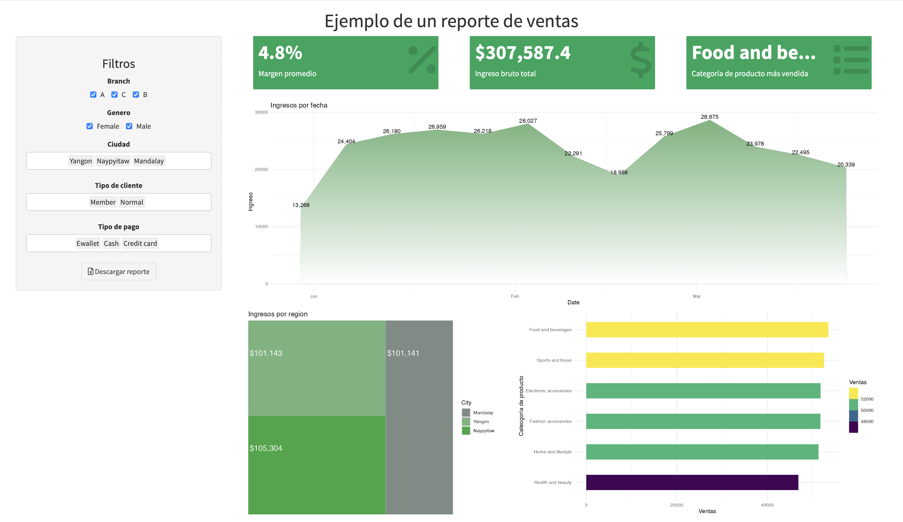{fig-align="center" width="600"}

Por supuesto, ahora debemos armar el servidor para poder generar todas estas vistas. Comencemos por crear un objeto reactivo general para aplicar los filtros y calcular el ingreso ($Precio * Cantidad$):

```{r, eval=FALSE}
data <- reactive({
      walmart_data |> 
        filter(Branch %in% input$branch & Gender %in% input$genero 
               & City %in% input$ciudad & Customer.type 
               %in% input$tipo_cliente & Payment %in% input$tipo_pago ) |> 
        mutate(Ingreso = Unit.price*Quantity,
               Date = floor_date(as_date(Date), "week"))
    })
```

Ahora, a partir de este objeto vamos a generar los gráficos adicionales, sin embargo, las métricas que estamos calculando en estos gráficos también será exportada al reporte que generaremos en excel más adelante, por lo que también guardaremos el resumen de estos datos en objetos reactivos, por ejemplo:

```{r, eval=FALSE}
historico_data <- reactive({
      data() |> 
        group_by(Date) |> 
        summarise(Ingreso = sum(Ingreso, na.rm = T))
    })

output$historico <- renderPlot({
      historico_data() |> 
        ggplot(aes(x = Date, y = Ingreso)) +
        geom_area_pattern(pattern = "gradient",
                          pattern_fill = "white",
                          pattern_fill2 = "#74b47c") +
        theme_minimal() + 
        labs(title = "Ingresos por fecha") +
        geom_text(aes(label=scales::comma(Ingreso)), 
                  position=position_dodge(width=0.9), vjust=-0.25)
    })
```

En este ejemplo solamente exportaremos los datos de los gráficos al reporte de excel, por lo que la información de las cajas de texto será calculada directamente en el *output*, ya que no la reutilizaremos para nada más. Dado lo anterior, el servidor será:

```{r, eval=FALSE}
backend <- function(input, output, session){
    
    data <- reactive({
      walmart_data |> 
        filter(Branch %in% input$branch & Gender %in% input$genero 
               & City %in% input$ciudad & Customer.type 
               %in% input$tipo_cliente & Payment %in% input$tipo_pago ) |> 
        mutate(Ingreso = Unit.price*Quantity,
               Date = floor_date(as_date(Date), "week"))
    })
    
    output$margen <- renderText({
      x <-
      data() |> 
        summarise(
          margen = mean(gross.margin.percentage, na.rm = T)
        )
      
      scales::percent(x$margen/100, accuracy = 0.1)
    })
    
    output$ingreso_bruto <- renderText({
      x <-
        data() |> 
        summarise(Ingreso = sum(Ingreso, na.rm = T))
      
      scales::comma(x$Ingreso, accuracy = 0.1, prefix = "$")
    })
    
    output$categoria <- renderText({
      x <-
        data() |> 
        group_by(Product.line) |> 
        summarise(Ventas = sum(Ingreso, na.rm = T)) |> 
        arrange(desc(Ventas)) 
      
      stringr::str_trunc(x$Product.line[1], width = 14)
    })
    
    historico_data <- reactive({
      data() |> 
        group_by(Date) |> 
        summarise(Ingreso = sum(Ingreso, na.rm = T))
    })
    
    output$historico <- renderPlot({
      historico_data() |> 
        ggplot(aes(x = Date, y = Ingreso)) +
        geom_area_pattern(pattern = "gradient",
                          pattern_fill = "white",
                          pattern_fill2 = "#74b47c") +
        theme_minimal() + 
        labs(title = "Ingresos por fecha") +
        geom_text(aes(label=scales::comma(Ingreso)), 
                  position=position_dodge(width=0.9), vjust=-0.25)
    })
    
    top_data <- reactive({
      data() |> 
        group_by(City) |> 
        summarise(Ingreso = sum(Ingreso)) |> 
        mutate(City = forcats::fct_reorder(City, Ingreso))
    })
    
    output$top <- renderPlot({
      top_data() |> 
        ggplot(aes(area = Ingreso, fill = City, 
                   label = scales::comma(round(Ingreso),
                                         prefix = "$"))) +
        geom_treemap() + 
        scale_fill_manual(
          values = c("#7c8c84", "#74b47c", "#32a640")
        ) +
        geom_treemap_text(
          color = "white",
          padding.y = unit(20, "mm"),
          size = 15) +
        theme_minimal() + 
        labs(title = "Ingresos por region")
    })
    
    categorias_ventas_data <- reactive({
      data() |> 
        group_by(Product.line) |> 
        summarise(Ventas = sum(Ingreso, na.rm = T)) |> 
        arrange(desc(Ventas))
    })
    
    output$categorias_ventas <- renderPlot({
      categorias_ventas_data() |> 
        ggplot(aes(y = forcats::fct_reorder(Product.line, 
                                            Ventas), 
                   x = Ventas,
                   fill = Ventas)) + 
        geom_col(width = 0.5) + 
        scale_fill_viridis_b() + 
        theme_minimal() + 
        labs(y = "Cateogoría de producto")
    })
    
  }
```

Nótese que, para el gráfico `historico` utilizamos la función `geom_area_pattern()` de la librería `ggpattern`, esto para poder generar un degradado en el gráfico de series de tiempo que nos indique los puntos de ingreso máximos, mientras que para el gráfico `top`, utilizamos las funciones `geom_treemap_text()` y `geom_treemap_text()` de la librería `treemapify`, esto para poder generar un gráfico categórico de este estilo, por tanto, las librerías a utilizar en la sección global serán:

```{r, eval=FALSE}
library(ggplot2)
library(shiny)
library(treemapify)
library(ggpattern)
library(shinyWidgets)
library(shinydashboard)
```

Claro que, para el caso de `shinyWidgets` solo vamos a importar una función, por lo que es más conveniente llamarla mediante `shinyWidgets::useShinydashboard()`, en lugar de cargar completamente la librería.

Ahora, ya que tenemos los objetos que exportaremos al reporte descargable (`historico_data()`, `top_data()` y `categorias_ventas_data()`), vamos a crear el documento excel, utilizando la librería `openxlsx2`. Primero, debemos crear un objeto que será nuestro libro de trabajo y añadirle las tres hojas respectivas a cada objeto reactivo, acción que haremos de la siguiente manera:

```{r, eval=FALSE}
library(openxlsx2)
colores <- RColorBrewer::brewer.pal(3, "RdYlGn")

wb_workbook() |> 
  wb_add_worksheet("Datos historicos", 
                   gridLines = F, tabColor = colores[1]) |> 
  wb_add_worksheet("Tops", 
                   gridLines = F, tabColor = colores[2]) |> 
  wb_add_worksheet("Categorías", 
                   gridLines = F, tabColor = colores[3])

```

Donde cada hoja tiene un color asignado de la paleta de colores `RdYlGn`. A pesar de que las hojas de nuestro reporte son estáticas, no podemos guardarlas en la sección global, ya que el objeto `wb_workbook()` es un objeto de clase `R6`, un tipo de objeto mutable, es decir, que no necesita volver a ser guardado para modificar su estructura original con nuevas líneas de código, por lo que necesariamente tendremos que crear un libro nuevo cada que descarguemos el reporte. Vamos a añadir las gráficas respectivas a cada caso, utilizando la librería `mschart`. Comencemos por el gráfico de series de tiempo para el objeto `historico_data()`:

```{r, eval=FALSE}
library(mschart)

wb_workbook() |> 
  wb_add_worksheet("Datos historicos", 
                   gridLines = F, tabColor = colores[1]) |> 
  wb_add_worksheet("Tops", 
                   gridLines = F, tabColor = colores[2]) |> 
  wb_add_worksheet("Categorías", 
                   gridLines = F, tabColor = colores[3]) |> 
  wb_add_mschart(
    sheet = "Datos historicos",
    graph = ms_linechart(
            historico_data(),
            x = "Fecha", y = "ingresos") |>
            chart_ax_x(num_fmt = "[$-es-ES]mmm yyyy") |> 
            chart_ax_y(num_fmt = "#,##0⁠"),
          dims = "D2")
```

Resultando en el siguiente objeto, cuando descarguemos el reporte:

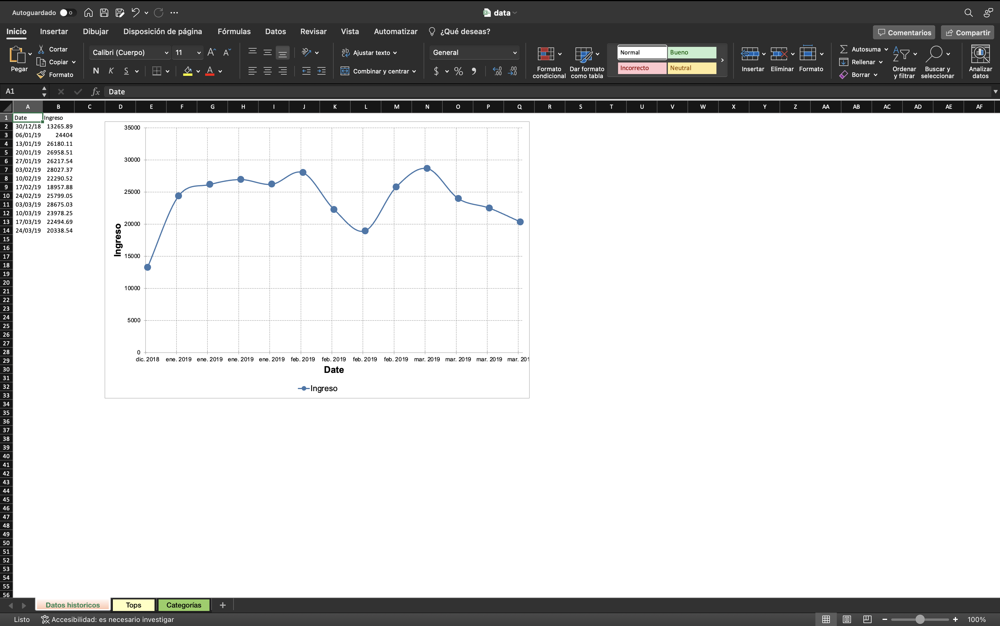{fig-align="center" width="500"}

Nótese que es posible customizar el formato de los ejes en los gráficos, siendo que, en este caso particular, añadimos una separación a los dígitos con `"#,##0⁠`, ademas de establecerla fecha en formato *mes-año*.

Ya que tenemos clara la estructura para añadir objetos al reporte, vayamos con el resto de hojas:

```{r, eval=FALSE}
wb_workbook() |> 
  wb_add_worksheet("Datos historicos", 
                   gridLines = F, tabColor = colores[1]) |> 
  wb_add_worksheet("Tops", 
                   gridLines = F, tabColor = colores[2]) |> 
  wb_add_worksheet("Categorías", 
                   gridLines = F, tabColor = colores[3]) |> 
  wb_add_mschart(
    sheet = "Datos historicos",
    graph = ms_linechart(
            historico_data(),
            x = "Fecha", y = "ingresos") |>
            chart_ax_x(num_fmt = "[$-es-ES]mmm yyyy") |> 
            chart_ax_y(num_fmt = "#,##0⁠"),
          dims = "D2") |> 
  wb_add_mschart(
            sheet = "Tops",
            graph = ms_barchart(
              top_data(),x = "City", y = "Ingreso") |>
              chart_ax_x(num_fmt = "[$-es-ES]mmm yyyy") |>
              chart_ax_y(num_fmt = "#,##0⁠"),
            dims = "D2") |> 
  wb_add_mschart(
            sheet = "Categorías",
            graph = ms_barchart(
              categorias_ventas_data(),x = "Product.line", 
              y = "Ventas") |>
              chart_ax_x(num_fmt = "[$-es-ES]mmm yyyy") |>
              chart_ax_y(num_fmt = "#,##0⁠"),
            dims = "D2") |> 
  wb_save(path = file)
```

Donde `file` será el parámetro creado con `filename` en la función `downloadHandler()` que usaremos para crear el reporte.

Finalmente, la función completa será:

```{r, eval=FALSE}
output$download <- downloadHandler(
      filename = function() {
        paste0("Reporte de ventas-", Sys.Date(), ".xlsx")
      },
      content = function(file) {
        wb_workbook() |> 
          wb_add_worksheet("Datos historicos", 
                           gridLines = F, tabColor = colores[1]) |> 
          wb_add_worksheet("Tops", 
                           gridLines = F, tabColor = colores[2]) |> 
          wb_add_worksheet("Categorías", 
                           gridLines = F, tabColor = colores[3]) |> 
          wb_add_mschart(
            sheet = "Datos historicos",
            graph = ms_linechart(
              historico_data(),x = "Date", y = "Ingreso") |>
              chart_ax_x(num_fmt = "[$-es-ES]mmm yyyy") |>
              chart_ax_y(num_fmt = "#,##0⁠"),
            dims = "D2") |> 
          wb_add_mschart(
            sheet = "Tops",
            graph = ms_barchart(
              top_data(),x = "City", y = "Ingreso") |>
              chart_ax_x(num_fmt = "[$-es-ES]mmm yyyy") |>
              chart_ax_y(num_fmt = "#,##0⁠"),
            dims = "D2") |> 
          wb_add_mschart(
            sheet = "Categorías",
            graph = ms_barchart(
              categorias_ventas_data(),x = "Product.line", 
              y = "Ventas") |>
              chart_ax_x(num_fmt = "[$-es-ES]mmm yyyy") |>
              chart_ax_y(num_fmt = "#,##0⁠"),
            dims = "D2") |> 
          wb_save(path = file)
      }
    )
```

Resultando en:

::: {#fig-excel layout-ncol="2"}
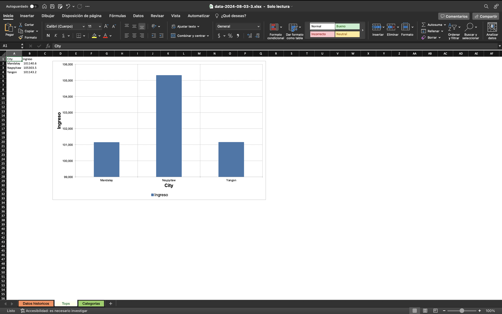{#fig-excel1 align="center" width="300"}

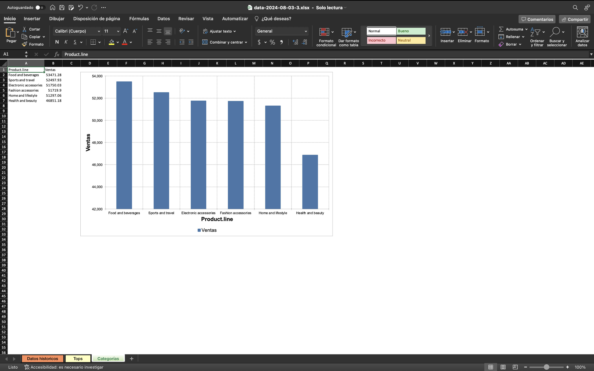{#fig-excel2 align="center" width="300"}

Gráficos generados en un reporte dinámico
:::

Al estar ligado este documento a objetos reactivos, el resultado dependerá enteramente de los filtros y opciones que tengamos activas en nuestra app, lo que lo vuelve un reporte más dinámico.

El código de esta app es considerablemente más largo que el de los ejemplos anteriores, por lo que lo encontrarás completo en el [repositorio oficial del libro](https://github.com/Jorge-hercas/r-para-inteligencia-de-negocios/blob/main/Apps/app%20reporte%20excel.R)

Por supuesto, esta solo es una introducción a los reportes que podemos generar utilizando shiny apps, siendo que podemos customizarlos aún más, generar formatos condicionales, añadir fórmulas, etc, ejemplos que no tocaremos ahora.

### Customización de interfaces con HTML y CSS

En este punto ya tenemos bastante claro que una shiny app no es más que una forma de expresar código HTML, CSS y JavaScript mediante funciones de R, lo que hace lógico que podamos implementar elementos diréctamente escritos en estos lenguajes para poder customizar de manera más profunda nuestras apps. En esta sección nos enfocaremos meramente en HTML y CSS, ya que el uso de JavaScript en los programas que realicemos estará más relacionado a aspectos de funcionamiento de los widgets (sesión, interactividad y eventos).

#### HTML

Como ya vimos con anterioridad, las funciones dedicadas a la interfaz, como `fluidPage()`, son una forma de llamar contenedores de elementos, por ejemplo:

```{r, eval=FALSE}
fluidPage(
  column(
    width = 10
  )
)
```

Equivalente en lenguaje HTML a:

```{r, eval=FALSE}
<div class="container-fluid">
  <div class="col-sm-10"></div>
</div>
```

Donde `class` hace referencia a ciertos parámetros asignados a ese contenedor, que le darán una apariencia por default (la cual estará establecida por un estilo escrito en lenguaje CSS).

Todos estos elementos, sin importar la clase, son conocidos como `tags`. Dada la denominación anterior, una forma sencilla en la que podemos acceder a dichos elementos dentro de nuestra shiny app es llamándolos a partir del objeto del mismo nombre, por ejemplo:

```{r, eval=FALSE}
tags$a()
```

Usualmente, cuando queremos establecer algunos parámetros de customización, establecer la codificación de la página (como *UTF-8*) o referenciar código adicional ubicado en otro archivo, haremos uso del tag `head()`, con el que asignaremos información que se va a aplicar a todo nuestro programa (de manera similar a la función `options()`, con la cual establecemos opciones en una sesión de R). Este tag debe ser escrito al principio de nuestro contenedor principal (`fluidPage()` en la mayoría de los casos), en la interfaz de la shiny app, por ejemplo:

```{r, eval=FALSE}
fluidPage(
  tags$head(
    tags$meta(charset = "UTF-8"),
    tags$link(rel = "stylesheet", type = "text/css", href = "estilo.css")
  ),
  ...
)
```

Siendo que en este caso, utilizando el tag `meta`, establecimos la codificación que seguirán las cadenas de texto y demás elementos en nuestra interfaz, y mediante el tag `link` hacemos referencia a un archivo adicional que contiene parámetros CSS que nos ayudarán a customizar nuestra app. En casos en los que tenemos programas demasiado grandes, los cuales cuentan con una cantidad considerable de páneles y/o elementos específicos, es preferible separar el parámetro `style` en un archivo separado, lo que nos permitirá tener un código mucho más limpio. Si bien es posible establecer el código CSS en la sección `head()` mediante el tag `style()`, por ejemplo:

```{r, eval=FALSE}
fluidPage(
  tags$head(
    tags$style(
      HTML("body {
           color: red;
      }")
    )
  ),
  ...
)
```

Esto solo es recomendable cuando la cantidad de elementos a customizar es corta, ya que esta sección puede crecer muy rápidamente y volver bastante confuso el código de nuestra interfaz.

En la sección `head()` también podemos incluir parámetros más específicos, como códigos escritos en javaScript para insertar animaciones/elementos interactivos, la descripción de la app, etc, por ejemplo:

```{r, eval=FALSE}
fluidPage(
  tags$head(
    tags$title("Nombre de mi app"),
    tags$script(src = "codigo para animacion.js")
  ),
  ...
)
```

Debemos ser cuidadosos cuando añadamos códigos en JavaScript,

Típicamente, los tags que más comunmente usaremos en el desarrollo de la interfaz serán:

1.  Estructurales:

-   `head()`: Para añadir metadatos.
-   `main()`: Para priorizar contenido en una página.
-   `header()`: Para añadir encabezados.
-   `footer()`: Para añadir pies de página.
-   `style()`: Para aplicar formato CSS.
-   `script()`: Para incluir código en JavaScript.
-   `link()`: Para incluir referencias a otros códigos (principalmente de archivos CSS más largos).

2.  De formato:

-   `p()`: Para añadir un párrafo.
-   `strong()`: Para texto en negritas.
-   `em()`: Para texto en cursiva.
-   `a()`: Para hipervínculos.
-   `img()`: Para imágenes.
-   `h1()`-`h6()`: Para títulos/encabezados, siendo `h1()` el más grande y `h6()` el más pequeño.
-   `br()`: Para generar un espaciado entre elementos.
-   `hr()`: Para generar una línea horizontal divisora.
-   `div()`: Para una columna contenedora de otros elementos.
-   `li()`: Para listas ordenadas numéricamente (o alfabéticamente, usando el parámetro `type="A"`). Va escrito dentro del tag `ol()`.

3.  Contenedores:

-   `section()`: Para definir secciones completas (vistas dentro de páginas). Útil cuando queremos aplicar estilos CSS de forma más general, afectando solo una parte específica de la app.
-   `div()`: Para columnas y subcolumnas. Suele estar dentro de `section()`.
-   `span()`: Para alinear elementos.

Adicionalmente, también existen tags enfocados a la creación de elementos de tipo tabla, sin embargo, es poco probable que los utilicemos en shiny apps, ya que usualmente crearemos estos elementos a partir de recursos adicionales, como `kable()` de la librería `knitr` o `reactable()` de la librería con el mismo nombre.

#### CSS

Ya que tenemos la estructura simple de una app mediante el uso de HTML (usando tags o funciones predefinidas, como es el caso de `fluidPage()`, `column()`, etc), podemos comenzar a darle un estilo más agradable para el usuario final, utilizando código en lenguaje CSS (Cascading Style Sheets). Mediante CSS podemos modificar aspectos tales como el espaciado, tamaño de los márgenes, color y tamaño del texto (independientemente de que se trate de títulos o texto de párrafos), color del fondo de pantalla, entre muchos otros parámetros. Ahora, ¿cómo aplicamos el código CSS en una shiny app? Tenemos tres formas de hacer esto:

1.  Aplicándolo directamente en cada contenedor y elemento, por ejemplo:

    ```{r, eval=FALSE}
    fluidPage(
      column(
        width = 1,
        style = "background-color:red;
                 border: 10px;"
      )
    )
    ```

    Nótese que, para poder aplicar un parámetro nuevo, tenemos que finalizar el parámetro anterior mediante un signo `;`.

    Escribir el estilo del elemento HTML dentro del código de nuestra interfaz no siempre es la mejor opción, ya que tenderá a volver confuso el código conforme lo vayamos escalando.

2.  Aplicar el código CSS en la sección `head()`, por ejemplo:

    ```{r, eval=FALSE}
    fluidPage(
        tags$head(
          tags$style(
            HTML(
              ".col-sm-5{
                  background-color:red;
                  border: 10px;
                 }"
            )
          )
        ),
        column(
          width = 5,
          p("perro")
        )
      )
    ```

    Donde `.col-sm-5` es la denominación dada al elemento `column(width = 5)`, con la que podremos identificar a qué elemento vamos a aplicarle dicho cambio.

    En este caso estamos estractando todo el código CSS en una sola sección de la interfaz, lo que lo hace más fácil de interpretar pero aún nos limita a una corta escalabilidad, al tener que introducir demasiadas líneas de código dentro de la interfaz aún.

3.  Referenciar el código CSS únicamente en la interfaz, escribiéndolo en un archivo separado que guardaremos en la carpeta **www**, por ejemplo:

    ```{r, eval=FALSE}
    fluidPage(
        tags$head(
          tags$link(rel = "stylesheet", 
                    type = "text/css", 
                    href = "estilo.css")
        ),
        column(
          width = 5
        )
      )
    ```

    Y, en el código CSS:

    ```{css, eval=FALSE}
    .col-sm-5 {
      background-color:red;
      border: 10px;
    }
    ```

Claramente, el uso de un archivo separado siempre será la mejor opción, ya que nos permitirá el añadir una cantidad considerable de elementos a nuestra interfaz, sin que esto se vuelva confuso conforme vayan aumentando.

Retomemos al ejemplo anterior, donde aplicamos un estilo a un elemento `div` con `width=5`. Este código tiene un problema: Este estilo se aplicará a todos los contenedores que tengan el parámetro `width=5`, ya que coinciden en el nombre de la clase. Es casi seguro que nos encontraremos con situaciones en las que solo necesitemos aplicar un cierto estilo a un elemento único, sin que los demás contenedores (u otros elementos) sean afectados por ello. Para poder aplicar estilos de una forma mucho más específica, simplemente tenemos que añadir un identificador (o ID) al elemento HTML que necesitemos trabajar y, del lado del código CSS, llamarlo con ese ID, por ejemplo:

```{r, eval=FALSE}
column(
  id = "col_per",
  width = 5
)
```

Y, en el código CSS:

```{css, eval=FALSE}
#col_per {
  background-color:red;
  border: 10px;
}
```

#### Temas predefinidos

La versatilidad que tenemos para poder aplicar código HTML/CSS en nuestras apps es grandioza, ya que nos permite tener un control total de la apariencia que queremos que adopten, siendo únicamente limitados por nuestra creatividad, sin embargo, cuando queremos evitarnos todo el trabajo que esto conlleva, podemos hacer uso de algunos temas ya predefinidos para realizar la customización de manera rápida. Podemos acceder a estos estilos mediante algunas librerías, como `shinythemes`, `bslib`, `semantic.page`, `shinyWidgets`, entre otras. Tomemos como ejemplo el programa que creamos con anterioridad para descargar reportes en excel y vamos a añadirle un tema predefinido de `shinythemes`, siendo en este caso el tema `simplex` (véanse una lista detallada con todos los temas disponibles en [el siguiente link](https://rstudio.github.io/shinythemes/)), haciendo uso de una sola línea de código:

```{r, eval=FALSE}
library(shinythemes)

fluidPage(
    theme = shinytheme(theme = "simplex"),
    shinyWidgets::useShinydashboard(),
    filtros_panel,
    outputs_panel
  )
```

Lo que resultará en:

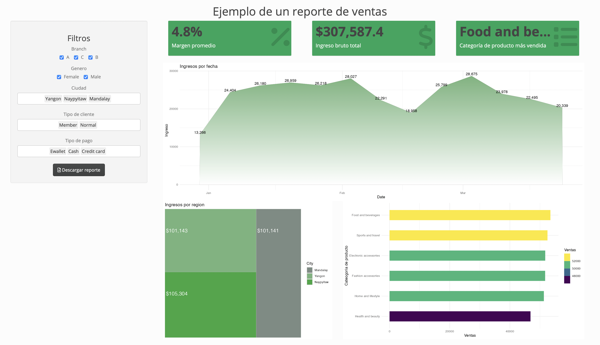{fig-align="center" width="370"}

Haciendo cambios en la fuente, color de fondo, estilo de los *inputs*, etc. Esta librería simplemente toma el nombre de clase de todos los elementos existentes y les aplica un formato en CSS, que aloja en un archivo separado que es llamado de forma condicional, dependiendo del tema elegido.

Usar `shinythemes` es la vía más sencilla para cambiar el aspecto de nuestras apps, pero los temas predefinidos no siempre serán de nuestro agrado, por lo que podemos hacer uso de otros recursos más flexibles, como es el caso de `bslib`. Con esta librería la customización se basa en reemplazar elementos de nuestra interfaz con aquellos provenientes de ella, por ejemplo: Originalmente, el programa que construimos utilizaba un `sidebar` donde almacenábamos los *inputs*, el cual podemos eliminar y, en su lugar, almacenar todos estos elementos dentro de una página `page_sidebar()` de `bslib`, que ya cuenta por default con este elemento, siendo que únicamente debemos llamarlo de la siguiente manera:

```{r, eval=FALSE}
library(bslib)

page_sidebar(
  title = "Ejemplo de un reporte de ventas",
  sidebar = sidebar(
    h3("Filtros"),
    checkboxGroupInput(
      "branch", "Branch", choices = unique(walmart_data$Branch),
      selected = unique(walmart_data$Branch),
      inline = T
    ),
    checkboxGroupInput(
      "genero", "Genero", choices = unique(walmart_data$Gender),
      selected = unique(walmart_data$Gender),
      inline = T
    ),
    ...
  ),
  ...
)

```

De igual forma, podemos cambiar las cajas de texto que usamos con anterioridad por otras provenientes de `bslib`, utilizando la función `value_box()` en su lugar, aplicando además un contenedor que les dará un `width` automático, mediante la función , siendo en este caso:

```{r, eval=FALSE}
layout_column_wrap(
    value_box(title = "Margen promedio",
              min_height = "100px",
              value = textOutput("margen"),
              showcase = icon("percent"),
              theme = "text-success", 
              width = "300px"
    ),
    ...
  )
```

Donde los cambios en argumentos son mínimos, por lo que la transición entre una interfaz y otra es bastante sencilla. En este caso, el código completo de la interfaz ahora será:

```{r, eval=FALSE}
page_sidebar(
  title = "Ejemplo de un reporte de ventas",
  sidebar = sidebar(
    h3("Filtros"),
    checkboxGroupInput(
      "branch", "Branch", choices = unique(walmart_data$Branch),
      selected = unique(walmart_data$Branch),
      inline = T
    ),
    checkboxGroupInput(
      "genero", "Genero", choices = unique(walmart_data$Gender),
      selected = unique(walmart_data$Gender),
      inline = T
    ),
    selectInput(
      "ciudad", "Ciudad", choices = unique(walmart_data$City),
      selected = unique(walmart_data$City), multiple = T
    ),
    selectInput(
      "tipo_cliente", "Tipo de cliente", 
      choices = unique(walmart_data$Customer.type),
      selected = unique(walmart_data$Customer.type), multiple = T
    ),
    selectInput(
      "tipo_pago", "Tipo de pago", choices = unique(walmart_data$Payment),
      selected = unique(walmart_data$Payment), multiple = T
    ),
    downloadButton("download", "Descargar reporte", 
                   icon = icon("file-excel"))
  ),
  layout_column_wrap(
    value_box(title = "Margen promedio",
              min_height = "100px",
              value = textOutput("margen"),
              showcase = icon("percent"),
              theme = "text-success", 
              width = "300px"
    ),
    value_box(title = "Ingreso bruto total",
              min_height = "100px",
              value = textOutput("ingreso_bruto"),
              showcase = icon("dollar-sign"),
              theme = "text-success"),
    value_box(title = "Categoría de producto más vendida",
              min_height = "100px",
              value = textOutput("categoria"),
              showcase = icon("list"),
              theme = "text-success")
  ),
  br(),
  column(
    width = 12,
    fluidRow(
      column(
        width = 12,
        align = "center",
        plotOutput("historico")
      ),
      column(
        width = 5,
        align = "center",
        plotOutput("top")
      ),
      column(
        width = 7,
        align = "center",
        plotOutput("categorias_ventas")
      )
    )
  )
)
```

Resultando en:

::: {#fig-sidebar layout-ncol="2"}
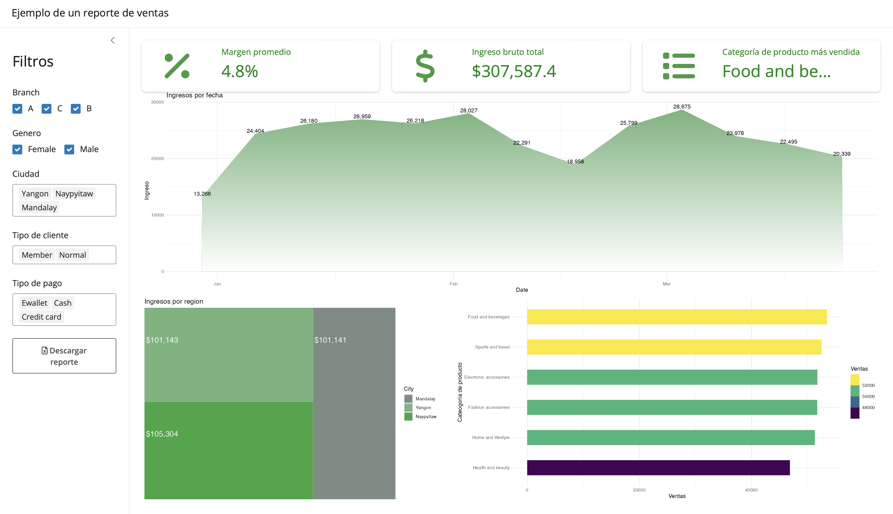{#fig-sidebar1 align="center" width="300"}

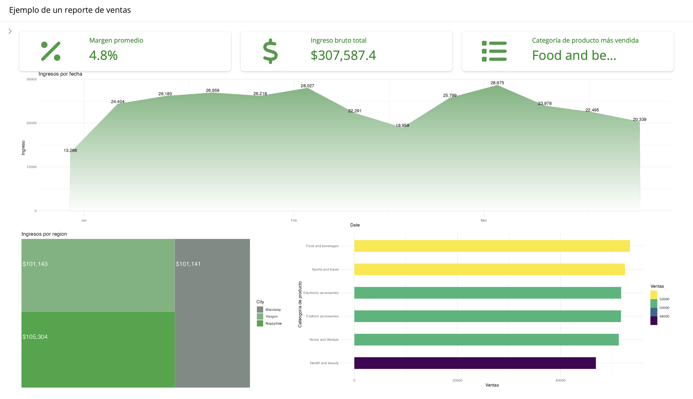{#fig-sidebar2 align="center" width="300"}

Interfaz actualizada con `bslib`
:::

Una interfaz mucho más minimalista y agradable a la vista (aunque claro, eso dependerá del gusto de cada persona). Como podrás darte cuenta, el código de esta interfaz es muy similar al código original, prácticamente cambiando las funciones a llamar para cada contenedor por aquellas provenientes de `bslib`, pero manteniendo prácticamente igual la estructura de nuestra aplicación.

Por supuesto, encontrarás el código completo de esta versión en [el repositorio oficial del libro](https://github.com/Jorge-hercas/r-para-inteligencia-de-negocios/blob/main/Apps/App%20reporte%20excel%20bslib.R).

Actualmente, las librerías más populares para customizar de manera sencilla nuestras apps son:

-   `shinythemes`: Temas genéricos para usar de manera rápida.
-   `shiny.semantic`: Diseños más minimalistas de interfaces.
-   `miniUI`: Diseños responsivos para pantallas pequeñas.
-   `bslib`: Diseños más minimalistas de interfaces.
-   `bsplus`: Funciones con elementos adicionales, como acordeones, textos flotantes, etc.
-   `fresh`: Funciones para customizar las paletas de colores en dashboards (`shinydashboard` y `bs4Dash`).
-   `designer`: App interactiva para generar customización en tiempo real y exportar el código.

Existen otras librerías dedicadas a este aspecto, pero en la gran mayoría de los casos las librerías mencionadas anteriormente serán más que suficiente. Más adelante analizaremos librerías enfocadas a la creación de dashboards, como `bs4Dash`, `shinydashboard`, `argonDash`, entre otras.

#### Plantillas (HTML templates)

Probablemente en más de una ocasión te has encontrado con un sitio web y has pensado algo como *"wow, este sitio tiene un diseño increíble, quisiera adaptarlo a un proyecto mío"*. Bueno, esto es posible en shiny apps. Así como podemos llamar código CSS en la sección `head()` de una app, podemos referenciar una plantilla completa e introducir elementos (*inputs* y *outputs*) diréctamente en un archivo de código HTML, ¿Cómo hacemos esto? Esto es un proceso bastante sencillo: Generalmente, cuando descargamos una plantilla HTML de internet, esta viene con múltiples archivos conectados entre si (códigos javaScript, customización CSS, imágenes, etc). Para adaptar la plantilla a nuestro proyecto, todos los archivos referentes a este *template* serán guardados con la misma estructura con la que los descargamos dentro de la carpeta **www**, que ya hemos mencionado con anterioridad. Una vez guardados, nos vamos a centrar en uno en particular llamado `index.html`, el cual contiene la estructura de la plantilla descargada, por lo que será el que vamos a referenciar en nuestra app. Suponiendo que ya tenemos el proyecto en la carpeta **www**, el código de nuestra app se verá de la siguiente manera:

```{r, eval=FALSE}
shinyApp(
  ui = htmlTemplate(
    filename = "index.html"
  ),
  server = function(input, output, session){
    ...
  }
)
```

Ahora, del lado del código principal de la plantilla, supongamos la siguiente estructura en el documento `index.html`:

```{html, eval=FALSE}
<!doctype html>
<html>
<head>
  <title>Ejemplo</title>
  <meta name="descripcion" content="Ejemplo">
  <meta name="ex" content="Ejemplo">
</head>
<body>
   Ejemplo de un texto simple.
</body>
</html>
```

Para poder añadir los elementos de nuestra app, debemos comenzar en la sección `<head>`, añadiendo el código `headContent()` de la siguiente manera (una plantilla real será mucho, muchísimo más grande, pero la estructura será muy parecida):

```{html, eval=FALSE}
<!doctype html>
<html>
<head>
  <title>Ejemplo</title>
  <meta name="descripcion" content="Ejemplo">
  <meta name="ex" content="Ejemplo">
  {{headContent()}}
</head>
<body>
   Ejemplo de un texto simple.
</body>
</html>
```

Finalmente, para añadir elementos de nuestra app a la plantilla, simplemente debemos guardarlos como objetos dentro del cuerpo `htmlTemplate()` y referenciarlos dentro del código de la plantilla, por ejemplo, del lado del código R:

```{r, eval=FALSE}
shinyApp(
  ui = htmlTemplate(
    filename = "index.html",
    pagina_principal = fluidPage(
      column(
        width = 3,
        selectInput(...),
        ...
      )
    )
  ),
  server = function(input, output, session){
    ...
  }
)
```

Y, consecuentemente, del lado de la plantilla:

```{html, eval=FALSE}
<!doctype html>
<html>
<head>
  <title>Ejemplo</title>
  <meta name="descripcion" content="Ejemplo">
  <meta name="ex" content="Ejemplo">
  {{headContent()}}
</head>
<body>
  {{pagina_principal}}
</body>
</html>
```

Adaptar plantillas a una app es bastante sencillo, además de que podemos tener un resultado bastante interesante, aunque esto ya dependerá de qué tan bien sepamos adaptar los diseños de los elementos de nuestra app (*inputs* y *outputs*) al diseño del template, procurando que estos dos sean compatibles en formas/paletas de colores.

A continuación te presento un ejemplo de una app realizada con una plantilla ([con el código disponible en el siguiente enlace](https://github.com/socapal/dataton-tudinero)):

::: {#fig-htmltemplate layout-ncol="2"}
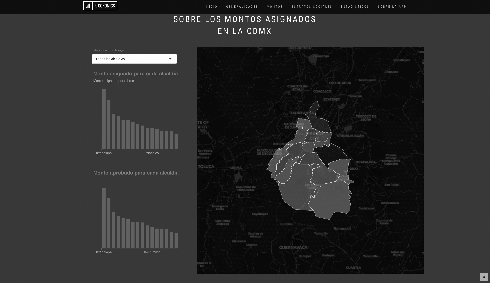{#fig-htmltemplate1 align="center" width="300"}

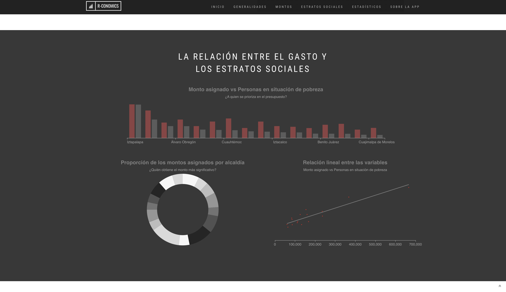{align="center" width="300"}

Aplicación realizada con una HTML Template
:::

::: callout-warning
## Cuidado

No todas las plantillas HTML existentes son compatibles con los *inputs*/*outputs* de una shiny app, por lo que debemos ser cuidadosos al escogerlas. Generalmente será una dinámica de prueba-error.
:::

### Dashboards con Shiny

Por supuesto, una de las mejores formas de presentar nuestros datos será dentro de un dashboard (tablero), ya que podremos condensar mucha información en varios páneles, de una forma entendible para el usuario final, pero ¿cómo lo podemos hacer en shiny? De manera estricta **no** necesitamos librerías adicionales para crear una visualización más al estilo de un dashboard, ya que en realidad lo hemos aplicado en los ejemplos que estuvimos trabajado anteriormente, al ser programas que dan un monitoreo y visualización sencilla de interpretar a ciertos datos, para que el usuario final pueda sacar cálculos y conclusiones de manera rápida (así como exportar la información), sin embargo, estos ejemplos han sido basdante básicos en cuanto a la interfaz usada, por lo que el objetivo de esta sección será el de entender cómo funcionan las librerías que están enteramente enfocadas a la creación de dashboards, cómo podemos adaptarlas a nuestros proyectos y, lógicamente, optimizarlas para su escalabilidad.

Para la creación de dashboards más especializados, las librerías más populares actualmente son `shinydashboard`, `shinydashboardPlus`, `argonDash` (en conjunto con `argonR`), `tablerDash`, `bs4Dash`, entre otras, paquetes que funcionan de manera muy similar, por lo que los siguientes ejemplos y desarrollos serán realizados con `bs4Dash`, haciendo uso del mismo set de datos `walmart_data`, que trabajamos en secciones anteriores.

Sí, los dashboards tienen como objetivo el centralizar los datos de un área del negocio o proyecto mediante resúmenes (gráficos, tablas, valores), concentrando una cierta cantidad de métricas en una sola vista. Sin embargo, eso no implica que debamos meter todos estos elementos en la misma página, ya que eso solo volvería confuso al tablero que estemos creando. Lo más óptimo siempre será dividir las vistas por tópicos. Además, existen distintos tipos de dashboards —estratégicos, tácticos y operativos— según el nivel de análisis y el público al que están dirigidos, aunque este tema no se abordará a fondo aquí. Por ejemplo: en un dashboard que esté destinado a mostrar los flujos de efectivo de una empresa, podemos dividir el tablero en: 1. Ingresos, 2. Costos y 3. Márgenes de ingresos, lo que evitará que el usuario que haga uso del dashboard se sature y se confunda con los números mostrados. Considerando el set de datos `walmart_data`, comencemos por crear una interfaz que estará dividida en dos ventanas: 1. Ingresos generales y 2. Márgenes. En este caso, para crear la interfaz, utilizaremos la función `dashboardPage()`:

```{r, eval=FALSE}
library(bs4Dash)

dashboardPage(
  header = dashboardHeader(),
  footer = dashboardFooter(),
  sidebar = dashboardSidebar(),
  controlbar = dashboardControlbar(),
  body = dashboardBody()
)

```

Donde `header`, `footer`, `sidebar`, `controlbar` y `body` son elementos necesarios para la creación de esta interfaz. Para crear el menú de secciones, tendremos que añadir los elementos dentro de la función `sidebarMenu()`, añadiéndoles un ID con el que podremos acceder a ellos más tarde, es decir:

```{r, eval=FALSE}
dashboardPage(
  header = dashboardHeader(),
  footer = dashboardFooter(),
  sidebar = dashboardSidebar(
    sidebarUserPanel(name = "Dashboard de ventas"),
    sidebarMenu(
      id = "menu",
      menuItem(
        text = "Ingresos generales",
        tabName = "ing_gen",
        icon = icon("money-bill")
      ),
      menuItem(
        text = "Márgenes",
        tabName = "marg",
        icon = icon("percent")
      )
    )
  ),
  controlbar = dashboardControlbar(),
  body = dashboardBody()
)
```

Resultando en:

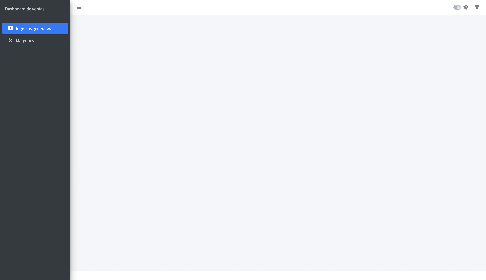{fig-align="center" width="370"}

Con esta primera vista podemos comenzar a notar algunas cosas, como el hecho de que las secciones `sidebar` y `controlbar` pueden ser ocultadas, lo que permite generar una visualización más limpia de los elementos que decidamos incluir en el cuerpo del dashboard. Cuando hablamos de la *no saturación* de elementos en la interfaz, eso también implica que no siempre vamos a querer visualizar los *inputs*, por lo que podemos hacer uso de la sección `controlbar` para almacenarlos y ocultarlos. Vamos a tomar los filtros que usamos para el reporte creado anteriormente, guardándolos en el `controlbar`:

```{r, eval=FALSE}
dashboardControlbar(
      width = 350,
      id = "controlbar",
      controlbarMenu(
        id = "menu_controlbar",
        controlbarItem(
          "Filtros",
          "Filtros generales:",
          column(width = 12, alig = "center",
                 checkboxGroupInput(
                   "branch", "Branch", 
                   choices = unique(walmart_data$Branch),
                   selected = unique(walmart_data$Branch),
                   inline = T
                 ),
                 checkboxGroupInput(
                   "genero", "Genero", 
                   choices = unique(walmart_data$Gender),
                   selected = unique(walmart_data$Gender),
                   inline = T
                 ),
                 selectInput(
                   "ciudad", "Ciudad", 
                   choices = unique(walmart_data$City),
                   selected = unique(walmart_data$City), 
                   multiple = T
                 ),
                 selectInput(
                   "tipo_cliente", "Tipo de cliente", 
                   choices = unique(walmart_data$Customer.type),
                   selected = unique(walmart_data$Customer.type), 
                   multiple = T
                 ),
                 selectInput(
                   "tipo_pago", "Tipo de pago", 
                   choices = unique(walmart_data$Payment),
                   selected = unique(walmart_data$Payment), 
                   multiple = T
                 ),
                 downloadButton("download", "Descargar reporte", 
                                icon = icon("file-excel"))
          )
        )
      )
    )
```

Lo que nos devolverá:

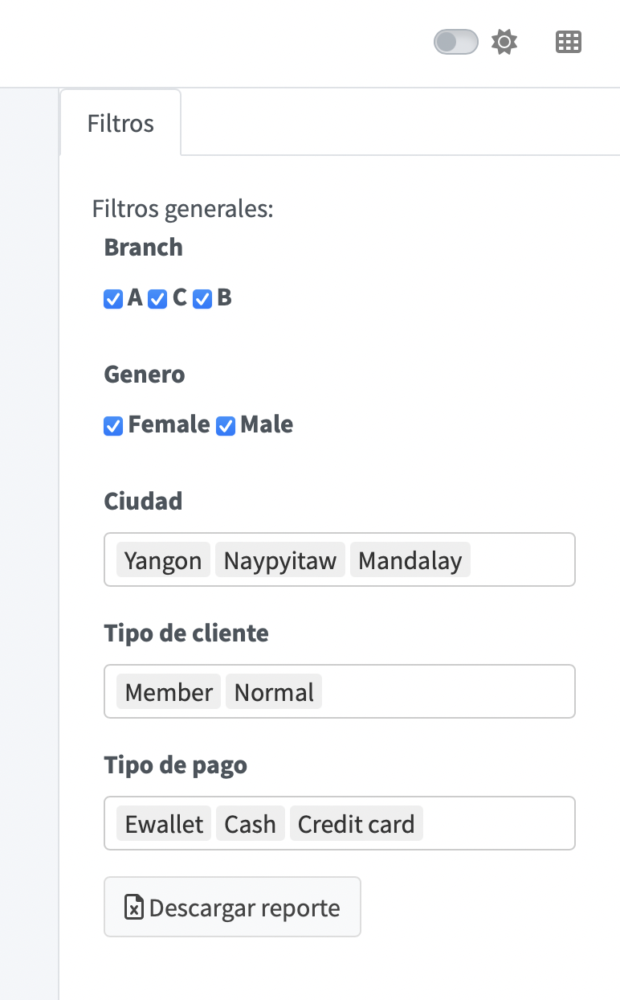{fig-align="center" width="160"}

Elemento que se encontrará oculto por default. Esconder estos elementos permite que, durante la presentación de este dashboard, el contenido central no se preste a distracciones innecesarias, lo que lo hará más eficiente respecto a las métricas que se quieran abordar en un cierto momento.

#### Gráficos, tablas y mapas basados en JavaScript

Ya que terminamos con los elementos generales del dashboard, vamos a continuar con la implementación del cuerpo, es decir, gráficos y tablas, pero en esta ocasión vamos a añadirle un toque extra. El uso de gráficos basados en la librería `ggplot2` es genial, ya que podemos customizarlos de forma casi ilimitada, sin embargo, aún siguen siendo imágenes estáticas, por lo que obtener información en tiempo real de ellos se vuelve complicado, por ejemplo: En un gráfico donde no todas las barras se encuentren etiquetadas con el valor del eje *y*, será sumamente complicado inferir estos valores de forma exacta. Para poder obtener información adicional, así como realizar ciertas acciones dentro del mismo gráfico o tabla (sin utilizar *inputs*), podemos hacer uso de librerías basadas en código JavaScript, las cuales contienen *Html Widgets*, como se les denomina a este tipo de elementos visuales. En esa sección nos limitaremos al uso de tres librerías específicas para generar estos elementos interactivos: `echarts4r`[^22] [@R-echarts4r] para gráficos, `reactable`[^23] para las tablas y `mapboxer`[^24] [@R-mapboxer] para mapas.

[^22]: Librería que importa el código JavaScript del framework `Echarts` y lo transforma en código R fácilmente interpretable.

[^23]: Librería construida con el framework `React`, diseñada para crear tablas interactivas con código R fácilmente interpretable.

[^24]: Librería que llama a la API del servicio `mapbox`, para importar mapas interactivos de rápida carga, así como temas predefinidos/creados para personalizarlos.

##### Gráficos

Retomemos los gráficos del ejemplo anterior. Comencemos por el gráfico de series de tiempo que se encontraba en la parte superior de nuestra app, es decir:

{fig-align="center" width="400"}

Siendo el código de ese gráfico:

```{r, eval=FALSE}
historico_data() |> 
  ggplot(aes(x = Date, y = Ingreso)) +
  geom_area_pattern(pattern = "gradient",
                    pattern_fill = "white",
                    pattern_fill2 = "#74b47c") +
  theme_minimal() +
  labs(title = "Ingresos por fecha") +
  geom_text(aes(label=scales::comma(Ingreso)),
            position=position_dodge(width=0.9), vjust=-0.25)
```

Donde `historico_data()` no es más que el objeto reactivo que usamos en la app para resumir (y filtrar) nuestros datos:

```{r, eval=FALSE}
walmart_data |>
  filter(Branch %in% input$branch & Gender %in% input$genero
               & City %in% input$ciudad & Customer.type
               %in% input$tipo_cliente 
               & Payment %in% input$tipo_pago ) |>
  mutate(Ingreso = Unit.price*Quantity,
         Date = floor_date(as_date(Date), "week")) |> 
  group_by(Date) |>
  summarise(Ingreso = sum(Ingreso, na.rm = T))
```

Vamos a convertir este gráfico a una versión más *interactiva* del mismo, utilizando `echarts4`. El uso de esta librería es bastante más sencillo que `ggplot2`, siendo que incialmente solo debemos establecer el eje **x** mediante el código `e_charts()` y, de forma automática, el eje **y**, basado en el tipo de gráfico que vayamos a utilizar, siendo en este caso un gráfico de área, por lo que la función a usar será `e_area()`. En este ejemplo, el código para generar el gráfico será:

```{r, eval=FALSE}
historico_data() |> 
  e_charts(Date) |> 
  e_area(Ingreso) |> 
  e_theme("infographic") |> 
  e_color(color = "#74b47c") |> 
  e_tooltip(trigger = "axis", 
            backgroundColor = "#fff")
```

Lo que resultará en:

{fig-align="center" width="400"}

En este caso, utilizamos la función `e_tooltip()` para generar un cuadro de texto flotante que aparece cuando posicionamos el puntero sobre algún punto, valga la redundancia, a lo largo del eje **x** en el área del gráfico. Tenemos diferentes opciones para que aparezca el `tooltip`, siendo en este caso `trigger = "axis"`, la que nos muestra el valor basado en el punto del eje **x** (independientemente del eje **y**), siendo que en otros casos utilizaremos `trigger = "item"`, en situaciones en las que no tengamos un eje **x** claro y necesariamente tengamos que posicionarnos en el punto graficado, opciones que veremos más adelante.

Obviamente, este objeto visual no es un gráfico generado como una imagen, por lo que sería incorrecto utilizar las funciones `renderPlot()` y `plotOutput()` para generarlo en una app. Para estos casos utilizaríamos las funciones `renderEcharts4r()` y `echarts4rOutput()` como sus respectivos equivalentes. Del lado de la interfaz, simplemente tendremos que asignarle un identificador, como en cualquier otro *output*, es decir:

```{r, eval=FALSE}
echarts4rOutput("historico")
```

Y, de manera similar, generar la función de renderización en el lado del servidor:

```{r, eval=FALSE}
output$historico <- renderEcharts4r({

  historico_data() |>
    e_charts(Date) |> 
    e_area(Ingreso) |> 
    e_theme("infographic") |> 
    e_color(color = "#74b47c") |> 
    e_tooltip(trigger = "axis", 
            backgroundColor = "#fff") |> 
    e_title("Ingresos por fecha")
  
  })
```

Como puedes ver, la lógica es exactamente la misma que con la generación de gráficos estáticos, únicamente cambiando las funciones de `ggplot2` por las de `echarts4r`, pero utilizando el mismo objeto reactivo con los datos en cuestión.

Vayamos ahora con el siguiente objeto gráfico, es decir:

{fig-align="center" width="350"}

Siendo en este caso el código respectivo:

```{r, eval=FALSE}
top_data() |> 
        ggplot(aes(area = Ingreso, fill = City, 
                   label = scales::comma(round(Ingreso),
                                         prefix = "$"))) +
        geom_treemap() + 
        scale_fill_manual(
          values = c("#7c8c84", "#74b47c", "#32a640")
        ) +
        geom_treemap_text(
          color = "white",
          padding.y = unit(20, "mm"),
          size = 15) +
        theme_minimal() + 
        labs(title = "Ingresos por region")
```

Donde, al igual que en el caso anterior, `top_data()` es el objeto reactivo con el que resumimos (y filtramos) nuestros datos, es decir:

```{r, eval=FALSE}
walmart_data |>
  filter(Branch %in% input$branch & Gender %in% input$genero
               & City %in% input$ciudad & Customer.type
               %in% input$tipo_cliente 
               & Payment %in% input$tipo_pago ) |>
  mutate(Ingreso = Unit.price*Quantity,
         Date = floor_date(as_date(Date), "week")) |> 
  group_by(City) |> 
        summarise(Ingreso = sum(Ingreso)) |> 
        mutate(City = forcats::fct_reorder(City, Ingreso))
```

En este caso, al tener solo tres grupos distintos, podemos optar por un gráfico de pastel o un gráfico de dona ahora que hagamos la transformación a `echarts4r`, los cuales son más intuitivos de leer en casos en los que no tenemos muchos elementos de segmentación de datos. La lógica para generar el gráfico es similar a la del caso anterior, únicamente cambiando el elemento del tipo de gráfico `e_area()` por `e_pie()`, es decir:

```{r, eval=FALSE}
top_data() |> 
  e_charts(City) |> 
  e_pie(Ingreso, 
        radius = c("50%", "70%")) |> 
  e_theme("infographic") |> 
  e_tooltip(trigger = "item", 
            backgroundColor = "#fff") |> 
  e_title("Ingresos por ciudad") |> 
  e_legend(orient = "vertical",
           right = 0)
```

Resultando en el gráfico @fig-pieecharts.

{#fig-pieecharts fig-align="center" width="400"}

Como puedes darte cuenta, en este caso no tenemos ejes **x** y **y** propiamente definidos, por lo que para añadir correctamente el *tooltip* es necesario utilizar el parámetro `item` en lugar de `axis` en la función `e_tooltip()`. Como única adición, se cambió la orientación y zona de la vista de la leyenda, para que concuerde con la versión gráfica que creamos con `ggplot2`.

De manera similar al caso anterior, simplemente debemos englobar el código dentro de las funciones `echarts4rOutput()`, para la salida del objeto, y `renderEcharts4r()`, para el elemento reactivo del lado del servidor.

Vamos a finalizar con el gráfico respectivo al top de categoriías de productos más vendidos, es decir:

{fig-align="center" width="350"}

Este caso es un poco más interesante de construir. La escala de colores en las barras se basa en los valores registrados de mayor a menor, siendo que para poder armar construir dicha escala hicimos uso de la función `scale_fill_viridis_b()` de `ggplot2`, la cual no tiene un equivalente en `echarts4r`. Directamente no tenemos forma de crear una escala de colores, pero lo que si podemos hacer es asignar un color a cada barra de forma manual, basado en una columna que contenga esa información en nuestro set de datos.

Como recordarás, el código para generar el gráfico en cuestión mediante `ggplot2` es:

```{r, eval=FALSE}
categorias_ventas_data() |> 
        ggplot(aes(y = forcats::fct_reorder(Product.line, 
                                            Ventas), 
                   x = Ventas,
                   fill = Ventas)) + 
        geom_col(width = 0.5) + 
        scale_fill_viridis_b() + 
        theme_minimal() + 
        labs(y = "Cateogoría de producto")
```

Donde el objeto `categorias_ventas_data()`, al igual que en los casos anteriores, se refiere a:

```{r, eval=FALSE}
walmart_data |>
  filter(Branch %in% input$branch & Gender %in% input$genero
               & City %in% input$ciudad & Customer.type
               %in% input$tipo_cliente 
               & Payment %in% input$tipo_pago ) |>
  mutate(Ingreso = Unit.price*Quantity,
         Date = floor_date(as_date(Date), "week")) |> 
  group_by(Product.line) |> 
        summarise(Ventas = sum(Ingreso, na.rm = T)) |> 
        arrange(desc(Ventas))
```

A partir de los datos iniciales, podemos crear una columna adicional con la paleta de colores que utilizamos anteriormente, simplemente usando la función `col_numeric()` de la librería `scales`:

```{r, eval=FALSE}
walmart_data |>
  filter(Branch %in% input$branch & Gender %in% input$genero
               & City %in% input$ciudad & Customer.type
               %in% input$tipo_cliente 
               & Payment %in% input$tipo_pago ) |>
  mutate(Ingreso = Unit.price*Quantity,
         Date = floor_date(as_date(Date), "week")) |> 
  group_by(Product.line) |> 
  summarise(Ventas = sum(Ingreso, na.rm = T)) |> 
  mutate(color = scales::col_numeric("viridis", Ventas)(Ventas)) |> 
  arrange(Ventas) 
```

Lógicamente, este paso debe ser posterior a que hayamos resumido la información, para poder realizar la asignación de color respecto a la información que estará representada en el gráfico de barras.

Para asignar los colores a cada barra, simplemente debemos usar la función `e_add()`, usando como argumento para asignar el color a la columna `color`, siendo:

```{r, eval=FALSE}
categorias_ventas_data() |> 
  e_charts(Product.line) |> 
  e_bar(Ventas) |> 
  e_add("itemStyle", color) |> 
  e_flip_coords() |> 
  e_theme("infographic") |> 
  e_tooltip(trigger = "axis", 
            backgroundColor = "#fff") |> 
  e_title("Top productos más vendidos") |> 
  e_legend(show = F)
```

Lo que resultará en el gráfico:

{fig-align="center" width="350"}

Estos gráficos son geniales, si, pero más allá del *tooltip*, que nos ayuda a identificar números concretos al posicionarnos en cualquier sección del gráfico, también podemos obtener otros elementos a aprovechar para una mayor interactividad en nuestro dashboard, por ejemplo, exportar los valores que se nos devuelven de un gráfico al posicionarnos en algún punto o dar click en el mismo, para después actualizar los *inputs*, tal como lo haríamos en dashboards creados en PBI. Obtener esta información y exportarla es bastante sencillo, por ejemplo, el gráfico que creamos anteriormente está reemplazando al *output* estático `categorias_ventas`, siendo que en este caso su renderización sería:

```{r, eval=FALSE}
# UI
echarts4rBoxOutput("categorias_ventas")

# Server
output$categorias_ventas <- renderEcharts4r({
  
  categorias_ventas_data() |> 
    e_charts(Product.line) |> 
    e_bar(Ventas) |> 
    e_add("itemStyle", color) |> 
    e_flip_coords() |> 
    e_theme("infographic") |> 
    e_tooltip(trigger = "axis", 
            backgroundColor = "#fff") |> 
    e_title("Top productos más vendidos") |> 
    e_legend(show = F)
  
})
```

En este caso, para acceder a los elementos reactivos (interpretados como *inputs*) tales como la barra seleccionada, o el punto en el que el puntero se encuentra posicionado, utilizaremos el *id* de identificación del elemento `categorias_ventas` como un prefijo, seguido del elemento que vamos a extraer, el cual puede ser:

-   `clicked_data`: Para datos seleccionados al hacer click en un elemento del gráfico. Se devolverá en un vector el valor de los ejes *x* y *y*.
-   `clicked_row`: Para el número de fila del dato seleccionado, correspondiente al data frame usado reactivo usado para crear ese objeto.
-   `clicked_serie`: Para el nombre de la serie seleccionada, si hay más de una.
-   `mouseover_data`: Para datos seleccionados al posicionar el mouse sobre un elemento del gráfico. Se devolverá en un vector el valor de los ejes *x* y *y*.
-   `mouseover_row`: Para el número de fila del dato en el que posicionamos el mouse, correspondiente al data frame usado reactivo usado para crear ese objeto.

Estos son los principales elementos que podemos extraer como objetos reactivos, aunque también tenemos disponibles otros elementos (`brush`, `legend_change`, `legend_selected`, `clicked_data_value`, `mouseover_data_value` y `mouseover_serie`) que usaremos con menos frecuencia.

Podemos utilizar, por ejemplo, `clicked_data` de la siguiente manera:

```{r, eval=FALSE}
datos_seleccionados <- reactive({
  input$categorias_ventas_clicked_data$value
})
```

Por lo tanto, para acceder a, por ejemplo, el valor del eje *y*, podríamos aplicar indexación:

```{r, eval=FALSE}
datos_seleccionados()[2]
```

Supongamos que en nuestro dashboard tenemos un filtro para las categorías de productos:

```{r, eval=FALSE}
pickerInput(
  inputId = "categorias",
  label = "Categoria de ventas",
  choices = unique(walmart_data$Product.line),
  selected = unique(walmart_data$Product.line),
  multiple = T
)
```

En este caso específico, podríamos actualizar las selecciones del filtro a partir de los valores que seleccionemos directamente del gráfico:

```{r, eval=FALSE}
observe({
  updatePickerInput(session = session, inputId = "categorias",
                    selected = datos_seleccionados()[2])
})
```

Afectando todos los elementos gráficos que se encuentren ligados a ese mismo filtro. De esta forma podemos generar una vista mucho más agradable al usuario final, ya que ahora puede interactuar con los elementos del gráfico y recibir una respuesta del servidor, de una forma similar a lo que hacen otros visualizadores (PBI, Tableau, etc), teniendo además la ventaja de que podemos acceder a esta información mediante reactivos, lo que nos permite tener un manejo más profundo de nuestro programa.

##### Mapas

Ya que reemplazamos los gráficos estáticos con los gráficos interactivos (y sacamos provecho de ellos), podemos comenzar a explorar otro tipo de elementos, como lo son los mapas y las tablas.

Empecemos por la creación de un mapa mediante la librería `mapboxer`. Esta librería se conecta a la API de *mapbox*, por lo que para llamar a un mapa genérico bastará con la función `mapboxer()`:

```{r, eval=FALSE}
library(mapboxer)

mapboxer()
```

Resultando en:

{fig-align="center" width="350"}

Ahora, utilicemos los datos de `walmart_data` para generar una visualización dentro de un mapa. Podemos partir de las coordenadas de las ciudades en cuestión, las cuales no tenemos en el data frame, pero podemos obtener sencillamente con, por ejemplo, la API de Google Maps, usando la librería `ggmap`:

```{r, eval=FALSE}
library(ggmap)
register_google("TU_API_KEY")

# Proceso para extraer direcciones
direcciones <- unique(walmart_data$City)
dir_contenedor <- tibble(
  Ciudad = c(),
  lat = c(),
  lng = c()
)

for (row in 1:length(direcciones)){
  
  dir <- geocode(direcciones[row])
  
  dir_contenedor <- dir_contenedor |> 
    bind_rows(
      tibble(
        Ciudad = direcciones[row],
        lat = dir$lat,
        lng = dir$lon
      )
    )
  
}

# Inserción en data frame
walmart_data <- walmart_data |> 
  left_join(dir_contenedor, 
            by = c("City" = "Ciudad"))

```

Ya que tenemos esa información, podemos proceder a resumir nuestros datos a nivel ciudad:

```{r, eval=FALSE}
resumen <-
  walmart_data |> 
  mutate(Ingreso = Unit.price*Quantity) |> 
  group_by(City, lat, lng) |> 
  summarise(Ingreso = sum(Ingreso, na.rm = T)) |> 
  ungroup() |> 
  mutate(
    percent_ing = Ingreso/sum(Ingreso)*100,
    color = scales::col_numeric("viridis", Ingreso)(Ingreso),
    Ingreso = scales::comma(Ingreso, prefix = "$")
  )
```

Y, finalmente, generar una vista de burbuja simple en el mapa:

```{r, eval=FALSE}
resumen |> 
  as_mapbox_source() |> 
  mapboxer() |> 
  add_circle_layer(
    circle_color = c("get", "color"),
    circle_opacity = 0.5,
    circle_radius = c("get", "percent_ing"),
    popup = "<p>
             Ingreso: {{Ingreso}}
             <p>"
  ) 
```

Resultando en:

{fig-align="center" width="350"}

Nótese que, para este ejemplo, además de resumir nuestros datos también creamos dos columnas adicionales: Una para generar la paleta de colores de los círculos y otra para normalizar el valor de nuestros datos y poder mantener un un tamaño razonable en el radio de los círculos.

Ya que tenemos un mejor entendimiento del uso básico de esta librería, ahora podemos comenzar a sacarle provecho dentro de una app web. Comencemos por integrar este widget en la interfaz de la app, siendo:

```{r, eval=FALSE}
mapboxerOutput("mapa")
```

Y:

```{r, eval=FALSE}
# Datos
resumen <- reactive({
  walmart_data |> 
  mutate(Ingreso = Unit.price*Quantity) |> 
  group_by(City, lat, lng) |> 
  summarise(Ingreso = sum(Ingreso, na.rm = T)) |> 
  ungroup() |> 
  mutate(
    percent_ing = Ingreso/sum(Ingreso)*100,
    color = scales::col_numeric("viridis", Ingreso)(Ingreso),
    Ingreso = scales::comma(Ingreso, prefix = "$")
  )
})

# Mapa
output$mapa <- renderMapboxer({
  resumen() |> 
    as_mapbox_source() |> 
    mapboxer() |> 
    add_circle_layer(
    circle_color = c("get", "color"),
    circle_opacity = 0.5,
    circle_radius = c("get", "percent_ing"),
    popup = "<p>
             Ingreso: {{Ingreso}}
             <p>"
  ) 
})
```

Para la renderización del mapa desde el servidor, similar a cualquier otro elemento gráfico que hemos trabajado hasta ahora.

Al igual que con los gráficos interactivos de `echarts4r`, podemos aprovechar la información obtenida del mapa cuando nosotros demos click en el. En este caso usamos el nombre *mapa* como ID del elemento, por lo que para acceder a la información de nuestros clicks, simplemente debemos añadir un sufijo `onclick` al mismo, usándolo dentro de un objeto reactivo, es decir:

```{r, eval=FALSE}
# Elementos devueltos tras el evento `click`
observeEvent(input$mapa_onclick,{
      print(input$mapa_onclick)
    })
```

Con este evento, rápidamente podemos identificar que, al dar click en alguna capa[^25] de nuestro mapa, se nos devolverán tres clases de objetos:

[^25]: Representación de nuestros datos mediante un elemento visual, como burbujas, escalas de colores, etc.

1.  Coordenadas (latitud y longitud), mediante `$coords$lng` y `$coords$lat`
2.  Propiedades de la capa, propias del data frame utilizado, mediante `$props$_elemento_`
3.  ID's del mapa y capa seleccionada, mediante `$layer_id` y `$widget_id`

Lógicamente, podemos aprovechar estos elementos para, por ejemplo, actualizar los filtros de nuestra app de una manera más interesante, tal cual lo hicimos con el gráfico anterior, por ejemplo, suponiendo que tuviéramos un filtro por ciudad:

```{r, eval=FALSE}
pickerInput(
  inputId = "ciudad",
  label = "Ciudad a escoger",
  choices = unique(walmart_data$City),
  selected = unique(walmart_data$City),
  multiple = T
)
```

Podemos actualizarlo muy sencillamente con:

```{r, eval=FALSE}
observeEvent(input$mapa_onclick, {
  updatePickerInput(session = session, inputId = "ciudad",
                    selected = input$mapa_onclick$props$City)
})
```

Existen otro tipo de capas que podemos visualizar, como las líneas (ej. Rutas de punto *A* a punto *b*) y las delimitaciones de regiones (ciudades, estados, países), para las cuales tendremos que usar `add_line_layer()` y `add_fill_layer()`, respectivamente. Estas funciones tienen un uso bastante similar, aunque para `add_fill_layer()` no utilizaremos data frames que contengan únicamente una coordenada, si no archivos de tipo `.shp` o *shapefiles*, que contienen en cada observación una lista con todos los puntos necesarios para dibujar el relieve en el mapa. Podemos leer estos archivos con la librería `sf`, utilizando la función `read_sf()`, la cual nos devolverá esta información en un formato similar a un data frame. Veamos un rápido ejemplo con los datos [*dest_2015gw.shp*, disponibles en este enlace al repositorio](https://github.com/Jorge-hercas/r-para-inteligencia-de-negocios/tree/main/SHP/mexico). La lectura del *shapefile* es bastante simple:

```{r}
library(sf)
shapefile_mexico <- read_sf("shapefile/dest_2015gw.shp") |> 
  dplyr::select(CAPITAL,geometry)

shapefile_mexico
```

La información que nos interesa de este data frame es la geometría, la cual podemos plasmar rápidamente en un mapa:

```{r, eval=FALSE}
shapefile_mexico |> 
  as_mapbox_source() |> 
  mapboxer() |> 
  add_fill_layer(
    fill_color = "darkgray",
    fill_outline_color = "#000",
    fill_opacity = 0.5
  )
```

Resultando en el gráfico @fig-mapfill.

{#fig-mapfill align="center" width="350"}

##### Tablas

Como último *widget* a analizar, vamos a trabajar con algunas tablas interactivas mediante la librería `reactable`. Su uso es bastante sencillo, ya que solo tenemos que llamar a la función `reactable()` y usar como argumento un data frame. Usemos como ejemplo los datos `walmart_data` que hemos venido trabajando hasta ahora, y vamos a crear una tabla resumen de las ventas por zona:

```{r, eval=FALSE}
library(reactable)

walmart_data |> 
  group_by(City) |> 
  summarise(Ingreso_total = sum(Total, na.rm = T)) |> 
  arrange(desc(Ingreso_total)) |> 
  reactable(
    columns = list(
      Ingreso_total = colDef(
        format = colFormat(
          prefix = "$",
          separators = T,
          digits = 0
        )
      )
    )
  )
```

Lo que resultará en:

{#fig-reactable align="center" width="350"}

Nótese que, para una mejor presentación de los datos, arreglamos el formato de la columna numérica, lo que lo hará más sencillo de leer para el usuario final.

Esta tabla se ve genial a simple vista, si, pero ¿Qué ventaja existe realmente entre usar una tabla y usar un gráfico que exprese los mismos datos? En realidad, no existe una regla exacta que defina en qué situaciones usar cada tipo de elemento visual, en estas situaciones debemos ser más analíticos respecto a: 1. El tipo de público al que va dirigido (es decir, si el usuario final prefiere ver números o gráficos), y 2. La homogeneidad de los datos, ya que en situaciones donde cada número es muy similar al otro, el uso de un gráfico puede no ser tan intuitivo como si lo será una tabla. Existen otros elementos que podemos tomar en cuenta al decidir qué tipo de *widget* vamos a utilizar, como la cantidad de datos a mostrar, pero los dos anteriores serán los que tomaremos principalmente en cuenta.

Ahora, la renderización de tablas en `shiny` es similar a la de los otros elementos que hemos analizado hasta ahora:

```{r, eval=FALSE}
# Interfaz
reactableOutput("ingresos_zona")

# Servidor
ingresos_por_zona <- reactive({
  
  walmart_data |> 
  group_by(City) |> 
  summarise(Ingreso_total = sum(Total, na.rm = T)) |> 
  arrange(desc(Ingreso_total))
  
})

output$ingresos_zona <- renderReactable({
  
  ingresos_por_zona() |> 
    reactable(
    columns = list(
      Ingreso_total = colDef(
        format = colFormat(
          prefix = "$",
          separators = T,
          digits = 0
        )
      )
    )
  )
  
})
```

Como era de esperarse, también podemos extraer información de la tabla renderizada a partir de los clicks que hagamos en ella, mediante `getReactableState("ID_DE_LA_TABLA")`, por ejemplo:

```{r, eval=FALSE}
getReactableState("ingresos_zona")
```

Lo que nos devolverá en formato de lista la siguiente información:

- `page`: Página actual visualizada.
- `pageSize`: Número de filas que tiene la vista de la tabla.
- `pages`: Páginas totales de la tabla.
- `selected`: Número de fila que estamos seleccionando de la tabla.
- `sorted`: Valor `asc` o `desc`, si la tabla fue reordenada en alguna columna.

En la mayoría de los casos, la opción que más vamos a utilizar será `selected`, sin embargo, para que podamos seleccionar una fila, tendremos que usar las siguientes opciones en la función `reactable()`:

```{r, eval=FALSE}
reactable(
  selection = "single",
  onClick = "select"
)
```

Donde también podemos establecer el argumento `selection = "multiple"`, si queremos seleccionar más de una fila a la vez. Lógicamente, si seleccionamos más de una fila, el resultado será un vector que incluya el número de filas seleccionadas.

Así como en los casos anteriores, podemos aprovechar los elementos extraídos de la sesión para actualizar el resto de elementos visuales que tengamos en nuestro tablero, así como los selectores y operaciones realizadas, por ejemplo, el selector `pickerInput()` que vimos en el caso anterior del mapa, puede ser actualizado de una forma similar:

```{r, eval=FALSE}

observeEvent(input$ingresos_zona, {
  # Extracción de las filas seleccionadas
  estado_de_seleccion <- getReactableState("ingresos_zona", "selected")
  
  # Actualización de los estados seleccionados mediante indexación
  # a la tabla reactiva
  updatePickerInput(session = session, inputId = "ciudad",
                    selected = unique(ingresos_por_zona()[1:2,]$City))
})
```

De esta forma, podemos mantener una conexión bidireccional en el tablero generado, de tal forma que si quisiéramos filtrar a partir de un elemento visual a los demás, entonces podremos hacerlo de una forma muy agradable visualmente.

##### Una pequeña reflexión

Estos tres ejemplos que analizamos son solamente tres librerías de cientos existentes con el mismo propósito, el de generar visualizaciones interactivas a partir de código JavaScript. Estos ejemplos únicamente tienen como propósito el mostrarte un funcionamiento general de los *HTML Widgets*, pero ¿por qué usarlos en lugar de simplemente imágenes estáticas que sean actualizadas mediante *inputs*? Realmente no es un requisito indispensable el usar este tipo de elementos en el tablero que estemos desarrollando, sin embargo, es preferible hacerlo en ciertos casos ya que la experiencia hacia el usuario final será mucho más agradable y le facilitará su uso. Cuando creamos un dashboard mediante **shiny**, debemos estar concientes en todo momento de que la información que vamos a presentar siempre debe ser **concisa y fácil de entender para el usuario al que va a ir dirigida**. Para nosotros como los desarrolladores del tablero, será sencillo el interpretar los datos que estamos expresando en este mismo, ¿Pero lo será para un usuario no técnico? Esa es la pregunta que siempre debemos tener en cuenta, ya que de esta forma nos será más sencillo el buscar soluciones visuales o interactivas que le permitan al usuario final el poder aprovechar la información del tablero de una mejor manera. Personalmente, me he encontrado en múltiples situaciones en las que hice un dashboard increíble, con prácticamente todas las métricas que mi compañero de trabajo necesitaba en ese momento, pero al presentárselo, su primer comentario se resumía en *"¿Puedo exportar esto a Excel?"*, ya que el dashboard era demasiado técnico, o no tenía el nivel de manipulación que mis colaboradores buscaban. Generalmente, cuando una persona no técnica utiliza un programa que cuenta con múltiples gráficos y mapas, casi siempre su primer acción será el dar click en algún punto del mapa, una barra de un gráfico o la columna de una tabla, esperando que algo pase con el resto de elementos del tablero, por lo que utilizar *HTML Widgets* nos será de gran utilidad, al poder satisfacer este tipo de situaciones, mejorando así la experiencia de uso.

Esta pequeña reflexión no es  para que te desanimes respecto a la creación de tus tableros, si no para que entiendas y siempre tengas presente la razón por la que los hacemos, y como podemos crear un programa que sea de verdadera utilidad para la persona a la que va dirigido, sin que esta última piense en utilizar otra opción porque se le complicó utilizar el programa, lo que lo convertiría en un desarrollo sin ningún valor agregado.

#### Seguridad en mis dashboards

Este tema en particular es de vital importancia para los desarrollos que harás en el futuro. Probablemente tus primeros dashboards y/o programas serán elaborados con datos públicos o datos de muestra, ya que serán proyectos personales para tu portafolio, pero cuando trabajes en un dashboard para una empresa, por obvias razones deberás mantener la seguridad de este mismo como tu prioridad, de tal forma que puedas asegurarte que solamente las personas autorizadas tengan acceso a la información en este. Obviamente, no queremos que la información privada de una empresa u organización este expuesta al público o sea filtrada. En *shiny* tenemos algunas opciones para brindarle seguridad a nuestros tableros, siendo que en el presente libro nos vamos a enfocar en las *Capas de Contraseña*.

##### Capas de contraseñas

Comencemos por la opción más sencilla, siendo que actualmente ya existen librerías dedicadas a este aspecto, como lo es `shinymanager` [@R-shinymanager]. Una capa de contraseñas no es más que un panel inicial que te solicita un usuario y una contraseña, tal como lo harías en cualquier página de uso cotidiano, como Facebook, Twitter, etc. Lo que hará esta capa de contraseñas es *poner en pausa* la renderización de todos los elementos de nuestro dashboard, y finalizar este proceso hasta que hayamos ingresado las claves correspondientes, dicho de otra manera, nuestro dashboard no va a iniciar ningún elemento hasta que se verifique que un usuario autorizado haya ingresado.

Supongamos la siguiente aplicación:

```{r, eval=FALSE}
shinyApp(
  ui = fluidPage(
    h1("Título del programa"),
    reactableOutput("ingresos_zona")
  ),
  server = function(input, output, session){
    
    ingresos_por_zona <- reactive({
      
      walmart_data |> 
        group_by(City) |> 
        summarise(Ingreso_total = sum(Total, na.rm = T)) |> 
        arrange(desc(Ingreso_total))
      
    })
    
    output$ingresos_zona <- renderReactable({
      
      ingresos_por_zona() |> 
        reactable(
          columns = list(
            Ingreso_total = colDef(
              format = colFormat(
                prefix = "$",
                separators = T,
                digits = 0
              )
            )
          )
        )
    })
  }
)
```

Este programa te muestra inmediatamente los datos de ese cálculo, por lo que si se encuentra en la nube, cualquiera podría acceder a el y robar dicha información. Protegerlo utilizando `shinymanager` es bastante sencillo. Como primer paso, debemos contar con una tabla que incluya los accesos al programa, como el siguiente data frame:

```{r, eval=FALSE}
usuarios <- tibble(
  user = "Nombre_usuario",
  password = "ejemplo_123"
)
```

Después, únicamente deberemos englobar nuestra interfaz en la función `secure_app()`, para que esta se encuentre ahora detrás de un panel condicional que únicamente desaparecerá hasta que hayamos ingresado nuestras credenciales, es decir:

```{r, eval=FALSE}
ui <- secure_app(
  fluidPage(
    h1("Título del programa"),
    reactableOutput("ingresos_zona")
  )
)
```

Mientras que, del lado del servidor, vamos a utilizar la función `secure_server()`, la cual será la encargada de revisar las credenciales y darnos acceso a los demás páneles, es decir:

```{r, eval=FALSE}
server <- function(input, output, session){
  
    autenticacion <- secure_server(
      check_credentials = check_credentials(usuarios)
    )
    
    ingresos_por_zona <- reactive({
      
      walmart_data |> 
        group_by(City) |> 
        summarise(Ingreso_total = sum(Total, na.rm = T)) |> 
        arrange(desc(Ingreso_total))
      
    })
    
    output$ingresos_zona <- renderReactable({
      
      ingresos_por_zona() |> 
        reactable(
          columns = list(
            Ingreso_total = colDef(
              format = colFormat(
                prefix = "$",
                separators = T,
                digits = 0
              )
            )
          )
        )
    })
  }
```

Por lo tanto, cuando iniciemos la aplicación, en primera instancia tendremos la siguiente vista:

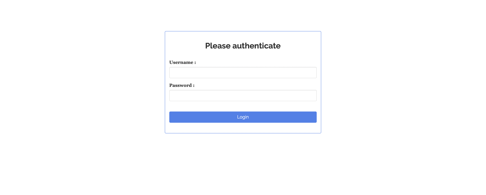{#fig-mapfill align="center" width="390"}

Vista que podemos customizar de múltiples maneras, por ejemplo, utilizando temas de `shinythemes` mediante el argumento `secure_app(theme = "...")`, o estableciendo una imagen como fondo de pantalla mediante código CSS, por ejemplo:

```{r, eval=FALSE}
ui <- secure_app(
  fluidPage(
    h1("Título del programa"),
    reactableOutput("ingresos_zona")
  ),
  theme = "cosmo",
  background  = "linear-gradient(rgba(0, 0, 0, 0.5),
                    rgba(0, 0, 0, 0.5)),
                    url('https://cdn.pixabay.com/photo/2018/08/21/23/29/
                    forest-3622519_1280.jpg')
                    no-repeat center fixed;
                    -webkit-background-size: cover;
                    -moz-background-size: cover;
                    -o-background-size: cover;
                    background-size: cover;"
)
```

Resultando en:

{#fig-mapfill align="center" width="390"}

E incluso agregar un logotigo:

```{r, eval=FALSE}
ui <- secure_app(
  fluidPage(
    h1("Título del programa"),
    reactableOutput("ingresos_zona")
  ),
  theme = "cosmo",
  tags_top = tags$div(
               tags$img(
                 src = "https://www.logoai.com/oss/icons/2021/
                        10/27/rA73APprj8wskQ0.png", 
                 width = 100
               )
             ),
  background  = "linear-gradient(rgba(0, 0, 0, 0.5),
                    rgba(0, 0, 0, 0.5)),
                    url('https://cdn.pixabay.com/photo/2018/08
                    /21/23/29/forest-3622519_1280.jpg')
                    no-repeat center fixed;
                    -webkit-background-size: cover;
                    -moz-background-size: cover;
                    -o-background-size: cover;
                    background-size: cover;"
)
```

Lo que nos dará:

{#fig-mapfill align="center" width="390"}

Vamos a sacarle un poco más de provecho al uso de esta capa de contraseñas, ya que con ello podemos crear un perfil de usuario. Tomemos como ejemplo una interfaz creada con `bs4Dash`:

```{r, eval=FALSE}
ui <-
dashboardPage(
    header = dashboardHeader(rightUi = userOutput("user")),
    footer = dashboardFooter(),
    sidebar = dashboardSidebar(
      sidebarUserPanel(name = "Dashboard de ventas"),
      sidebarMenu(
        id = "menu",
        menuItem(
          text = "Ingresos generales",
          tabName = "ing_gen",
          icon = icon("money-bill")
        ),
        menuItem(
          text = "Márgenes",
          tabName = "marg",
          icon = icon("percent")
        )
      )
    ),
    controlbar = dashboardControlbar(
      skin = "light",
      collapsed = TRUE,
      width = 350,
      id = "controlbar",
      controlbarMenu(
        id = "menu_controlbar"
      )
    ),
    body = dashboardBody(
      ...
    )
)
```

Como puedes notar, esta interfaz tiene un *output* dedicado a un elemento de usuario `userOutput("user")`, el cual podemos aprovechar, agregando algunos parámetros al data frame que contiene la información de acceso al dashboard, por ejemplo:

```{r, eval=FALSE}
usuarios <- tibble(
  user = "Nombre_usuario",
  password = "ejemplo_123",
  rol = "Jefe de ventas",
  Area = "Ventas",
  Nombre = "Prison Mike",
  foto = "https://upload.wikimedia.org/wikipedia/en/5/56/PrisonMike.png"
)
```

Por tanto, la interfaz será:

```{r, eval=FALSE}
ui <- secure_app(
  ui,
  theme = "cosmo",
  tags_top = tags$div(
               tags$img(
                 src = "https://www.logoai.com/oss/icons/2021/
                        10/27/rA73APprj8wskQ0.png", 
                 width = 100
               )
             ),
  background  = "linear-gradient(rgba(0, 0, 0, 0.5),
                    rgba(0, 0, 0, 0.5)),
                    url('https://cdn.pixabay.com/photo/2018/08
                    /21/23/29/forest-3622519_1280.jpg')
                    no-repeat center fixed;
                    -webkit-background-size: cover;
                    -moz-background-size: cover;
                    -o-background-size: cover;
                    background-size: cover;"
)
```

Y, del lado del servidor, tendremos que crear el perfil de usuario, tal que:

```{r, eval=FALSE}
output$user <- renderUser({
    
    dashboardUser(
      name = autenticacion$Nombre,
      image = autenticacion$foto,
      title = autenticacion$rol,
      subtitle = autenticacion$Area
    )
    
  })

```

Lo que resultará en una interfaz dinámica que devolverá el perfil del usuario loggeado:

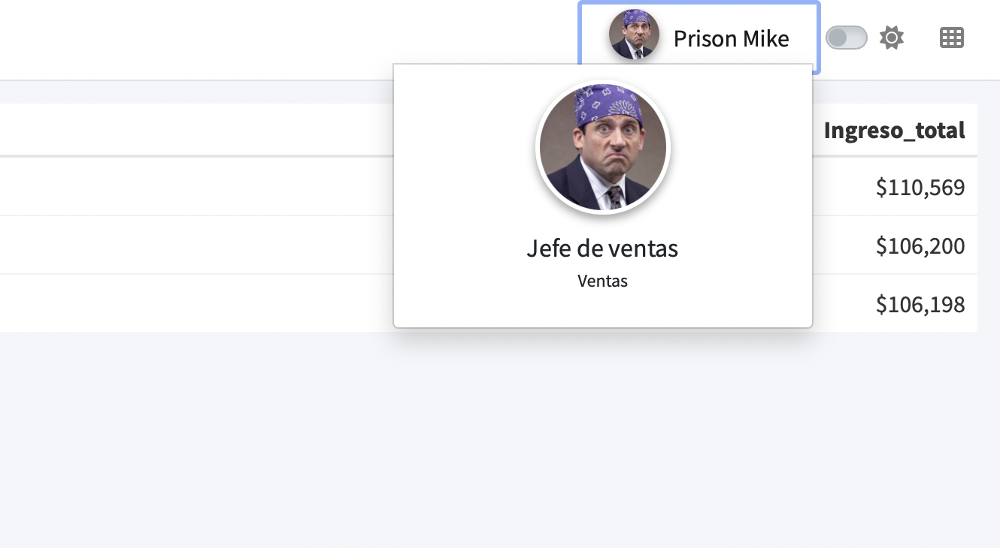{#fig-mapfill align="center" width="390"}

De esta forma podemos ir jugando con la seguridad de nuestros tableros, sacándole provecho visualmente. Claro que, el cargar el nombre de usuario en la interfaz realmente no es algo a lo que le podamos sacar provecho por si solo, pero si nos puede ser de utilidad a nivel *backend* para, por ejemplo, llevar registros de accesos al programa, o generar niveles de acceso a secciones de nuestro dashboard. Vamos a desarrollar estas dos ideas en la siguiente sección.

##### Control de accesos mediante bases de datos

Una forma de tener un mayor control respecto a los accesos que brindamos a nuestro dashboard es mediante un registro constante de los usuarios que acceden a este programa, pero ¿Cómo podemos obtener y guardar dicha información para poder explotarla después? Esto puede ser tan sencillo como enviar el registro de un acceso a una base de datos SQL, esto a partir de un evento en el servidor del dashboard. Comencemos por crear en la base de datos las tablas que contendrán la información de los usuarios y el registro de cada uno de ellos:

```{r, eval=FALSE}
# Tabla de usuarios
CREATE TABLE dashboard_users(
  ID INT NOT NULL AUTO_INCREMENT PRIMARY KEY,
  user VARCHAR(30),
  nombre VARCHAR(30),
  password VARCHAR(30),
  rol VARCHAR(15),
  area VARCHAR(15),
  foto VARCHAR(30),
  status INT
);

# Tabla de registros (logs)
CREATE TABLE dashboard_logs (
  log_id INT NOT NULL AUTO_INCREMENT PRIMARY KEY,
  user_id INT NOT NULL,
  log_timestamp TIMESTAMP NOT NULL DEFAULT CURRENT_TIMESTAMP,
  FOREIGN KEY (user_id) REFERENCES dashboard_users(ID)
)
```

Donde la tabla `dashboard_logs` tendrá una llave foránea ligada al *ID* del usuario. Vamos a añadir un usuario de ejemplo:

```{r, eval=FALSE}
insert into dashboard_users (user, nombre, password, rol, area, foto, status) 
values ("michael_01", "Michael Scott", "contra123", "Gerente", 
"Ventas", 
"https://cdn.pixabay.com/photo/2020/06/09/10/52/man-5277903_1280.jpg", 1)
```

Ya que tenemos esto, volvamos a nuestro dashboard, pero tomando ahora los usuarios directamente de nuestra base de datos:

```{r, eval=FALSE}
# Conexión a la BD
conn <- DBI::dbConnect(RMySQL::MySQL(), 
                       dbname = "ventas", 
                       host = "localhost", 
                       port = 3306, 
                       user = "master", 
                       password = "xxxxxxx")

# Carga de credenciales
usuarios <- dbGetQuery(
  conn, "SELECT * FROM dashboard_users
         WHERE status = 1"
)
```

Ahora, ¿cómo guardamos la información de acceso de los usuarios a nuestro dashboard? Muy sencillo. Nosotros ya aplicamos dos reglas en la tabla de registros para que, tanto el `log_id` como la hora/fecha de acceso `log_timestamp`, se generen automáticamente, siendo que el `log_id` es un valor único incremental y la hora de registro es registrada como la hora actual en la que se crea la fila, por lo que bastará con mandar un query con el id del usuario que se registró en el servidor de nuestro programa, es decir:

```{r, eval=FALSE}
server <- function(input, output, session){
  
  autenticacion <- secure_server(
    check_credentials = check_credentials(usuarios)
  )
  
  observe({
    if (!is.null(autenticacion$user)){
      dbSendQuery(conn, paste0("INSERT INTO dashboard_logs 
                                 (user_id) VALUES (",autenticacion$ID,")"))
    }
  })
  
}
```

De esta forma, cuando veamos la tabla de registros, podremos notar que se generará información como la siguiente:

```{r, eval=FALSE}
dbGetQuery(
  conn, "SELECT * 
         FROM dashboard_logs 
         WHERE CAST(log_timestamp AS DATE) = CURRENT_DATE"
)
```

| log_id | user_id | log_timestamp       |
|--------|---------|---------------------|
| 1      | 1       | 2025-01-01 20:11:19 |
| 2      | 2       | 2025-01-01 20:11:57 |

: Ejemplo de tabla de registros

##### Niveles de acceso

Cuando comiences a crear tus primeros tableros te darás cuenta de que en un mismo equipo no todas las personas pueden (o deben) tener acceso a la información, por ejemplo, si desarrollaramos un dashboard de ventas, probablemente solo nos interese mostrar el ingreso generado por cuentas a los agentes de ventas que accedan a este tablero, mientras que información financiera más sensible solo podrá ser visualizada por el gerente de ventas o su superior, tal como ocurre en tableros creados en Power BI, cuando asignamos roles de usuario. Por supuesto, no existe una librería o función que nos permita hacer esto directamente, por lo que, con lo que ya hemos armado hasta ahora, podemos plantear una solución bastante sencilla a este problema. Tomemos como ejemplo la interfaz de `bs4Dash` que utilizamos en el caso anterior, con la que generamos un perfil dinámico:

```{r, eval=FALSE}
ui <-
dashboardPage(
    header = dashboardHeader(rightUi = userOutput("user")),
    footer = dashboardFooter(),
    sidebar = dashboardSidebar(
      sidebarUserPanel(name = "Dashboard de ventas"),
      sidebarMenu(
        id = "menu",
        menuItem(
          text = "Ingresos generales",
          tabName = "ing_gen",
          icon = icon("money-bill")
        ),
        menuItem(
          text = "Márgenes",
          tabName = "marg",
          icon = icon("percent")
        )
      )
    ),
    controlbar = dashboardControlbar(
      skin = "light",
      collapsed = TRUE,
      width = 350,
      id = "controlbar",
      controlbarMenu(
        id = "menu_controlbar"
      )
    ),
    body = dashboardBody(
      ...
    )
)
```


Esta interfaz tiene dos ventanas a las que podemos acceder: `Ingresos generales` y `Márgenes`. Supongamos que la información de `Márgenes` es más sensible y, por ende, necesita un nivel de autorización mayor, ¿Cómo podemos evitar que otros usuarios accedan a este panel? Lógicamente, el primer paso será asignar los roles de acceso a los usuarios, lo que podemos hacer creando una columna adicional en nuestra base de datos con esta información:

```{r, eval=FALSE}
ALTER TABLE dashboard_users
ADD access_level INT;

UPDATE dashboard_users 
SET access_level = 1
WHERE ID = 1;
```

Con esto, estamos suponiendo que nuestro usuario de ejemplo tiene un nivel de acceso igual a *1*, pero para acceder al panel `Márgenes` se necesita un nivel de acceso igual a *2*, por lo que el siguiente paso será dinamizar esta vista, de tal forma que solo se muestre a usuarios con los permisos requeridos. La forma más sencilla es plantear una función que englobe nuestra interfaz:

```{r}
vista <- function(access_level,access_required,...){
  
  if (access_level < access_required){
    div(
      width = 12, align = "ceter",
      p("Sin permiso")
    )
  }else{
    tagList(...)
  }
  
}
```

Donde `access_level` será una variable que obtendremos de la tabla de usuarios, mientras que `access_required` será una variable que nosotros asignaremos, como el nivel mínimo requerido para acceder a dicho panel. Obviamente, si el usuario tiene un nivel de acceso menor al requerido, simplemente la función devolverá el mensaje *"Sin permiso"*. El argumento `...` será un objeto que contenga la interfaz que vamos a dinamizar. Tonemos como ejemplo una interfaz en la que generemos un mapa que solo pueda ser visualizado por usuarios con un nivel de acceso igual o superior a 2, siendo el panel:

```{r, eval=FALSE}
panel_condicional <-
  tagList(
    box(
      width = 12,
      align = "center",
      mapboxerOutput("mapa")
    )
  )
```

El cual será mostrado en la siguiente interfaz:

```{r, eval=FALSE}
tabItems(
        tabItem(
          tabName = "ing_gen",
          uiOutput("panel_inicial")
        )
      )
```

Podemos guardar el objeto `panel_condicional` como una variable global, a la cual accederemos después mediante:

```{r, eval=FALSE}
output$panel_inicial <- renderUI({
      
      vista(access_level = autenticacion$access_level, 
            access_required = 2, 
            panel_condicional)
      
    })
```

Obviamente, la tabla que contiene la información de acceso del perfil necesarioamente debe tener una columna llamada `access_level`, siendo esta la que estamos llamando en la función `vista()` para identificar el nivel de autorización del usuario que acceda, por ejemplo:

```{r, echo=FALSE}
usuarios <- tibble(
  user = "Nombre_usuario",
  password = "ejemplo_123",
  rol = "Jefe de ventas",
  Area = "Ventas",
  Nombre = "Prison Mike",
  foto = "https://upload.wikimedia.org/wikipedia/en/5/56/PrisonMike.png",
  access_level = 2
)

usuarios
```

Por tanto, si el usuario *Nombre_usuario* ingresara al *dashboard*, sería capaz de visualizar los objetos dentro de este panel, debido a su nivel de autorización suficiente. 

Ahora, manejar los accesos a los páneles bajo niveles de autorización puede no ser siempre la mejor opción, ya que si, es un método de seguridad confiable, sin embargo, al ser un método ambiguo respecto a los usuarios que tendrán acceso a cada panel, podemos dar pie a situaciones en las que un panel requiera un nivel de acceso elevado, pero un usuario con los niveles de acceso mínimos requeridos, pero perteneciente a **otra área** sea capaz de visualizar esta información. Para este tipo de situaciones podemos modificar la lógica de la función, agregando también otro tipo de condiciones más específicas, como el área a la que pertenece el usuario o el nombre del panel/páneles en específico al/los que tendrá  acceso cada usuario, por ejemplo:

```{r}
vista <- function(access_level,access_required,actual_department,
                  required_department,...){
  
  if (access_level < access_required 
      & required_department == actual_department){
    div(
      width = 12, align = "ceter",
      p("Sin permiso")
    )
  }else{
    tagList(...)
  }
  
}
```

Donde `required_department` será una constante en el servidor de nuestra aplicación que nos indicará a qué área pertenece el panel, mientras que `actual_department` será el valor obtenido a partir del usuario que esté ingresando, agarantizando que solo los destinatarios de la información puedan verla.

### Shiny para (semi) automatizar tareas

Algo interesante de las *Shiny Apps* es el hecho de que no son específicamente dashboards, son **aplicaciones web**, lo que significa que la cantidad de cosas que podemos crear con ellas es ilimitada, estando únicamente sujetos a nuestra imaginación. Precisamente, en esta sección discutiremos como podemos implementar la lógica detrás de la semi automatización de procesos, así como ajustarla a cada caso particular.

Usualmente, solemos escribir códigos que siguen una cierta secuencia, por ejemplo, para generar un gráfico sencillo:

```{r, eval=FALSE}
# Paso 1: leer los datos
data <- read.csv("ejemplo.csv")

# Paso 2: Transformar los datos
datos <- datos |> 
  group_by(x) |> 
  summarise(
    total = sum(y)
  )

# Paso 3: Generar el gráfico
grafico <- 
datos |> 
  ggplot(aes(x = x, y = total)) + 
  geom_col()

# Paso 4: Guardar el gráfico
ggsave("ruta_del_proyecto/grafico.pdf", plot = grafico)
```

Este código sigue una secuencia lógica que va a aplicar de la misma manera, cada vez que lo ejecutemos, sin embargo, no siempre tendremos abierta una sesión de R para correr el código, por lo que podemos contenerlo dentro de una Shiny App, ¿Cómo podemos hacer esto? Básicamente, podemos hacerlo de dos formas: Escribiendo directamente el código en el servidor de la app, o guardando el mismo en un script por separado y simplemente llamándolo desde el servidor. Ahora, obviamente ese código no se va a ejecutar solo por tenerlo en el servidor, debemos llamarlo de alguna manera, utilizando un **evento**, como es el caso de los botones. Veamos un ejemplo sencillo:

```{r, eval=FALSE}
shinyApp(
  ui = fluidPage(
    actionButton("generar_grafico", "Generar gráfico")
  ),
  server = function(input, output, session){
    
    observeEvent(input$generar_grafico, {
      # Paso 1: leer los datos
      data <- read.csv("ejemplo.csv")
      
      # Paso 2: Transformar los datos
      datos <- datos |> 
        group_by(x) |> 
        summarise(
        total = sum(y))
      
      #Paso 3: Generar el gráfico
      grafico <- 
        datos |> 
        ggplot(aes(x = x, y = total)) + 
        geom_col()

      # Paso 4: Guardar el gráfico
      ggsave("ruta_del_proyecto/grafico.pdf", plot = grafico)
      
    })
    
  }
)
```

En este caso, estamos escribiendo directamente el código en el servidor, pero también podríamos guardarlo en un archivo separado llamado, por ejemplo, `proceso.R`, y llamarlo mediante el mismo evento:

```{r, eval=FALSE}
shinyApp(
  ui = fluidPage(
    actionButton("generar_grafico", "Generar gráfico")
  ),
  server = function(input, output, session){
    
    observeEvent(input$generar_grafico, {
      
      source("proceso.R")
      
    })
    
  }
)
```

Ahora, esta muestra de código simplemente ejecuta un proceso estático, por lo que probablemente puedas pensar que esto no es útil en un uso práctico, ya que como programadores casi siempre tendremos nuestros códigos a la mano para ejecutarlos, lo que de hecho es cierto, por lo que ahora vamos a abordar un ejemplo mucho más completo que nos permita entender el potencial completo de los procesos que podemos ejecutar. Supongamos que los usuarios finales a quienes van dirigidos los análisis (stakeholders) están consumiendo constantemente un reporte, aunque de manera irregular, por lo que hacer uso de un *JOB* en la nube podría no ser la mejor solución en este caso, ya que no tenemos claro cada cuando tendremos que actualizar los datos de dicho reporte; Podemos aprovechar esta situación para generar un programa que le permita a los mismos usuarios finales el poder actualizar los datos que necesitan ellos mismos; Comencemos por establecer el proceso para extraer los datos que necesitamos, por ejemplo, si los datos vienen de una base de datos en SQL:

```{r, eval=FALSE}
library(DBI)
library(googlesheets4)

# Conexión
conexion <- DBI::dbConnect(RMySQL::MySQL(), dbname = "db_name", 
        host = "host_name.com", 
        port = 3306, user = "usuario", password = "contraseña")

# Query para obtener datos al día actual
datos <- dbGetQuery("select ...
                    from tabla_ejemplo
                    where fecha_tabla <= curdate()")
```

Supongamos ahora que estaremos enviando estos datos a un reporte en un documento colaborativo en Google Sheets, por lo que el siguiente paso lógico será:

```{r, eval=FALSE}
# Carga de datos en un reporte en la nube
write_sheet(data = datos, ss = "xxxxxxxxx", sheet = "Reporte")
```

Este proceso se puede volver aún más flexible, al dinamizar parámetros de la consulta de nuestro reporte. Vamos a convertir el código anterior en una función para poder añadir filtros más específicos en la consulta:

```{r, eval=FALSE}
library(DBI)
library(googlesheets4)

# Conexión
  conexion <- DBI::dbConnect(RMySQL::MySQL(), dbname = "db_name", 
          host = "host_name.com", 
          port = 3306, user = "usuario", password = "contraseña")

# Función
cargar_datos <- function(fecha_inicial, fecha_final, conexion){

  # Query para obtener datos al día actual
  datos <- dbGetQuery(paste0("select ...
                        from tabla_ejemplo
                        where fecha_tabla between '",fecha_inicial,"' 
                                          and '",fecha_final,"' "))
  
  # Carga de datos en un reporte en la nube
  write_sheet(data = datos, ss = "xxxxxxxxx", sheet = "Reporte")
  
}
```

Ahora, ya que tenemos el proceso dentro de una función, podemos añadir estos parámetros en una shiny app como *Inputs*, por ejemplo:

```{r, eval=FALSE}
shinyApp(
  ui = fluidPage(
    dateInput("fecha_inicial", "Fecha inicial"),
    dateInput("fecha_final", "Fecha final"),
    actionButton("generar_reporte", "Generar Reporte")
  ),
  server = function(input, output, session){
    observeEvent(input$generar_reporte,{
      
      cargar_datos(fecha_inicial = input$fecha_inicial, 
                   fecha_final = input$fecha_final,
                   conexion = conexion)
      
    })
  }
)
```

De esta forma, el usuario final ahora tiene la capacidad de actualizar el reporte que necesita siempre que lo quiera, en los rangos de fechas que necesite, simplemente utilizando una shiny app.

Llevemos aún más lejos este ejercicio. Supongamos ahora que tenemos múltiples reportes, los cuales funcionan de una manera similar, por lo que las funciones que armamos para cargarlos en google sheets mantienen la misma estructura, por ejemplo:

```{r, eval=FALSE}
# Función
segundo_reporte <- function(fecha_inicial, fecha_final, conexion){

  # Query para obtener datos al día actual
  datos <- dbGetQuery(paste0("select ...
                        from tabla_ejemplo_2
                        where fecha_tabla between '",fecha_inicial,"' 
                                          and '",fecha_final,"' "))
  
  # Carga de datos en un reporte en la nube
  write_sheet(data = datos, ss = "xxxxxxxxx", sheet = "Reporte 2")
  
}
```

En tal caso, podemos agregar un `selectInput()` para cada reporte. Primero, vamos a englobar ambas funciones en una lista, para poder acceder a ellas después:

```{r, eval=FALSE}
reportes <- list(
  "Reporte 1" = cargar_datos,
  "Reporte 2" = segundo_reporte
)
```

Ahora, vamos a agregar las opciones en el *UI*:

```{r, eval=FALSE}
fluidPage(
    dateInput("fecha_inicial", "Fecha inicial"),
    dateInput("fecha_final", "Fecha final"),
    selectInput("tipo_reporte", "Selecciona el reporte", choices = names(reportes)),
    actionButton("generar_reporte", "Generar Reporte")
  )
```

Finalmente, vamos a agregar el proceso al servidor:

```{r, eval=FALSE}
observeEvent(input$generar_reporte, {
  # Obtener la función seleccionada
  funcion_reporte <- reportes[[input$tipo_reporte]]
      
  # Ejecutar la función
  funcion_reporte(
    fecha_inicial = input$fecha_inicial,
    fecha_final = input$fecha_final,
    conexion = conexion
  )
})
```

Finalmente, la aplicación completa sería: 

```{r, eval=FALSE}
library(DBI)
library(googlesheets4)

cargar_datos <- function(fecha_inicial, fecha_final, conexion){
  # Query para obtener datos al día actual
  datos <- dbGetQuery(paste0("select ...
                        from tabla_ejemplo
                        where fecha_tabla between '",fecha_inicial,"' 
                                          and '",fecha_final,"' "))
  
  # Carga de datos en un reporte en la nube
  write_sheet(data = datos, ss = "xxxxxxxxx", sheet = "Reporte")
}

segundo_reporte <- function(fecha_inicial, fecha_final, conexion){
  # Query para obtener datos al día actual
  datos <- dbGetQuery(paste0("select ...
                        from tabla_ejemplo_2
                        where fecha_tabla between '",fecha_inicial,"' 
                                          and '",fecha_final,"' "))
  
  # Carga de datos en un reporte en la nube
  write_sheet(data = datos, ss = "xxxxxxxxx", sheet = "Reporte 2")
}

reportes <- list(
  "Reporte 1" = cargar_datos,
  "Reporte 2" = segundo_reporte
)

shinyApp(
  ui = fluidPage(
    dateInput("fecha_inicial", "Fecha inicial"),
    dateInput("fecha_final", "Fecha final"),
    selectInput("tipo_reporte", "Selecciona el reporte", 
                choices = names(reportes)),
    actionButton("generar_reporte", "Generar Reporte")
  ),
  server = function(input, output, session){
    observeEvent(input$generar_reporte,{
      
      funcion_reporte <- reportes[[input$tipo_reporte]]
      
      funcion_reporte(
          fecha_inicial = input$fecha_inicial,
          fecha_final = input$fecha_final,
          conexion = conexion
        )
      
    })
  }
)
```

Como puedes ver, mediante una Shiny App podemos ejecutar cualquier clase de procesos sin tener que tener abierta una sesión en un IDE, lo que lo hace perfecto para simplificar tareas, y que estas mismas puedan ser ejecutadas por los mismos usuarios finales siempre que las necesiten. En este caso utilizamos como ejemplo un sencillo proceso ETL, pero en el mundo laboral podemos crear este tipo de aplicaciones para cualquier situación que requeramos, como extraer información de correos, generar archivos PDF, hacer ciertos cálculos, y un largo etcetera.

Antes de pasar a la siguiente sección, vamos a añadirle una cosa más a nuestra app. Cuando los procesos que ejecutemos toman demasiado tiempo, puede volverse un poco ambiguo el hecho de que realmente se esten ejecutando, por lo que podemos apoyarnos de ciertos visuales para poder confirmar esto, como las típicas barras de carga de que vemos en los programas, por ejemplo, en el caso anterior podemos englobar la sección del código a la que llamamos mediante `input$generar_reporte`, dentro de una función `withProgress()`, que mostrará una barra de carga, la cual podemos ajustar respecto a los saltos que tome para llegar al *100%*:

```{r, eval=FALSE}
withProgress(message = "Iniciando proceso",{
  observeEvent(input$generar_reporte,{
    
      funcion_reporte <- reportes[[input$tipo_reporte]]
      
      incProgress(0.5, message = "50% terminado")
      
      funcion_reporte(
          fecha_inicial = input$fecha_inicial,
          fecha_final = input$fecha_final,
          conexion = conexion
        )
      
      incProgress(0.5, message = "Proceso completado")
      
    })
})
```

Resultando la figura 9.35.

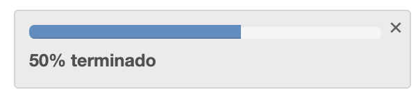{fig-align="center" width="420"}

Existen muchas otras dependencias basadas en JavaScript que podemos usar para apoyarnos visualmente al momento de ejecutar procesos en shiny apps, como pueden ser `shinyalert`, `shinytoastr`, entre otras más, dependiendo de cuál sea nuestro interés en particular (e inclusive el tema que estemos usando en nuestra app).

### Buenas prácticas para estructurar una aplicación

Ahora que ya conocemos como crear aplicaciones con Shiny y todo lo que podemos hacer con ellas, vamos a terminar este capítulo aprendiendo las mejores prácticas para poder estructurar nuestras aplicaciones, haciéndolas escalables y sencillas de leer. 

Algo común cuando comenzamos a crear nuestras primeras apps es que solemos mantener el código completo en un mismo archivo (casi siempre llamado `app.R`). Esto está bien cuando se trata de programas pequeños o prototipos simples. Sin embargo, a medida que nuestras aplicaciones crecen en complejidad (incorporando múltiples módulos, funciones, y elementos de *UI*) mantener todo el código en un solo archivo se vuelve inviable. Encontrar y modificar un componente entre cientos o miles de líneas de código se convierte en una tarea titánica y propensa a errores.

Como primera buena práctica, se recomienda dividir nuestro código en tres archivos principales:

- `global.R`: Aquí se colocan todas las variables, funciones, conexiones a bases de datos, paquetes, y cualquier otro recurso que será compartido tanto por el servidor como por la interfaz de usuario. Este archivo se ejecuta una sola vez cuando se lanza la app, por lo que es ideal para tareas pesadas o costosas.

- `ui.R`: Contiene exclusivamente el código relacionado con la interfaz gráfica del usuario. Aquí se definen los paneles, *inputs*, *outputs*, menús, estilos, temas, etc. Esta separación facilita que alguien con conocimiento en diseño o UX pueda trabajar directamente sobre este archivo sin alterar la lógica del servidor.

- `server.R`: Aquí se define la lógica de la aplicación: los cálculos, transformaciones, llamados a la base de datos, generación de gráficos y respuestas a eventos. Este archivo contiene el *server* como función reactiva.

La estructura de la carpeta de nuestro proyecto se verá:

```{r, eval=FALSE}
# /folder_de_mi_app/
# │
# ├── global.R
# ├── ui.R
# ├── server.R
```

Queda implícito el hecho de que es áltamente recomendable crear un proyecto que esté meramente destinado a nuestra aplicación, ya que tener guardados otros archivos en la misma ruta puede dar pie a confusiones al revisar/depurar el código, además de que será más dificil de mantener a largo plazo. Ahora, además de nuestros archivos principales, como ya mencioné en secciones anteriores, podemos incluir una carpeta `www`, en la cual guardaremos todos los objetos/archivos referentes a la customización de nuestra app, como pueden ser códigos CSS, imágenes, entre otros elementos. En el caso de incluir esta carpeta, la estructura de nuestra app será:

```{r, eval=FALSE}
# /folder_de_mi_app/
# │
# ├── global.R           
# ├── ui.R               
# ├── server.R           
# │
# ├── www/               
# │   ├── styles.css     
# │   ├── logo.png 
```

De esta forma, nuestro código es mucho más limpio y se vuelve sencillo el encontrar las secciones de la app que estamos buscando. Para referenciar estos archivos, de manera automática nuestro proyecto ya va a detectar que se encuentran dentro de la carpeta `www`, por lo que solo tendremos que nombrarlos sin ningún prefijo, por ejemplo:

```{r, eval=FALSE}
tags$head(
  tags$link(rel = "stylesheet", 
            type = "text/css", 
            href = "styles.css")
)
```

Para llamar a un archivo CSS.

Si quisiéramos, podemos dividir las secciones de nuestra app aún más, para que incluso secciones pequeñas o más específicas se encuentren encapsuladas dentro de otros archivos separados, por ejemplo, imaginemos que tenemos un proceso de extracción de datos relativamente complejo y largo, por lo que escribirlo en el archivo `global.R` se vuelve poco práctico; En lugar de escribir ese código en la sección global, podemos escribirlo en un archivo separado llamado `data.R` y simplemente llamarlo desde el archivo `global.R`, por lo que el código de este último archivo se verá de la siguiente manera:

```{r, eval=FALSE}
library(shiny)
...
...

source("data.R")
```

Volviéndose bastante sencillo de leer para otros usuarios, ya que ahora podemos identificar en qué archivo se encuentran cosas más específicas, como funciones, pipelines, e inclusive secciones del `UI`.

La contenerización de archivos en una shiny app no solo se limita a los aspectos que vimos anteriormente, si no también a secciones específicas de la app en si, como ventanas o páginas de la misma, cosa que podemos hacer separándola en **módulos**, tema que veremos a continuación.

#### Módulos

En una shiny app, los módulos permiten organizar el código en componentes reutilizables y escalables, lo que es ideal cuando la app empieza a crecer en complejidad y componentes. Básicamente, un módulo encapsula una parte de la interfaz y su lógica del servidor, para que puedas reutilizarla varias veces o mantener el código ordenado. El uso de módulos en shiny es especialmente útil cuando trabajamos colaboratibamente en un proyecto a gran escala, ya que cada usuario estará enfocado en desarrollar el código de su propio módulo, sin preocuparse por afectar la funcionalidad de los demás.

La estructura de los módulos es bastante sencilla, ya que simplemente vamos a englobar los componentes en dos funciones referentes al `UI` y el `Server`:

- `mod_funcion_UI(id)`: Para definir la parte de la interfaz.
- `mod_funcion_Server(id)`: Para definir la lógica del servidor.

Para ver cómo estructurar una aplicación mediante módulos, podemos retomar el ejemplo que vimos en la sección anterior. Para esta aplicación vamos a crear los siguientes archivos:

- `Global.R`
- `UI.R`
- `Server.R`
- `Funciones.R`
- `Modulo_panel_funciones.R`

Primero, comenzaremos por crear el archivo `Funciones.R`, para las funciones globales:

```{r, eval=FALSE}
cargar_datos <- function(fecha_inicial, fecha_final, conexion){
  datos <- dbGetQuery(conexion, paste0("
    SELECT ... 
    FROM tabla_ejemplo 
    WHERE fecha_tabla BETWEEN '", fecha_inicial, "' AND '", 
    fecha_final, "'"
  ))
  
  write_sheet(data = datos, ss = "xxxxxxxxx", sheet = "Reporte")
}

segundo_reporte <- function(fecha_inicial, fecha_final, conexion){
  datos <- dbGetQuery(conexion, paste0("
    SELECT ... 
    FROM tabla_ejemplo_2 
    WHERE fecha_tabla BETWEEN '", fecha_inicial, "' AND '", 
    fecha_final, "'"
  ))
  
  write_sheet(data = datos, ss = "xxxxxxxxx", sheet = "Reporte 2")
}

reportes <- list(
  "Reporte 1" = cargar_datos,
  "Reporte 2" = segundo_reporte
)
```

Ahora, vamos a crear el archivo `Modulo_panel_funciones.R`, para comenzar a entender la estructura de estos componentes:

```{r, eval=FALSE}
# UI
mod_reporte_ui <- function(id){
  ns <- NS(id)
  tagList(
    dateInput(ns("fecha_inicial"), "Fecha inicial"),
    dateInput(ns("fecha_final"), "Fecha final"),
    selectInput(ns("tipo_reporte"), "Selecciona el reporte", 
                choices = NULL),
    actionButton(ns("generar_reporte"), "Generar Reporte")
  )
}

# Servidor
mod_reporte_server <- function(id, reportes, conexion){
  moduleServer(id, function(input, output, session){
    
    updateSelectInput(session, "tipo_reporte", choices = names(reportes))
      
      withProgress(message = "Iniciando proceso",{
        observeEvent(input$generar_reporte,{
          req(input$tipo_reporte, input$fecha_inicial, input$fecha_final)
          
          funcion_reporte <- reportes[[input$tipo_reporte]]
          
          incProgress(0.5, message = "50% terminado")
          
          funcion_reporte(
            fecha_inicial = input$fecha_inicial,
            fecha_final = input$fecha_final,
            conexion = conexion
          )
          
          incProgress(0.5, message = "Proceso completado")
          
        })
      })
    
  })
}


```

Vamos ahora a analizar el código de los módulos. Del lado del `UI` es bastante sencillo, ya que simplemente creamos una función que llame a esa sección de la interfaz. Obviamente, como los elementos de HTML no se encuentran dentro de una función `fluidPage()`, tenemos que hacer uso de `tagList()`, para que puedan ser englobados y luego exportados a una sección de nuestra shiny app. Como puedes darte cuenta, además agregamos una línea de código adicional:

```{r, eval=FALSE}
ns <- NS(id)
```

¿Qué significa? Este pequeño código hace referencia al *NameSpace* o *espacio de nombre*, y sirve para encapsular todo lo que se encuentre dentro de este módulo, evitando problemas de ambigüedad, como en situaciones en las que dos *inputs* de módulos diferentes tienen el mismo ID, lo que al mantenerlos separados mediante un  *NameSpace* diferente, aunque ambos elementos tengan un mismo ID, este no se confundirá con el otro, permitiendo que nuestras apps sean mucho más escalables. Tanto del lado del `UI` como del `Server` tenemos como argumento la variable `id`, esta variable nos ayudará a asignarle el *NameSpace* a nuestro módulo para que sea identificable a partir de ella. Finalmente, puedes darte cuenta de que todos los *inputs* del módulo referente al `UI` se encuentran dentro de una función `ns()`, y esto es ocurre para que podamos mantenerlas única y exclusivamente dentro del *NameSpace*, siendo que todo lo que hagamos afuera de este espacio no lo va a afectar.

Volviendo a la estructura de la app, ahora vamos a crear el archivo `Global.R`:

```{r, eval=FALSE}
library(shiny)
library(DBI)
...
...

connexion <- dbGetQuery(...)

source("Funciones.R")
source("Modulo_panel_funciones.R")
```

El archivo `Global.R` únicamente cuenta con unas pocas líneas de código, ya que las funciones y módulos adicionales se encuentran en archivos separados que solo son llamados aquí, lo que lo convierte en un archivo sumamente fácil de leer.

Vayamos ahora con el archivo `UI.R`:

```{r, eval=FALSE}
fluidPage(
  mod_reporte_ui("reporte_ui")
)
```

En donde llamamos a la función referente a los componentes de la interfaz.

Finalmente, vamos a crear el archivo `Server.R`:

```{r, eval=FALSE}
function(input, output, session){
  mod_reporte_server("reporte_ui", reportes, conexion)
}
```

De esta forma, podemos construir completamente una app modularizada que sea más escalable. Si quisiéramos ordenar aún más el código, podríamos guardar todos los archivos referentes a los módulos en una subcarpeta llamada `modulos`, siendo ahora el archivo `Global.R`:

```{r, eval=FALSE}
library(shiny)
library(DBI)
...
...

connexion <- dbGetQuery(...)

source("modulos/Funciones.R")
source("modulos/Modulo_panel_funciones.R")
```

#### Otras funcionalidades de los módulos

Ya que trabajamos con la estructura general de los módulos, ahora vamos a exprimir sus capacidades un poco más. A pesar de que estos son independientes entre si, es posible que nos encontremos en situaciones en las que necesitemos exportar un cierto valor o `input` de un módulo a otro. El aislamiento entre estos objetos impide que utilicemos directamente el `input$id_objeto` de otro módulo, ya que esto rompería el funcionamiento de los módulos, por lo que la forma correcta de acceder a estos objetos es a través del uso de objetos reactivos. En lugar de acceder directamente al `input`, podemos hacer que un módulo devuelva un objeto `reactive()` o una `reactiveValues()` que luego se pasa como argumento a otro módulo, siendo este ya un objeto independiente. Veamos un ejemplo sencillo de esto, considerando la aplicación anterior con la que estuvimos trabajando: Imaginemos que ahora queremos crear un reporte adicional en otra sección de nuestra app, a partir de los parámetros del primer módulo, por lo que podemos hacer una modificación a este último para que exporte los valores reactivos en una lista:

```{r, eval=FALSE}
mod_reporte_server <- function(id, reportes, conexion){
  moduleServer(id, function(input, output, session){
    
    updateSelectInput(session, "tipo_reporte", choices = names(reportes))
    
    valores <- reactiveValues()

    observeEvent(input$generar_reporte, {
      req(input$tipo_reporte, input$fecha_inicial, input$fecha_final)

      withProgress(message = "Iniciando proceso", {
        
        funcion_reporte <- reportes[[input$tipo_reporte]]
        
        incProgress(0.5, message = "50% terminado")

        funcion_reporte(
          fecha_inicial = input$fecha_inicial,
          fecha_final = input$fecha_final,
          conexion = conexion
        )

        incProgress(0.5, message = "Proceso completado")
        
        valores$fecha_inicial <- input$fecha_inicial
        valores$fecha_final <- input$fecha_final
        valores$tipo_reporte <- input$tipo_reporte
        valores$listo <- TRUE
      })
    })

    return(valores)
  })
}
```

De esta forma, con la ayuda del objeto `valores <- reactiveValues()`, podemos almacenar toda la información que necesitemos de forma reactiva. Ahora, vamos a crear el segundo módulo, el cual tomará estos parámetros y creará el reporte:

```{r, eval=FALSE}
# UI
mod_segundo_reporte <- function(id){
  ns <- NS(id)
  tagList(
    actionButton(ns("generar_segundo_reporte"), "Generar Reporte"),
    verbatimTextOutput(ns("resultado_segundo_reporte"))
  )
}

# Server
mod_ejecutar_reporte_server <- function(id, parametros){
  moduleServer(id, function(input, output, session){
    
    output$resultado <- renderPrint({
      req(parametros$listo)
      paste("Parámetros recibidos:",
            "\nTipo:", parametros$tipo_reporte,
            "\nDesde:", parametros$fecha_inicial,
            "\nHasta:", parametros$fecha_final)
    })
    
  })
}
```

Por lo tanto, ahora el `UI` de nuestra app será:

```{r, eval=FALSE}
fluidPage(
  mod_reporte_ui("reporte_ui"),
  mod_segundo_reporte("segundo_reporte")
)
```

Y el servidor:

```{r, eval=FALSE}
function(input, output, session){
  mod_reporte_server("reporte_ui", reportes, conexion),
  mod_ejecutar_reporte_server("segundo_reporte", parametros)
}
```

Podemos guardar el código de este segundo módulo en un archivo llamado `Modulo_panel_reporte.R`, por lo que ahora nuestro archivo `Global.R` se verá de la siguiente manera:

```{r, eval=FALSE}
library(shiny)
library(DBI)
...
...

connexion <- dbGetQuery(...)

source("modulos/Funciones.R")
source("modulos/Modulo_panel_funciones.R")
source("modulos/Modulo_panel_reporte.R")
```

A pesar de que el objeto `valores` y el parámetro `parametros` no tienen el mismo nombre, estos se pueden comunicar gracias a que utilizamos un objeto `reactiveValues()`, el cual funciona como una referencia que comparten ambos en memoria, lo que les permite identificar que dichos parámetros son provenientes de ese objeto reactivo. 

Y así, tan sencillamente (aunque no tan intuitivo a nivel código) podemos trabajar con módulos en shiny de casi todas las maneras imaginables. Esta estructura modular no solo nos permite organizar mejor nuestras aplicaciones, sino también construir componentes reutilizables, escalables y más fáciles de mantener. A medida que nuestras apps crecen en complejidad, dominar los módulos se vuelve una herramienta esencial para escribir código más limpio, robusto y flexible.

### Culminando con dos proyectos

Finalmente, después de toda esta travesía que pasamos para poder entender cómo funcionan nuestros datos, como extraerlos, manipularlos, arreglarlos y hacer estadística y análisis con ellos, vamos a darle un cierre a este libro aplicando **todo** (o casi todo) lo que hemos aprendido en dos proyectos finales: *Una aplicación para visualizar datos del clima* y *un dashboard de ventas interactivo*, cada uno de ellos con un propósito diferente que iremos viendo poco a poco.

Estos proyectos no son solo ejercicios prácticos: son oportunidades reales para consolidar conocimientos, tomar decisiones de diseño, y pensar en la experiencia del usuario final. Pondremos en práctica estructuras reactivas, uso de módulos, visualizaciones dinámicas, limpieza de datos y algunas técnicas avanzadas que ya has visto, ahora en un contexto más completo y realista.

Además, estas aplicaciones están pensadas no solo como ejercicios académicos, sino como soluciones que podrían funcionar en escenarios del mundo real. Son el cierre perfecto para esta etapa de tu formación, antes de seguir profundizando en nuevas herramientas y desafíos.

#### Visualizador de datos climáticos

Nuestro primer proyecto final consistirá en una aplicación web diseñada para mostrar los datos climáticos actuales en cualquier parte del mundo, además de ofrecer pronósticos para los días siguientes. Este proyecto es especialmente interesante porque no solo trabajaremos con datos en tiempo real, sino que también vamos a extraerlos directamente mediante la API de OpenWeather, integrando así una fuente externa dinámica en nuestra aplicación.

Como recordarás, en el proyecto final del capítulo 5 nos enfocamos en crear un *pipeline* para enviar datos desde la API de `Open Weather` hacia una base de datos relacional, y en ese mismo capítulo hicimos uso de la librería `OweatherR`, desarrollada específicamente para facilitar ese flujo de trabajo. En este nuevo proyecto, volveremos a utilizar esa librería para simplificar el código de nuestra aplicación. Sin embargo, también explicaremos cada una de las funciones de la librería `OweatherR` de forma individual, con el objetivo de comprender mejor su estructura interna y tener un mayor control sobre lo que *se ejecuta detrás*.

##### Archivo Global

Comencemos por el primer paso lógico, como en cualquier shiny app: Cargar todas las librerías necesarias en un archivo `Global.R`:

```{r, eval=FALSE}
library(shiny)
library(globe4r)
library(dplyr)
library(stringr)
library(shinyWidgets)
library(globe4r)
library(GoogleTooltip)
library(mapboxer)
library(ggmap)
library(reactable)
library(OweatherR)
library(echarts4r)
```

Siendo `globe4r`, `reactable`, `mapboxer`, `echarts4r` y `shinyWidgets` librerías para los objetos visuales que vamos a trabajar, `dplyr` y `stringr` para el manejo de datos y cadenas específicas,  `ggmap` para obtener coordenadas a partir de direcciones, y `GoogleTooltip` (librería también escrita por tu servidor) para generar una barra de búsqueda que nos de sugerencias de direcciones, tal como lo hace el portal de Google Maps.

Siguiendo con el archivo `Global.R`, para poder extraer coordenadas a partir de direcciones, tendremos que usar una *API KEY* de Google Maps, la cual puedes obtener en la consola de Google, tal como vimos en secciones anteriores de este capítulo cuando discutimos el uso de `mapboxer`. De igual forma, necesitaremos una *API KEY* del sitio de Open Weather para poder extraer la información climática que necesitamos. Una vez tenemos estos dos claves, el código en el archivo `Global.R` será:

```{r, eval=FALSE}
# API de Google Maps
google_key <- "XXXXXXXXXXXXXXXXXXXXXXXX"
register_google(google_key)
# API de Open Weather
set_weather_key("XXXXXXXXXXXXXXXXXXXXXXXX")
```

Donde la función `set_weather_key()` únicamente guarda la cadena de texto de la *API KEY* como una variable de entorno disponible mientras la sesión esté activa, siendo la estructura de la función:

```{r, eval=FALSE}
set_weather_key <- function(api_key){
  Sys.setenv(weather_key = api_key)
}
```

##### Archivo UI

Siguiendo con la interfaz de nuestra app (en el archivo `ui.R`), antes de comenzar con el código, una buena práctica siempre será el plasmar en un diagrama o un visual sencillo el como queremos que luzca nuestro programa, para después escribir el código en base a ello, siendo en este caso el siguiente:

{#fig-relacion fig-align="center" width="540"}

Básicamente, vamos a dividir la interfaz en dos secciones: una más pequeña, que ocupará aproximadamente un cuarto de la pantalla y estará destinada a los *inputs* y widgets secundarios; y otra más amplia, que ocupará los tres cuartos restantes y contendrá un mapa interactivo. Este mapa nos permitirá visualizar con precisión el punto exacto del que estamos obteniendo la información climática.

Comencemos por añadir una fuente personalizada desde Google Fonts y un fondo oscuro con un gradiente radial para toda la pantalla. Además, incluiremos un *spinner* que se activará automáticamente cada vez que haya procesos ejecutándose en el servidor:

```{r, eval=FALSE}
fluidPage(
  tags$head(tags$link(href = "https://fonts.googleapis.com/css?family=Oswald", 
                      rel = "stylesheet")),
  shinybusy::add_busy_spinner(position = "top-right", 
                              spin = "self-building-square", 
                              color = "darkred"),
  setBackgroundColor(
    color = "#2B2B2B",
    gradient = "radial"
  )
)
```

Comenzando ahora con los elementos internos del panel pequeño, crearemos una columna con un tamaño `widht = 3`, que centre automáticamente los elementos:

```{r, eval=FALSE}
column(
    width = 3,
    align = "center",
    ...
  )
```

Ahora, comencemos a agregar los widgets correspondientes uno a uno. El primer elemento que vamos a añadir será un visual de JavaScript para generar un pequeño globo terraqueo:

```{r, eval=FALSE}
globeOutput("globo",
            width = 250, 
            height = 250)
```

El título de nuestro programa, el cual será *El clima en tu ciudad* (aunque esto puede ser ajustado a tu preferencia personal):

```{r, eval=FALSE}
h1("El clima en tu ciudad",style="color:#ebb52d")
```

Como siguiente paso, vamos a añadir los *inputs* para poder buscar la dirección en particular, siendo `autocomplete_textOutput()` para la cadena de texto a buscar, *input* creado para poder dar sugerencias a partir de la API de Google Maps, razón por la que la *API Key* respectiva en el archivo global fue guardada como un objeto, ya que la vamos a reutilizar en este *input*. Adicionalmente, dos `numericInput()` para establecer la latitud y longitud, y un `actionButton()` para poder activar el evento, evitando que este se ejecute de manera automática cuando añadamos información a los *inputs* anteriores. Puede parecer un poco redundante el tener dos *inputs* enfocados a latitud y longitud si esta misma la vamos a obtener directamente de la dirección que establezcamos, sin embargo, esto le da la opción al usuario final de poder usar nombres de ubicaciones o, si el lo prefiere, usar ubicaciones exactas. Obviamente, el *input* enfocado a la cadena de texto deberá ser mucho más amplio que los demás, en caso de que introduzcamos direcciones largas, por lo que vamos a crear tres columnas: Fuera de las columnas vamos a introducir `autocomplete_textOutput()`, en las siguientew dos columnas pequeñas que dividirán la sección a la mitad enfocaremos a los *inputs* numéricos de latitud/longitud, y la última columna adicional será para `actionButton()`:

```{r, eval=FALSE}
autocomplete_textOutput(label = " ", 
                        inputId = "direction", key = google_key,
                        use_shinywidgets = T, icon = icon("globe"), 
                        placeholder = "Ingresa tu ubicación"),
column(width = 6, tags$style("label{color: #ebb52d;}"),
       numericInput("lat", "Latitud", value = 0)),
column(width = 6, numericInput("lng", "Longitud", value = 0)),
column(width = 12, actionButton("temp_find", "Ver clima", 
                                icon = icon("magnifying-glass")))
```

Ya que tenemos escritos los *inputs* correspondientes, ahora vamos a añadir en esta sección dos *Outputs*: `textOutput("temperatura_actual")` para generar una cadena de texto con la temperatura actual de la zona a busacar, y `reactableOutput("tabla_temperaturas")` para generar una tabla con el pronóstico de las temperaturas de los siguientes días:

```{r, eval=FALSE}
column(width = 12,
       align = "center",
       h4(textOutput("temperatura_actual"),
          style="color:#ebb52d"),
       reactableOutput("tabla_temperaturas"))
```

Fuera del panel más pequeño, ahora vamos a ajustar el siguiente panel correspondiente al mapa:

```{r, eval=FALSE}
column(
    width = 9,
    mapboxerOutput("map", height = "1000px", width = "1300px")
  )
```

Siendo únicamente una columna con `width = 9` y un único widget, por lo que su implementación es bastante sencilla. 

Como último elemento visual, vamos a añadir un gráfico de tendencias para las temperaturas, sin embargo, notarás que todos los elementos ya están ocupando el 100% de los páneles de nuestra app. Lo que haremos para añadir este último visual será sobreponerlo en una esquina del mapa, lo que resultará en un visual más interesante, que no estorbará gravemente a los demás. Para sobreponer este elemento haremos uso del panel `absolutePanel()` y lo posicionaremos en la esquina superior derecha mediante los argumentos `top = 10` y `right = 10`, siendo:

```{r, eval=FALSE}
absolutePanel(
    top = 10, right = 10, style = "z-index:500; text-align: right;",
    echarts4rOutput("grafico_temperatura", height = 250, width = 400)
  )
```

Finalmente, el código completo de nuestra interfaz será:

```{r, eval=FALSE}
fluidPage(
  tags$head(tags$link(href = "https://fonts.googleapis.com/css?family=Oswald", 
                      rel = "stylesheet")),
  shinybusy::add_busy_spinner(position = "top-right", 
                              spin = "self-building-square", 
                              color = "darkred"),
  setBackgroundColor(
    color = "#2B2B2B",
    gradient = "radial"
  ),
  column(
    width = 3,
    align = "center",
    globeOutput("globo",
                width = 250, 
                height = 250),
    h1("El clima en tu ciudad",style="color:#ebb52d"),
    hr(),
    autocomplete_textOutput(label = " ", inputId = "direction", key = key,
                            use_shinywidgets = T, icon = icon("globe"), 
                            placeholder = "Ingresa tu ubicación"),
    column(width = 6, tags$style("label{color: #ebb52d;}"),
           numericInput("lat", "Latitud", value = 0)),
    column(width = 6, numericInput("lng", "Longitud", value = 0)),
    column(width = 12, actionButton("temp_find", "Ver clima", 
                                    icon = icon("magnifying-glass"))),
    div(style = "height: 100px;"),
    column(width = 12,
           align = "center",
           h4(textOutput("temperatura_actual"),style="color:#ebb52d"),
           reactableOutput("tabla_temperaturas"))
  ),
  column(
    width = 9,
    mapboxerOutput("map", height = "1000px", width = "1300px")
  ),
  absolutePanel(
    top = 10, right = 10, style = "z-index:500; text-align: right;",
    echarts4rOutput("grafico_temperatura", height = 250, width = 400)
  )
)
```

Nótese que añadimos algunos espaciados de página (*breaks*) mediante las funciones `hr()` y `div(style = "height: 100px;")`, simplemente para dar un mejor aspecto a nuestro programa.

##### Archivo Server

Entrando de lleno en la lógica de nuestro programa, comencemos por plantear las funciones respectivas del lado del servidor. Como primer paso, vamos a generar los visuales para el globo terraqueo y el mapa plano, ya que en el estado inicial de la aplicación les daremos una vista genérica:

```{r, eval=FALSE}
output$globo <- render_globe({
    create_globe(height = "100vh") |> 
      globe_background(color = "#2B2B2B") |> 
      globe_img_url(image_url("blue-marble")) |> 
      globe_pov(
        altitude = 2.3,
        0.6345,
        -80.5528
      )
  })

output$map <- renderMapboxer({
    mapboxer(
      style = "mapbox://styles/mapbox/dark-v11",
      token = "XXXXXXXXXXXXXXXXXXXXXXXXXXXXXXX",
      center = c(-99,22),
      zoom = 4.5,
      maxZoom = 9
    ) 
  })
```

Vamos ahora a obtener las coordenadas respectivas a partir de la dirección:

```{r, eval=FALSE}
coordenadas <- reactive({
    dir <- geocode(location = input$direction)
    dir
  })
```

Nótese que, al ser un objeto `reactive()`, este únicamente se activará cuando `input$direction` sea ejecutado, por lo que no es necesario escribirlo dentro de un `observeEvent()`.

A partir del objeto anterior podemos actualizar los valores de los *inputs numéricos*:

```{r, eval=FALSE}
observeEvent(input$direction,{
    
    req(coordenadas())
    
    updateNumericInput(session, "lat", value = coordenadas()$lat)
    updateNumericInput(session, "lng", value = coordenadas()$lon)
    
  })
```

En este caso si será necesario mantener la actualización de ambos *inputs* dentro de un `observeEvent()` que llame directamente a `input$direction`, ya que necesariamente utilizaremos el valor obtenido a partir de este último *input*, lo que imposibilita que esté vacío para evaluar los otros dos.

Ya que tenemos las coordenadas necesarias, podemos crear objetos *proxys* que actualicen el estado inicial del mapa y el globo, respectivamente, sin reiniciarlos, siendo:

```{r}
bounds <- reactive({
    x <- c(input$lng,input$lat, input$lng+0.1, input$lat+0.1)
    x
  })

observeEvent(input$temp_find, {
    globe_proxy("globo") |> 
      globe_pov(
        altitude = 2.3,
        input$lat,
        input$lng
      ) 
  })

observeEvent(input$temp_find,{
    req(bounds())
  
    mapboxer_proxy("map") |>
      fit_bounds(bounds()) |>
      update_mapboxer()
  })
```

Siendo ambos *proxys* activados por el botón `input$temp_find`. En el caso del globo terraqueo únicamente establecimos unas coordenadas específicas y una altitud, pero en el caso del mapa plano tuvimos que crear una serie de coordenadas para poder generar un cuadrado correspondiente al tamaño de la vista del mapa, el cual ajustará automáticamente el zoom basado en el tamaño de este cuadrado.

Aprovechando que ya tenemos establecidas las coordenadas, podemos comenzar por extraer los datos necesarios de la API de OpenWeather:

```{r, eval=FALSE}
temperaturas_data <- reactive({
    
    solicitud <- weather_forecast_req(lat = input$lat, 
                                      lon = input$lng, 
                                      tibble_format = T)
    
    x <- 
      tibble(
        solicitud$dt, solicitud$main$temp,
        solicitud$main$temp_min,
        solicitud$main$temp_max,
        solicitud |> 
          select(weather) |> 
          tidyr::unnest() |> 
          select(icon)) |> 
      setNames(c("Datetime", "Temp", "Min", "Max", "Icon")) |> 
      mutate(
        Icon = paste0(
          "http://openweathermap.org/img/w/",Icon,".png"
        ),
        Datetime = strftime(Datetime, format = "%A, %I %p"),
        Min = Min -273.15,
        Max = Max -273.15,
        Temp = Temp -273.15,
      )
    
    x
    
  })
```

Como puedes ver, le hicimos un pequeño tratamiento a los datos para poder convertirlos a un data frame compatible con `reactable()` (*input* para una tabla HTML). Además de la solicitud inicial, también modificamos cinco columnas: `Icon` para generar los íconos en HTML, `Datetime` para reformatear la columna de fechas y un pequeño ajuste a `Min`, `Max` y `Temp`, para convertir las temperaturas de *Kelvin* a *Celsius*.

Vamos ahora a crear los *outputs* finales: El texto condicional para conocer la temperatura actual:

```{r, eval=FALSE}
output$temperatura_actual <- renderText({
    x <- weather_actual_req(lat = input$lat, 
                            lon = input$lng, 
                            tibble_format = T)
    paste0("Temperatura actual: ", x$main.temp-273.15,"°")
  }) |> 
    bindEvent(input$temp_find)
```

El gráfico sobrepuesto de tendencias en la temperatura para los sigueintes días:

```{r, eval=FALSE}
output$grafico_temperatura <- renderEcharts4r({
    
    req(temperaturas_data())
    x <- temperaturas_data()
    
    temperaturas_data() |> 
      e_charts(Datetime) |> 
      e_bar(Temp, symbol = "none", smooth = F, 
             name = "Temperatura") |> 
      e_theme("auritus") |> 
      e_color(color = "darkred") |> 
      e_tooltip(trigger = "axis") |> 
      e_y_axis(show = F) |> 
      e_title(" ", left = "center") |> 
      e_legend(right = 0, textStyle = list(color = "#fff"))
    
  }) |> 
    bindEvent(input$temp_find)
```

Y, finalmente, la tabla con el pronóstico del clima, incluyendo elementos visuales en HTML como los íconos del clima:

```{r, eval=FALSE}
output$tabla_temperaturas <- renderReactable({
    
    req(temperaturas_data())
    
    temperaturas_data() |> 
      reactable(
        theme = reactablefmtr::nytimes(centered = TRUE, 
                                       header_font_size = 12,
                                       font_color = "#fff",
                                       background_color = "transparent"),
        defaultColDef = colDef(headerStyle = list(background = "#2B2B2B", 
                                                  color = "#fff"),
                               vAlign = "center"),
        compact = TRUE,
        language = reactableLang(
          noData = "No data found",
          pageInfo = "{rowStart}\u2013{rowEnd} of {rows} pages",
          pagePrevious = "\u276e",
          pageNext = "\u276f",
        ),
        bordered = F,
        onClick = "select",
        #selection = "single",
        pagination = F,
        height = 390,
        columns = list(
          Datetime = colDef(name = "Dia/hora",minWidth = 60),
          Icon = colDef(
            minWidth = 25,
            header = icon("cloud-sun"),
            cell = function(value) {
              image <- img(src = value, style = "height: 24px;", alt = value)
              tagList(
                div(style = "display: inline-block; width: 45px;", image)
              )
            }
          ),
          Temp = colDef(
            minWidth = 60,
            header = icon("temperature-low"),
            cell = function(value, index){
              Min <- temperaturas_data()$Min[index]
              Max <- temperaturas_data()$Max[index]
              div(
                div(style = "font-weight: 600", value, "°"),
                div(style = "font-size: 0.75rem", 
                    paste0("Min: ",Min,"°, Max: ", Max,"°"))
              )
            }
          ),
          Min = colDef(show = F),
          Max = colDef(show = F)
        )
      )
    
    
  }) |> 
    bindEvent(input$temp_find)
```

El código respectivo a la tabla es especialmente grande debido al alto nivel de personalización que aplicamos por ejemplo, siendo que hicimos tratamientos individuales para casi cada columna. Más específicamente, aplicamos un tema preestablecido con `reactablefmtr::nytimes(...)` y `colDef(headerStyle = list(background = "#2B2B2B", color = "#fff"), vAlign = "center")`. Para generar una columna que nos muestre el ícono del clima hicimos uso de una función anómima:

```{r, eval=FALSE}
Icon = colDef(
  minWidth = 25,
  header = icon("cloud-sun"),
  cell = function(value) {
    image <- img(src = value, style = "height: 24px;", alt = value)
    tagList(
      div(style = "display: inline-block; width: 45px;", image)
    )
  }
)
```

Mientras que, para el caso de la temperatura, condensamos los valores mínimos, máximos y actuales de la siguiente manera:

```{r, eval=FALSE}
Temp = colDef(
  minWidth = 60,
  header = icon("temperature-low"),
  cell = function(value, index){
    Min <- temperaturas_data()$Min[index]
    Max <- temperaturas_data()$Max[index]
    div(
      div(style = "font-weight: 600", value, "°"),
      div(style = "font-size: 0.75rem", 
          paste0("Min: ",Min,"°, Max: ", Max,"°"))
    )
  }
)

```

Seguramente te diste cuenta de que en estos tres *inputs* hicimos uso de `bindEvent()` en lugar de `observeEvent()`, ¿por qué optamos por esta función en particular? Para estos casos, `observeEvent()` solamente registra el primer disparador, lo que implica que cuando cambiemos de dirección (suponiendo que ya habíamos establecido una dirección previamente), los gráficos/tablas se van a actualizar sin que presionemos el boton por segunda vez, caso contrario a `bindEvent()`, ya que este último exige que hagamos click en el disparador en cada ocasión, lo que lo vuelve una mejor opción para este caso particular.

Finalmente, el código completo de nuestro servidor será:

```{r, eval=FALSE}
function(input, output, session){
  
  output$globo <- render_globe({
    create_globe(height = "100vh") |> 
      globe_background(color = "#2B2B2B") |> 
      globe_img_url(image_url("blue-marble")) |> 
      globe_pov(
        altitude = 2.3,
        0.6345,
        -80.5528
      )
  })
  
  observeEvent(input$temp_find, {
    globe_proxy("globo") |> 
      globe_pov(
        altitude = 2.3,
        input$lat,
        input$lng
      ) 
  })
  
  output$map <- renderMapboxer({
    mapboxer(
      style = "mapbox://styles/mapbox/dark-v11",
      token = "XXXXXXXXXXXXXXXXXXXXXXXXXXXXXXX",
      center = c(-99,22),
      zoom = 4.5,
      maxZoom = 9
    ) 
  })
  
  
  coordenadas <- reactive({
    
    dir <- geocode(location = input$direction)
    dir
  })
  
  observeEvent(input$direction,{
    req(coordenadas())
    
    updateNumericInput(session, "lat", value = coordenadas()$lat)
    updateNumericInput(session, "lng", value = coordenadas()$lon)
    
  })
  
  temperaturas_data <- reactive({
    solicitud <- weather_forecast_req(lat = input$lat, 
                                      lon = input$lng, 
                                      tibble_format = T)
    
    x <- 
      tibble(
        solicitud$dt, solicitud$main$temp,
        solicitud$main$temp_min,
        solicitud$main$temp_max,
        solicitud |> 
          select(weather) |> 
          tidyr::unnest() |> 
          select(icon)) |> 
      setNames(c("Datetime", "Temp", "Min", "Max", "Icon")) |> 
      mutate(
        Icon = paste0(
          "http://openweathermap.org/img/w/",Icon,".png"
        ),
        Datetime = strftime(Datetime, format = "%A, %I %p"),
        Min = Min -273.15,
        Max = Max -273.15,
        Temp = Temp -273.15,
      )
    x
  })
  
  output$tabla_temperaturas <- renderReactable({
    req(temperaturas_data())
    
    temperaturas_data() |> 
      reactable(
        theme = reactablefmtr::nytimes(centered = TRUE, 
                                       header_font_size = 12,
                                       font_color = "#fff",
                                       background_color = "transparent"),
        defaultColDef = colDef(headerStyle = list(background = "#2B2B2B", 
                                                  color = "#fff"),
                               vAlign = "center"),
        compact = TRUE,
        language = reactableLang(
          noData = "No data found",
          pageInfo = "{rowStart}\u2013{rowEnd} of {rows} pages",
          pagePrevious = "\u276e",
          pageNext = "\u276f",
        ),
        bordered = F,
        onClick = "select",
        #selection = "single",
        pagination = F,
        height = 390,
        columns = list(
          Datetime = colDef(name = "Dia/hora",minWidth = 60),
          Icon = colDef(
            minWidth = 25,
            header = icon("cloud-sun"),
            cell = function(value) {
              image <- img(src = value, style = "height: 24px;", alt = value)
              tagList(
                div(style = "display: inline-block; width: 45px;", image)
              )
            }
          ),
          Temp = colDef(
            minWidth = 60,
            header = icon("temperature-low"),
            cell = function(value, index){
              Min <- temperaturas_data()$Min[index]
              Max <- temperaturas_data()$Max[index]
              div(
                div(style = "font-weight: 600", value, "°"),
                div(style = "font-size: 0.75rem", 
                    paste0("Min: ",Min,"°, Max: ", Max,"°"))
              )
            }
          ),
          Min = colDef(show = F),
          Max = colDef(show = F)
        )
      )
  }) |> 
    bindEvent(input$temp_find)
  
  output$temperatura_actual <- renderText({
    x <- weather_actual_req(lat = input$lat, 
                            lon = input$lng, 
                            tibble_format = T)
    paste0("Temperatura actual: ", x$main.temp-273.15,"°")
    
  }) |> 
    bindEvent(input$temp_find)
  
  
  output$grafico_temperatura <- renderEcharts4r({
    
    req(temperaturas_data())
    x <- temperaturas_data()
    
    temperaturas_data() |> 
      e_charts(Datetime) |> 
      e_bar(Temp, symbol = "none", smooth = F, 
             name = "Temperatura") |> 
      e_theme("auritus") |> 
      e_color(color = "darkred") |> 
      e_tooltip(trigger = "axis") |> 
      e_y_axis(show = F) |> 
      e_title(" ", left = "center") |> 
      e_legend(right = 0, textStyle = list(color = "#fff"))
    
  }) |> 
    bindEvent(input$temp_find)
  
  bounds <- reactive({
    x <- c(input$lng,input$lat, input$lng+0.1, input$lat+0.1)
    x
  })

  observeEvent(input$temp_find,{
    req(bounds())
    
    mapboxer_proxy("map") |>
      fit_bounds(bounds()) |>
      update_mapboxer()
  })
}
```

Y así, con este código tan sencillo, completamos el desarrollo de nuestra app para visualizar el clima. Finalmente podemos cerrar este primer proyecto que fue tanto técnico como creativo. A través del desarrollo de esta aplicación Shiny para visualizar el clima, no solo pusimos en práctica conceptos fundamentales de R, manipulación de datos y visualización interactiva, sino que también dimos un paso hacia la construcción de herramientas que pueden tener un impacto real.

Este no es solo un conjunto de gráficos y tablas; es una ventana dinámica al estado del mundo, un ejemplo de cómo los datos pueden volverse accesibles, comprensibles y, sobre todo, útiles. Desde consumir una API externa, hasta transformar los datos y presentarlos en una interfaz amigable, este proyecto resume muchos de los aprendizajes recorridos a lo largo del libro. 

El resultado final de nuestra aplicación es:

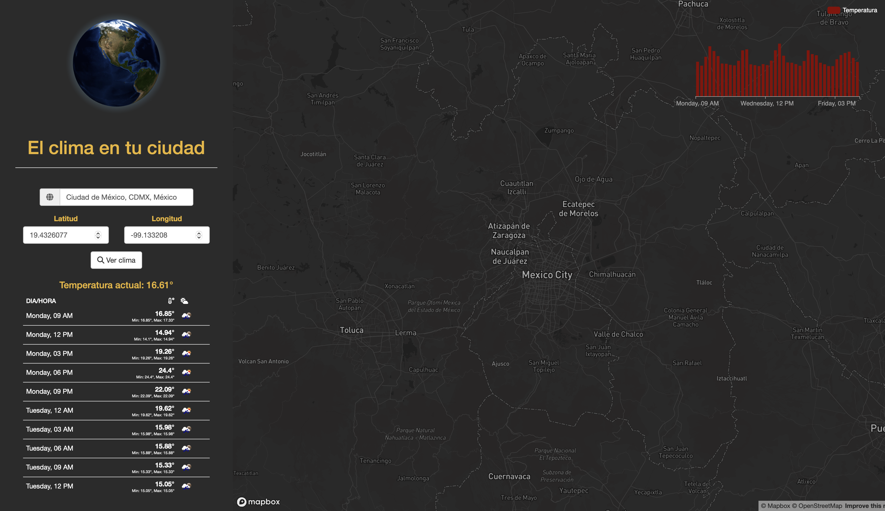{fig-align="center" width="500"}

Como regalo adicional, podrás encontrar el proyecto completo en [el siguiente enlace](https://github.com/Jorge-hercas/clima-hoy), junto con una versión online de la app.

#### Dashboard de ventas 

Como siguiente y último proyecto de este libro, vamos a crear un dashboard de ventas estratégico, es decir, un dashboard enfocado en hacer un análisis de alto nivel para el largo plazo. Este tipo de tablero está dirigido principalmente a tomadores de decisiones y busca brindar una visión general del rendimiento comercial, identificando tendencias, oportunidades y posibles riesgos que puedan influir en la estrategia de negocio. Además del análisis histórico, incluiremos una sección de pronóstico para proyectar el comportamiento futuro de las ventas y así facilitar una mejor planificación a mediano y largo plazo, analizando estacionalidad, tendencia, etc. Para este proyecto en particular vamos a usar el archivo ventas_proyecto_final [@kyanyoga_sales_data], disponible en [el repositorio oficial del libro](https://github.com/Jorge-hercas/r-para-inteligencia-de-negocios/blob/main/CSV/ventas_proyecto_final.csv). Este archivo contiene datos de ventas simulados, lo que nos permitirá practicar con métricas clave como ingresos totales, crecimiento mensual, participación por categoría, y otras métricas adicionales que iremos construyendo a lo largo del desarrollo del proyecto.

Como primer paso lógico, antes de comenzar a construir el dashboard, vamos a leer los datos para entender qué información tenemos y qué alcance podemos tener con este set de datos:

```{r, eval=FALSE}
sales_data <- vroom::vroom("https://raw.githubusercontent.com/Jorge-hercas/
                           r-para-inteligencia-de-negocios/main/CSV/
                           ventas_proyecto_final.csv")

sales_data
```

```{r, echo=FALSE}
sales_data <- vroom::vroom("https://raw.githubusercontent.com/Jorge-hercas/r-para-inteligencia-de-negocios/main/CSV/ventas_proyecto_final.csv")

sales_data
```

Como primera aproximación, podemos notar que se trata de una tabla transaccional, es decir, un tipo de tabla que registra eventos o transacciones individuales a medida que ocurren. En este caso, cada fila representa una orden de venta, con información detallada como la fecha de la transacción (ORDERDATE), la cantidad de producto por cada orden, el precio, estatus de la orden, región, etc. La información de dirección que tenemos es referente al cliente (Customer), sin embargo, esta información se limita únicamente a direcciones como cadenas de texto, por lo que no nos sirve para crear un mapa referente. En este caso, podemos crear una tabla catálogo que contenga la información de las direcciones disponibles, pero para eso, vamos a averiguar que tan completa se encuentra esta información, sacando un cálculo rápido de los valores nulos y la cantidad de valores únicos:

```{r}
library(dplyr)
library(purrr)
library(tidyr)
library(ggmap)

sales_data |> 
  dplyr::select(ADDRESSLINE1, ADDRESSLINE2, CITY, 
         STATE, POSTALCODE, COUNTRY, TERRITORY) |> 
  summarise(across(everything(), list(
    Unicos = ~n_distinct(.),
    Nulos = ~sum(is.na(.))
  ), .names = "{.col}_{.fn}")) |> 
  pivot_longer(
    cols = everything(),
    names_to = c("Columna", "Calculo"),
    names_sep = "_",
    values_to = "valor"
  ) 
```

En primera instancia, podemos notar que las columnas `ADDRESSLINE1`, `CITY` y `COUNTRY` no tienen valores nulos, por lo que podemos basarnos en ellas para hacer nuestro análisis geográfico, sin embargo, `ADDRESSLINE1` tiene 92 valores únicos, `CITY` 73 y `COUNTRY` 19, por lo que tendremos que decidir a qué nivel geográfico vamos a calcular las latitudes y longitudes. Para efectos de este proyecto vamos a calcular dos niveles: 1. País y 2. Dirección. Vamos a generar las latitudes/longitudes respectivas para cada caso, para después guardar ese catálogo en un archivo separado que después retomaremos.

```{r, eval=FALSE}
# Google maps API KEY
register_google("xxxxxxxxxxxxxxxxxxxxxxxxxxxxxxxxxxxxxxxx")

# Catálogo de direcciones únicas
catalogo_direcciones <- 
  sales_data |> 
  select(ADDRESSLINE1, CITY, COUNTRY) |> 
  mutate(
    Direccion_str = paste(ADDRESSLINE1, CITY, COUNTRY, sep = ", ")
  ) |> 
  distinct()

# Obtención de latitudes/longitudes
catalogo_direcciones <-
  catalogo_direcciones |> 
  mutate_geocode(
    Direccion_str
  ) |> 
  rename(
    address_lat = lat,
    address_lng = lon
  ) |> 
  left_join(
    catalogo_direcciones |> 
      select(COUNTRY) |> 
      distinct() |> 
      mutate_geocode(
        COUNTRY
      ) |> 
      rename(
        country_lat = lat,
        country_lng = lon
      ),
    by = c("COUNTRY" = "COUNTRY")
  )

# Guardado de catálogo en un objeto
write.csv(catalogo_direcciones, file = "direcciones.csv")
```

Ahora, en un contexto real, en el que posiblemente (muy seguramente, en realidad) se van a añadir nuevas ubicaciones al mapa en un medio a largo plazo, tener un archivo local asociado al dashboard tiene poco sentido y, en realidad, es una mala práctica cuando queremos llevar nuestros reportes a producción. Lo ideal en este caso sería generar un flujo de trabajo en, por ejemplo, Github Actions, que periódicamente actualice este catálogo y sobreescriba la tabla en una base datos en la nube. Si tuviéramos por ejemplo una conexión a Snowflake, nuestro flujo podría cambiar, eliminando la función `write.csv()` y añadiendo:

```{r, eval=FALSE}
# Conexión a Snowflake
con <- dbConnect(
  odbc::snowflake(),
  account = Sys.getenv("SNOWFLAKE_ACCOUNT"),
  uid = Sys.getenv("SNOWFLAKE_USER"),
  pwd = Sys.getenv("SNOWFLAKE_PASSWORD"),
  warehouse = Sys.getenv("SNOWFLAKE_WAREHOUSE"),
  database = "MI_DATABASE",
  schema = "MI_SCHEMA",
  role = Sys.getenv("SNOWFLAKE_ROLE")
)

# Reescribir tabla completa en Snowflake
dbWriteTable(
  conn = con,
  name = DBI::Id(schema = "MI_SCHEMA", 
                 table = "DIRECCIONES"),
  value = catalogo_direcciones,
  overwrite = TRUE,
  row.names = FALSE
)

# Cerrar conexión
dbDisconnect(con)
```

De tal forma que ya tendríamos un flujo que mantiene las zonas referentes actualizadas. Para efectos de practicidad de este ejercicio final vamos a mantener únicamente nuestro archivo local, ya que estamos trabajando con dataset preestablecido, por lo que no necesitamos automatizar nada en este momento.

Una vez preparados los datos, comenzaremos a diseñar las vistas del dashboard. El objetivo es construir un tablero de alto nivel que proporcione información general de forma clara y rápida para facilitar la toma de decisiones estratégicas, por lo que para lograrlo, estructuraremos la interfaz en cuatro niveles analíticos:

1. Indicadores Clave de Rendimiento (KPIs)

Como encabezado, implementaremos tarjetas de información con métricas clave: ventas totales, volumen de órdenes, clientes únicos y ticket promedio. Aunque estos indicadores son fundamentales, por sí solos carecen de contexto temporal o comparativo.

2. Contexto Temporal y Tendencias

Para solucionar la falta de contexto de los KPIs, incluiremos un gráfico de series de tiempo que muestre la tendencia de las ventas a nivel mensual. Esto nos permitirá evaluar la evolución del negocio en el mediano plazo e identificar incrementos o decrementos estacionales.

3. Apertura Geográfica y Filtros Dinámicos

Una tendencia general positiva podría estar sesgada por el éxito de una región específica, ocultando caídas en otras zonas. Para mitigar esto, integraremos un mapa interactivo que visualice las principales zonas de venta, complementado con filtros regionales. Así, el usuario podrá aislar y analizar la tendencia particular de cada localidad.

4. Perfil Comercial y Eficiencia Operativa

Para responder de manera constante a preguntas críticas del negocio como "¿Cuál es la categoría más vendida?" o "¿Quiénes son nuestros principales compradores?", añadiremos tablas de clasificación (top) de productos y clientes. Esta segmentación es vital para enfocar campañas de marketing y priorizar la distribución. Finalmente, incorporaremos una visualización del estatus de los pedidos (ciclo de vida del envío). Esto permitirá identificar cuellos de botella operativos y servirá como base para futuros análisis de optimización o maximización lineal en la cadena de entregas.

Conceptualmente, podemos plantear el siguiente diseño:


Esta interfaz solamente es la primer página del reporte, la cual tendrá información y métricas generales, sin embargo, vamos a implementar una segunda pestaña enfocada en un pronóstico de series de tiempo mediante un modelo *prophet*, ya que estos datos nos favorecen para este modelo en particular (no voy a repasar el proceso de validación de y estadística descriptiva de los datos para el modelo, por lo que quedará como ejercicio para el lector). Para esta página, vamos a simplificar bastante las visualizaciones, ya que será un aspecto del dasboard que el negocio también podría ver, razón por la que debemos mantenerlo al márgen de la simplicidad suficiente para que puedan comprenderlo de forma muy intuitiva. Específicamente, vamos a dividir la página en:

1. Pronóstico general

Una tendencia general más los valores pronosticados para *x* meses que el usuario va a poder definir, lo que permitirá analizar tendencias esperadas y poder planear estrategias basadas en escenarios futuros.

2. Tendencia y descomposición

Para esto, únicamente vamos a incluir la tendencia esperada del pronóstico, así como una descomposición de este mismo mediante una tabla, lo que permitirá que quien únicamente desee enfocarse en el pronóstico simple, simplemente se enfocará en el gráfico principal, pero si quieren ir más al detalle en ello, entonces podrán desplazarse hacia abajo, haciendo que la página sea más amigable a la vista.

La estructura conceptual de esta página será:


Ahora, comencemos por establecer los archivos que vamos a necesitar: `global.R`, `ui.R`, `server.R`, `body.R`, `data.R`, `controlbar.R` y `sidebar.R`. Nótese que estoy separando el cuerpo de la aplicación, el *sidebar* y el *controlbar* en diferentes archivos para mantener un proyecto limpio, aunque no está modularizado como tal, ya que es un dashboard relativamente pequeño, razón por la que no hace falta convertirlo a su misma versión mediante módulos (aunque te dejaré el código con esta versión al final de este ejercicio). La estructura general de nuestro dashboard será:

```{r, echo=FALSE}
cat("
Sales dashboard
│
│
│
├── global.R
│
├── ui.R
├── server.R
│
├── data.R
├── catalogo_direcciones.R
│
├── sidebar.R
├── body.R
├── controlbar.R
│
├── data/
│   └── direcciones.csv
│
└── www/
    └── recursos estáticos
        ├── imágenes
        └── logos
")
```


##### La interfaz

Comencemos por el archivo `global.R`, en el cuál únicamente cargaremos librerías y llamaremos a los demás archivos relacionados:

```{r, eval=FALSE}
library(shiny)
library(shinyjs)    
library(bs4Dash)
library(echarts4r)
library(reactable)
library(reactablefmtr)
library(mapboxer)
library(dplyr)
library(dtplyr, warn.conflicts = FALSE)
library(purrr)
library(tidyr)
library(lubridate)
library(prophet)
library(scales)
library(RColorBrewer)
library(htmlwidgets)
library(shinyWidgets)
library(openxlsx)
library(shinymanager)

# Options
opts <- list(
  `actions-box` = TRUE,
  `live-search`=TRUE)

source("data.R")
source("sidebar.R")
source("controlbar.R")
source("body.R")
```

Donde `opts` se refiere a las opciones globales aplicables a los filtros que usaremos con `shinyWidgets`.

Como siguiente archivo, vamos con la interfaz `ui.R` de nuestro dashboard, en la cual diseñaremos nuestro dashboard mediante `dashboardPage()`, pero llamando a cada uno de sus componentes de los archivos separados (`sidebar.R`, `controlbar.R`, `body.R`), lo que mantendrá esta interfaz relativamente pequeña en cuestión de código que mantener:

```{r, eval=FALSE}
frontend <- 
  dashboardPage(
  header = dashboardHeader(
    sidebarIcon = icon("home"),
    controlbarIcon = icon("bars"),
    status = "navy",
    fixed = T
  ),
  footer = dashboardFooter(
    left  = "R-conomics",
    right = paste0("@Jorge Hernández, ", year(today()))
  ),
  sidebar = sidebar,
  controlbar = controlbar,
  body = body
)
```


Como puedes ver, los argumentos `sidebar`, `controlbar` y `body` son objetos que llamamos de otros archivos, lo que mantiene muy simplificada la interfaz.

Vamos ahora con la siguiente parte simple: El menú `sidebar.R`. En este caso, únicamente vamos a establecer un encabezado para nuestro dashboard, un logotipo (opcional, pero siempre recomendable) y las páginas que incluye nuestro reporte:

```{r, eval=FALSE}
sidebar <-
  dashboardSidebar(
    status = "navy",
    minified = T,
    elevation = 4,
    fixed = T,
    skin = "light",
    bs4SidebarUserPanel("Sales dashboard",
                        image = "shitpost.webp"),
    sidebarMenu(
      id = "menu",
      menuItem(
        text = "General Numbers",
        tabName = "general",
        icon = icon("coins")
      ),
      menuItem(
        text = "Forecast",
        tabName = "forecast",
        icon = icon("chart-line")
      )
    )
  )
```

Nada complicado aquí, ya que solo es una estructura en forma de lista, la cual podemos escalar sin mayores dificultades. 

Respecto a la barra que contiene todos los filtros, es decir, el `controlbar.R`, vamos dividirla en dos pestañas: `general` y `forecast`:

```{r, eval=FALSE}
controlbar <-
  dashboardControlbar(
    width = "350px",
    skin = "light",
    pinned = FALSE,
    collapsed = TRUE,
    overlay = TRUE,
    controlbarMenu(
      id = "controlbar_menu",
      type = "tabs",
      # Filtros generales
      controlbarItem(
        title = "Filtros",
        icon  = icon("filter"),
        tags$div(
          style = "padding: 10px;",
          tags$h6(
            tags$i(class = "fas fa-calendar-alt me-1"),
            "Período de análisis",
            style = "font-weight:600; margin-bottom:8px;"
          ),
          airDatepickerInput(
            inputId = "fecha_rango",
            range = T,
            multiple = T,
            value = c(min(sales_data$ORDERDATE) - 1, 
                      max(sales_data$ORDERDATE) + 1),
            minDate = min(sales_data$ORDERDATE) - 1,
            maxDate = max(sales_data$ORDERDATE) + 1,
            inline = T
          ),
          tags$hr(),
          tags$h6(
            tags$i(class = "fas fa-boxes me-1"),
            "Línea de producto",
            style = "font-weight:600; margin-bottom:8px;"
          ),
          uiOutput("ui_productline"),
          tags$hr(),
          tags$h6(
            tags$i(class = "fas fa-globe-americas me-1"),
            "País",
            style = "font-weight:600; margin-bottom:8px;"
          ),
          uiOutput("ui_country"),
          tags$hr(),
          tags$h6(
            tags$i(class = "fas fa-city me-1"),
            "Estado del pedido",
            style = "font-weight:600; margin-bottom:8px;"
          ),
          uiOutput("ui_status"),
          tags$hr(),
          actionButton(
            "btn_reset",
            "Restablecer filtros",
            icon  = icon("rotate-left"),
            class = "btn-outline-secondary btn-sm w-100"
          )
        )
      ),
      # Filtros del forecast
      controlbarItem(
        title = "Forecast",
        icon  = icon("chart-line"),
        tags$div(
          style = "padding: 10px;",
          tags$h6(
            tags$i(class = "fas fa-forward me-1"),
            "Horizonte de pronóstico",
            style = "font-weight:600; margin-bottom:8px;"
          ),
          sliderInput(
            inputId = "forecast_periods",
            label = "Meses a proyectar",
            min = 3,
            max = 36,
            value = 12,
            step = 3,
            ticks = TRUE
          )
        )
      )
    )
  )
```

Nótese que aplicamos el argumento `inline = T` en el selector de fechas para poder mantenerlo fijo, ya que infortunadamente este *input* suele tener un bug en el que, si utilizamos ventanas desplegables en el dashboard, entonces este se cierra automáticamente al dar click en un valor, lo que lo vuelve molesto de utilizar. Por otra parte, como puedes notar, la sección del pronóstico únicamente tiene un *slider* para indicar el horizonte de datos que queremos ver, esto debido a que quiero mantener una visión muy simple para el negocio, ya que selectores más avanzados respecto al pronóstico pueden resultar algo confusos para el usuario final.

Continuemos con el cuerpo de nuestra app, específicamente en el archivo `body.R`, el cual va a contener las visualizaciones en cuestión. Para ello, como recordarás, tenemos que englobar nuestras páginas en un contenedor `tabItems()`, y a su vez, en un subcontenedor `tabItem()`, el cual llamaremos a partir de un `tabName`, con el que podremos ligar esa página al nombre en el menú del `sidebar`. Para la hoja de métricas generales:

```{r, eval=FALSE}
general_metrics_page <-
  tabItem(
      tabName = "general",
      fluidRow(
        bs4ValueBoxOutput("vbox_ventas",   width = 3),
        bs4ValueBoxOutput("vbox_ordenes",  width = 3),
        bs4ValueBoxOutput("vbox_clientes", width = 3),
        bs4ValueBoxOutput("vbox_ticket",   width = 3)
      ),
      fluidRow(
        column(
          width = 12,
          style = "display:flex; justify-content:center; 
          padding-bottom:4px;",
          radioButtons(
            inputId = "granularidad_mapa",
            label = NULL,
            choices = c("País" = "pais", "Ciudad" = "ciudad"),
            selected = "pais",
            inline = TRUE
          )
        )
      ),
      fluidRow(
        bs4Card(
          title = "Ventas mensuales",
          width = 12,
          maximizable = TRUE,
          status = "navy",
          echarts4rOutput("chart_monthly", height = "380px")
        )
      ),
      fluidRow(
        bs4Card(
          title = "Concentración geográfica de ventas",
          width = 8,
          maximizable = TRUE,
          status = "navy",
          mapboxerOutput("mapa_ventas", height = "380px")
        ),
        bs4Card(
          title = "Distribución por estatus",
          width = 4,
          maximizable = TRUE,
          status = "navy",
          echarts4rOutput("chart_status", height = "380px")
        )
      ),
      fluidRow(
        bs4Card(
          title = "Ventas por línea de producto",
          width = 6,
          maximizable = TRUE,
          status = "navy",
          reactableOutput("tbl_productline")
        ),
        bs4Card(
          title = "Ventas por cliente (Top)",
          width = 6,
          maximizable = TRUE,
          status = "navy",
          reactableOutput("tbl_customer")
        )
      ),
      fluidRow(
        bs4Card(
          title = "Ventas por región",
          width = 12,
          maximizable = TRUE,
          status = "navy",
          echarts4rOutput("chart_region", height = "320px")
        )
      )
    )
```

Por su parte, para la hoja referente al pronóstico:

```{r, eval=FALSE}
forecast_page <-
  # Forecast
  tabItem(
    tabName = "forecast",
    fluidRow(
      column(
        width = 12,
        style = "display:flex; justify-content:flex-end; padding-bottom:8px;",
        downloadButton(
          outputId = "download_forecast",
          label = "Descargar forecast",
          class = "btn btn-primary btn-sm"
        )
      )
    ),
    fluidRow(
      bs4Card(
        title = "Pronóstico de ventas (Prophet)",
        width = 12,
        maximizable = TRUE,
        status = "navy",
        echarts4rOutput("chart_forecast", height = "420px")
      )
    ),
    fluidRow(
      bs4Card(
        title = "Tendencia",
        width = 4,
        maximizable = TRUE,
        status = "navy",
        echarts4rOutput("chart_trend", height = "280px")
      ),
      bs4Card(
        title = "Descomposición",
        width = 8,
        maximizable = TRUE,
        status = "navy",
        reactableOutput("chart_descomp", height = "280px")
      )
    )
  )
```

Y, ambos objetos, van a ir en:

```{r, eval=FALSE}
body <- dashboardBody(
  useShinyjs(),
  tabItems(
    # General
    general_metrics_page,
    # Forecast
    forecast_page
  )
)
```


##### El Server

Veamos ahora la parte interesante: El archivo `server.R`. Comencemos con una customización condicional sencilla, ya que `dashboardPage()` nos permite utilizar un modo obscuro, sin embargo, los gráficos y tablas no están ligadas por default a este modo, por lo que tendremos que modificar manualmente las paletas de colores. Para identificar el modo actual de nuestro dashboard, únicamente necesitamos llamar a `input$dark_mode`, por lo tanto, para una paleta de colores acorde, dependiendo del estado:

```{r, eval=FALSE}
es_dark <- reactive({ isTRUE(input$dark_mode) })
  
# Tema para echarts
tema_e <- reactive({ if (es_dark()) "dark" else "infographic" })
  
# Paleta de texto para reactable
color_texto <- reactive({ if (es_dark()) "#e0e0e0" else "#111111" })
color_header <- reactive({ if (es_dark()) "#1a2a4a"  else "#081e3d" })
color_bg <- reactive({ if (es_dark()) "#1e1e2e"  else "transparent" })
color_bg_strip <- reactive({ if (es_dark()) "#16213e"  else "#f9f9f9" })
color_borde <- reactive({ if (es_dark()) "#2e3a5a"  else "#eeeeee" })
  
# Helper para reactable
tema_reactable <- reactive({
  reactableTheme(
    backgroundColor = color_bg(),
    borderColor = color_borde(),
    stripedColor = color_bg_strip(),
    color = color_texto(),
    searchInputStyle = list(background = color_bg()),
    pageButtonStyle = list(color = color_texto())
  )
})
  
# Colores de fondo
tooltip_dark_bg <- reactive({
  if (es_dark())
    list(backgroundColor = "#1e1e2e", borderColor = "#3a4a6a",
         textStyle = list(color = "#e0e0e0"))
  else
    list(backgroundColor = "#fff")
})
```

Avanzando ahora con los filtros, como recordarás, para la página de métricas generales no los incluí directamente en el archivo `controlbar.R` (con excepción de `airDatepickerInput()`), si no que creamos un `renderUI()` para poder generar estos códigos directamente en el archivo `server.R`. Quisiera decir que hay una razón muy importante por la cual lo hice de esta manera, pero realmente no, simplemente fue por una cuestión de practicidad, ya que así no tengo que reescribir los valores del *input* dos veces, es decir:

```{r, eval=FALSE}
# Filtros
output$ui_productline <- renderUI({
    vals <- sort(unique(sales_data$PRODUCTLINE))
    pickerInput("productline", choices = vals, selected = vals,
                options = opts, multiple = TRUE)
})
  
output$ui_country <- renderUI({
    vals <- sort(unique(sales_data$COUNTRY.x))
    pickerInput("country", choices = vals, selected = vals,
                options = opts, multiple = TRUE)
})
  
output$ui_status <- renderUI({
    vals <- sort(unique(sales_data$STATUS))
    pickerInput("status_filter", choices = vals, selected = vals,
                options = opts, multiple = TRUE)
})
  
# Reset de filtros
observeEvent(input$btn_reset, {
    updatePickerInput(session, "productline", 
                      selected = unique(sales_data$PRODUCTLINE))
    updatePickerInput(session, "country", 
                      selected = unique(sales_data$COUNTRY.x))
    updatePickerInput(session, "status_filter", 
                      selected = unique(sales_data$STATUS))
})
```

Donde, en lugar de escribir los valores a utilizar dos veces, tanto para `choices` como para `selected`, solo tengo que asignar un objeto `vals <- sort(unique(sales_data$PRODUCTLINE))`, por ejemplo (y aplicarlo para cada caso). Claro que podría asignar estos valores desde un inicio en la sección `global.R` o en `data.R`, guardarlos en la memoria global y simplemente llamarlos, sin embargo, me parece una opción más práctica el englobarlos dentro del filtro que estamos renderizando, ya que de esta manera es más fácil identificar qué valores estamos llamando.

Ahora, vamos a generar un objeto dinámico para nuestros datos, el cual tendrá los filtros respectivos aplicados, para que simlemente podamos reutilizarlo después para todas las demás visualizaciones:

```{r, eval=FALSE}
datos_filtrados <- reactive({
    req(input$fecha_rango)
    
    df <- sales_data |>
      filter(
        ORDERDATE >= input$fecha_rango[1],
        ORDERDATE <= input$fecha_rango[2]
      )
    
    if (!is.null(input$productline))
      df <- df |> filter(PRODUCTLINE %in% input$productline)
    
    if (!is.null(input$country) )
      df <- df |> filter(COUNTRY.x %in% input$country)
    
    if (!is.null(input$status_filter))
      df <- df |> filter(STATUS %in% input$status_filter)
    
    df
})
```

Como puedes darte cuenta, establecimos una condición en caso de que los filtros todavía no tengan ningún valor asignado. Esto es importante porque, cuando una aplicación de Shiny que comienza a hacerse más pesada está cargando, puede ocurrir que algunos *inputs* aún no existan o todavía no hayan sido inicializados, razón por la que, antes de aplicar cada filtro, verificamos que el valor del input no sea `NULL`. De hecho, en algunas versiones de JavaScript, al tener un *controlbar* oculto, los objetos dentro de él (los filtros) no se cargarán hasta que explícitamente lo abramos (cosas que he aprendido a la mala desarrollando estos dashboards en el pasado), por lo que estas condiciones evitan que el dashboard se inicie con visualizaciones vacías por default.

Pasando a las visualizaciones de la página principal, comencemos por generar las cajas de texto simples:

```{r, eval=FALSE}
output$vbox_ventas <- renderbs4ValueBox({
    total <- sum(datos_filtrados()$SALES, na.rm = TRUE)
    bs4ValueBox(
      value = scales::dollar(total, big.mark = ",", prefix = "$"),
      subtitle = "Ventas totales",
      icon = icon("dollar-sign"),
      color = "navy",
      width = 12
    )
})
  
output$vbox_ordenes <- renderbs4ValueBox({
    n <- n_distinct(datos_filtrados()$ORDERNUMBER)
    bs4ValueBox(
      value = scales::comma(n),
      subtitle = "Órdenes",
      icon = icon("receipt"),
      color = "info",
      width = 12
    )
})
  
output$vbox_clientes <- renderbs4ValueBox({
    n <- n_distinct(datos_filtrados()$CUSTOMERNAME)
    bs4ValueBox(
      value = scales::comma(n),
      subtitle = "Clientes únicos",
      icon = icon("users"),
      color = "success",
      width = 12
    )
})
  
output$vbox_ticket <- renderbs4ValueBox({
    total  <- sum(datos_filtrados()$SALES, na.rm = TRUE)
    orders <- n_distinct(datos_filtrados()$ORDERNUMBER)
    ticket <- if (orders > 0) total / orders else 0
    bs4ValueBox(
      value = scales::dollar(ticket, big.mark = ",", prefix = "$"),
      subtitle = "Ticket promedio",
      icon = icon("tag"),
      color = "warning",
      width = 12
    )
})
```

como puedes ver, realmente son muy sencillas, ya que únicamente tomamos el objeto reactivo `datos_filtrados()` previamente filtrado y hacemos el cálculo que necesitamos para cada caso. 

Vamos ahora a desarrollar el primer gráfico de series de tiempo:

```{r, eval=FALSE}
output$chart_monthly <- renderEcharts4r({
    paleta <- if (es_dark()) "Blues" else "YlGn"
    
    datos_filtrados() |>
      mutate(ORDERDATE_round = floor_date(ORDERDATE, "months")) |>
      group_by(ORDERDATE_round) |>
      summarise(TOTAL_SALES = sum(SALES, na.rm = TRUE), .groups = "drop") |>
      mutate(
        color = scales::col_quantile(paleta, TOTAL_SALES)(TOTAL_SALES)
      ) |>
      e_charts(ORDERDATE_round, dispose = FALSE) |>
      e_bar(TOTAL_SALES, name = "Ventas") |>
      e_add("itemStyle", color) |>
      e_tooltip(
        trigger = "axis",
        backgroundColor = tooltip_dark_bg()$backgroundColor,
        borderColor = tooltip_dark_bg()$borderColor,
        textStyle = tooltip_dark_bg()$textStyle,
        formatter = htmlwidgets::JS("
          function(params) {
            var d = new Date(params[0].value[0]);
            var mes = d.toLocaleDateString('es-MX', 
            {year:'numeric', month:'short'});
            var val = '$' + params[0].value[1].toLocaleString('es-MX', 
            {maximumFractionDigits: 0});
            return mes + '<br/>' + params[0].marker + 
            ' Ventas: <b>' + val + '</b>';
          }
        ")
      ) |>
      e_x_axis(
        type = "time",
        axisLabel = list(color = if (es_dark()) "#c0c0c0" else NULL)
      ) |>
      e_y_axis(
        axisLabel = list(
          color = if (es_dark()) "#c0c0c0" else NULL,
          formatter = htmlwidgets::JS("function(v){ return '$' 
                                      + (v/1000).toFixed(0) + 'k'; }")
        )
      ) |>
      e_theme(tema_e()) |>
      e_toolbox_feature("dataZoom") |>
      e_toolbox_feature("restore") |>
      e_grid(backgroundColor = "transparent")
})
```

Donde únicamente agrupamos a nivel mensual y calculamos la suma de ventas totales a partir del objeto reactivo `datos_filtrados()`. Como puedes notar, utilizamos una función de JavaScript para customizar el *tooltip* de nuestro gráfico, lo que nos permitirá tener un control más claro de la información que queremos retornar cuando pasamos el puntero sobre alguna barra. De igual forma, aplicamos una función de JavaScript al eje *y* de nuestro gráfico, únicamente para mostrar valores en miles, lo que lo hace más facilmente legible para el público en general.

Continuemos con el siguiente gráfico, en el que mostraremos la suma total del monto de `SALES`, pero separado por estatus de la venta. La mejor forma de representar este tipo de métricas, en las que se supone que debe haber una disparidad importante en los valores (por ejemplo, teniendo un 98% de ventas cerradas y el resto de categorías distribuidas en el 2% restante) suele ser mediante gráficos de *pie* o *dona*. Vamos a utilizar un gráfico de *dona* para este caso (porque se me hace más agradable visualmente que el de pastel):

```{r, eval=FALSE}
output$chart_status <- renderEcharts4r({
    datos_filtrados() |>
      group_by(STATUS) |>
      summarise(total = sum(SALES, na.rm = TRUE), .groups = "drop") |>
      e_charts(STATUS, dispose = FALSE) |>
      e_pie(
        total,
        radius = c("50%", "70%"),
        name = "Ventas",
        label = list(
          color = if (es_dark()) "#e0e0e0" else NULL
        ),
        labelLine = list(
          lineStyle = list(color = if (es_dark()) "#888" else NULL)
        )
      ) |>
      e_tooltip(
        backgroundColor = tooltip_dark_bg()$backgroundColor,
        borderColor = tooltip_dark_bg()$borderColor,
        textStyle = tooltip_dark_bg()$textStyle,
        formatter = htmlwidgets::JS("
          function(params){
            return params.name + '<br/>' +
                   params.marker + ' $' +
                   params.value.toLocaleString('es-MX', 
                   {maximumFractionDigits:0}) +
                   ' (' + params.percent + '%)';
          }
        ")
      ) |>
      e_legend(
        bottom = 0,
        textStyle = list(color = if (es_dark()) "#e0e0e0" else "#000")
      ) |>
      e_theme(tema_e())
})
```


En este caso, aplicamos una función de JavaScript simplemente para formatear el tooltip, mostrando el valor y su respectivo valor porcentual referente al total de todos los estatus que tenemos.

Pasemos ahora al mapa en cuestión, que de hecho es de los códigos que más se me complicaron, ya que lo dividí en varias partes. Primero, este mapa podrá ser visualizado a nivel país y nivel ciudad, por lo que podemos definir una función para cambiar la granularidad de los datos:

```{r, eval=FALSE}
agregar_mapa <- function(df, granularidad) {
    group_cols <- if (granularidad == "ciudad")
      c("Direccion_str", "address_lng", "address_lat")
    else
      c("COUNTRY.y", "country_lng", "country_lat")
    
    df |>
      group_by(across(all_of(group_cols))) |>
      summarise(total = sum(SALES, na.rm = TRUE), .groups = "drop") |>
      mutate(radio = (total / sum(total)) * 100) |>
      setNames(c("Zone", "lng", "lat", "total", "radio")) |>
      filter(!is.na(lng), !is.na(lat))
}
```

Ahora, vamos a definir la capa inicial del mapa. Para efectos de visualización, previamente preparé dos temas acorde al estado de la aplicación (si se encuentra o no en modo oscuro) en el sitio oficial de [mapbox](https://www.mapbox.com), por lo que, en tu caso particular, será necesario que desarrolles tus propios temas en este sitio y uses tu propia API Key. Veamos el código:

```{r, eval=FALSE}
output$mapa_ventas <- renderMapboxer({
    datos_iniciales <- agregar_mapa(sales_data, "pais")
    
    style <- ifelse(
      isTRUE(input$dark_mode),
      "mapbox://styles/mapbox/dark-v11",
      "mapbox://styles/jorgehdez1998/clhsaghny00ys01qn6f27870h"
    )
    
    datos_iniciales |>
      as_mapbox_source() |>
      mapboxer(
        center = c(0, 20),
        maxZoom = 7,
        zoom = 1.5,
        token = "xxxxxxxxxxxxxxxxxxxxxxxxxxxxxxxxxxxxxxxxxxx",
        style = style
      ) |>
      add_circle_layer(
        circle_color = "red",
        circle_radius = c("get", "radio"),
        circle_opacity = 0.7
      )
})
```

Por defecto, en la capa inicial los datos se van a visualizar a nivel país sin filtrar. Lógicamente, debemos ahora establecer datos dinámicos en un objeto reactivo, así como definir el área que vamos a dibujar, dependiendo del filtro de países seleccioandos:

```{r, eval=FALSE}
datos_mapa <- reactive({
    req(input$granularidad_mapa)
    agregar_mapa(datos_filtrados(), input$granularidad_mapa)
})
  
bounds_mapa <- reactive({
    df <- datos_mapa()
    req(nrow(df) > 0)
    c(
      min(df$lng, na.rm = TRUE),
      min(df$lat, na.rm = TRUE),
      max(df$lng, na.rm = TRUE),
      max(df$lat, na.rm = TRUE)
    )
})
```

Finalmente, aplicamos la capa dinámica del gráfico:

```{r, eval=FALSE}
observeEvent(datos_mapa(), {
    df <- datos_mapa()
    req(nrow(df) > 0)
    
    mapboxer_proxy("mapa_ventas") |>
      set_data(data = df) |>
      fit_bounds(bounds_mapa()) |>
      update_mapboxer()
}, ignoreInit = TRUE)
```


Pasemos ahora a las tres visualizaciones más sencillas: Las tablas de resumen por cliente/producto y el gráfico de barras por estado/ciudad. En el caso de las tablas, bastará con que agrupemos los datos dinámicos por cada nivel de granularidad y generemos la tabla en cuestión. Para la tabla a nivel producto:

```{r, eval=FALSE}
output$tbl_productline <- renderReactable({
    x <- datos_filtrados() |>
      group_by(PRODUCTLINE) |>
      summarise(total = sum(SALES, na.rm = TRUE), .groups = "drop") |>
      arrange(desc(total))
    
    # Paleta de barras: tonos cálidos en light, neones fríos en dark
    pal_barras <- if (es_dark())
      c("#1a3a5c","#1e5f8a","#2180b8","#3fa0d4","#6abde6","#9dd4f0","#c5e8fa")
    else
      RColorBrewer::brewer.pal(9, "Reds")
    
    x |> 
      reactable(
      theme  = tema_reactable(),
      defaultPageSize = 10,
      striped = TRUE,
      highlight = TRUE,
      defaultColDef = colDef(
        headerStyle = list(
          background = color_header(),
          color = "#ffffff",
          fontWeight = "600",
          fontSize = "12px"
        ),
        style = list(
          color = color_texto(),
          fontSize = "12px"
        )
      ),
      columns = list(
        PRODUCTLINE = colDef(
          name = "Categoría de producto",
          style = list(fontSize = "12px")
        ),
        total = colDef(
          name = "Ventas totales",
          align = "left",
          minWidth = 180,
          format = colFormat(digits = 0),
          style = list(fontSize = "12px"),
          cell = data_bars(
            data = x,
            fill_color = pal_barras,
            background = "transparent",
            bar_height = 7,
            number_fmt = scales::comma,
            text_position = "outside-end",
            round_edges = TRUE,
            text_color = color_texto()
          )
        )
      )
    )
})
```

Por su parte, para la tabla a nivel cliente:

```{r, eval=FALSE}
output$tbl_customer <- renderReactable({
    x <- datos_filtrados() |>
      group_by(CUSTOMERNAME) |>
      summarise(total = sum(SALES, na.rm = TRUE), .groups = "drop") |>
      arrange(desc(total))
    
    pal_barras <- if (es_dark())
      c("#2d1b5c","#4a2d8a","#6a3fb8","#8a5cd4","#aa80e6","#c8a8f0","#e0ccfa")
    else
      RColorBrewer::brewer.pal(9, "Blues")
    
    x |> 
      reactable(
      theme = tema_reactable(),
      pagination = FALSE,
      height = 350,
      striped = TRUE,
      highlight = TRUE,
      defaultColDef = colDef(
        headerStyle = list(
          background = color_header(),
          color = "#ffffff",
          fontWeight = "600",
          fontSize = "12px"
        ),
        style = list(
          color = color_texto(),
          fontSize = "12px"
        )
      ),
      columns = list(
        CUSTOMERNAME = colDef(
          name = "Cliente",
          style = list(fontSize = "12px")
        ),
        total = colDef(
          name = "Ventas totales",
          align = "left",
          minWidth = 180,
          format = colFormat(digits = 0),
          style = list(fontSize = "12px"),
          cell = data_bars(
            data = x,
            fill_color = pal_barras,
            background = "transparent",
            bar_height = 7,
            number_fmt = scales::comma,
            text_position  = "outside-end",
            round_edges = TRUE,
            text_color = color_texto()
          )
        )
      )
    )
})
```

Finalmente, para el gráfico del total de ventas por ciudad/país (específicamente, un top 15), únicamente debemos definir el nivel de granularidad y aplicarla dinámicamente mediante `group_by_at()`:

```{r, eval=FALSE}
output$chart_region <- renderEcharts4r({
    group_var <- if (input$granularidad_mapa == "ciudad") 
      "CITY.x" else "COUNTRY.x"
    
    datos_filtrados() |>
      group_by_at(group_var) |>
      summarise(total = sum(SALES, na.rm = TRUE), .groups = "drop") |>
      arrange(desc(total)) |>
      slice_head(n = 15) |>
      e_charts_(group_var, dispose = FALSE) |>
      e_bar(total, name = "Ventas") |>
      e_x_axis(
        axisLabel = list(
          color = if (es_dark()) "#c0c0c0" else NULL
        )
      ) |>
      e_tooltip(
        trigger = "axis",
        backgroundColor = tooltip_dark_bg()$backgroundColor,
        borderColor = tooltip_dark_bg()$borderColor,
        textStyle = tooltip_dark_bg()$textStyle,
        formatter = htmlwidgets::JS("
      function(params) {
        var p = params[0];
        var ciudad = p.axisValue || p.name;
        var valor = Array.isArray(p.value) ? p.value[1] : p.value;
        var val = '$' + Number(valor).toLocaleString('es-MX', {
          maximumFractionDigits: 0
        });
        return ciudad + '<br/>' +
               p.marker + ' Ventas: <b>' + val + '</b>';
      }
    ")
      ) |>
      e_theme(tema_e())
})
```

Como puedes ver, la función de JavaScript únicamente nos ayuda a customizar el *tooltip*, para que nos diga el valor en un formato de moneda y el país/ciudad en cuestión.

Con esto, terminamos la primera página de nuestro dashboard, la cual tendrá el siguiente aspecto (@fig-dashboardfinal).

::: {#fig-dashboardfinal layout-ncol=2}

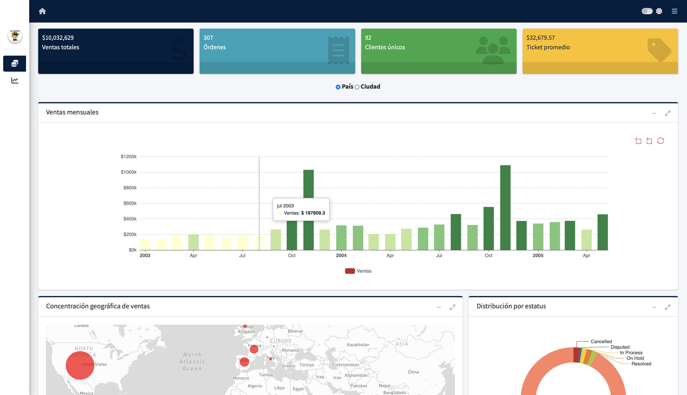{#fig-normaldash}

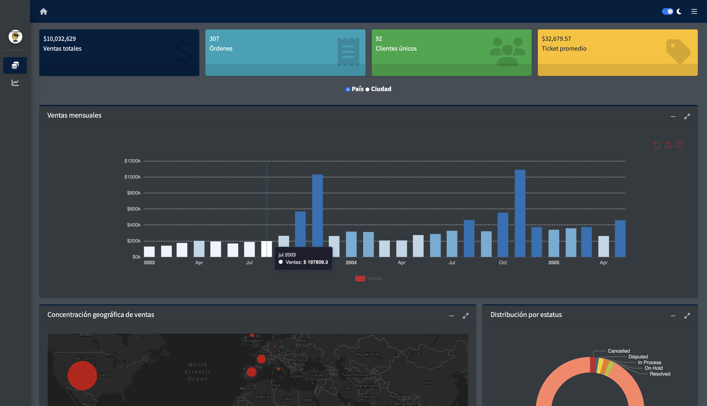{#fig-nochedash}

Página principal del dashboard de ventas
:::

Continuemos ahora con la sección referente al pronóstico. Como mencioné previamente, por ahora vamos a obviar las pruebas de validación previas al modelo `prophet` para simplificar esta parte, ya que, de hecho, en el punto en el que decidimos llevar un pronóstico a un ambiente de producción, como lo es un dashboard en la nube, es porque todas las validaciones previas ya fueron llevadas a cabo. Ahora bien, comencemos por establecer el modelo en un objeto reactivo, llamando a los datos filtrados:

```{r, eval=FALSE}
modelo_reactive <- reactive({
    
    sales_ts <- datos_filtrados() |>  
      mutate(ORDERDATE_round = floor_date(ORDERDATE, "month")) |> 
      group_by(ORDERDATE_round) |> 
      summarise(total = sum(SALES, na.rm = TRUE), .groups = "drop") |> 
      arrange(ORDERDATE_round)
    
    # columnas para Prophet
    prophet_data <- sales_ts |> 
      transmute(
        ds = as.Date(ORDERDATE_round),
        y = total
      )
    
    prophet_data
})
  
  
forecast_reactive <- reactive({
    
    # Modelo Prophet
    modelo_prophet <- prophet(
      modelo_reactive(),
      yearly.seasonality = TRUE,
      weekly.seasonality = FALSE,
      daily.seasonality = FALSE,
      seasonality.mode = "multiplicative",
      changepoint.prior.scale = 0.05,
      seasonality.prior.scale = 10
    )
    
    # Pronóstico a 12 meses
    future <- make_future_dataframe(
      modelo_prophet,
      periods = if (is.null(input$forecast_periods)) 12 
      else input$forecast_periods,
      freq = "month",
      include_history = TRUE
    )
    
    forecast_prophet <- predict(modelo_prophet, future)
    
    forecast_prophet
    
})
```

Nótese que establecemos un periodo de 12 meses por default, en caso de que no se detecte el *input*, si es que el *controlbar* no se ha desplegado en ese punto. 

Como puedes ver, el objeto `modelo_reactive()` nos devuelve los datos en el formato que necesitamos, mientras que el objeto `forecast_reactive()` genera el modelo en cuestión. A partir de estos objetos, podemos generar el gráfico referente al pronóstico:

```{r, eval=FALSE}
output$chart_forecast <- renderEcharts4r({
    
    historico <- modelo_reactive()
    forecast <- forecast_reactive()
    max_fecha <- max(historico$ds, na.rm = TRUE)
    
    plot_data <- forecast |> 
      select(ds, yhat, yhat_lower, yhat_upper) |> 
      left_join(historico, by = "ds") |> 
      mutate(
        `Point Forecast` = if_else(ds >= max_fecha, yhat, NA_real_),
        `Lower 95%` = if_else(ds >= max_fecha, yhat_lower, NA_real_),
        `Upper 95%` = if_else(ds >= max_fecha, yhat_upper, NA_real_)
      )
    
    plot_data |> 
      e_charts(ds, dispose = FALSE) |> 
      e_line(
        y, name = "Ventas reales", symbol = "none") |> 
      e_line(`Point Forecast`, name = "Pronóstico", symbol = "none",
        lineStyle = list(width = 3)) |> 
      e_line(`Lower 95%`, name = "Límite inferior 95%",
        symbol = "none", lineStyle = list(type = "dashed")) |> 
      e_line(`Upper 95%`, name = "Límite superior 95%",
        symbol = "none", lineStyle = list(type = "dashed")) |> 
      e_tooltip(
        trigger = "axis",
        backgroundColor = tooltip_dark_bg()$backgroundColor,
        borderColor = tooltip_dark_bg()$borderColor,
        textStyle = tooltip_dark_bg()$textStyle,
        formatter = htmlwidgets::JS("
        function(params) {
          var d = new Date(params[0].value[0]);
          var mes = d.toLocaleDateString('es-MX', {
            year: 'numeric',
            month: 'short'
          });
          var html = mes + '<br/>';
          params.forEach(function(p) {
            var val = p.value[1];
            if (val !== null && val !== undefined && !isNaN(val)) {
              var val_fmt = '$' + Number(val).toLocaleString('es-MX', {
                maximumFractionDigits: 0
              });
              html += p.marker + ' ' + p.seriesName + ': <b>' 
              + val_fmt + '</b><br/>';
            } }); return html;}")
      ) |> 
      e_x_axis(
        type = "time",
        axisLabel = list(
          color = if (es_dark()) "#c0c0c0" else "#000000"
        )
      ) |> 
      e_y_axis(
        axisLabel = list(
          color = if (es_dark()) "#c0c0c0" else "#000000",
          formatter = htmlwidgets::JS("
          function(v){
            return '$' + (v / 1000).toFixed(0) + 'k';
          }"))) |> 
      e_legend(
        textStyle = list(color = if (es_dark()) "#c0c0c0" else "#000000")) |> 
      e_theme(tema_e()) |> 
      e_toolbox_feature("dataZoom") |> 
      e_toolbox_feature("restore") |> 
      e_grid(backgroundColor = "transparent")
})
```


Y agregamos algunas customizaciones sencillas con JavaScript, para formatear el eje *y* y el *tooltip*. 

Pasemos ahora a la tendencia del pronóstico, la cual podemos obtener mediante la columna `trend`, de nuestro objeto `forecast_reactive()`, por lo tanto, el gráfico final:

```{r, eval=FALSE}
output$chart_trend <- renderEcharts4r({
  
    forecast <- forecast_reactive()
    
    plot_data <- forecast |> 
      mutate(
        `Tendencia` = trend,
        `Límite inferior 95%` = if ("trend_lower" %in% 
                                    names(forecast)) 
          trend_lower else NA_real_,
        `Límite superior 95%` = if ("trend_upper" 
                                    %in% names(forecast)) 
          trend_upper else NA_real_
      ) |> 
      select(ds, `Tendencia`, `Límite inferior 95%`, `Límite superior 95%`)
    
    plot_data |> 
      e_charts(ds, dispose = FALSE) |> 
      e_line(`Tendencia`, name = "Tendencia", symbol = "none",
        lineStyle = list(width = 3)) |> 
      e_line(`Límite inferior 95%`, name = "Límite inferior 95%",
        symbol = "none", lineStyle = list(type = "dashed")) |> 
      e_line(`Límite superior 95%`, name = "Límite superior 95%",
        symbol = "none", lineStyle = list(type = "dashed")) |> 
      e_tooltip(
        trigger = "axis",
        backgroundColor = tooltip_dark_bg()$backgroundColor,
        borderColor = tooltip_dark_bg()$borderColor,
        textStyle = tooltip_dark_bg()$textStyle,
        formatter = htmlwidgets::JS("
        function(params) {
          var d = new Date(params[0].value[0]);
          var mes = d.toLocaleDateString('es-MX', {
            year: 'numeric',
            month: 'short'
          });
          var html = mes + '<br/>';
          params.forEach(function(p) {
            var val = p.value[1];
            if (val !== null && val !== undefined && !isNaN(val)) {
              var val_fmt = '$' + Number(val).toLocaleString('es-MX', {
                maximumFractionDigits: 0});
              html += p.marker + ' ' + p.seriesName + ': <b>' 
                + val_fmt + '</b><br/>';} });
          return html;}")) |> 
      e_x_axis(type = "time",
        axisLabel = list(
          color = if (es_dark()) "#c0c0c0" else "#000000"
        )) |> 
      e_y_axis(
        axisLabel = list(
          color = if (es_dark()) "#c0c0c0" else "#000000",
          formatter = htmlwidgets::JS("
          function(v){
            return '$' + (v / 1000).toFixed(0) + 'k';}"))) |> 
      e_legend(
        textStyle = list(
          color = if (es_dark()) "#c0c0c0" else "#000000")) |> 
      e_theme(tema_e()) |> 
      e_toolbox_feature("dataZoom") |> 
      e_toolbox_feature("restore") |> 
      e_grid(backgroundColor = "transparent")
    
})
```

En este punto ya está de más explicar para qué sirve el código JavaScript en `e_tooltip()`, ya que es bastante trivial. 

Como puedes notar, el gráfico únicamente toma en cuenta los valores pronosticados, ya que estamos analizando el componente individual de este mismo. Realmente podríamos extraer el componente de tendencia de los datos históricos, sin embargo, para efectos de esta vista, únicamente nos interesa visualizar el pronóstico.

Como último apoyo visual, vamos a generar una tabla con los componentes que generamos de nuestro pronóstico, así como los valores históricos. Aunque parezca redundante, considerando el gráfico general referente al pronóstico, estamos agregando esta tabla porque no todo el público se suele acomodar con series de tiempo. Usualmente, hay usuarios que prefieren ver los números de forma explícita en tablas, razón por la que este recurso nos permite complementar la interpretación visual con una lectura más directa de los valores. Realmente la tabla funciona como un segundo nivel de consulta, ya que, mientras el gráfico nos ayuda a identificar tendencias, patrones, etc, la tabla nos permitirá revisar con mayor precisión los valores observados. La tabla en realidad es bastante sencilla de definir. Comencemos englobando los datos en un objeto reactivo, ya que los vamos a reutilizar más adelante:

```{r, eval=FALSE}
tabla_reactive <- reactive({
    
    historico <- modelo_reactive()
    forecast <- forecast_reactive()
    max_fecha <- max(historico$ds, na.rm = TRUE)
    
    x <- forecast |> 
      left_join(historico, by = "ds") |> 
      mutate(
        tipo = if_else(ds <= max_fecha, "Histórico", "Pronóstico"),
        fecha = format(ds, "%Y-%m"),
        `Ventas reales` = y,
        `Pronóstico` = yhat,
        `Límite inferior 95%` = yhat_lower,
        `Límite superior 95%` = yhat_upper,
        `Tendencia` = trend,
        `Tendencia inferior` = if ("trend_lower" %in% names(forecast)) 
          trend_lower else NA,
        `Tendencia superior` = if ("trend_upper" %in% names(forecast)) 
          trend_upper else NA,
        `Estacionalidad anual` = if ("yearly" %in% names(forecast)) 
          yearly else NA,
        `Términos aditivos` = if ("additive_terms" %in% names(forecast)) 
          additive_terms else NA,
        `Términos multiplicativos` = if ("multiplicative_terms" 
                                         %in% names(forecast)) 
          multiplicative_terms else NA
      ) |> 
      select(fecha, tipo, `Ventas reales`, `Pronóstico`,
             `Límite inferior 95%`, `Límite superior 95%`, `Tendencia`,
             `Tendencia inferior`, `Tendencia superior`,`Estacionalidad anual`,
             `Términos aditivos`, `Términos multiplicativos`) |> 
      arrange(fecha)
    
    x
})
```

Ahora, generamos la tabla en cuestión:

```{r, eval=FALSE}
output$chart_descomp <- renderReactable({
    
    fmt_money <- colFormat(prefix = "$", separators = TRUE, digits = 0)
    fmt_pct <- colFormat(percent = TRUE, digits = 2)
    
    cols_money <- c("Ventas reales", "Pronóstico", "Límite inferior 95%", 
                    "Límite superior 95%", "Tendencia", "Tendencia inferior", 
                    "Tendencia superior", "Términos aditivos")
    
    cols_pct <- c("Estacionalidad anual", "Términos multiplicativos")
    
    tabla_reactive() |> 
      reactable(
        theme = tema_reactable(), defaultPageSize = 12, searchable = FALSE,
        striped = TRUE, highlight = TRUE,
        defaultColDef = colDef(
          minWidth = 130,
          headerStyle = list(background = color_header(), 
                             color = "#ffffff", fontWeight = "600", 
                             fontSize = "12px"),
          style = list(color = color_texto(), fontSize = "12px")),
        columns = c(
          list(fecha = colDef(name = "Mes", minWidth = 95),
               tipo = colDef(name = "Tipo", minWidth = 100)),
          setNames(lapply(cols_money, \(z) colDef(align = "right", 
                                                  format = fmt_money)), 
                   cols_money),
          setNames(lapply(cols_pct, \(z) colDef(align = "right", 
                                                format = fmt_pct)), 
                   cols_pct)
        )
      )
})
```

Nótese que usamos funciones `lapply()` para poder aplicar el tema definido de forma más eficiente. Nótese que simplificamos bastante el código de la tabla aquí, ya que tenemos múltiples columnas y, francamente, me da bastante pereza el tener que definir cada columna por separado, así como lo hicimos en las tablas de la página previa (aunque en aquellos casos cada columna tenía una definición diferente).

Como último paso, vamos a habilitar el botón de descarga para los datos del pronóstico, porque muy seguramente cuando decidas presentar un proyecto similar, alguien del negocio te preguntará: *¿puedo exportar esto a excel?*. Realmente odio esa pregunta, pero así es esto. 

Como recordarás, en este capítulo discutimos el uso de la librería `openxlsx` para generar archivos excel, por lo que vamos a definir el siguiente archivo para descarga:

```{r, eval=FALSE}
output$download_forecast <- downloadHandler(
  filename = function() paste0("componentes_forecast_", Sys.Date(), ".xlsx"),
  content = function(file) {
    x <- tabla_reactive()
    n_rows <- nrow(x); n_cols <- ncol(x)

    cols_money <- c("Ventas reales", "Pronóstico", "Límite inferior 95%", 
                    "Límite superior 95%","Tendencia", "Tendencia inferior", 
                    "Tendencia superior", "Términos aditivos")
    cols_pct <- c("Estacionalidad anual", "Términos multiplicativos")

    money_cols <- which(names(x) %in% cols_money)
    pct_cols   <- which(names(x) %in% cols_pct)
    date_cols  <- which(names(x) == "fecha")

    wb <- createWorkbook(creator = "Shiny App")
    addWorksheet(wb, "Forecast", gridLines = FALSE)

    title_style <- createStyle(fontSize = 16, textDecoration = "bold", 
                               fontColour = color_header(), halign = "left")
    subtitle_style <- createStyle(fontSize = 10, fontColour = "#666666", 
                                  textDecoration = "italic")
    header_style <- createStyle(fontSize = 12, fontColour = "#FFFFFF", 
                                fgFill = color_header(),
                                textDecoration = "bold", halign = "center", 
                                valign = "center",
                                border = "TopBottom", borderColour = "#D9D9D9")
    body_style  <- createStyle(fontSize = 11, fontColour = "#333333", 
                               border = "bottom", borderColour = "#EFEFEF")
    money_style <- createStyle(numFmt = '"$"#,##0', halign = "right")
    pct_style   <- createStyle(numFmt = "0.00%", halign = "right")
    date_style  <- createStyle(numFmt = "mmm yyyy", halign = "left")

    writeData(wb, "Forecast", "Componentes del pronóstico de ventas", 
              startRow = 1, startCol = 1, colNames = FALSE)
    mergeCells(wb, "Forecast", cols = 1:n_cols, rows = 1)
    addStyle(wb, "Forecast", title_style, rows = 1, 
             cols = 1:n_cols, gridExpand = TRUE)

    writeData(wb, "Forecast", paste("Archivo generado el", Sys.Date()), 
              startRow = 2, startCol = 1, colNames = FALSE)
    mergeCells(wb, "Forecast", cols = 1:n_cols, rows = 2)
    addStyle(wb, "Forecast", subtitle_style, rows = 2, 
             cols = 1:n_cols, gridExpand = TRUE)

    writeData(wb, "Forecast", x, startRow = 4, startCol = 1, 
              colNames = TRUE, withFilter = TRUE)
    addStyle(wb, "Forecast", header_style, rows = 4, 
             cols = 1:n_cols, gridExpand = TRUE)

    if (n_rows > 0) {
      body_rows <- 5:(n_rows + 4)

      addStyle(wb, "Forecast", body_style, rows = body_rows, 
               cols = 1:n_cols, gridExpand = TRUE)
      if (length(money_cols) > 0) addStyle(wb, "Forecast", 
                                  money_style, rows = body_rows, 
                                  cols = money_cols, gridExpand = TRUE, 
                                  stack = TRUE)
      if (length(pct_cols) > 0) addStyle(wb, "Forecast", 
                                  pct_style, rows = body_rows, 
                                  cols = pct_cols, gridExpand = TRUE, 
                                  stack = TRUE)
      if (length(date_cols) > 0 && inherits(x$fecha, "Date")) 
        addStyle(wb, "Forecast", date_style, rows = body_rows, 
                 cols = date_cols, gridExpand = TRUE, stack = TRUE)
    }
    
    setColWidths(wb, "Forecast", cols = 1:n_cols, widths = "auto")
    setRowHeights(wb, "Forecast", rows = 1, heights = 28)
    freezePane(wb, "Forecast", firstActiveRow = 5, firstActiveCol = 1)

    saveWorkbook(wb, file = file, overwrite = TRUE)
  }
)
```

Originalmente planeaba utilizar `openxlsx2` para este ejercicio, pero me encontré con algunos problemas al generar el archivo excel, por lo que regresé a la versión original para evitarme dolores de cabeza.

A pesar de ser un código extenso, realmente es bastante sencillo, ya que únicamente definimos argumentos para customizar las celdas, agregar un encabezado y fijarlo. Nuestra página referente al pronóstico tendrá el siguiente aspecto:

::: {#fig-dashboardfinal layout-ncol=2}

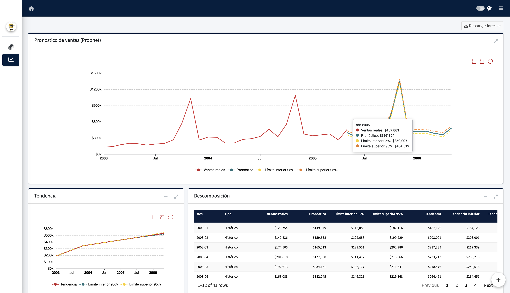{#fig-normaldash}

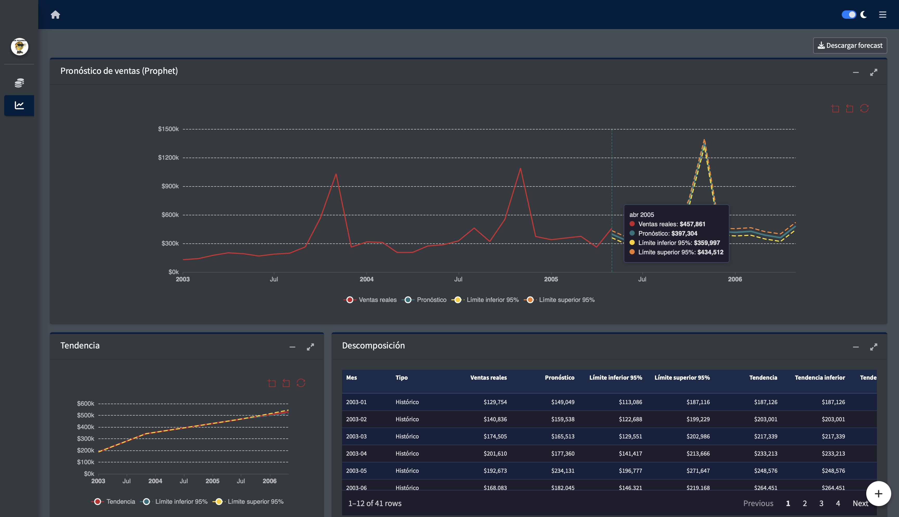{#fig-nochedash}

Pronóstico del dashboard de ventas
:::


Estamos a un paso de terminar este dashboard, pero aún nos falta un pequeño detalle: La seguridad. Supongamos por ejemplo que tenemos estos usuarios:

```{r, eval=FALSE}
# Usuarios autorizados
usuarios <- tibble::tibble(
  user = c("admin", "analista"),
  password = c("ejemplo_123", "datos_456"),
  name = c("admin", "ventas"),
  posicion = c("Gerente", "Vendedor")
)
```

Para este ejercicio, los vamos a generar mediante un data frame, pero lo más lógico sería obtener esta información a partir de una base de datos con un mayor nivel de seguridad (en ambientes reales). Dados los usuarios, vamos a englobar nuestra interfaz mediante `secure_app()`, función que ya discutimos previamente:

```{r, eval=FALSE}
secure_app(frontend,
           theme = "cosmo",
           background  = "linear-gradient(rgba(0, 0, 0, 0.5),
                    rgba(0, 0, 0, 0.5)),
                    url('https://cdn.pixabay.com/photo/2018/08/21/23/29/
                    forest-3622519_1280.jpg')
                    no-repeat center fixed;
                    -webkit-background-size: cover;
                    -moz-background-size: cover;
                    -o-background-size: cover;
                    background-size: cover;")
```

(Si, reciclé el diseño usado en el ejemplo que vimos anteriormente, cuando explicamos este tema).

Respectivamente, para el servidor:

```{r, eval=FALSE}
autenticacion <- secure_server(
    check_credentials = check_credentials(usuarios)
  )
```


Ya que tenemos una capa de contraseñas, ahora podemos añadir un encabezado en nuestro dashboard con el usuario en cuestión. Si regresamos a la sección `x`, en la función `dashboardHeader()` simplemente tenemos que añadir `rightUi = userOutput("user")`, es decir: 

```{r, eval=FALSE}
frontend <- 
dashboardPage(
  header = dashboardHeader(
    sidebarIcon = icon("home"),
    controlbarIcon = icon("bars"),
    status = "navy",
    fixed = T,
    rightUi = userOutput("user")
  ),
  footer = dashboardFooter(
    left  = "R-conomics",
    right = paste0("@Jorge Hernández, ", year(today()))
  ),
  sidebar = sidebar,
  controlbar = controlbar,
  body = body
)
```

Y, del lado del servidor, definimos al usuario:

```{r, eval=FALSE}
output$user <- renderUser({
    dashboardUser(
      name = autenticacion$name,
      image = "url_de_usuario",
      title = autenticacion$posicion
    )
})
```

De esta forma, concluimos el proyecto final de este libro: Un dashboard completamente funcional, sencillo de entender para el negocio y con los niveles de seguridad requeridos.

Como regalo adicional y final, podrás encontrar el proyecto completo en [el siguiente enlace](https://github.com/Jorge-hercas/ejercicio-dashboard-ventas), junto con una versión online de la app.

Con este proyecto, damos por concluido este libro, cuyo objetivo principal fue mostrar cómo R puede utilizarse como una herramienta integral para la inteligencia de negocios. A lo largo de los distintos capítulos, pasamos por muchísimos dolores de cabeza, análisis, más análisis, manipulación de datos e incluso desarrollo web (a un nivel bastante sencillo).

Más allá de revisar funciones o paquetes de forma aislada, la intención fue construir una visión práctica del uso de R dentro de un flujo real de trabajo: desde la obtención y limpieza de los datos, hasta la generación de productos analíticos que puedan ser consultados por usuarios finales, y parece ser que se logró el objetivo, aunque tú tendrás la opinión final.

Muchas gracias por leer este libro, por dedicar tu tiempo a recorrer estas páginas y, sobre todo, por atreverte a ensuciarte las manos con código.

El final de este libro es, en realidad, el inicio de tu propio camino en la analítica de datos y el desarrollo de soluciones de negocio. El código que construimos y el dashboard que desplegamos son solo los cimientos, y eso es lo más divertido, porque siempre habrá un proyecto nuevo, un nuevo dataset y un nuevo método a utilizar en tu carrera profesional. Este libro se basó meramente en temas y recursos que yo he utilizado a lo largo de mi carrera profesional, pero lo cierto es que hay un sinfín de temas que aún puedes explorar.


