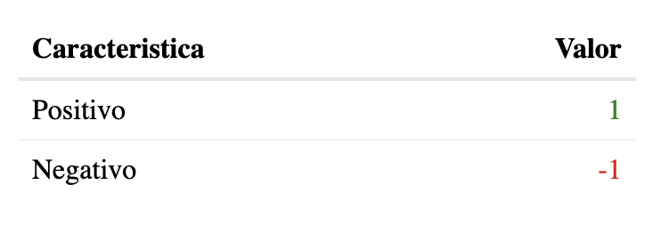

# Creando mis propias funciones

Generalmente, los cursos y libros dedicados a programación inicial en R suelen dejar de lado la creación de funciones, pero a mi parecer estas son una pieza clave de tu camino en el aprendizaje de este lenguaje. En el 99% de los casos ya existirá una función o, en su defecto, una librería que cuente con la función que necesitas para casi cualquier situación, pero no siempre será así. Cuando te encuentres en una situación laboral o escolar en la que no exista una forma clara de resolver un problema específico, tu deberás ser capaz de crear dicha solución a partir del uso de la lógica y combinación de funciones/operaciones ya existentes.

Básicamente, la idea de una función es simplificar el trabajo realizado. En muchas situaciones encontraremos que tenemos una gran cantidad de cálculos que debemos correr una y otra vez, por lo que el crear una función que englobe todo nuestro script nos ayudará a reducir tiempo, tener un código más limpio y mejor estructurado, sin mencionar que, al asignarle un nombre, podremos identificar de mejor manera el cálculo que realizamos mediante la función.

## La sintaxis de una función

Toda función en R se compone de 3 partes básicas:

-   Argumentos de entrada

-   Operacion(es)

-   Resultado(s)

Explicado de manera más detallada, lo que hace una función es, dada una lista de argumentos que predefinimos, se van a realizar una serie de cálculos, los cuales nos devolverán un resultado a partir de los datos que nosotros introducimos.

Para nosotros poder guardar en memoria una función simplemente tenemos asignarla como un objeto, así como lo hicimos anteriormente con el signo `<-`, lo cual nos permitirá usar dicha función en el futuro (y eventualmente poder introducirla en una librería, cosa que veremos en capítulos posteriores).

Los argumentos de una función son en esencia objetos, por lo que pueden estar predefinidos para que se calculen por default sin tener que asignarlos al momento de hacer el cálculo.

Al nosotros escribir una función en R, debemos seguir la siguiente estructura básica:

```{r, eval=FALSE}
Nombre_de_la_funcion <- function(argumentos){
  
  #operaciones a realizar
  
}
```

Primero, debemos asignarle un nombre a nuestra función, el cuál será con el que la llamaremos una vez que la hayamos guardado en memoria, después debemos asignar los argumentos que nos pedirá nuestra función para poder realizar las operaciones correspondientes, las cuales se ejecutarán dentro de los signos de llave.

Imaginemos por ejemplo que queremos calcular el cuadrado de un número, para hacer esto debemos definir como argumento de la función al número, posterior a ello simplemente debemos escribir dentro de los corchetes el argumento a usar seguido del cálculo a realizar, es decir:

```{r}
# Función para calcular el cuadrado de un número
cuadrado <- function(numero){
  numero^2
}

# Probando nuestra función
cuadrado(numero = 9)
```

Si queremos darle un aspecto más agradable a la respuesta devuelta por nuestra función podemos hacer uso de, valga la redundancia, la función `paste()` (o `paste0()` si no queremos espacios por default) con la cual podemos concatenar múltiples objetos, por ejemplo:

```{r}
# Customizando el valor devuelto
cuadrado <- function(numero){
  paste("El valor devuelto es", numero^2)
}

# Probando nuestra función
cuadrado(numero = 9)
```

## La función `return()`

En nuestro ejemplo anterior la función para calcular el cuadrado de un número nos devolvió el objeto creado, pero ¿qué pasaría si creáramos múltiples objetos dentro de la función? Dentro del lenguaje R, cuando nosotros establecemos una función, si no lo definimos previamente, siempre se nos devolverá el último objeto evaluado. Cuando nosotros queremos definir explícitamente el valor evaluado que nos va a retornar la función en cuestión, debemos utilizar `return()` de la siguiente manera:

```{r}
# Agregando return() a la función
cuadrado <- function(numero){
  resultado <- paste("El valor devuelto es", numero^2)
  
  return(resultado)
}

# Probando la función
cuadrado(numero = 9)
```

Este argumento es especialmente útil cuando tenemos múltiples objetos dentro de la función y queremos retornar uno en específico, sin que necesariamente sea el último que haya sido evaluado.

## El operador `<<-`

Cuando nosotros creamos objetos mediante `<-` estos se guardan en memoria, por lo que podemos acceder a ellos llamándolos por su nombre, sin embargo, cuando creamos objetos dentro de una función estos al depender de valores dinámicos no se guardan, sin embargo, podemos definir utilizar el operador `<<-` para que al momento de que nosotros evaluemos una función de manera automática se guarde un objeto en memoria, por ejemplo:

```{r}
# Asignando <<- a la función
cuadrado <- function(numero){
  resultado <- paste("El valor devuelto es", numero^2)
  
  resultado <<- resultado
}

# Evaluando la función
cuadrado(numero = 9)

# Accediendo al objeto guardado en memoria
resultado
```

Pensemos en un ejemplo un poco más interesante: Supongamos que queremos hacer más de un cálculo con datos provenientes de un vector, algo como la media, mediana, máximo y mínimo, por ejemplo. Vamos a crear una función que a partir de los resultados dados nos devuelva un texto con dicha información y, además, guarde dicha información en memoria. Vamos a construir la función a continuación:

```{r}
# Creamos la función
calculos <- function(vector){
  
  # Cálculos
  promedio <- mean(vector, na.rm = T)
  minimo <- min(vector, na.rm = T)
  maximo <- max(vector, na.rm = T)
  
  # Guardado de la información en memoria
  datos <<- list(
    promedio = promedio, 
    minimo = minimo, 
    maximo = maximo)
  
  # Valor final impreso en consola
  final <- paste0("El promedio del vector es ",
                  promedio,". El mínimo es ",
                  minimo," y el maximo es ", 
                  maximo)
  
  return(final)
}

# Evaluamos la función con datos de ejemplo
calculos(vector = c(1:5))

# Llamamos a los datos guardados en memoria
datos
```

Este ejemplo es bastante útil para entender la importancia de crear funciones cuando queremos simplificar los cálculos que realizamos. Imagina que tuvieras que evaluar el promedio, mínimo y máximo de múltiples vectores, hacer eso de forma manual habría sido bastante tardado, por lo que crear una función nos permite reducir el tiempo que destinamos a codificar los resultados.

## Estructuras de control

Una parte fundamental al trabajar con funciones son las estructuras de control, las cuales simplemente son una forma en la que, a partir de una condición original o secuencia establecida, podemos restringir la ejecución de nuestro código. La idea es sencilla: Una estructura de control nos permitirá ejecutar solamente la información que queremos en el rango que queremos e incluso ignorar los casos que queremos. Antes de introducir las estructuras de control dentro de las funciones, vamos a ver cada una de ellas de forma individual:

1.  Condicionales: `if else` y `switch`

2.  Bucles:

    2.1. Secuencia `for`

    2.2. Secuencia `while` y `repeat`

3.  Interrumpiendo un bucle: `next` / `break`

### Dos (o más) posibles resultados: Condicional `if`.

Usualmente las funciones nos devuelven un resultado a partir de los argumentos que definimos, pero ¿y si quisieramos devolver un resultado a partir de una condición? Muchas veces nos encontraremos en un situación en la que, por ejemplo, si un valor predefinido cumple una condición, querremos devolver un resultado y, contrariamente, si dicha condición no se cumple, devolver otro resultado; para resolver esos casos podemos hacer uso del condicional `if else`. Veamos su estructura mediante un ejemplo: Imagina que tenemos un objeto x, el cuál es equivalente a un número aleatorio y queremos imprimir un mensaje dependiendo de si el resultado es mayor o menor a 5, podemos crear un condicional de la siguiente manera:

```{r}
# Número aleatorio
x <- sample(1:10, size = 1)

# Condicional
if (x < 5){
  paste0("El número ",x," es menor a 5")
}else{
  paste0("El número ",x," es mayor a 5")
}
```

La creación de un condicional es bastante sencilla, ya que simplemente debemos escribir la condición a cumplir y, dentro de signos de llave `{}` asignar la operación-resultado a devolver. En este caso específico introducimos `else` para asignar un valor impreso en caso de que no se cumpla la condición original, sin embargo, esto no es del todo necesario. Basta con escribir una sola condición a cumplir para evaluar el condicional, ya que si esta situación no se cumple, valga la redundancia, no se devolverá ningún resultado, por ejemplo:

```{r}
# Número predefinido
x <- 6

# Condicional
if (x < 5){
  paste0("El número ",x," es menor a 5")
}
```

Es importante mencionar que las llaves no son estrictamente necesarias si solamente utilizamos una línea de código; el uso de llaves nos permite ejecutar múltiples operaciones dentro de un *bloque de código*, por lo que solo son necesarias cuando un condicional, bucle e incluso una función tiene más de una operación dentro de su estructura. En nuestro ejemplo anterior es posible reducir aún más el tamaño del código ignorando el uso de llaves al solo tener una línea a ejecutar. Probémoslo en un caso en el que si se cumpla la condición:

```{r}
if (x > 5) paste0("El número ",x," es mayor a 5")
```

#### Añadiendo más opciones al condicional: `else if`

La estructura básica de un condicional se basa en que si una condición (o más) se cumple(n) entonces obtendremos un resultado, mientras que de no ser el caso entonces obtendremos otro por fallo, pero encontraremos casos en los que tendremos que añadir más resultados posibles a la lista. Si dentro de esta estructura `if` significa *"si cierta situación se cumple"* y `else` significa *"entonces",* para añadir un tercer (o más) caso(s) posible(s) al condicional utilizariamos la expresión `else if`, la cuál signifca *"por tanto si"* . Regresemos al ejemplo usado en el punto anterior, vamos a segmentarlo en 3 posibles escenarios: 1. El número es menor o igual 5, 2. El número es mayor a 5 y menor o gual a 10 y 3. El número es mayor a 10. Vamos a plantear la estructura de este condicional triple:

```{r}
x <- 6

if (x <= 5){
  paste0("El número ",x," es menor a 5")
}else if (x > 5 & x <= 10){
  paste0("El número ",x," está entre 5 y 10")
}else{
  paste0("El número ",x," es mayor a 10")
}
```

A pesar de que esta es la forma más correcta de plantear un condicional con 3 posibles soluciones, también podemos generar una estructura con un condicional dentro de otro, tal que:

```{r}
if (x <= 5){
  paste0("El número ",x," es menor a 5")
}else{
  if (x > 5 & x <= 10){
    paste0("El número ",x," está entre 5 y 10")
  }else{
    paste0("El número ",x," es mayor a 10")
  }
}
```

Sin embargo, ese tipo de estructuras se recomiendan en casos en los que el segundo condicional se utilice para realizar una operación diferente a partir del primer resultado, claro que esto puede quedar a comodidad de cada persona.

### Múltiples condiciones: `Switch`.

Usar el condicional `if else` es genial, ya que es bastante sencillo de entender y, en la gran mayoría de los casos, nos ayudará a resolver el problema al que nos estemos enfrentando, pero existen situaciones en las que no es la mejor opción, ya que nos encontramos con una cantidad considerable de escenarios posibles. Para situaciones en las que puede ser bastante engorroso el escribir tanto `if else` la solución más óptima será utilizar un condicional `switch`. Considera que un condicional `if` está diseñado para situaciones en las que tenemos una decisión a partir de un valor booleano (0 o 1, `TRUE` o `FALSE`, etc), mientras que `switch` está enfocado a casos en los que se toma una decisión en función del valor de una expresión. No existe una regla oficial para escoger cuando utilizar cada caso, pero mi recomendación es que si tienes más de 3 condiciones posibles cambies a `switch`

El uso de `switch` es bastante sencillo, ya que tiene una estructura muy similar a la de `if else`, pero siendo una versión algo más simplificada de ello, es decir, no es necesario escribir múltiples veces sentencias `else`, basta con escribir el posible valor y el resultado dado ese valor, por ejemplo: Supongamos que tenemos un objeto `operacion` el cuál puede ser uno de los siguientes posibles valores: "suma", "resta", "multiplicacion" u "division" y queremos realizar dicho cálculo dependiendo de lo que diga la cadena de caracteres, podemos hacer lo siguiente:

```{r}
# Objeto para escoger la operación a realizar
operacion <- "resta"

# Valores a utilizar
valor1 <- 5
valor2 <- 7

# Estructura condicional
switch(operacion,
       "suma"={
         print(valor1 + valor2)
       },
       "resta"={
         print(valor1 - valor2)
       },
       "multiplicacion"={
         print(valor1 * valor2)
       },
       "division"={
         print(valor1 / valor2)
       },
       "No se ha asignado una operacion valida")

```

Notese que esta estructura de control es mucho más corta de lo que hubiese sido un `if`, ya que simplemente debemos escribir el valor de la cadena de caracteres y, subsecuentemente, el valor a retornar si la cadena coincide. El último mensaje asignado en esta estructura no tiene un valor ligado, ya que es un valor que aparecerá por default si la cadena no coincide con ningún otro caso. Es recomendable utilizar un valor final no ligado a un caso específico como default para tener un mejor control de lo que se realizará en la estructura, aunque esto no es necesario y se puede omitir.

Estas estructuras se pueden simplificar aún más trabajándolas únicamente mediante el índice de valores, es decir, escribimos por ejemplo 4 condiciones y seleccionamos una de ellas únicamente a partir del número de fila en el que se encuentre, tal que:

```{r}
switch(3,
       "Seleccionaste el primer valor",
       "Seleccionaste el segundo valor",
       "Seleccionaste el tercer valor",
       "Seleccionaste el cuarto valor")
```

Más adelante veremos estas estructuras con funciones de la librería `dplyr` en casos más prácticos, por lo que podrás ver el potencial de dichas estructuras en una situación más realista.

### Secuencias: `for i`

Una de las estructuras de datos más útiles y que más frecuentemente vamos a utilizar, ya que nos permitirá simplificar mucho tiempo cuando estemos trabajando con tareas repetitivas. Si bien la función `lapply()` tiene un objetivo similar, por ahora nos limitaremos a la estructura `for i`, ya que `lapply()` cuenta con toda una familia de funciones que veremos con detalle en secciones posteriores. Comencemos con un ejemplo básico del tema: Imprimir un número en la consola de R. Supongamos que queremos imprimir el número 1, esto lo podemos hacer sencillamente usando la función print() como ya lo sabes, pero ¿y si quisiera imprimir los números del 1 al 5 de forma separada (es decir, sin utilizar una secuencia 1:5)? Aquí es donde entraría en juego una estructura for i, ya que nos permitirá realizar operaciones un número determinado de veces. Su estructura es bastante sencilla, básicamente tenemos que asignar un número fijo de números, los cuales serán adoptados por la variable `i`, la cual debe estar presente dentro de la estructura de datos para poder ser reciclada ese número determinado de veces. Veamos el ejemplo de los números del 1 al 5:

```{r}
# Secuencia de números del 1 al 5
for (i in 1:5){
  print(i)
}
```

Como puedes ver, el valor `i` simplemente se va a imprimir el número de veces que tenga asignadas en dicho vector, adquiriendo los valores correspondientes del mismo. Recuerda, a pesar de estar dentro de una estructura `for i`, si nosotros solamente escribimos el número `5` en lugar de `1:5` entonces la variable `i` solo tomará ese valor; necesitamos ser bastante explícitos en el vector que insertamos en la estructura, para que este sea considerado correctamente. Lo normal al momento de trabajar con secuencias es escribir, valga la redundancia, una secuencia de números determinada, pero habrá ocasiones en las que queramos saltarnos un valor en específico al momento de ejecutar la estructura, por lo que aquí tenemos dos opciones para ello: Crear un vector personalizado que no contenga el caso en específico, o bien utilizar una estructura `while`, pero esto lo veremos en la siguiente sección a detalle.

Puede que hasta ahora no veas tanta utilidad en el uso de secuencias, por lo que te plantearé el siguiente ejemplo: Imagina que quieres crear un objeto guardado en memoria para cada una de las columnas de un data frame, en este caso podríamos ver cuantas columnas tiene ese data frame y, a partir de eso crear una secuencia con dicha amplitud. En este caso utilizaremos el dataset de muestra *mtcars*.

Directamente no podemos utilizar el operador `<-` cuando queremos crear nombres de objetos en bucle, por lo que en este caso haremos uso de la función `assign()` para evitar ese problema de la siguiente manera:

```{r}
# Vemos el númerod e columnas que tiene nuestro data frame
length(mtcars)

# Creación de objetos en bucle a partir del nombre de cada columna 
# (solo los primeros 3)
for (i in 1:3){
  assign(names(mtcars)[i],mtcars[i])
}
# Accedemos a uno de los objetos creados
head(mpg,5)
```

En un contexto mucho más realista, será muy normal que te encuentres con tablas que contengan 40,50 o incluso más de 100 columnas, por lo que la forma más sencilla de establecer el rango de la secuencia es escribiendo la función `length()` dentro de la misma, tal que:

```{r,eval=FALSE}
# Rango del bucle mediante una función
for (i in 1:length(mtcars)){
  assign(names(mtcars)[i],mtcars[i])
}
```

Considera que `length()` nos da el número de elementos que tiene un objeto dependiendo del tipo de objeto que sea éste, por ejemplo, para un data frame nos indicaría el número de columnas que tiene, mientras que para un vector nos indicaría el número de observaciones, ya que considera a cada observación como un elemento del objeto. Puede que te encuentres con situaciones en las que necesites saber el número de filas que tiene un data frame, por lo que para ese caso puedes utilizar la función `nrow()`, la cuál nos da ese dato, pero solamente a nivel data frame o matriz (objeto de dos dimensiones).

::: callout-note
## Nota

El valor `i` únicamente es un objeto que funciona como índice o contador, no necesariamente debe ser esa letra o nombre de objeto, aunque es comúnmente utilizado así.
:::

#### Bucles anidados.

Un bucle para abarcar todos los elementos de un cierto cálculo siempre nos es útil, pero en ciertas ocasiones no es suficiente, ya que necesitamos implementar más de una estructura para poder abarcar todos los elementos que necesitaremos. La mejor forma de entender los bucles anidados es mediante el siguiente ejemplo: Imagina que tienes archivos excel con información macroeconómica separados por ciudades, que a su vez se separan por estado de México en carpetas contenedoras. Si quisieramos leerlos uno por uno mediante un bucle, necesariamente necesitaríamos dos: un bucle para seleccionar carpetas y otro bucle para seleccionar archivos individuales y leerlos. En este caso podemos apoyarnos de la función `list.files()` que nos indica las carpetas/archivos disponibles en una ruta específica. Supongamos que tenemos toda la información dentro de un proyecto (lo que nos evita preocuparnos por una ruta más larga del directorio de trabajo), el primer paso será establecer el primer nivel para selección de carpetas, es decir:

```{r, eval=FALSE}
carpetas <- list.files()
for (i in 1:length(carpetas)){
  carpeta_secundaria <- carpetas[i]
}
```

Ahora, ya que tenemos acceso a cada una de las carpetas vamos a establecer un bucle secundario dentro del anterior que nos permita leer individualmente cada archivo y, conforme vaya terminando, comience a leer el siguiente documento, tal que:

```{r, eval=FALSE}
carpetas <- list.files()
for (i in 1:length(carpetas)){
  carpeta_secundaria <- carpetas[i]
  for (j in 1:length(list.files(carpeta_secundaria))){
    archivo <- read.csv(paste0(carpeta_secundaria, "/", 
                               list.files(carpeta_secundaria)[j] ))
  }
}
```

Como puedes ver, en el ciclo interior lo que hicimos fue obtener los documentos existentes de la carpeta contenedora de cada estado (en este ejemplo ficticio) y concatenar la ruta de la carpeta `carpeta_secundaria` con la ruta final del archivo `list.files(carpeta_secundaria)` delimitado por el índice `[j]`, lo que nos permitirá ir leyendo cada archivo y, una vez que se acaben los archivos de cierta carpeta, el bucle continuará en la siguiente. Básicamente, el bucle interior se va a ejecutar $n$ veces dependiendo del contenido de esa carpeta hasta terminar, lo que permitirá avanzar a la siguiente a través del bucle exterior. El proceso sería similar en caso de tener niveles aún más profundos de carpetas contenedoras, simplemente *anidando* bucles al proceso.

La intención de los bucles anidados es simple: trabajar con múltiples procesos que requieran una evaluación individual imposible de realizar en un solo proceso. Debemos ser cuidadosos en estos ejercicios, ya que estas estructuras de control pueden volverse lentas en caso de que no esten bien estructuradas o se trabaje con demasiados niveles de anidación.

::: callout-warning
## Cuidado

Un error común en bucles anidados es utilizar un mismo objeto `i`, `j` para el conteo en cada proceso. Si repetimos el mismo nombre de objeto nos encontraremos con un problema en el que el índice del nivel anterior se va a reciclar, lo que nos dará un cálculo incorrecto. **Cada nivel de anidación debe tener un contador único.**
:::

### Cuando el final es incierto: `While` y `repeat`.

Estas estructuras son personalmente unas de mis favoritas, ya que podemos sacar muchísimo provecho de ellas cuando no sabemos exactamente cuantas veces debemos realizar una tarea. Te voy a contar una pequeña historia de uso de esta estructura, pero antes veamos como funciona. La idea es sencilla: Mientras se cumpla una condición, el bucle se va a ejecutar de manera indefinida, por ejemplo, si quisieramos imprimir un mensaje mientras el valor de un objeto sea menor a 4, podemos hacer lo siguiente:

```{r}
# Objeto a evaluar
x <- 1

# Bucle a ejecutar
while(x < 4){
  print("El valor calculado es aún menor a 4")
  x <- x + 1
}
```

Como puedes ver, cada vez que se ejecuta este código, al objeto `x` se le suma un número entero, por lo que la siguiente vez que se evalue ese objeto, este habrá incrementado. Es importante considerar que estos bucles pueden salirse de control fácilmente si no son estructurados correctamente, por ejemplo, en el caso anterior, si no se le sumara un número entero al objeto `x` este bucle se ejecutaría infinitamente.

El uso de `repeat` se podría decir que considera una lógica contraria a `while`, ya que mientras este último se basa en la idea de "mientras se cumpla cierta condición se ejecutará el código", `repeat` se va a ejecutar indefinidamente hasta encontrarse con una condición que detenga dicha iteración. Es importante considerar que, al igual que `while`, `repeat` debe usarse con cuidado de tener una condición que pueda pararlo en cierto momento, ya que de lo contrario se ejecutará indefinidamente y puede demandar una gran cantidad de recursos de tu ordenador.

#### Usando `while` en un caso real.

Se que puedes estar preguntándote el uso real de esta estructura y si realmente podrás sacarle provecho en el mundo laboral. No te culpo, yo también me pregunté eso cuando aprendí como funcionaba, ya que los libros y artículos al respecto solo proporcionan ejemplos muy básicos, así que dedicaré esta pequeña sección a mostrarte cómo utilicé un ciclo `while` (y como aún lo sigo utilizando) en mi trabajo para extraer información de una base de datos.

Una de las labores mensuales más importantes que me tocó realizar fue el obtener datos de encuestas que se alojaban en una base de datos no relacional en firestore, un servicio de Google Cloud. Para obtener esta información es necesario estar registrado y ser invitado al proyecto por el equipo de TI de la empresa, pero el gestor de firestore tiene un problema considerable: Para que las aplicaciones que estén conectadas en tiempo real a esa base de datos puedan funcionar de manera óptima, hace particiones de la información en secciones de máximo 300 observaciones. Al yo conectarme a esa base de datos y utilizar código de R para poder exportar esos datos a un archivo de excel, me es imposible hacerlo todo en un solo movimiento, ya que la consulta te devuelve 2 objetos: Un **token** que te redireccionará a la siguiente consulta y las primeras 300 observaciones (si las hay, es decir, si existe esa cantidad de registros). En este punto es donde entra el ciclo `while` y un poco de lógica, ya que se me ocurrió la siguiente idea: No tengo idea de cuantas secciones de 300 observaciones existen, pero si cada consulta te regresa un token para acceder a la siguiente sección, entonces en algún momento ese token dejará de existir porque llegué al final de consultas. La aplicación de un ciclo `while` es fundamental para realizar esto de manera automática, así que vamos a desglozar la idea en partes:

1.  Generar un data frame a partir de una consulta, el cuál retornará el token de la siguiente página.
2.  Crear un objeto que contenga únicamente el token creado.
3.  Crear un ciclo `while` que se ejecute mientras dicho token exista.

Quiero que notes que el ciclo funciona mientras exista un token, ya que el hecho de que este desaparece implica que llegamos al final y, por lo tanto, no es necesario que se siga ejecutando. Veamos un ejemplo del código utilizado para dicha extracción:

```{r, eval=FALSE}
# Consulta inicial (retornará el primer data frame y el token)
consulta <- "Objeto de la consulta"

# Ciclo
while (is.null(consulta$token) == FALSE) {
  # Creación de la consulta en bucle para cada página
  consulta <- consulta + consulta$token 
}
```

Claramente esto solo es la estructura lógica que se siguió para la extracción de los datos, pero quiero que notes que, cada que se ejecuta la consulta, esta debe incluir el token utilizado en la consulta anterior, ya que esto me permitió acceder a la siguiente página de valores y, consecuentemente, al siguiente token. La consulta es una lista, por lo que si yo intento acceder a su token mediante el operador `$` y este no existe, me retornará el valor `NULL`, razón por la que se evalua que este objeto sea diferente a ese valor, porque aún existe.

### Añadiendo `next` y `break`

Estos operadores son por si solos inútiles, ya que funcionan en conjunto con bucles como `while` o `repeat` en situaciones en las que queremos detener una ejecución o ignorar ciertos casos en concreto. Comencemos por analizar `break`: Es utilizado cuando queremos detener la ejecución de la estructura `repeat` al encontrar una iteración que cumpla una condición, por ejemplo, supongamos que queremos calcular el cuadrado de un número de manera indefinida pero sin pasarnos del número 30 en el resultado, tal que:

```{r}
numero <- 3

# Estructura de la iteración
repeat{
  numero <- numero^2
  print(numero)
  # Condición para terminar la ejecución
  if (numero > 100){
    break
  }
}
```

Como puedes ver, la consola nos está devolviendo un valor que si sobrepasa el número establecido en la condición para detener la ejecución de la estructura `repeat`, esto ocurre porque tanto el cálculo `numero^2` como la función `print(numero)` están escritas antes del condicional `if`, por lo que el bucle primero hace el cálculo y después lo evalua para decidir si se detiene.

Vamos a analizar el funcionamiento de `next`: Al ejecutar un bucle puede que en ciertas ocasiones queramos ignorar ciertos valores en la iteración que cumplan con una condición específica, por lo que nos apoyaremos de `next` dentro de un condicional `if` para ello. Imaginemos el siguiente caso: Supongamos que queremos imprimir únicamente los números impares del 1 al 10, para ignorar aquellos que sean pares podemos hacer lo siguiente:

```{r}
for (i in 1:10){
  if (i %% 2 == 0){
    next
  }else{
    print(i)
  }
}
```

Como puedes ver, si el residuo del número dividido entre 2 es igual a 0, eso implica que el número es par, por lo que se ignora ese caso y se pasa a evaluar al siguiente número. El uso de `next` es en realidad algo muy sencillo, ya que simplemente implica incluir un condicional para ejecutar solo lo que nosotros queremos, limitando la demanda de recursos que podría utilizar el ejecutar un código sin esta condición.

### Dinamizando estructuras dentro de funciones.

Hasta ahora ya hemos analizado el uso de cada una de las estructuras de control y su uso más básico, por lo que ahora tocará simplificar nuestro código introduciendo dichas estructuras en una función que nos evite el escribir demasiadas órdenes. Regresemos a un caso anterior: Imprimir el cuadrado de un número mientras este sea menor a 100. Este proceso es bastante sencillo, pero puede convertirse en algo engorroso si quisieramos hacerlo para muchos números diferentes, ya que tendríamos que reemplazar el objeto original que contiene el número y ejecutar ese código de nuevo. Una forma de simplificar este proceso es, simplemente, introducir la estructura en una función, tal que:

```{r}
cuadrado <- function(numero){
  # Bucle dentro de una función
  repeat{
    numero <- numero^2
    print(numero)
    if (numero > 100){
      break
    }
  }
}
```

Y de esta manera evitamos la necesidad de ejecutar una y otra vez la línea de código que contiene al número que estamos trabajando, solamente debemos ejecutar la función creada, es decir:

```{r}
# Ejemplo de uso de la función
cuadrado(5)
```

Veamos un ejemplo más interesante: El factorial de un número. Como sabes, el factorial no es más que el mismo número multiplicado por todos los números consecutivos anteriores a el, por lo que utilizando un ciclo `for i` que multiplique ese valor en cada iteración, podemos crear una función para calcular dicho factorial, tal que:

```{r}
factorial <- function(numero){
  resultado <- 1
  for (i in 1:numero)
    resultado <- resultado * i
  return(resultado)
}
```

Desglosemos la función: El primer paso es generar un objeto `resultado` con el número 1, después, dentro de un bucle en un rango de 1 al número a calcular su factorial, vamos a ir generando de forma iterativa la multiplicación del objeto `resultado` $n$ veces hasta llegar al número a calcular. Este ejemplo me parece bastante más adecuado para mostrar el potencial de una función para dinamizar estructuras iterativas, ya que ahora solo debemos escribir el número del cual queremos calcular su factorial, por ejemplo:

```{r}
factorial(5)
```

### Funciones dentro de ellas mismas: *recursividad.*

Cuando queremos simplificar el código de una función, el uso de la recursividad nos puede ser bastante útil, pero ¿a qué me refiero con esto? Una función recursiva es una manera diferente de resolver problemas de forma repetitiva en R, sin la necesidad directa de crear un ciclo, o bien, sin tener que generar directamente una iteración. Se llama a sí misma dentro de su propia definición y se utiliza cuando no se sabe cuántas veces se necesitará repetir una acción. La recursividad ayuda a crear funciones más avanzadas y flexibles que las funciones normales. Retomemos el ejemplo de la función para calcular un factorial de un número, mediante recursividad nuestra función puede simplificarse de la siguiente manera:

```{r}
factorial_recursivo <- function(numero){
  # Límite de recursión
  if(numero == 1){
    return(1)
  }else{
    # Recursión
    return(numero * factorial_recursivo(numero - 1))
  }
}
```

En el ejemplo anterior evitamos el uso de una estructura iterativa al invocar a la misma función en una versión $n-1$, es decir, con el número anterior al escrito como argumento de la función una y otra vez hasta llegar a 1, donde al registrar dicho valor el condicional se detiene, por ejemplo:

```{r}
factorial_recursivo(5)
```

Es importante considerar que, de no haber escrito el condicional `if(numero == 1) return(1)` la función no habría parado, se hubiese seguido ejecutando hasta agotar la memoria asignada, retornando un error como el siguiente:

```{r}
### Error: C stack usage  7953912 is too close to the limit
```

Razón por la que debemos tener mucho cuidado al momento de realizar este tipo de funciones, o bien utilizar directamente ciclos iterativos explícitos (`while`, `for i`, `repeat`) para tener la seguridad de no encontrarnos con este tipo de problemas.

::: callout-tip
## Tip

Al trabajar con una función recursiva es recomendable utilizar herramientas de depuración como `debug()` para encontrar y corregir posibles errores de ejecución.
:::

## Funciones anónimas

Este concepto es sumamente útil cuando queremos evitar la creación de múltiples objetos (funciones), principalmente si estas solo van a realizar una parte del cálculo final. En R, una función anónima es una función que no tiene nombre asignado directamente (al no utilizar un operador `<-`). En su lugar, se define utilizando la función `function()` dentro de otra expresión y se asigna a una variable o se utiliza directamente, lo que, dicho de otra manera, nos dice que una función anónima no es más que una función corta (temporal) a la cual no nombramos para simplificar secciones de código y ahorrarnos tiempo [@hofmann2017functional]. Imaginemos la siguiente situación: Qué pasaría si quisieramos hacer un cálculo rápido del cuadrado de un número sin tener que directamente crear el objeto de la expresión, podemos hacer lo siguiente:

```{r}
(function(x)x^3)(10)
```

Simplemente englobamos a la expresión `function()` en un paréntesis y, subsecuentemente, escribimos en otro paréntesis el valor a calcular.

Veamos ahora un caso práctico un poco más interesante: *Una función que nos retorne la media y la moda*. El lenguaje R es muy bueno para casi todas las situaciones enfocadas a análisis de datos, pero extrañamente no cuenta con una función para calcular la moda estadística por default, razón por la que podemos crear una función que genere este cálculo, introduciendola en una función gliobal que retorne tanto la media como la moda. Comencemos por establecer la lógica del cálculo de la moda: Sabemos que la moda estadística no es más que el número que más veces se repite en un conjunto de observaciones, por lo que podemos hacer uso de la función `table()` para obtener las frecuencias de cada uno de los elementos únicos del vector, por ejemplo, supongamos el siguiente vector de muestra:

```{r}
frecuencia <- c(1,3,4,5,6,7,4,5,4,4,4)
table(frecuencia)
```

Como puedes observar, esta función convierte a los valores únicos de los vectores en nombres y a su frecuencia en el valor, por lo que para extraer el número representante de la moda podemos hacer uso de la función `names()`, filtrando aquel nombre que tenga el valor máximo con `which.max()`, función que nos da la posición del valor máximo, es decir:

```{r}
names(table(frecuencia))[which.max(table(frecuencia))]
```

Ya que tenemos la lógica establecida, vamos a pasar dichos argumentos a una función, donde el cálculo de la moda estará introducido como una función anónima, tal que:

```{r}
media_moda <- function(x){
  paste0("La media es ", mean(x), " y la moda es ",
         # Función anónima
         (function(x){names(table(x))[which.max(table(x))]})(x))
}
```

Ahora, vamos a probar la función con un ejemplo:

```{r}
vector <- c(1,1,1,9,5,2,2)
media_moda(vector)
```

De esta forma pudimos crear una función que englobe ambos cálculos sin la necesidad de crear dos expresiones por separado, simplificando el trabajo que hay de por medio.

### Un caso de uso

Discutiremos la creación y customización de tablas en capítulos posteriores, por lo que ahora mismo no voy a profundizar demasiado en este tema, pero un caso muy conocido en el uso de las funciones anónimas está en la librería `reactable` [@reactable] dedicada a la renderización de tablas interactivas. Las funciones anónimas se pueden utilizar como un argumento en la creación de tablas para generar un color condicional en una columna dependiendo del valor. Veamos un ejemplo sencillo de ello:

```{r, eval=FALSE}
# Cargamos la librería
library(reactable)

# Generamos un data frame con números positivos y negativos
datos_tabla <- data.frame(
  Caracteristica = c("Positivo", "Negativo"),
  Valor = c(1,-1)
)

# Generamos una tabla
reactable(
  datos_tabla,
  # Customizamos la columna numérica
  columns = list(
    Valor = colDef(
      # Función anónima para establecer el color de la celda
      style = function(value) {
        color <- if (value > 0) {
          "#008000"
        } else if (value < 0) {
          "#e00000"
        }
        list(color = color)
      }
    )
  )
)

```

La tabla resultante tendría el siguiente aspecto:

{fig-align="center" width="320"}

## Funciones de órden superior: La familia `apply`

Una de las expresiones más útiles en el proceso de programación en R es algo a lo que conocemos comunmente como *función de orden superior*, ¿A que se refiere este concepto? En términos generales, podemos decir que las funciones de este estilo se basan en tomar como argumento **otra función** y aplicarlo enteramente a una estructura de datos, como una matriz, data frame (convirtiéndolo a una matriz), array, etc. Este tipo de funciones son extremadamente útiles cuando queremos simplificar una tarea que involucre trabajar con más de un vector a la vez. Veamos un ejemplo sencillo: Vamos a usar el data frame *USArrests* y, con esa información, vamos a calcular el promedio de cada columna. Con lo que hemos aprendido hasta ahora, probablemente pienses que tendríamos que crear un objeto (o simplemente hacer un cálculo individual) para cada columna, al estilo siguiente:

```{r}
mean(USArrests$Murder)
```

Pero eso puede ser bastante tedioso y tardado. Este data frame cuenta únicamente con tres columnas, por lo que aquí no hay tanto problema con calcular cada dato individualmente, el problema surge cuando en el mundo laboral nos encontramos con tablas que cuentan con 20, 30, 50 o hasta 100 columnas, en esas situaciones sería sumamente tardado este proceso, y aquí es donde entra en juego la función `apply()`, la cual nos permitirá trabajar a nivel columna/fila y aplicar ese cálculo a cada elemento del data frame. Regresemos al ejemplo anterior, si en lugar de hacer un cálculo individual utilizamos la función `apply()`, utilizando a la media `mean()` como argumento de la función, entonces obtendremos el resultado por columna, tal que:

```{r}
apply(USArrests, 2, mean)
```

Ahora vamos a desglozar el uso de `apply()` para entenderlo mejor: El primer argumento es, simplemente, los datos a los cuales vamos a aplicarles una función específica, con el siguiente argumento vamos a definir si queremos aplicar la función a nivel columna o nivel fila (1 para fila y 2 para columna) y, finalmente, la función a aplicar escrita sin paréntesis para que pueda ser tomada como un argumento. Si has tomado cursos de estadística en tu licenciatura puede que ahora mismo pienses que la función `apply` no es tan útil cuando existe la función `summary()`, que igualmente nos proporcionaría esta información por columna. Para que veas un poco más del potencial que tiene `apply()` ¿que tal si lo utilizamos con la función que creamos anteriormente para calcular la media y la moda a la vez? La lógica es la misma, por lo que aplicándola tendremos lo siguiente:

```{r}
apply(USArrests, 2, media_moda)
```

Como puedes ver, hemos simplificado una gran parte del trabajo simplemente encasillando a una función como argumento.

¿Qué te parece si llevamos el uso de `apply()` al siguiente nivel? Como vimos en la sección de *funciones anónimas* al crear una función de este estilo es registrada como un argumento más, por lo que, lógicamente, sería posible aplicar esto para crear un argumento personalizado que nos devuelva un vector individual por cada resultado. Veamos un ejemplo sencillo: Una función `apply` que nos devuelva la media y la desviación estandar, tal que:

```{r}
apply(USArrests, 2, function(x) c(mean(x), sd(x)))
```

Notese que lo único que hice fue crear una función anónima que devuelve en un vector la media y la deviación estandar por separado. Si nosotros quisieramos acceder a alguno de estos elementos por separado, podemos simplemente indexar, por ejemplo:

```{r}
resultados <- apply(USArrests, 2, function(x) c(mean(x), sd(x)))

# Obtención de la media por separado
resultados[1,]
```

Considera que en este ejemplo el uso de `apply()` funciona porque **todas las columnas de la estructura de datos son numéricas**, si este no fuese el caso el valor retornado sería `NA`. Esta función fue diseñada originalmente para trabajar con matrices o arrays, por lo que al hacer el cálculo con un data frame que cuenta con una variable de tipo *factor* (mismo caso con variables de tipo *caracter*), como es el caso del dataset `iris`, no retornará valores al ser imposible transformar un data frame que no sea completamente numérico a una matriz. Veamos que ocurre cuando tratamos de aplicar `apply()` a este dataset:

```{r, warning=FALSE}
apply(iris,2, mean)
```

Pensemos en algunas soluciones que podemos aplicar para arreglar este problema:

1.  **Seleccionar únicamente columnas numéricas:**

    La forma más sencilla de evitar un resultado `NA` es ignorar a la columna no numérica, por ejemplo:

    ```{r}
    apply(iris[1:4],2, mean)
    ```

    A pesar de ser una solución rápida, no necesariamente es la más mejor. Este caso específico fue bastante sencillo porque la columna `Species` era la única no numérica y se encontraba hasta el final del data frame. Recuerda que este es un ejemplo ilustrativo muy sencillo, en el día a día del trabajo será bastante común que te encuentres con data frames que tengan muchas columnas no numéricas o intercaladas, por lo que la siguiente solución puede ser mucho más óptima.

2.  **Crear una función anónima:**

    Esta puede parecer una solución un poco más complicada a primera vista, pero definitivamente es mucho más óptima cuando la escalamos con estructuras de datos más grandes y complejas. La idea es sencilla: antes de calcular la media, vamos a transformar el tipo de columna a numérica, para que al hacer la transformación a una matriz ya no presentemos ese problema, por ejemplo:

    ```{r}
    apply(iris, 2, function(x){mean(as.numeric(x))})
    ```

    De esta forma evitaremos el problema de transformación sin importar el número de columnas no numéricas y la posición de ellas.

### Las variantes de `apply()`

Esta última función que revisamos en el punto anterior es, posiblemente, la más conocida y popular de toda la familia de funciones superiores, sin embargo, existen muchas otras variantes diseñadas para diferentes situaciones y estructuras de datos, vamos e revisar cada una de ellas, así como su funcionamiento básico y ejemplos de ello en los puntos siguientes. El objetivo de esta sección será que puedas familiarizarte con cada una de estas variantes y, durante tu vida profesional, sepas escoger la que mejor se acomode a tus necesidades (las necesidades de modelado de tus datos).

#### `lapply()`

Mientras que `apply()` está enfocado a matrices o arrays y, por consiguiente, presupone que todas las columnas o filas tienen la misma estructura (ya sea numérica, de tipo caracter, etc), `lapply()` está enfocada y diseñada para las listas, razón por la que tiene una mayor versatilidad al momento de realizar algunos cálculos. Básicamente, lapply considera que la estructura de datos de entrada es una lista, por lo que hará la conversión basado en ello y, por lo tanto, trabajará cada elemento por separado, devolviendo como resultado una lista de igual manera. Supongamos que queremos calcular la media de cada columna del data frame `iris`, cosa que ya hicimos con `apply()`, en este caso el resultado que nos devolverá es el siguiente:

```{r}
promedios <- lapply(iris, mean)

promedios
```

Como puedes observar, el resultado devuelto con esta variante es una lista, por lo que podríamos acceder a alguno de sus elementos usando el operador `$`, tal que:

```{r}
promedios$Sepal.Width
```

En este caso la función `lapply()` nos ahorró la tarea de calcular una función anónima para obtener la media, ya que en lugar de convertir el data frame a una matriz lo convirtió a una lista, haciendo que el cálculo de la media para cada columna se convierta en una tarea más sencilla. Cuando trabajamos los datos a nivel vector, `lapply()` va a trabajar cada uno de los elementos de dicho vector, por lo que podemos simplificar tareas como la separación de cadenas de texto, por ejemplo: Supongamos un vector que tiene cadenas de texto separadas por un guión *"-"*, con el uso de esta función podemos aplicar una separación de la cadena, tal que:

```{r}
# Ejemplo de cadenas de texto
cadena <- c("hector-suarez", "luis-escobedo")

# Separación de las cadenas mediante lapply()
lapply(cadena, function(x) strsplit(x, "-"))
```

Es evidente que `apply()` tiene ciertas ventajas sobre `apply()` al momento de realizar cálculos, sin embargo, sus propias ventajas pueden no serlo en un caso más complejo de uso. Transformar los datos de entrada a una lista puede hacer que la tarea de extraerlos se vuelva más complicada, al ser un elemento separado el resultado de cada columna. Una desventaja notable en el uso de `lapply()` es la imposibilidad de realizar el cálculo a nivel *fila*, lo que la hace menos versatil en este aspecto.

#### `sapply()`

Como te dije anteriormente, una desventaja notable de `lapply()` trabajando con vectores es el formato de salida en una lista, el cual puede ser algo complejo al momento de extraer información. La intención de `sapply()` es precisamente corregir la complejidad de `lapply()`, devolviendo los resultados obtenidos en un formato de vector mucho más simple. Regresemos al ejemplo anterior: Separación de cadenas ubicadas dentro de un vector. Al realizar este ejercicio mediante `sapply()` el resultado que nos devuelve es:

```{r}
sapply(cadena, function(x) strsplit(x, "-"))
```

El cual es notablemente más sencillo de trabajar, sobre todo en la etapa de extracción de la información obtenida. Analicemos el ejemplo de cálculo de una media para cada columna del data frame `iris`, al aplicar `sapply()` obtenemos:

```{r}
sapply(iris, mean)
```

Nos devuelve el mismo formato que el realizado mediante `apply()`, pero sin la necesidad de una función anónima, lo que resuelve el problema original en el que teníamos que transformar toda la matriz a numérica y, además, resuelve el problema del formato de lista que teníamos en `lapply()`.

A pesar de lo mencionado anteriormente, `sapply()` sigue teniendo la misma limitante de `lapply()`, al no poder trabajar directamente a nivel fila de la manera sencilla en la que lo hacíamos en `apply()`.

#### `tapply()`

Esta es, a mi consideración, una de las más útiles variantes, ya que se basa en agrupaciones más generales para realizar un cálculo particular. La idea detrás de `tapply()` es muy sencilla: Vamos a realizar un cálculo alrededor de un vector dividiéndolo a partir de "características en común" que tengan sus elementos, esto basándonos en otro vector. Vamos a imaginar el siguiente escenario: Supongamos que tenemos una tabla de registros que lleva a cuenta las ventas de 3 sucursales diferentes, pero todos esos registros se encuentran alojados en la misma columna, únicamente identificados por otra columna que tiene el nombre de la tienda a la cual pertenece esa venta. Mediante el uso de `tapply()` podemos calcular rápidamente el valor de ingresos para cada tienda, tal que:

```{r}
# Establecemos una semilla para que los números aleatorios no cambien
set.seed(999)

# Tabla con datos ficticios de ventas
ventas <- data.frame(
  monto = runif(20, 1000, 1500),
  tienda = sample(c("Tienda A", "Tienda B", "Tienda C"), 20, replace = T)
)

# Cálculo agrupado por tienda
tapply(ventas$monto, ventas$tienda, sum)

```

Como puedes ver, lo que hice dentro de `tapply()` fue referenciar al vector al que se le va a hacer el cálculo de ventas totales, después hago referencia al vector en el que se va a basar la agrupación y, finalmente, la función a realizar, al igual que en el resto de variantes de `apply()` que hemos analizado.

#### `mapply()`

Esta variante es más versatil en cuanto a los datos de entrada, ya que la cantidad de argumentos aquí es ilimitada. La idea tras `mapply()` no es más que realizar un cálculo a nivel vector, aplicado a cada uno de sus elementos, siendo que podemos escribir una cantidad infinita de vectores a los cuales aplicar el cálculo, razón por la que el argumento de la función a realizar en este caso será el primero que escribamos. Veamos un ejemplo, haciendo una suma simple de vectores, tal que:

```{r}
# Establecemos una semilla para que los números aleatorios no cambien
set.seed(999)
primer_vector <- runif(10, 100,200)
segundo_vector <- runif(10,10,100)

# Suma de vectores
mapply(sum, primer_vector, segundo_vector)
```

Cada uno de los elementos de cada vector se sumó por separado con su elemento correspondiente del siguiente vector. En este punto vale la pena preguntarse ¿qué ocurriría si los vectores de entrada fuesen de longitudes distintas? Al tener un tamaño incompatible, `mapply()` va a rellenar esos espacios vacíos repitiendo los elementos del vector con la menor longitud hasta que sea compatible con el vector de mayor tamaño, por ejemplo:

```{r}
# Vectores incompatibles
a <- c(1,19)
b <- c(1,2,5,3)

mapply(sum,a,b)
```

Como puedes ver, los últimos dos elementos del vector `b` simplemente vuelven a sumar a los elementos iniciales del vector `a`, repitiendose en la misma secuencia hasta haber sumado cada caso. Es importante mencionar que esto se puede aplicar a una mayor cantidad de vectores incompatibles, siendo que los vectores de menor longitud siempre seguirán la misma lógica, por ejemplo:

```{r}
# Ejemplo usando vectores provenientes de un data frame
mapply(sum, head(iris$Sepal.Length, 4), 
       head(iris$Sepal.Width,10), 
       head(iris$Petal.Width, 2))
```

Este concepto puede ser algo complicado de entender a nivel teórico, por lo que puedes verlo en acción en la figura 3.2, la cuál detalla la secuencia en la que que se rellenan valores del vector más corto para poder hacerlo compatible.

{fig-align="center" width="155"}

#### `vapply()`

Al igual que `sapply()` esta variante nos retorna los valores de forma vectorizada, simplificando la información. Esta versión es específicamente útil ya que nos permite manejar manualmente el tipo de valor retornado que necesitemos, lo cuál puede evitarnos errores en el código. Retomemos un ejemplo sencillo de uso: La separación de cadenas de texto que vimos en `sapply()`. En el caso analizado anteriormente simplemente tuvimos que aplicar la función al vector de texto sin importar el tipo de dato que fuese, siendo que `sapply()` nos devolvió un resultado simplificado en el resultado, pero ¿qué pasaría si lo aplicamos con `vapply()`? Veamos el caso a continuación:

```{r}
vapply(cadena, function(x) strsplit(x, "-"), list(1))
```

Como puedes notar, agregué un tercer argumento a la función, explícitamente que me devolviera una lista, ya que por default el objeto devuelto en `strsplit()` es de esta clase. Si asignara otro tipo de salida, ya sea un vector, data frame, etc, me daría un error al no ser exáctamente un objeto de este tipo el devuelto, por ejemplo:

```{r, eval=FALSE}
vapply(cadena, function(x) strsplit(x, "-"), character(1))

## Error in vapply(cadena, function(x) 
##  strsplit(x, "-"), character(1)) : 
##  values must be type 'character',
## but FUN(X[[1]]) result is type 'list'
```

En tal caso, para corregir ese error es necesario cambiar desde la función el tipo de salida que nos estaría devolviendo, tal que:

```{r}
vapply(cadena, function(x) unlist(strsplit(x, "-")), character(2))
```

Notese que, al tener el vector de entrada 2 elementos a separar, es necesario especificar esto en la función en la que indicamos la salida.

Puede que en este punto estes pensado que al requerir un argumento tan estricto en la salida `vapply()` se convierta más en un problema que en una solución, sin embargo, esta funcionalidad nos será de mucha ayuda en códigos más amplios, ya que al saber específicamente la salida que tendrá nuestro resultado (el tipo de dato) podremos evitar *parches* en nuestro script, como lo son funciones del estilo `as.numeric()`, `as.character()`, etc.

Estas son las principales variantes de `apply()` con las que nos vamos a topar en nuestro día a día, aunque existen algunas otras para casos más específicos. Si bien no vimos de manera exhaustiva todas las alternativas disponibles, con las variantes analizadas hasta ahora podemos generar a continuación un cuadro resumen, detallando cada aspecto importante de cada función y, de esta manera, puedas seleccionar de manera más rápida el mejor caso para ti:

+-------------+----------------------------------------------------------------+----------------------------------------------------------------------------------------------------------+
| **Función** | **Ventajas**                                                   | **Desventajas**                                                                                          |
+=============+================================================================+==========================================================================================================+
| apply()     | Mayor versatilidad.                                            | Ejecución lenta.                                                                                         |
|             |                                                                |                                                                                                          |
|             | Se puede aplicar a diferentes estructuras de datos.            | Los vectores no pueden ser de longitud variable.                                                         |
+-------------+----------------------------------------------------------------+----------------------------------------------------------------------------------------------------------+
| lapply()    | Mejor manejo de listas.                                        | Devuelve un formato complejo de trabajar (listas).                                                       |
|             |                                                                |                                                                                                          |
|             | Se puede aplicar a elementos de diferente longitud.            | Imposibilidad de trabajar a nivel fila.                                                                  |
+-------------+----------------------------------------------------------------+----------------------------------------------------------------------------------------------------------+
| sapply()    | Similar a lapply.                                              | Imposibilidad de trabajar a nivel fila.                                                                  |
|             |                                                                |                                                                                                          |
|             | Devuelve resultados más simplificados.                         | No en todos los casos simplifica el resultado.                                                           |
+-------------+----------------------------------------------------------------+----------------------------------------------------------------------------------------------------------+
| tapply()    | Permite agrupaciones por elementos generales.                  | De ejecución lenta en conjuntos grandes de datos.                                                        |
|             |                                                                |                                                                                                          |
|             | Útil para resumir datos estadísticos.                          |                                                                                                          |
+-------------+----------------------------------------------------------------+----------------------------------------------------------------------------------------------------------+
| mapply()    | Mayor versatilidad respecto a número de argumentos de entrada. | Puede ser complejo entender los resultados cuando los vectores independientes son de longitud diferente. |
|             |                                                                |                                                                                                          |
|             | Devuelve resultados simplificados.                             |                                                                                                          |
+-------------+----------------------------------------------------------------+----------------------------------------------------------------------------------------------------------+
| vapply()    | Ayuda a evitar el uso de parches en el código.                 | Demasiado estricta en cuanto a la salida de la función (tipo y longitud).                                |
|             |                                                                |                                                                                                          |
|             | Uso similar que sapply.                                        |                                                                                                          |
+-------------+----------------------------------------------------------------+----------------------------------------------------------------------------------------------------------+

: Ventajas y desventajas de las funciones de la familia \`apply\`

## Entendiendo los parámetros de una función

En este punto quiero explicarte un poco sobre los tipos de parámetros (variables) que se pueden leer al escribir una función, sus tipos, sus diferencias y cómo aplicarlos de la manera más óptima posible. Recuerda que una función tiene la intención de simplificar la tarea general de un código (sobre todo cuando trabajamos con funciones personalizadas), por lo que es importante tener una estructura correcta, mismo caso para las variables de entrada, ya que estas son las que harán que nuestra función trabaje correctamente.

### Parámetros con valores por defecto.

Básicamente, al nosotros escribir una función simple e introducir los parámetros de ella, simplemente vamos a asignar un valor por defecto, el cuál se va a ejecutar en caso de que nosotros llamenos a la función sin especificar el valor de entrada, por ejemplo: Supongamos que tenemos una función simple para sumar dos vectores, es decir:

```{r}
# Estableciendo la función
suma_vectores <- function(primer_vector, segundo_vector){
  primer_vector + primer_vector
}
```

Es evidente que esta función realiza una simple suma, sin embargo, ¿qué pasaría si llamamos a la función pero sin establecer los parámetros?

```{r, eval=FALSE}
suma_vectores()

## Error in suma_vectores() : 
##   argument "primer_vector" is missing, with no default
```

Como puedes observar, nos arroja un error ya que no existe un valor inicial asociado a evaluar. En este punto es donde entran los parámetros por defecto, los cuales nos ayudarán a evitar que la función nos arroje un valor en estas circunstancias. En este caso vamos a asignar los valores por defecto `c(1,2,3)` para el primer vector y `c(5,3,5)` para el segundo, tal que:

```{r}
# Función con valores por defecto
suma_vectores <- function(primer_vector = c(1,2,3), segundo_vector = c(5,3,4)){
  primer_vector + primer_vector
}
```

Ahora, volvemos a llamar a la función sin establecer ningún argumento:

```{r}
suma_vectores()
```

Por lo que ahora ya no tenemos que preocuparnos porque la función nos devuelva un error.

El punto de establecer valores por defecto es, en primer lugar, evitar errores no deseados en la función a evaluar y, en segundo lugar, servir de guía para llevar a la función a un punto específico, ¿a qué me refiero con este segundo punto? Al nosotros crear una función, esperamos que sea usada de cierta forma para que se pueda obtener un resultado en concreto (que sea correcto), por lo que si establecemos argumentos por defecto es una forma de indicarle a un usuario externo cómo es que debe utilizar la función, claro que también existe la documentación de la función (la cuál abordaremos más adelante, al discutir la creación de librerías en R), pero esto de esta forma podemos crear una guía en primera instancia para la función. Imaginemos el siguiente escenario: Estamos trabajando con números muy grandes, por ejemplo, millones de dólares, a los cuales queremos darles un formato más específico, dividido por comas, reducir el número de ceros e imprimirlos con un prefijo "\$", podríamos establecer la siguiente función:

```{r}
separador <- function(numero, digitos = 1, prefijo = "$"){
  paste0(scales::comma(numero/1000000, accuracy = digitos, 
                       prefix = prefijo), " millones USD")
}
```

Vamos a evaluar la función con un número considerable, por ejemplo:

```{r}
separador(10000000000)
```

¿Por qué fue importante el uso de parámetros por defecto en esta función? Lo que quiero que notes con este caso es que estamos trabajando con información específica. En este caso estamos suponiendo que constantemente la función trabajará con números redondeados y estos serán normálmente dólares, por lo que al usarla en un futuro sabremos de manera más concisa a que se refiere el valor devuelto y el uso que deberíamos darle a dichos argumentos, teniendo aún la libertad de poder cambiarlos a nuestro gusto.

### Parámetros de longitud variable: El uso de "..."

Este tipo de parámetros son sumamente interesantes y útiles, ya que se refieren a la capacidad de una función para aceptar una cantidad no especificada de parámetros a evaluar, devolviéndonos un resultado a partir de ello. Lo normal al evaluar una función es tener ciertos parámetros ya establecidos, los cuales iremos cambiando para obtener diferentes resultados, pero en este tipo de casos podemos obtener un resultado a partir de múltiples argumentos que no estén establecidos de manera explícita, por ejemplo: Supongamos que queremos crear una función que clasifique diferentes tipos de elementos dependiendo de su clase (numéricos, boleanos, carácteres, etc), utilizando parámetros explícitos la tarea de introducir distintos elementos y catalogarlos se complicaría considerablemente. Haciendo uso de parámetros de longitud variable podemos facilitar el planteamiento de la función, tal que:

```{r}
clasificador <- function(...){
  datos <- list(...)
  grupos <- list(num = numeric(), no_num = list())
  
  for (i in 1:length(datos)){
    if (is.numeric(datos[[i]])){
      grupos$num <- c(grupos$num, datos[[i]])
    } else {
      grupos$no_num[[i]] <- datos[[i]]
    }
  }
  return(grupos)
}
```

Y ahora llamamos a la función utilizando algunos elementos al azar, por ejemplo:

```{r}
clasificador(c(1, 2, 3, 4, 5),c( "hola", 5 > 4),3, 1, 4)
```

Como puedes ver, en este tipo de funciones la introducción de un argumento es mucho más flexible. De hecho, la mayoría de las funciones básicas en R son de este tipo, ya que nos permiten formular lógicas más complejas y específicas.

### Parámetros de tipo de dato variable

La idea tras este tipo de parámetros es básicamente que una función tenga la flexibilidad de aceptar, dentro de un mismo rango, diferentes tipos de datos, ya sean estos numéricos, carácteres, etc. Típicamente, este tipo de funciones suelen ser de longitud variable en cuanto a sus variables, ya que al ser más flexibles en cuanto a la entrada de esos datos, suelen requerir ese nivel de flexibilidad en la cantidad de parámetros a introducir. Pensemos en el ejemplo del punto anterior, donde la función `clasificador()` funciona también como una función con parámetros de tipo de dato variable, al nosotros poder introducir de manera indefinida valores de diferentes clases sin un órden específico. A pesar de ser algo común en este tipo de funciones, la longitud variable no es una regla, por ejemplo, supongamos una función que, dependiendo del tipo de vector introducido, sume los valores o los concatene:

```{r}
sumar_o_conc <- function(vector){
  if (typeof(vector) == "double")
    sum(vector) else
      paste(vector, collapse = "-")
}
```

En este ejemplo solamente podemos introducir un vector, sin embargo, este puede ser de diferentes clases. Vamos a evaluar la función para un vector númerico y una cadena de caractéres:

```{r}
# Función con parámetros numéricos
sumar_o_conc(vector = c(1,2,3))

# Función con parámetros numéricos
sumar_o_conc(vector = c("si", "no"))
```

Como puedes notar, la intención de este tipo de funciones es poder simplificar el trabajo de tal manera que, sin importar el tipo de dato de entrada, nosotros obtengamos un resultado y no un mensaje de error.

### Argumentos de evaluación diferida (evaluación perezosa)

Es posible que no hayas escuchado hablar de este tipo de argumentos, al ser los menos conocidos dentro del tema de creación de funciones, pero sin duda van a tomar relevancia cuando desarrolles funciones cada vez más complejas y proyectos que necesiten ser escalables.

Estos argumentos tienen un objetivo: Ser evaluados únicamente hasta que sea absolutamente necesario. Cuando trabajamos con funciones que realizan cientos (o más) de cálculos complejos, es normal que comiencen a volverse lentas y poco prácticas de ejecutar, por lo que una alternativa para acelerar el proceso y crear funciones escalables es convertir a sus argumentos en sus homólogos de evaluación peresoza, siendo que ahora solo se van a ejecutar hasta que la función sea llamada explícitamente como un objeto, por ejemplo: Supongamos una función simple para realizar una suma, si quisieramos retrasar la salida de ella hasta que sea llamada como un objeto lo podemos hacer de la siguiente manera:

```{r}
suma_diferida <- function(x, y) {
  function() x + y
}
```

Ahora, si nosotros llamamos a la función como habitualmente lo hacemos, simplemente se nos devolverá su estructura, es decir:

```{r}
suma_diferida(1,2)
```

Como puedes ver, aún no se ha ejecutado el cálculo dentro de la suma, ya que lo hemos retrasado hasta llamarlo como un objeto, tal que:

```{r}
suma <- suma_diferida(1,2)

suma()
```

Nótese que llamamos al objeto creado como una función secundaria, la cual ya evalúa el resultado. Esta funcionalidad es sumamente útil cuando queremos evitar que una función más compleja pierda tiempos intermedios en cálculos inecesarios hasta que directamente los llamemos. Puede que en este punto no parezca que haya un aumento notable de la eficiencia de una función, pero esto va a tomar mucho peso cuando trabajemos con dashboards complejos y archivos que llamen a múltiples funciones a la vez.

## Análisis de errores y alternativas

En cualquier lenguaje de programación, es inevitable cometer errores al escribir código. En R, cuando se trabaja con funciones, es importante saber cómo identificar y solucionar los errores que puedan surgir. En esta sección, abordaremos los tipos comunes de errores que pueden ocurrir al definir o llamar a una función, y las alternativas que se pueden emplear para solucionarlos. Comprender cómo manejar los errores de función es fundamental para crear código robusto y confiable en R.

### Tipos comunes de errores: Una mala sintaxis

En la mayoría de los casos los errores a los que nos vamos a enfrentar serán meramente de sintaxis, por lo que es importante dar un breve repaso de dos características principales del lenguaje R, haciendo énfasis en las secciones más propensas a estos casos:

1.  Lenguaje "case-sensitive"[^6]: a diferencia de lenguajes más simples como SQL, donde no importa si escribimos `sum()` en lugar de `SUM()`, R es un lenguaje que reconoce mayúsculas y minúsculas. Imaginemos que creamos un objeto cualquiera, por ejemplo:

    ```{r}
    objeto_min <- 1
    ```

    Al nosotros intentar llamar a este objeto, si cambiamos alguna de sus letras obtendremos un error:

    ```{r, error = TRUE}
    print(Objeto_min)
    ```

    Esto ocurre ya que teóricamente estamos llamando a un objeto diferente al creado, el cuál no existe.

2.  Uso correcto de paréntesis y llaves: Fuera de la creación de funciones, los paréntesis dentro de R tienen el mismo propósito matemático, es decir, agrupar ciertos cálculos, mientras que las llaves se extienden hacia un nivel mucho más general, agrupando secciones de código par que sean ejecutadas en una misma instancia. Cuando trabajamos con funciones el uso de paréntesis en primera instancia es el de establecer los parámetros de ellas, mientras que las llaves tienen el mismo uso de agrupar una sección de código que se va a ejecutar. Al momento de escribir una función es común hacer uso de ambos agrupadores, sin embargo, las llaves son, hasta cierto punto, opcionales, caso contrario a los paréntesis, los cuales son absolutamente necesarios para crear una función, por ejemplo: Supongamos una función para imprimir un mensaje, tal que:

    ```{r}
     mensaje_fecha <- function()
         paste0("La fecha es ", Sys.Date())

     mensaje_fecha()
    ```

    Puedes observar que, al ser solo una linea de código no fue necesario agregar llaves para encerrar ese bloque ejecutado por la función creada, sin embargo, cuando no agregamos paréntesis obtenemos un error al intentar guardar la función, por ejemplo:

    ```{r, error = TRUE}
    mensaje_fecha <- function
        paste0("La fecha es ", Sys.Date())
    ```

    Independientemente de que esta función no tenga ningún argumento explícito, es necesario agregar esta sección de código ya que es la forma en la que el lenguaje interpretará que se trata de una función a crear y no un objeto estático.

[^6]: Denominación dada a lenguajes que son capaces de diferenciar letras mayúsculas de minúsculas.

### El uso de `tryCatch()`

Cuando trabajamos con un proceso, ya sea una función o una estructura de control, siempre existe la posibilidad de que la evaluación falle en cierto punto, ya sea por un dato erroneo, una mala sintaxis, un error de conexión, etc. El uso de `tryCatch()` se puede definir de la siguiente manera: En lugar de ejecutar una función, vamos a **intentar** ejecutar una función, siendo que en caso de que algo falle vamos a establecer una alternativa. Pensemos en un caso sencillo de suma de vectores: Sabemos que si utilizamos un vector no numérico la función nos retornará un error, por lo que si añadimos `tryCatch()` en la estructura podemos establecer una alternativa en caso de que esto ocurra, con el objetivo de evitar que la evaluación se detenga, por ejemplo:

```{r}
# Función usando `tryCatch()`
suma_sin_error <- function(...){
  tryCatch({
    sum(...)
  }, error = function(e){
    print("Argumento no válido")
  })
}

# Evaluamos la función de forma incorrecta

suma_sin_error("argumento")
```

Como puedes observar, el uso de `tryCatch()` es bastante simple, siendo que el primer argumento es la expresión a evaluar y el segundo es otra expresión si el argumento inicial falla, lo que en excel sería el equivalente a `iferror()`.

A pesar de que `tryCatch()` es sumamente útil en estos casos, su principal uso radica en la evaluación de estructuras de control, ya que esto evitará que se detengan por algún error, arruinando rodo el proceso de por medio. Veamos un ejemplo de suma de números mediante el uso de un ciclo:

```{r}
numeros_sumar <- list(1,2,3,4,"valor","valor", 5,6)
inicial <- 0


tryCatch({
  for (i in 1:length(numeros_sumar)){
    inicial <- numeros_sumar[[i]] + inicial
    print(inicial)
  }
}, error = function(e){print("Valor no numérico")})

```

En este caso, a pesar de contener argumentos erroneos la suma se llevó hasta el final haciendo uso de `tryCatch()`.

### Mensajes de error, alertas y notas

A pesar de que podemos evitar que una función se detenga por un error hasta cierta medida, esto no siempre es posible y, de hecho, no es recomendable en todos los casos, ya que una entrada de datos que no sea la que la función requiere de manera específica puede generar resultados erroneos, si se ejecuta mediante una alternativa con `tryCatch()`, razón por la que debemos saber abordar esta situación correctamente.

Pensemos en una situación sencilla en la que queremos calcular la media de un vector de longitud variable de manera manual a partir de una función, claramente esto solo aplica para vectores numéricos, por lo que podríamos convertirlo a esta clase utilizando `as.numeric()`, tal que:

```{r}
# Generando función
promedio <- function(vector){
  promedio <- as.numeric(vector)
  return(sum(promedio)/length(promedio))
}

promedio(c("1","1",3))
```

Originalmente, el vector utilizado era de clase `character`, por lo que en una situación así, a pesar de que la función fue capaz de calcular la media, lo más óptimo sería introducir una alerta que nos indique esto, por ejempo:

```{r, warning=TRUE}
# Generando función
promedio <- function(vector){
  promedio <- as.numeric(vector)
  if (typeof(vector) != "double"){
    print(sum(promedio)/length(promedio))
    warning("El vector no es de tipo numérico")
  }else{
    print(sum(promedio)/length(promedio))
  }
}

promedio(c("1","1",3))
```

Como puedes observar, si de manera inicial el vector introducido no es de formato numérico entonces aparecerá una alerta indicando este inconveniente, aunque de igual manera se nos va a retornar un resultado. Esta función es flexible, ya que nos permite introducir un vector de diferente clase, sin embargo, supongamos que introducimos un vector que no tenga un solo valor numérico, en tal caso no sería útil solo retornar una alerta, por lo que podríamos detener directamente la ejecución de la siguiente manera:

```{r, error=TRUE}
promedio <- function(vector){
  if (typeof(vector) != "double"){
    stop("Vector incompatible")
  }else{
    print(sum(promedio)/length(promedio))
  }
}

promedio(c("1","1",3))
```

Recuerda que las funciones generalmente son escritas para funciones con diferentes conjuntos de datos, por lo que debemos estar concientes de las diferentes situaciones a las que se van a exponer y, a partir de ello, establecer una alerta o utilizar `stop()` para detener la ejecución y evitar retornar valores incorrectos.

#### Un caso de uso.

Vamos a discutir una situación a la que, como analista de datos, te vas a enfrentar tarde o temprano: Identificación de **outliers**.  

Cuando trabajamos con estadística descriptiva, probabilidad e incluso temas más complejos como pronósticos de series de tiempo, el resultado final puede ser afectado enormemente por **outliers**, también conocidos como *valores atípicos*. Eliminar o no estos valores al momento de hacer pronósticos o generar estadísticos dependerá de cada caso particular, sin embargo, detectar estos valores es algo fundamental en el proceso de trabajo de un proyecto de análisis de datos. Una forma sencilla de detectar valores atípicos es mediante la función `boxplot()`, la cual nos retornará un gráfico de caja que tiene como uno de sus componentes a los valores atípicos seccionados. Más adelante analizaremos con detalle gráficos estadísticos, por lo que ahora solo nos vamos a centrar en la detección de outliers con el uso de esta función.

Pensemos en la siguiente situación: Tenemos un data frame del cual queremos obtener estadística descriptiva, pero queremos identificar cuando tenemos una gran cantidad de valores atípicos, lo que nos permita tomar acciones preventivas al respecto, para esta situación podríamos definir una función que calcule la cantidad de valores atípicos en relación al número de observaciones, por ejemplo:

```{r,warning=TRUE}
summarise_cond <- function(vector){
  # Calculando porcentaje de outliers
  outliers <- boxplot(vector, plot = F)$out
  out_tam <- length(outliers)/length(vector)
  if (out_tam >= 0.1){warning(paste0("Cuidado, el ",scales::percent(out_tam),
                                     " de tus datos son outliers" ))}
  summary(vector)
}
# Valores de prueba
x <- c(1,2,90,150,1231)
summarise_cond(x)
```

En este punto la función simplemente nos arroja un aviso, pero podemos definir otro condicional para que, dado un mayor número de *outliers* se detenga la ejecución, lo que obligaría al usuario a replantear el tratamiento que le da a sus datos, tal que:

```{r, error=TRUE}
summarise_cond <- function(vector){
  outliers <- boxplot(vector, plot = F)$out
  out_tam <- length(outliers)/length(vector)
  if (out_tam >= 0.1 & out_tam < 0.18){
    warning(paste0("Cuidado, el ",scales::percent(out_tam),
                   " de tus datos son outliers" ))
  }else if (out_tam >= 0.18){stop(
      paste0("La cantidad de outliers es muy grande (",
             scales::percent(out_tam),")"))}
  summary(vector)
}

# Valores de prueba
summarise_cond(x)
```

Como puedes observar, ahora tenemos una función que nos obligará a normalizar nuestra información (tema que abordaré más adelante) al devolvernos un error y no ejecutar el proceso, lo que puede ser útil cuando queremos construir estadísticos más precisos o evitar sesgos al momento de generar una predicción.

## Concatenando funciones: `|>` y `%>%`

Un aspecto algo tedioso de la programación orientada a objetos es que, cuando estamos trabajando un script cualquiera, debemos ir guardando los objetos que vamos creando a partir de una secuencia de funciones para llegar a la transformación final de nuestros datos. Una forma de limitar la creación de objetos que se guarden en memoria es mediante un operador *pipe*, el cual funciona como concatenador de funciones. La idea tras este operador es sencilla: En lugar de crear un objeto en el cual se aplica una función para transformarlo, guardarlo y después volver a aplicarle otra transformación, simplemente se va a llamar a ese objeto una sola vez y se le aplicarán todas las transformaciones necesarias al mismo tiempo, una tras otra, encadenando las funciones. 

Los dos principales concatenadores de funciones son `|>` y `%>%`. La versión original `%>%` fue introducida en la librería `magrittr` siendo que, a partir de la versión 4.1.0 de RStudio se incluyó de forma nativa en el IDE mediante el símbolo `|>`.

Pensemos en un caso práctico: El data frame de muestra `USArrests` nos da los números de casos de arrestos por cada 100,000 habitantes en EEUU para 1973, ¿cómo podríamos simplificar nuestro código para obtener un *top 5* de estados con mayor nivel de arrestos por asaltos? Aquí hay varios puntos a tomar en cuenta: Los estados no son una columna aparte, si no el índice del data frame, por lo que podemos ayudarnos de la función `rownames_to_column()` de la librería `tibble` para extraer estos datos. Una vez obtenida esa información, el siguiente paso lógico será reordenar la columna de arrestos por asalto (Assault) mediante las funciones `arrange()` y `desc()` de la librería `dplyr` para que, tras esto, podamos seleccionar únicamente las cinco primeras observaciones con el mayor valor. Con lo que has aprendido hasta ahora, la estructura lógica de tu código debería tener tres objetos creados para cada paso mencionado anteriormente, cosa que ahora vamos a simplificar encadenando las funciones de la siguiente manera:

```{r}
library(dplyr)

USArrests |> 
  tibble::rownames_to_column("Estado") |> 
  arrange(desc(Assault)) |> 
  head(5)
```

Como puedes ver, utilizando el operador `|>` simplemente debemos llamar al data frame una sola vez, para después realizar de manera inmediata los cálculos necesarios. Opté por cargar únicamente la librería `dplyr` ya que utilizo dos funciones de ella: `arrange()` para reordenar los datos y `desc()` para que este órden sea de manera descendente, mientras que para el caso de `rownames_to_column()` simplemente hice referencia a la función evitando llamar a la librería en cuestión, al ser solo una función la que se necesitaría.

Es importante mencionar que no todas las funciones son compatibles con un concatenador, principalmente aquellas provenientes de R nativo. Las funciones que más se prestan para funcionar con concatenadores generalmente van a provenir de librerías introducidas en `Tidyverse`, un compendio de paquetes destinados a análisis y ciencia de datos. 

### ¿Cuándo no usar un concatenador?

Limitar la creación de objetos en general es una buena práctica, ya que no se van a guardar en memoria y tendremos un código más sencillo de leer, sin embargo, esto también implica que el código dentro de este encadenamiento se va a ejecutar una y otra vez, cosa que en ciertas ocasiones vamos a querer evitar. Usualmente nos encontraremos con situaciones en las que tendremos una variable global a la cual vamos a realizarle ciertos cálculos, sin embargo, uno de ellos será un cálculo que, independientemente de la cantidad de veces que ejecutemos nuestro código, siempre será el mismo, por lo que ejecutar esa línea hará que toda la estructura sea más lenta de lo que podría ser si simplemente creáramos un objeto que ya realizó esa operación previamente. Veamos un ejemplo sencillo: Utilizando el mismo data frame `USArrests` vamos a calcular el promedio de arrestos para cada tipo de crimen, pero únicamente considerando los estados de California, Florida y Arizona. En primera instancia nosotros podríamos filtrar nuestros datos utilizando la funciones `filter()` y resumir la información en medias con `summarise()`, ambas funciones del paquete `dplyr` de la siguiente manera:

```{r}
USArrests |> 
  tibble::rownames_to_column("Estado") |> 
  filter(Estado %in% c("Florida", "Arizona", "California")) |> 
  summarise(
    Murder = mean(Murder),
    Assault = mean(Assault))
```

Siendo `%in%` el equivalente a `IN` de un filtro en SQL. Hemos preestablecido a las dos primeras líneas de código como algo estático, ya que suponemos que siempre van a ser los mismos estados a filtrar, además de que siempre utilizaremos la función `rownames_to_column()` de la misma manera, por lo que podríamos simplemente convertir estas dos líneas a un objeto que ya se haya ejecutado una única vez, tal que:

```{r}
arrestos <-
USArrests |> 
  tibble::rownames_to_column("Estado") |> 
  filter(Estado %in% c("Florida", "Arizona", "California")) 

arrestos |> 
  summarise(
    Murder = mean(Murder),
    Assault = mean(Assault))
```

De esta forma, la parte cambiante de nuestro código solo ejecutará lo necesario, mejorando el rendimiento de nuestro script. Puede que en este punto no se note una diferencia notable en el rendimiento, sin embargo, esto será de vital importancia cuando trabajemos con proyectos más pesados, principalmente con aplicaciones web y dashboards que iremos construyendo más adelante, en los cuales vamos a crear objetos similares a los cuales denominaremos **variables globales**.

