# Extracción, entendimiento y exportación de nuestros datos {#sec-extrac-datos}

Los dos primeros capítulos de este libro tenían como objetivo principal que te familizarizaras con el lenguaje R, conociendo su sintaxis, la estructura principal de las funciones y el uso correcto de ellas en diversos entornos/situaciones. Dado lo anterior, a partir de ahora vamos a ver usos más prácticos de la programación en este lenguaje, procurando en todo momento el tener un enfoque a la inteligencia de negocios. Como es de esperarse, los códigos que iremos trabajando a partir de ahora serán cada vez más complejos, pero no debes preocuparte por ello, ya que a pesar de que subiremos el nivel de dificultad también se procurará el explicar con sumo detalle cada paso a realizar, para que puedas comprender en paralelo cada sección a continuación.

Este capítulo tendrá como objetivo el familiarizarnos con las fuentes de datos más comunes con las que nos vamos a topar el nuestra vida laboral, así como las formas en las que podremos leerlas y exportarlas. Vamos a analizar desde archivos simples hasta bases de datos tanto relacionales como no relacionales, entendiendo en todo momento su estructura y la manera más eficiente de extraer dichos datos. Una vez que hayamos comprendido las fuentes y distintos formatos de datos, podremos comenzar a limpiar nuestra información, utilizando ciertas técnicas que nos permitirán darle valor agregado a la información obtenida, sin embargo, la limpieza y manejo de datos la dejaremos para la siguiente sección, ya que es un tema sumamente extenso con diversas ramificaciones que es importante analizar con detalle.

## Fuentes locales de datos (estructurados): CSV, Excel, TXT, RDS

Generalmente nuestro primer acercamiento a la programación en R será mediante archivos locales con los que realizaremos ejercicios, generación de gráficos, etc. De hecho, en la gran mayoría de los casos, cuando realizamos proyectos personales lo haremos con archivos locales,ya que la información alojada en la nube casi siempre se encontrará en ámbitos empresariales, en sus propias bases de datos privadas, sin embargo, esto no significa que los archivos locales sean menos importantes o carezcan de valor. Por el contrario, estos archivos suelen ser la puerta de entrada a la programación en R y nos brindan la oportunidad de desarrollar habilidades fundamentales en la manipulación y análisis de datos. Al trabajar con archivos locales, tenemos el control total sobre la gestión de nuestros datos, lo que nos permite experimentar, aprender y perfeccionar nuestras técnicas de programación de manera independiente. Además, el uso de archivos locales nos brinda flexibilidad y portabilidad, ya que podemos trabajar en ellos en cualquier momento y lugar, sin depender de una conexión a Internet o de sistemas empresariales complejos. Esta versatilidad nos permite adquirir experiencia práctica y familiarizarnos con las diversas funciones y capacidades de R antes de enfrentarnos a proyectos más grandes y desafiantes.

### Archivos Excel

Comencemos con los tipos más comunes de archivos: Los documentos en formato excel. Como sabemos, un data frame en R es simplemente una estructura con columnas con diferentes tipos de valores, siendo este el formato estandar que se nos devolverá al leer un archivo excel, pero debemos tener en cuenta ciertos factores para leer correctamente estos datos. Supongamos una tabla de tamaño *2x20* con una columna llamada *ingresos* y otra llamada *gastos*, típicamente tendrá el siguiente aspecto:

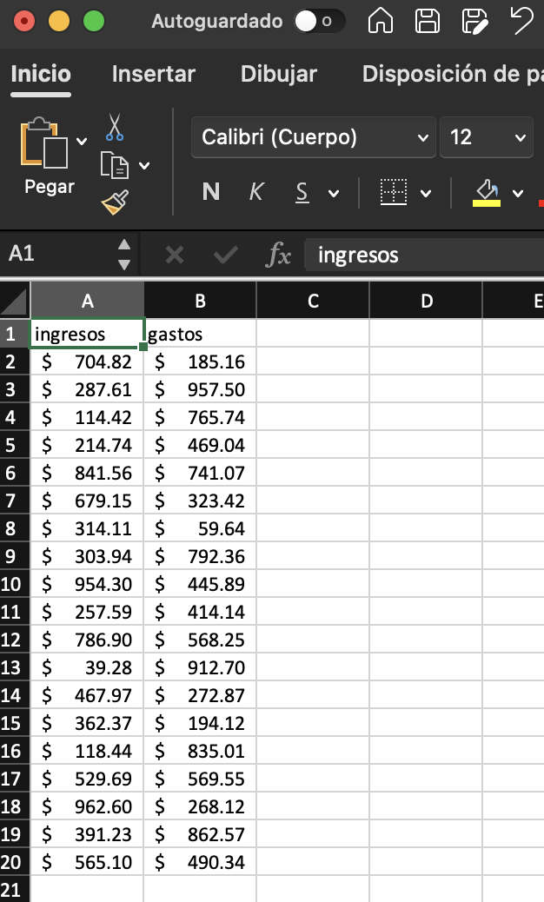{fig-align="center" width="200"}

Como puedes ver, los datos no tienen formato de tabla, ya que esto en realidad no es necesario, siendo que al momento de nosotros importarlos en R se van a leer de igual forma como un data frame. Es importante procurar que la hoja actual de nuestro libro de excel no cuente con otros datos o cálculos ajenos a la tabla en otras celdas, ya que estas pasarán a incluirse dentro del rango de lectura y al final tendremos una tabla en R con múltiples columnas sin nombre repletas de valores nulos. Ahora, para nosotros leer nuestro archivo, tenemos varias opciones, siendo las dos principales las librerías `openxlsx` y `readxl`, pero por ahora utilizaremos la segunda opción ya que es una librería que tiende a leer archivos de manera más rápida. En este punto te recomiendo crear un proyecto en RStudio y alojar tus archivos en una subcarpeta destinada únicamente a los datos a utilizar de nuestro ejecicio. En este caso supongamos que nuestro archivo se llama *ejercicio* y la subcarpeta dentro del proyecto se llama *data*, en tal caso la ruta para leerlo será la siguiente: `"data/ejercicio.xlsx"`. Utilizando la función `read_excel()` de `readxl` el código para leer los datos será el siguiente:

```{r, eval=FALSE}
datos <- readxl::read_excel("data/ejercicio.xlsx")
```

El código meramente nos devolverá un objeto de tipo data frame, por lo que para trabajarlo más adelante será necesario crear un objeto que aloje esta información. Supongamos que nuestros datos presentan valores nulos en ciertas columnas, podríamos omitirlos reemplazarlos directamente encadenando funciones, tal que:

```{r, eval=FALSE}
datos <- readxl::read_excel("data/ejercicio.xlsx") |> 
  na.omit()
```

O bien, utilizando la función `replace_na()` del paquete `tidyr`:

```{r, eval=FALSE}
datos <- readxl::read_excel("data/ejercicio.xlsx") |> 
  tidyr::replace_na(list(ingresos = 0, gastos = 0))
```

Nota que el hacer una subcarpeta es útil únicamente cuando creamos un proyecto, pero de no ser el caso podemos establecer un directorio de trabajo. Para obtener la ruta actual en la que se encuentra nuestro script podemos utilizar la función `getwd()`, y para establecer una ruta de trabajo utilizaríamos `setwd()`, por lo que para establecer la ruta actual como el directorio por defecto, simplemente utilizamos el código `setwd(getwd())`.

Ahora, cada tipo de columna se leerá con un formato distinto de manera automática, dependiendo de los datos introducidos en el archivo excel, pero nosotros podemos asignar de manera manual los tipos de columnas que se nos van a devolver. Por default, los tipos permitidos son los siguientes:

-   `logical` para valores booleanos.
-   `numeric` para transformar automáticamente las columnas a números.
-   `date` para columnas de fechas.
-   `text` para cadenas de caracteres.
-   `list` para devolver una columna con formato de lista.

Podemos establecer un solo formato para que el data frame se nos devuelva enteramente con ese mismo tipo de datos, ya que se reciclaría para cada columna, o establecer un formato específico para cada columna dentro de un vector, tal que:

```{r, eval=FALSE}
datos <- readxl::read_excel("data/ejercicio.xlsx", 
                            col_types = c("numeric", "text")) |> 
  tidyr::replace_na(list(ingresos = 0, gastos = "0"))
```

Si intentamos lo segundo, estableciendo el formato exacto para cada columna, debemos tener presente la longitud del vector debe ser la misma que el número de columnas, o de lo contrario nos devolverá un error, lo que puede ocurrirnos en situaciones en las que vamos añadiendo columnas al archivo original constantemente.

En general, todos estos formatos ya los conoces, pero quiero hacer incapié en las columnas de formato `date`. Es común toparnos con errores cuando queremos leer fechas, y esto es porque al escribirlas dentro de archivos excel lo hacemos con un formato incorrecto. Los formatos comunmente aceptados en R son los siguientes:

| Tipo de fecha               | Formato en R        | Ejemplo                                               |
|-------------------|------------------|-----------------------------------|
| Fecha estandar "yyyy-mm-dd" | `%Y-%m-%d`          | `as.Date("2023-01-01")`                               |
| Fecha corta "dd/mm/yyyy"    | `%d/%m/%Y`          | `as.Date("01/01/2023", "%d/%m/%Y")`                   |
| Fecha con hora              | `%Y-%m-%d %H:%M:%S` | `as.Date("2023-05-22 12:34:56", "%Y-%m-%d %H:%M:%S")` |

: Formatos de fechas en excel, para exportar a R.

El tratamiento de fechas de excel a R y viceversa puede ser algo dificil de entender durante este primer acercamiento, por lo que puedes optar por separar las fechas desde el archivo de origen en tres columnas: día, mes y año, para posteriormente convertirlas con código, por ejemplo: Supongamos una tabla que contiene tres columnas "day", "month" y "year", podemos generar una columna de fecha utilizando la función `make_date()` de la librería `lubridate` (la cuál veremos con sumo detalle en capítulos posteriores) y la función `mutate()` de `dplyr`, tal que:

```{r}
# Tabla
library(dplyr)
tabla <- tibble(year = 2022,month = 12,day = 15)

# Columna con formato de fecha
tabla |> 
  mutate(fecha = lubridate::make_date(year, month, day))
```

Este primer acercamiento a las fechas en R a partir de un archivo excel es una mera recomendación, por lo que no voy a profundizar en este tema. Más adelante, cuando comencemos con análisis exploratorio de datos veremos todo lo relacionado a fechas, formatos y cálculos de intervalos de tiempo.

### Archivos CSV

Este tipo de archivos son, simplemente, un documento que contiene un cierto número de observaciones (filas y columnas) únicamente separadas por comas, tal como su nombre lo indica: *"Comma-Separated Values"*. A diferencia de los archivos excel, estos son mucho más simples, teniendo únicamente las observaciones, siendo que no se pueden añadir fórmulas, gráficos ni otras características insignia de una hoja de cálculo tradicional. Lógicamente, un archivo csv tenderá a ser más ligero en tamaño y tiene una mayor capacidad de almacenaje de datos que un archivo excel, lo que lo vuelve mucho más útil cuando queremos exportar conjuntos de datos mucho más grandes.

De forma nativa podemos leer estos archivos con la función `read.csv()` o `read.csv2()` para archivos separados por punto y coma en lugar de solo una coma. Más allá de las funciones nativas de R, podemos utilizar sus equivalentes de la librería `readr`: `read_csv()` y `read_csv2()`, las cuales son considerablemente más eficientes al momento de leer un archivo de este estilo. La lógica para leer archivos es la misma: Supongamos que tenemos un documento de este estilo guardado en nuestro proyecto, llamado *prueba.csv*, simplemente debemos leerlo y guardarlo como un objeto, por ejemplo:

```{r, eval=FALSE}
datos <- readr::read_csv("data/prueba.csv")
```

Estas funciones son las más comunes y con las que más vamos a trabajar al leer archivos de este estilo, sin embargo, habrá ocasiones en las que nos encontremos con un archivo considerablemente grande, de más de un gigabyte de espacio, por lo que estas opciones dejan de ser las más eficientes en cuanto a tiempo de lectura. Para estas situaciones podemos utilizar la función `fread()` de la librería `data.table`, aunque nos retornará un objeto de tipo *data.table* que, a pesar de ser más eficiente en ciertas ocasiones puede ser incompatible con algunas funciones de transformación de datos. La mejor opción para estos casos es la función `vroom()` de la librería del mismo nombre, ya que es aún más rápida que `fread()` y nos devuelve un objeto de tipo *tibble*, el cual si es compatible con prácticamente cualquier transformación de datos. El código para llamar a ambas funciones es muy similar a los vistos anteriormente, teniendo lo siguiente:

```{r, eval=FALSE}
# Versión de Data.table
datos <- data.table::fread("data/prueba.csv")
# Versión de Vroom
datos <- vroom::vroom("data/prueba.csv")
```

En ciertas ocasiones nos encontraremos con algunas variantes de un archivo csv, como los documentos *tsv*, los cuales son muy parecidos en estructura a este último, con la diferencia de que los valores se separan mediante espacios o *tabs*. Para archivos *tsv* podemos utilizar la función `read.delim()` o su equivalente de `readr`, `read_delim()`, por ejemplo, supongamos el [siguiente archivo de muestra alojado en github](https://gist.github.com/cdroulers/1a919d7f9ce701a716b0), para leerlo podemos hacer lo siguiente:

```{r, message=FALSE, warning=FALSE}
portal <- "https://gist.githubusercontent.com/cdroulers/1a919d7f9ce701a716b0"
url_id <- "/raw/77dbd5e7e3db7017ae64e3f420e53f7e8b90aca1/Sample.tsv"
readr::read_delim(paste0(portal, url_id))
```

Notese que en este caso no fue un archivo local. Los archivos csv y tsv alojados en internet, ya sean repositorios o blogs, pueden ser leídos directamente utilizando el link del portal donde se encuentren alojados. Ten en cuenta que la lectura de archivos alojados en servidores web será un poco más lenta, lo que puede disminuir el rendimiento de tu flujo de trabajo.

### Archivos TXT

Así como los archivos *csv*, los archivos *txt* son una forma simple y sin formato de almacenar información, lo que los hace altamente eficientes en cuanto a su lectura. A pesar de lo anterior, los archivos csv necesariamente tienen un delimitador (",", ";", "tab"), mientras que un archivo *txt* es aún más simple, estos no requieren de un delimitador específico lo que los hace más flexibles en cuanto a almacenaje, pero también puede dificultar su correcta lectura en R, ya que debemos tener presente la forma específica en la que cada archivo separa sus observaciones. En ciertas ocasiones nos encontraemos con datos no estructurados, como un archivo *txt* que simplemente tiene cadenas de texto, ya sean párrafos, listas, etc, por lo que extraer información relevante puede convertirse en todo un reto, el cuál analizaremos más adelante con datos no estructurados, ahora solo nos centraremos en archivos de texto que tengan un delimitador y una estructura clara.

Usemos el [siguiente archivo de ejemplo](https://raw.githubusercontent.com/itsfoss/text-files/master/agatha_complete.txt) alojado en github llamado *agatha_complete.txt*, documento que tiene registro de algunos libros junto con su año de publicación. Si nosotros entramos desde el navegador para ver el documento podremos notar que cada observación es, básicamente, el nombre del libro y su año de publicación separados por un guión, además de que el archivo no tiene títulos. Podemos leerlo de la siguiente manera, considerando como delimitador el guión:

```{r, eval=FALSE}
url <- "https://raw.githubusercontent.com/itsfoss/text-files/master/"
filename <- "agatha_complete.txt"
read.table(paste0(url, filename), sep = "–")

## Error in scan(file, what = "", sep = sep, quote = quote, 
## nlines = 1, quiet = TRUE, :
## invalid 'sep' value: must be one byte
```

Como puedes notar, en este ejemplo nos encontramos con un problema, ya que el separador no es reconocido como tal al ser de más de un byte, lo que nos genera un error al respecto. En estas situaciones podemos hacer uso de una función para archivos *csv* y establecer el delimitador específico, tal que:

```{r}
url <- "https://raw.githubusercontent.com/itsfoss/text-files/master/"
filename <- "agatha_complete.txt"
libros <- vroom::vroom(paste0(url, filename), delim = "–", col_names = FALSE)
head(libros,3)
```

Al ser un archivo sin nombres de columnas podemos especificarlas manualmente, por ejemplo:

```{r}
colnames(libros) <- c("Libro", "Año")
head(libros,3)
```

### Archivos RDS

Este tipo de archivos (*R Data Serialization*) son especialmente interesantes de analizar, ya que no son específicos para el guardado de tablas o *data frames*. La idea de estos archivos es simple: exportar los objetos guardados en la sesión de R convirtiendolos en secuencias de bytes y guardándolos en el disco de tu equipo, lo que hará que se puedan utilizar con una mayor versatilidad en futuros proyectos no relacionados entre si, o bien en el mismo proyecto en el que se guardó la información. Supongamos una sesión en la que queremos guardar estadística descriptiva que hemos calculado, algunos vectores y una tabla que tenemos cargada en nuestra sesión actual. Utilizar un archivo *csv*, *tsv* o *txt* sería complicado al tener diferentes tipos de objetos. Intentar realizar la tarea en excel puede ser algo más sencillo al poder almacenar la información en diferentes hojas o rangos, pero al ser un archivo con mayor formato el peso de este puede incrementar rápidamente, lo que haría que no sea muy escalable en un contexto en el que se añadan más objetos poco a poco. En estas situaciones lo más conveniente es crear un archivo RDS que únicamente guardará esta información serializándola (convirtiéndola en bytes) optimizando el espacio de manera más eficiente. Para realizar este proceso podemos hacer lo siguiente:

```{r, eval=FALSE}
objetos <- list(estadisticos = mtcars[1] |> 
                  summary(),data = head(mtcars,3))
# Guardamos los datos
saveRDS(objetos, file = "objeto.rds")
```

Ahora, si leemos ese archivo nos devolverá la lista guardada, tal que:

```{r, eval=FALSE}
readRDS("objeto.rds")
```

```{r, echo=FALSE}
list(estadisticos = mtcars[1] |> 
                  summary(),data = head(mtcars,3))
```

## Datos alojados en la nube.

Anteriormente vimos un par de casos de datos que estaban alojados en internet, como archivos *csv* guardados en repositorios de github, sin embargo, estos archivos son de cierta forma estáticos, es necesario subirlos de nuevo para poder actualizar la información, lo que puede hacer que su actualización constante en un entorno laboral tenga poca eficiencia. Pensemos en, por ejemplo, un registro de ventas que se actualiza cada 2 a 5 minutos, ¿te imaginas tener que subir un archivo nuevo a github cada 5 minutos? sería una tarea casi imposible, por lo que tener alojados nuestros registros en la nube de forma que se actualicen en tiempo real es nuestra opción más óptima. Para lograr nuestro objetivo tenemos varias opciones a la mano: Google Sheets, MongoDB, SQL en entornos en la nube como Azure o AWS, etc. A pesar de tener más opciones a la mano, me voy a centrar en las mencionadas anteriormente, ya que son las que más usarás en tu vida profesional, especialmente bases de datos en MySQL y SQL Server.

### Datos de Google Sheets

Las hojas de cálculo de Google Sheets son, en apariencia, muy similares a los archivos Excel, teniendo algunas diferencias en cuanto a las fórmulas que podemos aplicar, filtrado de datos, etc. Una ventaja notable en cuanto a estas hojas de cálculo es que pueden ser actualizadas en tiempo real de manera colaborativa, permitiendo el acceso a estos archivos a personas específicas u organizaciones, lo que permite mantener estos datos actualizados constantemente.

Veamos un ejemplo de uso de estos archivos, utilizando el [siguiente documento de ejemplo](https://docs.google.com/spreadsheets/d/1s9fVB9TcgzpMuBWx29ycwaiefelSm8zQi8ICdF0zphc/edit#gid=0). Para leer el archivo haremos uso de la librería `googlesheets4` y la función `read_sheet()`. La función en cuestión nos pide el *id* de la hoja de cálculo, el cuál lo podemos obtener sencillamente del link de la misma, simplemente tomando toda la cadena de caracteres subsecuente a `spreadsheets/d/` en la dirección del archivo, siendo en este caso `1s9fVB9TcgzpMuBWx29ycwaiefelSm8zQi8ICdF0zphc`, y leemos el archivo en cuestión, tal que:

```{r, eval=FALSE}
googlesheets4::read_sheet("1s9fVB9TcgzpMuBWx29ycwaiefelSm8zQi8ICdF0zphc")
```

```{r,echo=FALSE}
dplyr::tibble(Cliente = c("Office Depot","Amazon","Walmart","Facebook"),	Monto = c(100,150,100,90),Cantidad = c(5,3,3,9))
```

Generalmente la primera vez que leamos un archivo de google sheets nos va retornar un mensaje de confirmación de autenticación mediante un token, como el siguiente:

```{r}
# The googlesheets4 package is requesting access to your Google account.
# Select a pre-authorised account or enter '0' to obtain a new token.
# Press Esc/Ctrl + C to cancel.

# 1: tu_correo@ejemplo.com
```

A lo cual nosotros únicamente debemos escribir *"1"* en la consola y dar *enter* para proceder a leer el documento.

La autenticación de tu cuenta en este caso es algo de lo que no debemos preocuparnos, ya que estamos en una sesión interactiva en la que podemos interactuar con la consola de manera directa, caso contrario a sesiones que son ejecutadas en la nube, principalmente en servidores para la ejecución de aplicaciones web (que discutiremos más adelante) como [shinyapps](https://www.shinyapps.io). Cuando utilicemos sesiones no interactivas, en las que no podamos interactuar con la consola, podemos generar un archivo `.secret` que nos permitirá evitar solicitudes de autenticación a futuro. Para generar este archivo haremos uso de las librerías `gargle` y `googledrive`. Simplemente vamos a establecer un archivo que alojará la información de la autenticación, para después usar ese método directamente mediante un token alojado dentro del proyecto, es decir:

```{r, eval=FALSE}
library(gargle)
library(googledrive)

options(gargle_oauth_cache = ".secrets")
drive_auth(cache = ".secrets", email = "tu_mail@gmial.com") 
googlesheets4::gs4_auth(token = googledrive::drive_token())
```

Ejecutamos esos códigos y la primera vez nos redireccionará a nuestro navegador, mostrándonos una ventana como la siguiente:

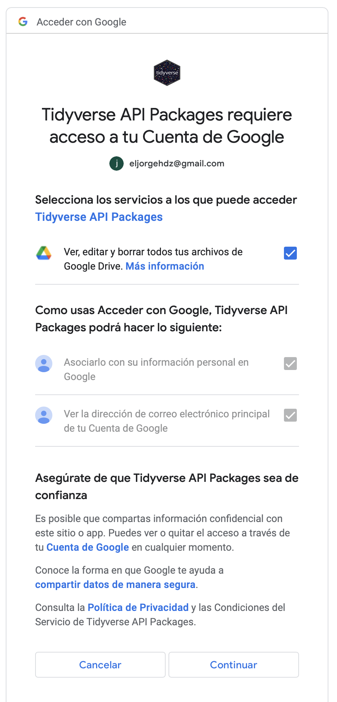{fig-align="center" width="150"}

Procura tener seleccionada la casilla de la opción *"ver, editar y borrar todos tus archivos de Google Drive"*, una vez hecho esto damos click en **Continuar** y hemos terminado la autenticación. A partir de ahora podremos ejecutar códigos en sesiones no interactivas sin tener que preocuparnos por lo que ocurre en la consola.

#### Tipos de valores retornables

Al igual que con `readxl`, la librería `googlesheets4` nos permite establecer directamente el tipo de dato por columna mediante el argumento `col_types` de la función `read_sheet()`, lo que es especialmente útil ya que en ciertas ocasiones se nos devolverán algunas columnas como listas por defecto con las cuales no se puede trabajar directamente con transformaciones comunes de datos. En este caso, los formatos disponibles a establecer para cada columna son los siguientes:

-   `l` para valores booleanos.
-   `i` para números enteros.
-   `d` o `n` para double o numérico.
-   `D` para fecha.
-   `t` para hora del día.
-   `T` para fecha con formato que incluye tiempo (*datetime*).
-   `c` para cadena de caracter.

Al establecer el formato de las columnas debemos tener cuidado de estar seguros del número de ellas, ya que al igual que en `readxl` podemos cometer el error de no considerarlas a todas en el vector que incluirá este formato, lo que nos devolvería un error al tratar de leer la hoja de cálculo.

## Bases de datos: MySQL, SQL Server, etc.

De manera estricta, tanto excel como google sheets pueden denominarse como una base de datos, ya que pueden ser utilizados para almacenar y gestionar información de manera sistemática y ordenada,incluso un cuaderno con notas estructuradas podría entrar en esta categoría, pero en esta sección nos enfocaremos únicamente en los *gestores de bases datos* diseñados específicamente para ello, ya que tienen una forma distinta en la que podemos obtener la información que necesitamos.

Las hojas de cálculo son geniales, en eso todos estamos de acuerdo cuando comenzamos a analizar pequeños sets de datos, pero son muy poco eficientes cuando queremos llevar el análisis al siguiente nivel, teniendo más de cien o doscientas mil observaciones para una tabla. Cuando tenemos demasiada información y, además, esta se está actualizando constantemente, necesariamente debemos recurrir a lenguajes enfocados a bases de datos, como es el caso de SQL, el cual es capaz de manejar y almacenar información a gran escala. En esta sección vamos a analizar los principales gestores de bases de datos que podemos utilizar para obtener datos en tiempo real, así como algunos ejemplos de uso y formas para configurar estos gestores en la nube. Es importante conocer estas bases de datos del lado de un script en R, pero también es crucial saber cómo se configuran en entornos en la nube, lo que nos permitirá entender de mejor manera como funcionan, pero vamos por partes, antes de comenzar a configurar entornos en AWS o Azure vamos a ver un poco del lenguaje, así como formas de integrarlo en R.

Considera que este libro tiene como eje central el lenguaje R, por lo que los códigos que analicemos en SQL serán consultas básicas/intermedias (al menos por ahora).

### Consultando datos en SQL

En esta sección analizaremos algunas consultas y su integración a un script en R. Se que ya estas ansioso por saber cómo integrar bases de datos con tus códigos, pero comencemos con algo esencial: Conectarnos a la base. Usualmente, cuando entras como analista de datos en una compañía, la empresa te proporcionará un usuario y contraseña para acceder al servidor en cuestión, además de otros parámetros como el *host*[^7], el *port*[^8] y el nombre de la base de datos. Estos parámetros serán los que utilizaremos para conectarnos a la base de datos utilizando un *software de administración de bases datos*[^9] como Workbench, DBeaver, DbVisualizer, etc (recomendación personal: **Azure Data Studio** para guardar scripts de consultas y **phpMyAdmin** para realizar cambios en tiempo real) o, en este caso específico, mediante una conexión directa con la librería `DBI` en nuestro script de R. La conexión a nuestra base de datos en realidad es muy sencilla, simplemente debemos establecer los parámetros anteriormente nombrados en la función `dbConnect`, tal que:

[^7]: Servidor donde se almacenan las bases de datos (una computadora conectada a la red de manera constante). Vease AWS, Azure, GCP, IBM Cloud, etc. Este servidor puede ser local si estamos trabajando con bases de datos creadas en nuestra propia computadora. Para servidores locales la dirección suele ser **127.0.0.1**.

[^8]: Número de puerto utilizado para identificar un proceso específico en la red. En la mayoría de los casos el port suele ser *3306*.

[^9]: CURP: Clave Única de Registro de Población (en México).

```{r, eval=FALSE}
# Parámetros
driver <- RMySQL::MySQL()
base_nombre <- "nombre_de_la_base_de_datos"
servidor <- "direccion_del_servidor.com"
port <- 3306
usuario <- "tu_usuario"
contraseña <- "tu_contraseña"

# Conexión
conexion <- DBI::dbConnect(driver, 
                           dbname = base_nombre, 
                           host = servidor, 
                           port = port, 
                           user = usuario, 
                           password = contraseña)
```

Notese que también utilizamos un parámetro `driver` o controlador. Para que se pueda interpretar el lenguaje SQL en nuestra conexión debemos utilizar un controlador del gestor de bases de datos que estaremos usando, como MySQL, SQLite, MySQL, etc. En este caso tenemos disponible la librería `RMySQL` con la que podemos generar un controlador de forma sencilla, sin embargo, en un caso en el que nos conectemos a, por ejemplo, SQL Server, previamente tendremos que instalar un controlador mediante la terminal de tu ordenador (véase el [siguiente link](https://learn.microsoft.com/en-us/sql/connect/odbc/linux-mac/installing-the-microsoft-odbc-driver-for-sql-server?view=sql-server-ver16&tabs=alpine18-install%2Calpine17-install%2Cdebian8-install%2Credhat7-13-install%2Crhel7-offline)) para después establecer el controlador de la siguiente manera:

```{r, eval=FALSE}
# Conexión a SQL Server
driver <- "SQL Server"
base_nombre <- "nombre_de_la_base_de_datos"
servidor <- "direccion_del_servidor.com"
port <- 3306
usuario <- "tu_usuario"
contraseña <- "tu_contraseña"

# Conexión
conexion <- DBI::dbConnect(odbc::odbc(),driver, 
                           dbname = base_nombre, 
                           host = servidor, 
                           port = port, 
                           user = usuario, 
                           password = contraseña)
```

Donde la función `odbc::odbc()` funcionará como un puente entre el controlador de SQL Server y la conexión en R.

Ahora, la conexión se encuentra activa pero necesita ser llamada directamente para hacer una consulta, razón por la que la guardamos como un objeto llamado `conexion`. Supongamos que el dataset de muestra `mtcars` se encuentra dentro de la base de datos como una tabla, si quisieramos ver dicha tabla simplemente utilizaríamos la consulta `SELECT * FROM mtcars` dentro de la función `DBI::dbGetQuery()`, tal que:

```{r, eval=FALSE}
DBI::dbGetQuery(conexion, "SELECT * FROM mtcars")
```

```{r, echo=FALSE}
mtcars |> 
  head(5) |> 
  tibble::rownames_to_column("model")
```

Lo que nos devolverá la tabla en un formato de data frame. Básicamente solo debemos usar la conexión activa que tenemos y nuestra consulta en forma de cadena de caracteres. Obviamente la escalabilidad en cuanto al nivel de datos que podemos manejar es mucho mayor que un archivo plano, pero otra ventaja notable es la posibilidad de hacer arreglos de datos e incluso introducir filtros desde el momento de la lectura, lo que nos permite simplificar la limpieza posterior de los datos, por ejemplo: Supongamos que de la tabla `mtcars` únicamente queremos valores de `cyl` mayores a 6, o valores de `hp` mayores a 100, si estuviesemos usando un archivo estilo CSV o Excel necesitaríamos previamente cargar toda la sesión de R para después hacer el filtro mediante indexación (o utilizando la librería `dplyr` para manejo de datos, la cual discutiremos en el siguiente capítulo), lo que consumirá más memoria ram y, en conjuntos más grandes de datos, puede provocar mayor lentitud en el proceso que estemos trabajando. Utilizando una consulta de SQL el proceso se hace mucho más ágil, ya que directamente aplicaríamos el filtro en la cadena de caracteres, veamos un comparativo entre ambos métodos:

```{r, eval=FALSE}
# Lectura y filtrado de datos a partir de archivos estáticos
mtcars <- read.csv("mtcars.csv")
mtcars <- mtcars[mtcars$cyl > 6 | mtcars$hp > 100,]

# Lectura y filtrado de datos mediante una consulta a base de datos
mtcars <- DBI::dbGetQuery(conexion, "SELECT * FROM mtcars
                                     WHERE cyl > 6 or hp > 100")
```

Como puedes observar, en el segundo método nos saltamos un paso, lo que lo vuelve más sencillo y, de hecho, podemos dinamizarlo aún más, convirtiendo los parámetros filtrados en una función, es decir:

```{r, eval=FALSE}
mtcars_db <- function(cyl, hp){
  tabla <- DBI::dbGetQuery(conexion,paste0( "SELECT * FROM mtcars
                                             WHERE cyl > ",cyl," or hp > ",hp))
  
  return(tabla)
}

mtcars_db(cyl = 10, hp = 220)
```

```{r, echo=FALSE}
mtcars[mtcars$cyl >10 | mtcars$hp > 220,] |> 
  tibble::rownames_to_column("model")
```

En este ejemplo no es tan obvio, pero en un ambiente de producción de una empresa los datos se actualizarán todos los días, a veces incluso a todas horas y mínutos, por lo que el poder acceder a esa información de forma actualizada sin tener que estar escribiendo archivos CSV, Excel, etc, agilizará de manera considerable el trabajo posterior que realicemos. En capítulos posteriores analizaremos la integración de bases de datos con dashboards/aplicaciones web, así como sus ventajas y desventajas en ambientes con grandes volúmenes de datos.

## Extracción de datos no estructurados.

La extracción de datos hasta ahora era un tema muy sencillo, ya que nuestra única tarea fue simplemente utilizar una función común para leer una tabla ya estructurada de un archivo simple, pero ¿y si no fuera el caso? En diversas ocasiones nos vamos a encontrar con archivos que tendrán información en bruto, como pdf's con facturas, archivos de texto sin un órden claro en la información, e incluso datos provenientes de páginas web (Amazon, Facebook, Twitter, Youtube, etc), de los cuales tendremos que extraer la información identificando específicamente lo que necesitamos de cada documento, encontrando patrones y generando como resultado final la tabla a utilizar con los datos estructurados.

Como puedes darte cuenta, los datos no estructurados son prácticamente información que se encuentra dispersa en algún sitio o archivo (o múltiples archivos), por lo que para su correcta extracción haremos uso de dos conceptos: *Web Scrapping* y *expresiones regulares*, ambos para obtener y ordenar información de manera sistemática, tal que sea útil para poder trabajarla más adelante.

### Expresiones regulares para extraer datos. {#sec-regex}

Las expresiones regulares no son más que secuencias de caracteres utilizadas para buscar patrones dentro de documentos, correos, cadenas de caracteres, etc. Una expresión regular está compuesta tanto por caracteres literales como por metacaracteres, que son caracteres con un significado especial dentro de la expresión regular. Estos metacaracteres permiten especificar reglas y condiciones para buscar patrones específicos en el texto. Un caracter literal no es más que una secuencia de letras o números que se van a buscar específicamente dentro del documento o expresión a analizar, sin embargo, en ciertas ocasiones no sabremos con exactitud que elemento estamos buscando, pero si su estructura general, por lo que nos apoyaremos de los metacaracteres para esto, ya que con ellos podremos especificar una regla o patrón más ambiguo con el que extraeremos los datos necesarios.

Este es indudablemente uno de los temas más complicados de todo el libro, por lo que se procurará dar énfasis en los ejemplos de uso para su mejor entendimiento, además de que se retomará este tema más adelante, mezclando expresiones regulares con métodos de automatización de tareas.

Encontrar patrones mediante expresiones regulares se basa en tres operaciones básicas: Unión, intersección, concatenación y cerradura de Kleene, funcionando de la misma manera que en la teoría de conjuntos, la cual veremos con mayor detalle cuando trabajemos con uniones de tablas en capítulos posteriores. Veamos cada concepto a nivel general:

-   Unión: Este operador es utilizado de tal manera que, combinando ciertas expresiones regulares, el resultado coincidirá con alguna (o varias) de ellas, por ejemplo, si tienes las expresiones regulares *"A"* y *"B"*, la expresión regular *"A\|B"* coincidirá con cualquier cadena que contenga *"A"* o *"B"*. Utilizando la función grepl() de R podemos hacer uso de este operador para buscar el caracter "A" o "B" en la cadena *"ACD"*, tal que:

    ```{r}
    grepl(pattern = "A|B", "ACD")
    ```

    En este caso si se encontró una coincidencia de al menos , por lo que se nos devuelve TRUE como resultado, si este no fuera el caso se nos devolvería un `FALSE`, por ejemplo:

    ```{r}
    grepl(pattern = "A|B", "GCD")
    ```

-   Concatenación: Este operador es, básicamente, una forma de encontrar patrones en una cierta secuencia que se debe seguir de manera específica, por ejemplo, si tienes las expresiones regulares *"A"* y *"B"*, la expresión regular *"AB"* coincidirá con cualquier cadena que tenga *"A"* seguido inmediatamente de *"B"*, como con la cadena *"ABC"* pero no con la cadena *"ACB"*. Trasladando este ejemplo a R, encontraremos lo siguiente:

    ```{r}
    # Patrón en órden incorrecto
    grepl(pattern = "AB", "ACD")

    # Patrón en órden correcto
    grepl(pattern = "AB", "ABC")
    ```

    Como puedes ver, si el patrón no se sigue exactamente en la cadena a buscar entonces se nos devolverá un `FALSE.`

-   Cerradura de Kleene: Este operador se utiliza para indicar que la expresión regular anterior puede aparecer cero o más veces (aunque solo aplicará con cero coincidencias en situaciones muy particulares), por ejemplo, si tenemos la expresión regular *"A"*, coincidiría con cualquier cadena que contenga cero o más repeticiones de la letra *"A"*. Supongamos que queremos saber si una cadena comienza con la letra *x*, repitiéndose cero o más veces y termina con *y*, en tal caso podemos usar una cerradura de Kleene mediante el símbolo "\*", tal que:

    ```{r}
    grepl(pattern = "x*y", "xxxxxy")
    ```

    En este caso si se cumple esa condición, pero si la cadena terminara con cualquier otro caracter entonces se nos devolvería un `FALSE`, por ejemplo:

    ```{r}
    grepl(pattern = "x*y", "xxxxxc")
    ```

Además, podemos incluir otros operadores más generales, por ejemplo:

-   `&` Para hacer búsquedas con más de una condición (todas deben cumplirse).
-   `!` Para hacer búsquedas inversas (todo aquello que no se encuentre en la cadena especificada).
-   `%in%` Para hacer búsquedas con más de un objeto (o patrón).
-   `==` Para hacer búsquedas exactas.

Estos últimos operadores funcionan para complementar una búsqueda o extracción de patrones.

Las operaciones usadas anteriormente son solamente una vista general de la estructura de una expresión regular. A continuación vamos a ver de manera detallada cada tipo de elemento que podemos utilizar por cada tipo de operación, es decir, los elementos que podemos usar (y su funcionamiento) para cuantificar, agrupar y alternar caracteres en la búsqueda de patrones.

#### Búsqueda (omisión) de caractéres

Cuando queremos buscar un caracter en específico, independientemente de que este sea númerico, alfanumérico, caracter especial, espacio, etc, vamos a utilizar un doble signo de diagonal invertido `\\` para representar una expresión de búsqueda de este elemento. El uso del signo `\` tiene como objetivo que el caracter subsecuente tenga un significado específico (o deje de tenerlo), teniendo los siguientes caracteres utilizables para encontrar elementos de manera directa:

-   `\\d` Para encontrar dígitos del 0 a 9 dentro de las cadenas de caracteres.
-   `\\w` Para encontrar caracteres alfanuméricos.
-   `\\s` Para encontrar espacios en blanco.

De manera inversa también tenemos:

-   `\\D` Para encontrar elementos diferentes a dígitos del 0 a 9 dentro de las cadenas de caracteres.
-   `\\W` Para encontrar caracteres diferentes a alfanuméricos.
-   `\\S` Para encontrar elementos diferentes a espacios en blanco.

Para encontrar posiciones específicas en las cadenas tenemos:

-   `\\A` Para coincidir el inicio de una cadena.
-   `\\Z` Para coincidir el final de una cadena.
-   `\\b` Para marcar la posición una palabra dentro de la cadena, delimitada por espacios o puntos.
-   `\\B` Para marcar la posición una palabra entre dos caracteres (números o alfanuméricos).

Otros caracteres comunes para buscar patrones son:

-   `\\t` Para buscar espacios tabulados (espacios creados con TAB).
-   `\\n` Para buscar el punto donde inicia una nueva línea de texto.
-   `\\f` Para buscar saltos de página.
-   `\\v` Para buscar espacios tabulados de forma vertical.

De forma más general podemos buscar patrones mediante las siguientes sentencias:

-   `[:digit:]` Para retornar todos los valores numéricos.
-   `[:alpha:]` Para retornar todos los valores no numéricos.
-   `[:lower:]` Para retornar letras minúsculas.
-   `[:upper:]` Para retornar letras mayúsculas.
-   `[:alnum:]` Para retornar valores numéricos y no numéricos.
-   `[:punct:]` Para retornar puntos, comas, llaves, signos de interrogación y admiración.
-   `[:graph:]` Para retornar cualquier elemento diferente a un espacio vacío.
-   `[:space:]` Para retornar todos los espacios en blanco que existan en una cadena.\
-   `[:blank:]` Para retornar todos los espacios en blanco que existan en una cadena. A diferencia de `[:space:]`, si existe un espacio al final de la misma no se tomará en cuenta.
-   `.` Para retornar todos los elementos de una cadena, sean del tipo que sean (excepto una nueva línea de texto).

#### Algunos casos de uso.

Es innegable que las reglas de búsqueda de las expresiones regulares son a simple vista poco amigables, en realidad no se espera que alguien las conozca todas de memoria, lo que si se necesita es saber cómo combinarlas en ciertas situaciones para extraer patrones más o menos específicos, situación que vamos a explorar en esta sección, con ejemplos que irán de lo simple a lo más complejo, con el objetivo de que tú como usuario comprendas la lógica detrás y puedas combinar estas reglas a tu antojo sin mayores complicaciones.

Pensemos en una situación sencilla: Tenemos un vector que cuenta con múltiples elementos, por ejemplo:

```{r}
vector_cadenas <- c(sample(1:20, 10), 
                    sample(letters, 10), 
                    paste0(tolower(randomNames::randomNames(10, 
                           which.names = "first")), 
                           sample(c("@ejemplo.com", "@mail.com", 
                                    "@test.com"),10, replace = T)))
```

Como puedes observar, tenemos un vector que contiene números (marcados como cadenas de caracteres debido al resto de elementos), letras y algunos mails que acabamos de inventar. Si nosotros quisieramos obtener únicamente los valores numéricos de este vector, podemos hacer uso de `[:digit:]` utilizando la función `str_extract` de la librería `stringr`, tal que:

```{r}
stringr::str_extract(vector_cadenas, "[:digit:]")
```

Y, como puedes observar, la función nos devuelve únicamente los valores numéricos. A pesar de que este método funciona, en realidad pudimos haber hecho algo mucho más simple como simplemente aplicar una función `as.numeric()` al vector en cuestión, lo que nos descartaría en automático las cadenas de caracteres consecuentes a los números, por lo que el uso de una expresión regular no resulta muy útil en este caso, pero ¿y si tratamos de buscar algo mucho más específico como un correo electrónico? El vector que estamos usando de ejemplo contiene números y letras, si intentamos descartar los carácteres numéricos aún tendremos a las letras individuales, entonces ¿cómo identificamos únicamente a las direcciones de correo electrónico? Primero debemos identificar aquellos patrones que se repiten en todos los casos, los cuales pueden ser los siguientes:

1.  Todos los correos cuentan con un signo \*@*
2.  Todos los correos terminan con *.com*
3.  Todos los correos tienen una cadena de texto antes del signo \*@*

Dados los patrones previamente mensionados, podemos establecer una expresión regular para cada uno de los patrones, para finalmente unir las condiciones en una sola sentencia:

1.  Para identificar la primer y última condición podemos hacer uso de la expresión `.*@.*` donde el signo `.` indica la presencia de cualquier elemento, el signo `*` nos indica que los elementos cualquiera pueden repetirse *n* veces como lo vimos al principio de esta sección, y el signo `@` es el símbolo a buscar.

2.  Para identificar la segunda condición podemos utilizar la expresión `.*.com$`, la cual nos dice que puede haber cualquier elemento (o elementos) antes de la cadena *.com*, además de que la cadena debe terminar justo en este punto, por lo que agregamos el signo `$` para terminar la expresión.

Ahora, directamente no podemos mezclar las condiciones, ya que por separado nos indican diferentes cosas, siendo que la primer condición presupone que después del signo `@` puede haber cualquier elemento, mientras que la segunda condición presupone que la cadena debe terminar con `.com`. Para poder crear una expresión regular compatible con ambas condiciones es necesario identificar los patrones de izquierda a derecha, tal que:

$$
cadena + @ + cadena + .com 
$$

Por lo tanto, podemos establecer la siguiente expresión: `^.+@.+\\.com$`, donde `^` da inicio a la cadena, `.` establece cualquier cadena, se presupone un signo `@` en medio de ambas cadenas aleatorias y, finalmente, se termina con `.com` (donde establecemos los guiones previamente para que no se confunda el punto de `.com` con la expresión para buscar cualquier otra cadena) y se concatenan las condiciones con el signo `+`, dando fin a la expresión con `$`. Probando dicha expresión obtendremos lo siguiente:

```{r}
stringr::str_extract(vector_cadenas, "^.+@.+\\.com$")
```

Es importante dejar en claro que el ejemplo anterior no va a ayudarnos en todos los casos, ya que existen direcciones de correo electrónico con otros patrones, terminaciones diferentes (`.net`, `.gov`, `.mx`, etc) y demás variaciones, sin embargo nos es útil para comenzar a adentrarnos en la generación de estos buscadores de patrones.

Entendiendo la estructura de la expresión por partes se vuelve mucho más sencillo el poder construir cada vez más y más complejas condiciones. Vamos a subir la apuesta con el siguiente ejemplo: Imagina que eres un capturista de documentos y necesitas llenar un archivo de excel con cientos y cientos de CURP's[^10] de personas que se están registrando en un programa, sin embargo, las personas además adjuntan información como nombre, edad, ocupación, etc, por lo que cada registro contiene mucha información que no nos es útil para el archivo excel final y, de hecho, entorpece el trabajo. En este caso podemos implementar una expresión regular para detectar el patrón que siguen los CURP, lo que nos permitirá eficientar el trabajo de horas de captura en unos pocos segundos. Para mayor claridad vamos a utilizar un CURP cualquiera como base para establecer la lógica, por ejemplo `MAAJ800101HDFLRR00`. Ahora, ¿Cómo se construye esta cadena de caractéres? Según la secretaría de relaciones exteriores, el CURP es una clave única que cuenta con 18 carácteres:

[^10]: CURP: Clave Única de Registro de Población (en México).

-   4 letras correspondientes al primer apellido, segundo apellido y primer nombre.
-   6 dígitos correspondientes al año, mes y día de nacimiento.
-   1 letra `H` o `M` para identificar si se trata de un hombre o una mujer.
-   2 letras para la entidad federativa de nacimiento.
-   3 consonantes internas correspondientes al primer apellido, segundo apellido y primer nombre.
-   2 dígitos correspondientes al siglo y un valor único.

El algorítmo anterior para crear un CURP puede ser simplificado aún más, ya que de nuestra parte no nos interesa el significado individual de cada letra o número, lo que nos importa es la cantidad de números, letras y otros carácteres tiene la cadena, así como su posición exacta, por lo que podemos resumirlo en las siguientes partes:

-   4 letras.
-   6 dígitos.
-   1 letra (HM).
-   5 letras.
-   2 dígitos.

Al encontrarse de forma inmediata la letra individual *H* o *M* podríamos unir la condición con las cinco letras subsecuentes, pero en este caso específico vamos a dejar separadas ambas condiciones ya que la primera puede servir como un verificador de que el CURP está escrito correctamente. Ahora, dado el resumen anterior, podemos establecer la expresión `^[A-Z]{4}[0-9]{6}[HM]{1}[A-Z]{5}[0-9]{2}$`, donde `^` inicia la cadena de texto, `[A-Z]{4}` nos indica que hay 4 letras de la A a la Z (mayúsculas), `[0-9]{6}` indica seis dígitos del 0 al 9, `[HM]{1}` indica una letra que puede ser H o M, `[A-Z]{5}` indica cinco letras de la A a la Z, `[0-9]{2}` indica dos dígitos del 0 al 9 y `$` da fin a la cadena. Si evaluamos esta expresión con la función `str_detect` de `stringr` entonces obtendremos lo siguiente:

```{r}
CURP <- "MAAJ800101HDFLRR00"
expresion_regular <- "^[A-Z]{4}[0-9]{6}[HM]{1}[A-Z]{5}[0-9]{2}$"
stringr::str_detect(CURP,expresion_regular)
```

Por lo que al encontrar dicho patrón nos devuelve un `TRUE`. A partir de ello podemos sacar provecho de este resultado y, por ejemplo, crear una función verificadora de CURP's, como la siguiente:

```{r}
# Función
funcion_curp <- function(CURP){
  regex <- "^[A-Z]{4}[0-9]{6}[HM]{1}[A-Z]{5}[0-9]{2}$"
  
  if (stringr::str_detect(CURP,regex) == FALSE){
    print(paste0("'",CURP,"' no es un CURP válido"))
  }else{
    print(paste0("'",CURP,"' ingresado correctamente"))
  }
}

# Evaluamos la función
funcion_curp(CURP = "ejemplo")
```

En capítulos posteriores discutiremos y pondremos en práctica el uso de expresiones regulares dentro de proyectos y aplicaciones web.

## Listas, sublistas y más listas: Archivos JSON.

Inevitablemente en algún momento de tu trayectoria como analísta o científico de datos te encontrarás con los famosos archivos JSON (JavaScript Object Notation), los cuales son una forma de almacenar datos de manera más eficiente que una tabla relacional (aunque esto no aplica en todos los casos). Consideremos el siguiente ejemplo de una estructura JSON:

```{r, eval=FALSE}
{
    "Nombre": "JSON str",
    "Descripcion": "Estructura JSON simple",
    "Tipo": "Objeto",
    "esMultiple": true,
    "Elementos": [
        {
            "PrimerElemento": "Ejemplo 1",
            "Tipo": "boolean",
            "esMultiple": true
        }
    ]
}
```

En primera instancia podemos notar que no es un formato precisamente amigable a la vista, como si lo es una simple tabla relacional que se basa en filas y columnas, entonces ¿por qué utilizar estos formatos de datos? En el ejemplo anterior puedes notar que existe una jerarquía definida, es decir, existen elementos principales y secundarios pertenecientes a una misma observación. Si nosotros transformáramos la estructura anterior a una tabla terminaríamos con ocho columnas y una fila, tal que:

```{r, echo=FALSE}
list(
  Nombre= "JSON str",
  Descripcion= "Estructura JSON simple",
  Tipo= "Objeto",
  esMultiple= "true",
  Elementos = list(
    list(
      PrimerElemento = "Ejemplo 1",
      Tipo = "boolean",
      esMultiple = TRUE
    )
  )) |> 
  unlist() 
```

Pero ¿qué pasa cuando tenemos más observaciones y estas no incluyen algún elemento que otras si? Por ejemplo, supongamos que una segunda observación no tiene la sublista "Elementos", en ese caso si los datos estuviesen estructurados en una tabla de dos dimensiones nos encontraríamos con un elemento `NA` en esos casos (o `NULL` si estamos dentro de una base SQL) el cuál en cierta medida sigue generando espacio de almacenamiento y, en escalas más amplias, puede reducir la velocidad de lectura de una tabla. En el caso de un archivo JSON esto no ocurre, ya que al tratarse de elementos separados entre si simplemente no se incluyen los elementos faltantes de la estructura, lo que permite una mayor eficiencia en la lectura y escritura de ellos.

Las estructuras de este estilo son sumamente útiles cuando trabajamos con elementos que pueden tener (o no) múltiples atributos, por ejemplo, los datos fiscales de una persona y su descripción, los productos de una tienda o los expedientes de ciertas empresas, sin embargo, el mismo formato de la estructura propicia que la extracción de la información para convertirla a otros formatos (procesos ETL) sea más complicada. En la siguiente sección analizaremos algunos métodos de extracción, un poco de lógica detrás de ello y alternativas a ciertos casos.

### Extrayendo información de archivos JSON

Existen múltiples formas de leer/extraer información en este formato, y la complejidad de esta tarea dependerá del formato que vayamos a requerir como resultado (un data frame, una lista, un vector, etc). Para esta sección utilizaremos el archivo `ejemplo-001.json` del repositorio de github del libro disponible en el siguiente enlace: *https://github.com/Jorge-hercas/r-para-inteligencia-de-negocios*.

Para una extracción simple en forma de lista (formato estandar del archivo) podemos hacer uso de la función `read_json()` de la librería `jsonlite`, por ejemplo:

```{r,eval=FALSE}
datos <- jsonlite::read_json("https://raw.githubusercontent.com
                             /Jorge-hercas/r-para-inteligencia-de-
                             negocios/main/JSON/ejemplo-0001.json")

datos
```

Con ello, los primeros elementos de la lista al visualizarlos tendrán un aspecto tal que:

```{r, eval=FALSE}
[[1]]
$id
[1] "62a24facc1b8820019fa6887"

$institucionDependencia
$institucionDependencia$nombre
[1] "Dirección de Justicia Cívica Municipal"


$servidorPublicoSancionado
$servidorPublicoSancionado$nombres
[1] "Sergio Arturo"

...
```

Por lo que para acceder a un valor en específico tenemos que hacer uso de indexación y llaves `$`, por ejemplo, para el valor *Sergio Arturo* necesitaríamos seguir la ruta específica:

```{r,eval=FALSE}
datos[[1]]$servidorPublicoSancionado$nombres
```

Individualmente la estructura nos es bastante útil, pero cuando queremos extraer información de manera más masiva para, por ejemplo, resumirla mediante cálculos estadísticos, es cuando necesitamos convertir la información a una tabla estilo `data.frame` o `tibble`. Para simplificar la lista devuelta podemos utilizar el argumento `simplifyVector = TRUE` de la función `read_json()` o utilizar la función `fromJSON()` de la misma librería en su lugar, en ambos casos nos devolverá el mismo formato simplificado. Aplicando alguno de los dos métodos al caso anterior la función nos devolvería lo siguiente:

```{r, echo=FALSE}
ruta_archivo <- "https://raw.githubusercontent.com/Jorge-hercas/r-para-inteligencia-de-negocios/main/JSON/ejemplo-0001.json"
```

```{r, echo=TRUE}
datos <- jsonlite::read_json(ruta_archivo, simplifyVector = TRUE)

datos[1:4] |> 
  dplyr::as_tibble() |> 
  head(5) 
```

Y ahora tenemos un formato mucho más amigable a la vista, sim embargo, en algunos (la mayoría) de los casos en los que hagamos una extracción de datos de este estilo nos encontraremos con un problema: A pesar de que ahora se encuentran en un formato de tabla, los datos del archivo JSON aún se encuentran inaccesibles para funciones de manejo y resúmen (`summarise`, `mutate`, `select`) ya que originalmente se encontraban dentro de una sublista, un nivel más adentro. Las columnas de este estilo tendrán una llave como indicativo de que se está accediendo a la columna de otra tabla dentro de la tabla original. Ahora, ¿Cómo podemos corregir esta situación? Si bien esto dependerá de cada caso específico, existen algunas soluciones que podemos aplicar a estos casos: La más obvia de todas es crear una tabla secundaria llamando directamente a cada columna por separado, por ejemplo:

```{r, eval=FALSE}
tibble(
  datos$id,
  datos$institucionDependencia$nombre,
  datos$institucionDependencia$siglas
)
```

Pero por claras razones esta solución es bastante ineficiente y poco escalable, sobre todo cuando tenemos tablas con demasiadas columnas. Buscando una solución más eficiente podemos apoyarnos de la librería `tidyr`, la cuál nos proporciona funciones específicas para formatear tablas completas, siendo en este caso las funciones `nest()` y `unnest()` las que usaremos para solucionar esta situación. La función `nest()` esta pensada para agrupar generar sub-tablas dentro de un data frame cualquiera (haremos uso de este tipo de agrupaciones en capítulos posteriores), por lo que, lógicamente, `unnest()` tiene el propóstico contrario, que es desagrupar este tipo de sub-tablas, por ejemplo:

```{r}
datos[1:4] |> 
  dplyr::as_tibble() |> 
  head(5) |> 
  tidyr::unnest()
```

Y como puedes observar, en nuestro ejemplo anterior hemos resuelto este inconveniente que, a pesar de parecer un problema trivial, puede convertirse en un dolor de cabeza si no nos hemos enfrentado a este tipo de situaciones previamente. Es importante mencionar que no en todos (pero si en la mayoría) los casos la función `unnest()` no logrará desagrupar ciertas variables, específicamente en aquellas columnas de tipo **listas** o **arrays**, casos en los que podemos hacer uso de funciones como `unlist()`, sin embargo, debemos ser extremadamente precavidos con estas transformaciones. Si dentro de una lista llegásemos a tener valores `NULL` al utilizar `unlist()` ese valor no se va a transformar en `NA` si no que directamente va a desaparecer del vector, por lo que se reducirá en una observación y, en consecuencia, el vector se volverá incompatible con la tabla desagrupada. Para estas situaciones podemos directamente hacer uso de estructuras de control `for i` e indexación para buscar aquellos valores nulos y transformarlos directamente en `NA`, por ejemplo, supongamos la siguiente lista:

```{r}
# Ejemplo de lista con valores nulos
lista_nulos <- list(1,2,3,4,5,NULL,7,8)

# Estructura de control para reemplazar valores
for (i in 1:length(lista_nulos)){
  if (is.null(lista_nulos[[i]]) == TRUE){
    lista_nulos[[i]] <- NA
  }
}

# Resultado
unlist(lista_nulos)
```

Es sumamente importante tener en consideración este tipo de situaciones cuando trabajamos con archivos JSON, ya que los diferentes formatos y la compleijdad de transformación puede generar resultados erroneos al momento de intentar hacer estadística con ellos.

## Datos a través de API's.

Existen múltiples portales y/o aplicaciones que tienen disponibles sus datos en internet para uso libre, lo que es genial, pero cuando queremos información masiva o datos que se actualicen de forma regular con cada consulta, descargar los archivos excel o csv enlazados se convierte en una tarea molesta y dificil de escalar. Otro problema sobre la mesa son los diferentes lenguajes de programación utilizados para cada portal, lo que hace que una integración a dicho portal sería bastante complicada debido a las diferentes lógicas existentes. Una solución a los problemas anteriores es el uso de las llamadas API's, siglas referentes al concepto "Interfaz de programación de aplicaciones".

Las API's funcionan de forma simple: Un *"cliente"* (término con el que denominamos al código o aplicación con la que extraeremos los datos) hace una solicitud al *"servidor"*, el cual será donde esté alojada la base de datos que contiene la información requerida. Una vez hecha la solicitud se devolverá una respuesta basada en los parámetros establecidos, la cual (casi) siempre estará en un formato JSON, aplicando tanto para los datos obtenidos como también para los mensajes de error en caso de introducir parámetros incorrectos. Un ejemplo de ello sería la aplicación de la bolsa de valores, programa que funciona como el cliente que hará una solicitud al servidor en cuestión, devolviendo los valores más actualizados de los stocks importantes en formato JSON, para después procesar esa información y darle un formato más agradable a la vista.

Ahora, ¿qué información necesitamos para poder hacer uso de una API? Cada sitio tendrá sus respectivas especificaciones/parámetros, pero en general se basarán en los siguientes:

-   **Endpoint**: La dirección URL a la que vamos a hacer la solicitud de información.
-   **Método HTTP**: Así como en SQL tenemos funciones para consultar (SELECT), enviar datos (INSERT INTO), actualizar información (UPDATE) o borrar datos (DELETE) podemos utilizar las mismas opciones de parámetros para diferentes operaciones de datos que hagamos con la API. Los métodos en cuestión son **GET**, **POST**, **PATCH** y **DELETE**, siendo que en la mayoría de los casos utilizaremos **GET** para consultas de datos.
-   **Headers**: Parámetros adicionales del tipo de consulta, como el formato de consulta de datos, el token de acceso[^11] (en la mayoría de casos el token se introduce después del endpoint), etc. No en todos los casos se requiere un "header" para una consulta de API.
-   **Parámetros de consulta**: Básicamente los filtros órdenes para seleccionar los datos a consultar.
-   **Body**: Cuerpo de la consulta, generalmente escrito en formato JSON. Casi siempre se utilizará únicamente en operaciones de envío de datos, como **POST** o **PATCH**.

[^11]: Clave de autorización para acceder a los datos, la cual es proporcionada por el sitio mismo. En algunas ocasiones se necesita hacer un pago o estar suscrito al sitio para poder obtener un token.

Claro que, únicamente entendiendo los parámetros mediante su descripción, será dificil que podamos comprender la sintaxis correcta de una consulta a través de una API (en R), por lo que a continuación vamos a trabajar algunos ejemplos prácticos para que te familiarices con este tema de forma más sencilla.

### Casos de uso.

A continuación vamos a analizar algunos casos uso de API's para consultas de datos en la nube, siendo algunas de ellas meramente de prueba y otras más de uso práctico para extracción de datos reales (que posiblemente usarás a lo largo de tu carrera profesional).

#### API's de prueba.

Comencemos con un ejemplo sencillo y probablemente el más conocido: La API de Pokemon (documentación disponible en el [siguiente link](https://pokeapi.co)). La documentación de el sitio nos menciona que, para consultar información de algún Pokemon en específico, debemos utiizar como prefijo la liga `https://pokeapi.co/api/v2/` y los parámetros (o *endpoint*) a utilizar serán un indicador del tipo de dato que querramos extraer, ya sea el tipo de pokemon, sus habilidades, formas, etc, seguido del id o nombre de la especie en cuestión, cada parámetro separado por una barra diagnonal, por lo que la dirección completa para consulta tendrá la siguiente estructura: `https://pokeapi.co/api/v2/pokemon/nombre`. Para hacer una consulta de datos necesitaremos usar el método `GET()`, por lo que nos apoyaremos de la librería `httr` que cuenta con esta función, además de la función `content()` para extrear únicamente la respuesta JSON y no los encabezados, teniendo como resultado:

```{r}
library(httr)

url <- "https://pokeapi.co/api/v2/pokemon/pikachu"
datos <- GET(url)
content(datos)[1]
```

Si necesitaramos información de otras especies podríamos sencillamente crear una función que maneje dichos parámetros finales como argumentos, tal que:

```{r}
# Función para llamar una API
pokemon_datos <- function(tipo_dato = "pokemon", especie){
  
  url <- paste0("https://pokeapi.co/api/v2/",tipo_dato,"/",especie)
  datos <- GET(url)
  datos <- content(datos)[1]
  
  return(datos)
}

# Probando la función
stats <- pokemon_datos(especie = "pikachu")
stats$abilities[[1]]
```

La documentación de esta API nos explica que podemos ser más específicos en la consulta, pudiendo añadir otro parámetro como *encounters* para retornar únicamente las áreas donde aparece el pokemon consultado. Vamos a añadir dicho parámetro como un opcional, resultando en:

```{r}
# Función para llamar una API
pokemon_datos <- function(tipo_dato = "pokemon", especie, encounters = FALSE){
  
  if (encounters == TRUE){
    url <- paste0("https://pokeapi.co/api/v2/",tipo_dato,"/",especie, 
                  "/encounters")
  }else{
    url <- paste0("https://pokeapi.co/api/v2/",tipo_dato,"/",especie)
  }
  datos <- GET(url)
  datos <- content(datos)[1]
  
  return(datos)
}

region <- pokemon_datos(especie = "pikachu", encounters = TRUE)
region[[1]]$location_area
```

El uso de esta API es bastante sencillo al solo requerir pocos argumentos de tipo *string*, pero comunmente nos encontraremos con casos en los que vamos a requerir otro tipo de parámetros cada vez más complejos.

Trabajemos ahora con la API de la Federal Reserve Economic Data (FRED). Su documentación (disponible en el [siguiente link](https://fred.stlouisfed.org/docs/api/fred/)) nos dice que, por ejemplo, para poder acceder a ciertas series económicas, debemos utilizar los siguientes parámetros:

-   API KEY
-   Tipo de archivo a retornar (JSON o XML)
-   ID de la serie
-   Fecha de inicio
-   Fecha final

Siendo los parámetros de fechas opcionales. En este caso la consulta de información se vuelve algo más complicada, ya que en primera instancia nos pide una *API KEY* que podremos obtener al registrarnos en el [siguiente link](https://fredaccount.stlouisfed.org/login/secure/), después podremos establecer el ID de la variable que vayamos a consultar, el cual en su mayaría será simplemente una abreviación del nombre completo en inglés a partir de sus siglas oficiales, por ejemplo *GDP* para el PIB de USA. El link que vamos a utilizar en este caso como prefijo de la consulta será `https://api.stlouisfed.org/fred/series?`. Vamos a realizar una consulta rápida del *GDP* para un rango de fechas establecido, por ejemplo:

```{r, eval=FALSE}
fecha_inicial <- "2010-01-01"
fecha_final <- "2011-01-01"
api_key <- "XXXXXXXXXXXXXXXXXXXXXXXX"
api_key <- "4e0b1a2a082d2929f6b9b0fa065b6b4a"
prefijo <- "https://api.stlouisfed.org/fred/series/observations?"
formato <- "json"
serie <- "GDP"

consulta <- paste0(prefijo,"series_id=", serie, "&api_key=",api_key, 
                   "&file_type=",formato,"&observation_start=",
                   fecha_inicial,"&observation_end=",fecha_final)
valores <- content(GET(consulta))
```

En este caso la consulta nos retorna un formato JSON que es complicado de convertir a tabla de datos, por lo que podemos optar por utilizar en lugar de `GET()` y `content()` la función `fromJSON()` que discutimos brevemente en la sección anterior, ya que nos permite extraer información de links, asumiendo una solicitud `POST`. De tal manera nuestros datos tendrán el siguiente aspecto:

```{r, echo=FALSE}
fecha_inicial <- "2010-01-01"
fecha_final <- "2011-01-01"
api_key <- "4e0b1a2a082d2929f6b9b0fa065b6b4a"
prefijo <- "https://api.stlouisfed.org/fred/series/observations?"
formato <- "json"
serie <- "GDP"

consulta <- paste0(prefijo,"series_id=", serie, "&api_key=",api_key, 
                   "&file_type=",formato,"&observation_start=",
                   fecha_inicial,"&observation_end=",fecha_final)
```

```{r, eval=FALSE}
datos <- jsonlite::fromJSON(consulta)

datos$observations 
```


```{r, echo=FALSE}
readRDS("fred_data.rds")
```


Y con ello tendremos un formato mucho más sencillo de trabajar. Vamos a convertir nuestra consulta en una función simple, por ejemplo:

```{r, eval=FALSE}
# Función para extraer datos de FRED
fred_datos <- function(fecha_inicial, fecha_final, api_key, serie, formato){
  prefijo <- "https://api.stlouisfed.org/fred/series/observations?"
  consulta <- paste0(prefijo,"series_id=", serie, "&api_key=",api_key, 
                   "&file_type=",formato,"&observation_start=",
                   fecha_inicial,"&observation_end=",fecha_final)
  
  datos <- jsonlite::fromJSON(consulta)
  resultado <- datos$observations
  
  return(resultado)
}

# Probando la función con otra serie
fred_datos(fecha_inicial = "2010-01-01", 
           fecha_final = "2011-01-01", 
           api_key, serie = "GNP",
           formato = "json")
```

```{r, echo=FALSE}
datos$observations 
```

De esta forma podemos dinamizar las consultas que hagamos de datos.

#### Trabajando la API de firestore.

Subamos un poco más el nivel con una API más interesante: La API de firestore, una base de datos no relacional de google en la nube, del servicio *firebase*. Hasta ahora hemos revisado ejemplos que ya tienen cargada información que rara vez cambia de formato, pero en este caso vamos a revisar la extracción de información de proyectos que, casi siempre, serán creados por nosotros o por la organización en la que estemos trabajando, donde la estructura de la información puede cambiar o incrementar su volumen con mayor frecuencia, por lo que necesitaremos mayor flexibilidad en las consultas que hagamos (tema que discutiremos a continuación), y aquí es donde entra firestore. Al ser una base no relacional con un formato de tipo JSON en su estructura, tiene una mayor flexibilidad en cuanto a su escalabilidad. Imagina que trabajas en una empresa de marketing que realiza campañas cada semana, las cuales cambian constantemente su público objetivo, el producto, etc, por lo que crean formularios que tienen ciertas generalidades que se mantienen a lo largo del tiempo (como nombre, apellido, teléfono o correo), pero también preguntas más específicas referentes a cada campaña en particular. Si toda esta información se guardara en una misma tabla se tendrían que estar creando columnas nuevas constantemente para las nuevas campañas, mientras que las columnas viejas comenzarían a quedarse en blanco para los nuevos registros, lo que aún consumiría recursos. En situaciones como estas es mayormente recomendable utilizar una base de datos no relacional como firestore, ya que al ser de formato JSON nos ayuda a optimizar el espacio de almacenamiento, aunque con la desventaja de ser más complicada de trabajar, pero iremos a eso poco a poco.

Como en cualquier base de datos SQL, para hacer una conexión a firebase (firestore) necesitaremos autenticación por usuario, contraseña y, al ser proyecto privado, una *API KEY*. La [documentación de firestore](https://cloud.google.com/firestore/docs/reference/rest) nos dice que para poder acceder a los datos que necesitamos primero debemos registrarnos mediante una solicitud `POST`, para después iniciar sesión con la misma cuenta de registro (mediante una solicitud del mismo tipo). La solicitud de registro nos pide usar como prefijo la dirección *https://identitytoolkit.googleapis.com*, seguido de nuestra API KEY (que podemos encontrar en la sección *configuraciones del proyecto* o *project settings* en el portal de firebase), teniendo como cuerpo de la solicitud nuestro correo y contraseña, además de indicar en el encabezado que el tipo de contenido es de formato JSON, es decir, `"Content-Type" = "application/json"`, por tanto, nuestra solicitud en formato HTTP tendrá el siguiente aspecto:

```{r, eval=FALSE}
POST /v1/accounts:signUp?key={api_key} HTTP/1.1
Host: identitytoolkit.googleapis.com
Content-Type: application/json

{
  "email": "correo_electronico",
  "password": "contraseña",
  "returnSecureToken": true
}
```

Sencillamente es posible crear una función en R para establecer de forma dinámica estos parámetros:

```{r, eval=FALSE}
library(httr)
library(jsonlite)
# Función para registro en Firebase
registro <- function(email, password, api_key) {
  solicitud <- POST(
    paste0("https://identitytoolkit.googleapis.com/v1/accounts:signUp?key=", 
           api_key), add_headers("Content-Type" = "application/json"),
            body = toJSON(
              list(email = email,
                   password = password, 
                   returnSecureToken = TRUE),
              auto_unbox=TRUE)
    )
  return(content(solicitud)) 
}
```

Donde `returnSecureToken` nos devolverá un Token o clave única para acceder a la base de datos. Estos mismos parámetros se nos piden al iniciar sesión, únicamente modificando el prefijo inicial de la solicitud de `signUp` a `signInWithPassword`, teniendo la siguiente solicitud:

```{r, eval=FALSE}
inicio_sesion <- function(email, password, api_key) {
  solicitud <- POST(
    paste0(
      "https://identitytoolkit.googleapis.com/v1/accounts:signInWithPassword?key=", 
           api_key), add_headers("Content-Type" = "application/json"),
            body = toJSON(
              list(email = email,
                   password = password, 
                   returnSecureToken = TRUE),
              auto_unbox=TRUE)
    )
  return(content(solicitud)) 
}
```

la función `inicio_sesion()` nos devolverá el token de acceso a nuestra base de datos, información que usaremos más adelante, por lo que será importante guardarla como un objeto, por ejemplo:

```{r, eval=FALSE}
token_acceso <- inicio_sesion("mimail@gmail.com", 
                              "mi_contraseña", 
                              "APIKEY")$idToken
```

Ya que tenemos todos los requisitos previos para acceder a la información alojada en firestore, vamos a establecer una función de tipo `GET`, en donde establezcamos la ruta a la colección[^12] y el token de acceso:

[^12]: En bases de datos no relacionales no existen las tablas, por lo que una colección es el equivalente a una tabla individual en firestore.

```{r, eval=FALSE}
leer_firestore <- function(coleccion_ruta, token) {
  datos <- GET(paste0("https://firestore.googleapis.com/v1beta1/", coleccion_ruta), 
           add_headers("Content-Type" = "application/json", 
                       "Authorization" = paste("Bearer", token)))
  
  return(fromJSON(content(datos,"text")))
}
```

Típicamente, una colección en firestore tendrá una ruta de acceso que seguirá la siguiente secuencia: `projects/NOMBRE_DEL_PROYECTO/databases/(default)/documents/COLECCION_NOMBRE`, por lo que una consulta de datos se conformará de los siguientes elementos:

```{r, eval=FALSE}
# Token
token_acceso <- inicio_sesion("mimail@gmail.com", 
                              "mi_contraseña", 
                              "APIKEY")$idToken
# Ruta al proyecto
ruta <- "projects/NOMBRE_DEL_PROYECTO/databases/(default)/documents/
         COLECCION_NOMBRE"

# Consulta
leer_firestore(ruta, token_acceso)
```

Cada elemento de una colección tiene un nombre identificador único con el que podemos acceder a el mediante una consulta, referenciándolo en la ruta de acceso, por ejemplo:

```{r, eval=FALSE}
# Token
token_acceso <- inicio_sesion("mimail@gmail.com", 
                              "mi_contraseña", 
                              "APIKEY")$idToken
# Ruta al proyecto
ruta <- "projects/NOMBRE_DEL_PROYECTO/databases/(default)/documents/
         COLECCION_NOMBRE/NOMBRE_ELEMENTO"

# Consulta
leer_firestore(ruta, token_acceso)
```

De esta forma podemos acceder de una manera sencilla a una base de datos (firestore) en firebase. Puedes leer un una discusión al respecto de este tema en [el siguiente enlace](https://gabrielcp.medium.com/introduction-to-working-with-firestore-in-r-99443489b01b) [@cabrera_introduction_2022].

##### Escalabilidad al consultar datos.

Firestore es una excelente opción cuando queremos alojar información de manera más eficiente, en situaciones donde se espera que existan muchos campos vacíos, además de ser más flexible en cuanto a su estructura general, sin embargo, esta flexibilidad implica también ciertos problemas cuando hacemos extracciones de datos. Por default, al nosotros hacer una consulta, la respuesta limita los resultados a un máximo de 300 observaciones (las cuales podemos establecer agregando el sufijo `?pageSize=300` a la ruta de acceso) más un token de acceso a las siguientes 300 observaciones. El hecho de que tengamos que hacer otra consulta por cada 300 filas hace que un proceso de ETL con bases de datos grandes se vuelva más complicado. Supongamos que queremos hacer una extracción de datos teniendo este problema, al nosotros hacer la consulta se nos devolverán las filas y el token a la siguiente página, como ya lo mencioné hace un momento. Obviamente, en algún momento dejará de aparecer un token a la siguiente página, por lo que podríamos establecer una estructura de control de tipo `while` basada en este elemento para automatizar la recolección de datos, por ejemplo:

```{r, eval=FALSE}
# Token
token_acceso <- inicio_sesion("mimail@gmail.com", 
                              "mi_contraseña", 
                              "APIKEY")$idToken
# Ruta al proyecto
ruta <- "projects/NOMBRE_DEL_PROYECTO/databases/(default)/documents/
         COLECCION_NOMBRE/NOMBRE_ELEMENTO"

# Consulta inicial
datos <- leer_firestore(ruta, token_acceso)

# Guardamos los elementos que necesitemos en una tabla
tabla <- data.frame(
  campo1 = datos$campo1,
  campo2 = datos$campo2,
  ...
)

# Guardamos el token de acceso
token <- json$nextPageToken
# Establecemos una estructura de control

while (is.null(token) == F){
  
  # Ruta de acceso a la siguiente página
  ruta <- 
     paste0("projects/NOMBRE_DEL_PROYECTO/databases/(default)/documents/
         COLECCION_NOMBRE/NOMBRE_ELEMENTO?pageSize=30&pageToken=",
         json$nextPageToken)
  
  # Consulta
  datos <- leer_firestore(ruta, token_acceso)
  
  # Guardamos los elementos que necesitemos en una tabla
  tabla_temporal <- data.frame(
    campo1 = datos$campo1,
    campo2 = datos$campo2,
    ...
   )

  # Guardamos el token de acceso
  token <- json$nextPageToken

  # Introducimos los valores ya existentes a la tabla
  tabla <- tabla |> 
    dplyr::bind_rows(tabla_temporal)
  
}

```

Y, de esta forma, el código se ejecutará hasta que ya no se encuentren más datos. Por supuesto que existen más formas de realizar este proceso, siendo esto solamente una sugerencia de cómo abordar dicho problema. Te recomiendo que trabajes en tu propia solución a partir de lo aprendido hasta ahora.

## Datos geoespaciales

No voy a negar que este es mi tipo de datos favorito, porque cuando trabajo con visualizaciones estos son por mucho los más interesantes, además de ser bastante flexibles respecto a ciertos análisis que veremos en capítulos posteriores. 

Generalmente, los archivos geoespaciales son un cojunto de archivos (valga la redundancia) que devuelven un *data frame* con una columna adicional que contiene múltiples polígonos (dibujados a partir de coordenadas), con los que podemos establecer relaciones espaciales entre observaciones que, en una tabla tradicional, normalmente aparecerían como registros independientes.

Ahora bien, normalmente, cuando descargamos estos archivos de repositorios en internet (como en [el sitio de Arcgis](https://hub.arcgis.com/datasets/esri::world-countries-generalized/about)), estos vienen en un formato llamado *shapefile*, el cual puede resultar un poco confuso al inicio porque, a diferencia de un archivo CSV o Excel, no suele venir representado por un único documento y, de hecho, un shapefile está compuesto por varios archivos auxiliares que trabajan en conjunto para almacenar la geometría, los atributos y la referencia espacial de los datos, razón por la que cuando descargues una capa geográfica no debes mover únicamente el archivo con extensión `.shp`, ya que este por sí solo no contiene toda la información necesaria para reconstruir correctamente el objeto espacial en R. 

Normalmente, nos encontraremos con el archivo `.shp`, que almacena las geometrías; el `.dbf`, que contiene la tabla de atributos asociada a cada geometría; y el `.shx`, que funciona como un índice espacial para conectar ambos elementos. Además, en muchos casos encontraremos un archivo `.prj`, el cual guarda la información del sistema de coordenadas utilizado.

Después de toda esta explicación puede parecer un poco aterrador trabajar con archivos de este estilo, pero realmente es muy sencillo, ya que en R simplemente tendremos que llamar al archivo `.shp` con la función `read_sf()` de la librería `sf`. Previamente preparé unos datos de muestra (los cuales también están disponibles en el [repositorio oficial del libro](https://github.com/Jorge-hercas/r-para-inteligencia-de-negocios/tree/main/SHP/mexico)) para ejemplificar esto:

```{r, eval=FALSE}
library(sf)
shapefile_mexico <- read_sf("shapefile/dest_2015gw.shp") |> 
  dplyr::select(CAPITAL,geometry)

shapefile_mexico$CAPITAL
```

```{r, echo=FALSE}
shapefile_mexico <- readRDS("shapefile.rds")


shapefile_mexico$CAPITAL
```


No estoy imprimiendo la parte de los polígonos asociada a este caso (debido a que causa errores al renderizarse en *quarto*), pero básicamente estaríamos retornando un formato de *data frame*, con los polígonos necesarios para poder dibujar la geografía que queremos y, de hecho, podemos generar el mapa muy rápidamente con:

```{r, eval=FALSE}
plot(shapefile_mexico)
```

Aunque no voy a renderizar el mapa por el momento, porque es un poco pesado de ejecutar debido al nivel de detalle. De hecho, para un mismo mapa podrás encontrar archivos *shapefile* que pueden tardar mucho más o mucho menos en leerse y ejecutarse, esto por el nivel de detalle que tenga la geometría guardada.

Como seguramente lo habrás notado, la función `read_sf()` solamente llamó al archivo `.shp`, sin embargo, esto no significa que puedas borrar el resto de archivos, ya que como te lo expliqué antes, cada uno de estos archivos representa un diferente atributo del *shapefile*, por lo que si hace falta uno, al intentar leer el `.shp`, la función nos devolverá un error.

Por cierto, estos datos van a ser reutilizados en el capítulo final del libro, ya que tienen mucho potencial para ciertos programas que estaremos creando.

## Proyecto: Creación de un *data pipeline* semi automático.

¿Qué mejor manera de cerrar este capítulo que concentrando todo lo aprendido en un *data pipeline*?, es decir, un proceso de extracción y envío de datos de una fuente a otra (por ahora no abordaremos transformaciones específicas de la fuente de datos).

En esta sección final vamos a crear un proceso que almacene datos trabajados desde la API de OpenWeather (documentación disponible en [el siguiente enlace](https://openweathermap.org/api)), los catalogue mediante ciertas reglas que vamos a aplicar y, con ello, vamos a crear una base de datos relacional mediante MySQL, además de que vamos a semi automatizar este proceso. Como extra, vamos a utilizar la API de gmail para enviar correos de alerta en los que notificaremos a un usuario (nosotros en este caso) que el proceso ha terminado con éxito (o fallado, sea cual sea el caso) cada vez que el código sea ejecutado.

Para plantear correctamente este problema, debemos comenzar por entenderlo en su nivel más básico, por lo que haremos un diagrama sencillo para mostrar el flujo de trabajo a seguir (figura 5.3).

{fig-align="center" width="520"}

Como puedes ver, el flujo se basará en extraer datos de la API mediante una solicitud `GET`. En caso de que la extracción falle se volverá a intentar hasta tres veces, siendo que en la tercera solicitud fallida se enviará un correo de estatus de error al usuario administrador del proyecto (nosotros). En caso de extraer la información con éxito pasaremos a la siguiente fase de catalogación de datos en diferentes tablas asignadas, para finalmente cargarlos en el servidor de MySQL. En caso de que el último paso falle tres veces se enviará un correo de estatus de error. Si el último paso se completa exitosamente se enviará un correo final de estatus.

Ahora, el proceso no puede ser establecido inmediatamente porque previamente tendremos que establecer ciertos requisitos previos para que funcione:

-   Establecer la lógica de catalogación de los datos a extraer.
-   Creación de una base de datos y la tabla a utilizar en MySQL.
-   Creación de un proyecto en Google Cloud para establecer una conexión con la API de gmail.

Comencemos por establecer estos requisitos previos para poder comenzar el *data pipeline*:

### ¿Qué datos vamos a extraer?

Para este proyecto vamos a utilizar información histórica de clima (temperatura, presión del aire, humedad, velocidad del viento y descripción del cielo), pronósticos de clima (temperatura, presión del aire, humedad, velocidad del viento y descripción del cielo) y componentes actuales del aire (C0, NO, NO2, O3, SO2 y NH3), datos limitados a Nueva York, Ciudad de México y Tokyo (estas ciudades fueron elegidas de forma aleatoria, pero tú puedes escoger otras ciudades/coordenadas para tu versión de este proyecto).

### La lógica en nuestra base de datos.

Vamos a iniciar el proceso de definición lógica de las tablas que formarán parte de nuestra base de datos, procurando establecer una forma eficiente de almacenar los datos que necesitamos, pero ¿a qué nos referimos con "eficiencia" en este caso? Introducir toda la información tal como la obtenemos de la API en una sola tabla sería lo más sencillo, ya que la inserción de datos se haría de forma directa en SQL, pero terminaríamos con una tabla más pesada (en cuanto a bites de información) que, por ende, en el largo plazo se volvería lenta al realizar una consulta de información. Para disminuir este problema podemos simplemente transformar valores más pesados, como lo son las cadenas de caracteres, a números enteros que representen el ID (número identificador) de otra tabla, por ejemplo, en lugar de añadir una columna con la descripción de las nubes, podemos establecer una columna que solo tenga un ID y crear una tabla de referencia más pequeña con los ID's y su descripción, siendo que de esta manera al realizar una consulta podremos eficientar la velocidad de la tabla principal y relacionar ambas para obtener su descripción en la parte final de esta operación. Del lado de la tabla de referencia podemos decir que el ID será una llave primaria, mientras que del lado de la tabla principal se le conocerá como una llave foránea. Una ventaja de realizar la inserción de datos de esta manera es que si en la tabla principal se añade un ID que no se encuentre en la tabla índice la operación nos devolverá un mensaje de error, por lo que podremos tener un mejor seguimiento de la información que estamos subiendo y evitamos tener valores que no tengan sentido.

Antes de crear nuestra base datos en MySQL veamos a nivel teórico las relaciones entre tablas. Comencemos por la parte más sencilla: El tipo de clima. La documentación de la API de OpenWeather nos dice que tenemos nueve tipos de climas, lo que se puede observar en la tabla @tbl-climas, por lo que podemos establecer una columna en la tabla principal llamada `tipo_clima_id` la cuál será nuestra llave foránea, mientras que en la tabla de referencia la llave primaria simplemente será `id`, identificando dicha tabla con el nombre `tipo_climas`, forma sencilla en la que tendremos claras la relaciones entre ambas. La siguiente tabla de referencia que vamos a crear será la de regiones, donde vamos a establecer una relación jerarquica igual a:

$$
Pais \ \ -> \ \ Estado  \ \ -> \ \ Ciudad
$$

| Descripción      | Traducción      |
|------------------|-----------------|
| clear sky        | Cielo despejado |
| few clouds       | Algunas nubes   |
| scattered clouds | Nubes dispersas |
| broken clouds    | Nubes rotas     |
| shower rain      | Lluvia moderada |
| rain             | Lluvia          |
| thunderstorm     | Tormenta        |
| snow             | Nieve           |
| mist             | Niebla          |

: Descripciones de climas {#tbl-climas}

La información a extraer va a estar dividida en tres ciudades principales que establecimos previamente, por lo que vamos a generar una columna de llave foránea llamada `region_id`, que estará relacionada con una tabla llamada `regiones` que irá de lo particular a lo general, teniendo la columna `id`, su respectiva ciudad, el estado al que pertenecen y el país.

Una vez establecidas las relaciones anteriores, podemos visualizar gráficamente el flujo de nuestra base de datos, tal que:

{fig-align="center" width="520"}

Ahora que ya tenemos la estructura general, podemos comenzar por crear nuestras tablas en MySQL, utilizando una instancia local. En este punto recuerda activar MySQL en la configuración de tu computadora, tal como se menciona en la sección de conocimientos previos.

Empecemos por crear una base de datos en la instancia (esto lo podemos hacer mediante Workbench o Azure Data Factory), tal que:

```{r, eval=FALSE}
CREATE DATABASE clima_data;
```

Como siguiente paso lógico vamos a crear las tablas en cuestión. Comencemos con las tablas de referencia de `regiones` y `clima`, ya que son las que tienen las llaves primarias, tal que:

```{r, eval=FALSE}
# Tabla con tipos de clima
CREATE TABLE climas_tipo(
  ID INT AUTO_INCREMENT PRIMARY KEY,
  Descripcion VARCHAR(100),
  Traduccion VARCHAR(100)
);

# Tabla con regiones
CREATE TABLE regiones(
  ID INT AUTO_INCREMENT PRIMARY KEY,
  Ciudad VARCHAR(30),
  Estado VARCHAR(30),
  Pais VARCHAR(30),
  lat DECIMAL(10, 8),
  lng DECIMAL(10, 8)
);
```

Ahora, como mencionas al principio de este proyecto, vamos a crear tres tablas adicionales, las cuales serán las que registrarán de forma recurrente la siguiente información: Información histórica, pronósticos y clima actual. La estructura de las tablas será la siguiente:

```{r, eval=FALSE}
# Tabla de valores históricos
CREATE TABLE climas_historico(
  ID INT AUTO_INCREMENT PRIMARY KEY,
  temperatura_far DECIMAL(12,4),
  presion_aire DECIMAL(12,4),
  humedad DECIMAL(12,4),
  velocidad_viento DECIMAL(12,4),
  descripcion_cielo INT,
  fecha_registro DATE,
  ciudad_id INT,
  FOREIGN KEY(descripcion_cielo) REFERENCES climas_tipo(ID),
  FOREIGN KEY (ciudad_id) REFERENCES regiones(ID)
);

# Tabla de pronósticos
CREATE TABLE climas_pronostico(
  ID INT AUTO_INCREMENT PRIMARY KEY,
  temperatura_far DECIMAL(12,4),
  presion_aire DECIMAL(12,4),
  humedad DECIMAL(12,4),
  velocidad_viento DECIMAL(12,4),
  descripcion_cielo INT,
  fecha_registro DATETIME,
  ciudad_id INT,
  FOREIGN KEY(descripcion_cielo) REFERENCES climas_tipo(ID),
  FOREIGN KEY (ciudad_id) REFERENCES regiones(ID)
);

# Tabla de componentes actuales del aire
CREATE TABLE componentes_aire(
  ID INT AUTO_INCREMENT PRIMARY KEY,
  CO DECIMAL(12,4),
  NO1 DECIMAL(12,4),
  NO2 DECIMAL(12,4),
  O3 DECIMAL(12,4),
  SO2 DECIMAL(12,4),
  NH3 DECIMAL(12,4),
  ciudad_id INT,
  fecha_registro DATETIME,
  FOREIGN KEY (ciudad_id) REFERENCES regiones(ID)
);
```

Nótese que en las tablas de `climas_pronostico` y `componentes_aire` se está utilizando un tipom de columna `DATETIME` en lugar de `DATE`, ya que tendremos más de una observación por día, situación que veremos más a detalle a continuación.

Lógicamente, para que podamos agregar información en nuestras tablas principales necesitaremos añadir algunos registros en las tablas de referencia. Comencemos por la tabla `climas_tipo`, vamos a crear los registros dentro de la sesión de R, conectándonos a la base de datos local con la siguiente información:

```{r, eval=FALSE}
# Conexión
conexion <- DBI::dbConnect(RMySQL::MySQL(), 
                           dbname = "clima_data", 
                           host = "127.0.0.1", 
                           port = 3306, 
                           user = "usuario_creado", 
                           password = "mi_contraseña")
```

Ahora, como vimos en la sección de conocimientos previos, para rellenar la información de *tipos de clima* haremos uso de la sentencia `UPDATE`. Vamos a hacerlo dentro de un bucle `for i` para ahorrar tiempo en este proceso, comencemos por crear una tabla en nuestra sesión de R que contenga la información requerida, tal que:

```{r, eval=FALSE}
# Información de tipos de clima
climas <- data.frame(
  Descripcion = c("clear sky", "few clouds", "scattered clouds", 
                  "broken clouds", "shower rain", "rain", "thunderstorm", 
                  "snow", "mist"),
  Traduccion = c("Cielo despejado", "Algunas nubes", "Nubes dispersas", 
                 "Nubes rotas", "Lluvia moderada", "Lluvia", "Tormenta", 
                 "Nieve", "Niebla")
)

# Inserción en la tabla de nuestra base de datos
for (i in 1:nrow(climas)){
  DBI::dbSendQuery(conexion, 
                   paste0("INSERT INTO climas_tipo(Descripcion, Traduccion) 
                          VALUES ('",climas$Descripcion[i],"', '",
                          climas$Traduccion[i],"')"))
}

```

Vamos a repetir este proceso ahora con la tabla de regiones. Comencemos creando un data frame en nuestra sesión de R que usaremos como referencia:

```{r, eval=FALSE}
# Información de regiones
regiones <- data.frame(
  Ciudad = c("Ciudad de Mexico", "Nueva York", "Tokio"),
  Estado = c("Ciudad de Mexico", "Estado de Nueva York", "Prefectura de Tokio"),
  Pais = c("Mexico", "Estados Unidos", "Japon"),
  lat = c(19.4326,40.7128,35.6895),
  lng = c(-99.1332,-74.0060,139.6917)
)

# Inserción en la tabla de nuestra base de datos
for (i in 1:nrow(regiones)){
 DBI::dbSendQuery(conexion,
                  paste0("INSERT INTO regiones(Ciudad, Estado, Pais, lat, lng) 
                         VALUES ('",
                         regiones$Ciudad[i],"','",
                         regiones$Estado[i],"','",
                         regiones$Pais[i],"','",
                         regiones$lat[i],"','",
                         regiones$lng[i],"')"))
}
```

Y listo, ya tenemos la información necesaria de nuestras tablas de referencia, la cual podemos comprobar que se subió a la base de datos de forma correcta mediante una consulta sencilla:

```{r, eval=FALSE}
DBI::dbGetQuery(conexion, "SELECT * FROM regiones")
DBI::dbGetQuery(conexion, "SELECT * FROM climas_tipo")
```

Esta de más decir que los códigos vistos hasta este punto del proyecto solo deberán ser ejecutados una sola vez.

### Extracción desde la API.

El siguiente paso lógico será obtener la información de climas con la API de OpenWeather. La [documentación de su sitio](https://openweathermap.org/api) nos dice que, dependiendo de la consulta a requerir, el prefijo de la consulta deberá ser:

-   **https://api.openweathermap.org/data/2.5/weather?** para datos históricos y actuales.
-   **https://api.openweathermap.org/data/2.5/forecast?** para pronósticos.

Además de poder incluir ciertos parámetros de búsqueda, como el lenguaje, unidades de medición, fecha de búsqueda y localización a buscar (esta puede ser mediante coordenadas o nombre oficial de cierta región), además claro de una respectiva *API KEY* válida, la cual podremos obtener registrándonos en el sitio de OpenWeather. Para simplificar esta parte y ahorrarte trabajo, vamos a utilizar la librería **OweatherR** que ya cuenta con las funciones necesarias para llamar a la API de este servicio [@jorge-hercas_OweatherR], la cual me tomé la libertad de crear previamente.

Comencemos por analizar los datos que se devuelven con cada consulta. Si extraemos la información actual y pronósticos de, por ejemplo, el clima de Tokyo, el resultado será el siguiente:

```{r, eval=FALSE}
# Datos actuales de clima
datos_clima <- 
  OweatherR::weather_state_historic(api_key = "XXXXXX", 
                                  name = "TOKYO", 
                                  tibble_format = T, 
                                  date = Sys.Date())
datos_clima

# Pronóstico
forecast <- 
  OweatherR::weather_state_forecast(api_key = "XXXXXX", 
                                    name = "TOKYO", 
                                    tibble_format = T)
forecast |> 
  head(5)
```

```{r, echo=FALSE}
datos_clima <- OweatherR::weather_state_historic(api_key = "7ade3673d5e34cd670eaeeae0209c16d", name = "TOKYO", 
                                  tibble_format = T, date = Sys.Date())
datos_clima

readRDS("forecastweatherdata.rds") |> tidyr::unnest() |> 
  head(5)
```

Vamos a centrarnos únicamente en las columnas que nos interesan para nuestra tabla de valores históricos y pronósticos: `temp`, `pressure`, `humidity`, `wind.speed` y `weather.description`.

Respecto a los componentes del aire que también vamos a extraer, vamos por darle un vistazo a esa extracción mediante la API:

```{r, eval=FALSE}
componentes_clima <- OweatherR::air_polution_historical(lat = 19, lon = -99, 
                                   api_key = "XXXXXX", 
                                   tibble_format = TRUE, 
                                   start_date = Sys.Date()-1, 
                                   end_date = Sys.Date()-1)

componentes_clima
```

```{r, echo=FALSE}
componentes_clima <-OweatherR::air_polution_historical(lat = 19, lon = -99, 
                                   api_key = "7ade3673d5e34cd670eaeeae0209c16d", 
                                   tibble_format = TRUE, 
                                   start_date = Sys.Date()-1, 
                                   end_date = Sys.Date()-1)

componentes_clima
```

En este caso nos centraremos en las columnas `co`, `no`, `no2`, `o3` y `so2`.

Al visualizar los datos devueltos, podemos notar que en el caso del clima actual únicamente se nos devuelve una observación referente al promedio a lo largo del día, mientras que el pronóstico nos devuelve cuarenta observaciones de diferentes momentos del día por los próximos cinco días, por lo que en este punto tenemos dos opciones: Insertar únicamente un solo valor por día obteniendo un promedio por fecha, o bien insertar toda la información disponible. En este caso vamos a tomar todas las observaciones devueltas para el pronóstico al ser un servidor local, ya que así evitaremos perder información o tener datos sesgados, sin embargo, es importante mencionar que el introducir demasiados datos en un futuro puede volver lentas a las consultas de información. En el caso de los componentes ocurre algo particular, si nosotros establecemos una fecha inicial y fecha final con un rango mayor a un día se nos devolverá un desglozado de los datos por diferentes horas del día, mientras que si establecemos el rango de tiempo a un solo día entonces se nos da una versión más simplificada, con el promedio únicamente segmentado a esa fecha. En este caso, al igual que con el resto de los datos del clima, vamos a extraer e insertar la información de la forma más desglozada disponible.

En esta primera ocasión la inserción de datos será más sencilla, ya que vamos a subir toda la información que recolectamos de la API, pero en las ocasiones futuras haremos una ligera modificación para evitar duplicados en nuestros datos, cosa que iremos desglozando a continuación.

Comencemos por establecer la primera inserción de datos en nuestras tablas de SQL, la cuál utilizaremos de referencia (aunque con ciertas modificaciones) para las próximas que hagamos, esto al menos en la tabla de `climas_pronostico`. Empecemos por la tabla `climas_historico`, donde las columnas "*temperatura_far*", "*presion_aire*", "*humedad*" y "*velocidad_viento*" serán trabajadas de forma directa con la información que obtengamos de la consulta en la API, mientras que "*descripcion_cielo*" y "*ciudad_id*" serán intercambiadas por su respectivo ID establecido en las tablas de referencia. Hagamos una consulta de la API para mostrar la referencia respectiva con la tabla de referencia para "*descripcion_cielo*":

```{r, eval=FALSE}
# Tabla de referencia en SQL
referencia_climas <- DBI::dbGetQuery(conexion, "SELECT * FROM climas_tipo")
referencia_climas
```

```{r, echo=FALSE}
referencia_climas <- readRDS("climastipo.rds")
referencia_climas
```

```{r,eval=FALSE}
# Consulta de la API
datos_clima <- 
  OweatherR::weather_state_historic(api_key = "XXXXXX", 
                                  name = "TOKYO", 
                                  tibble_format = T, 
                                  date = Sys.Date())
datos_clima
```

```{r, echo=FALSE}
datos_clima
```

```{r}
# Cruce de los datos
clima_id_act <- referencia_climas$ID[referencia_climas$Descripcion == 
                                       datos_clima$weather.description]

clima_id_act
```

Como puedes ver, al coincidir los tipos de clima existentes en la API con los que nosotros creamos en nuestra base de datos, simplemente debemos devolver el ID donde el nombre coincide. En el caso del ID por país será mucho más sencillo, ya que en este caso la observación de `ciudad` es un parámetro de la consulta, por lo que podemos obtenerlo directamente de nuestra tabla SQL, por ejemplo:

```{r, eval=FALSE}
region <- DBI::dbGetQuery(conexion, "SELECT * FROM regiones")
OweatherR::weather_state_historic(api_key = "XXXXXX", 
                                  name = region$Ciudad[3], 
                                  tibble_format = T, 
                                  date = Sys.Date())
```

Ahora que ya tenemos establecida esta lógica, podemos comenzar por construir la estructura de la inserción en SQL para datos actuales:

```{r, eval=FALSE}
# Establecemos una conexión a nuestra base de datos
conexion <- DBI::dbConnect(RMySQL::MySQL(), 
                           dbname = "clima_data", 
                           host = "127.0.0.1", 
                           port = 3306, 
                           user = "usuario_creado", 
                           password = "mi_contraseña")

# Cargar tablas de referencia
region <- DBI::dbGetQuery(conexion, "SELECT ID,lat, lng, Ciudad FROM regiones")
tipos_clima <- DBI::dbGetQuery(conexion, "SELECT ID, Descripcion 
                                          FROM climas_tipo")

for (ciudades in 1:nrow(region)){
  # Seleccionamos una ciudad
  ciudad <- URLencode(region$Ciudad[ciudades], reserved = TRUE)
  
  
  # Consulta
  datos_clima <- 
    OweatherR::weather_state_historic(api_key = "XXXXXX", 
                                      name = ciudad, 
                                      tibble_format = T, 
                                      date = Sys.Date())
  
  
  # Establecer el ID del tipo de clima
  tipo_clima_id <- tipos_clima$ID[tipos_clima$Descripcion == 
                                    datos_clima$weather.description]
  
  
  # Concatenar la expresión de SQL para establecer los valores de la consulta
  valores <- 
    paste0("INSERT INTO climas_historico(temperatura_far, presion_aire, 
                   humedad, velocidad_viento, descripcion_cielo,fecha_registro, 
                   ciudad_id) VALUES 
                  (",datos_clima$main.temp,", ",datos_clima$main.pressure,",
                  ",datos_clima$main.humidity,",",datos_clima$wind.speed,",
                  ",tipo_clima_id,",'",Sys.Date(),"',",region$ID[ciudades],")")
  
  
  # Enviar fila a la tabla de la base de datos
  DBI::dbSendQuery(conexion,valores)
}

```

Donde el primer paso será utilizar nuestra tabla de referencia de regiones, para seleccionar la ciudad en cuestión. Con dicha información realizaremos una consulta en la API de OpenWeather y cruzamos el tipo de clima para obtener el ID del clima de nuestra base de datos, el cual insertaremos en nuestra orden para actualizar información. Nótese que utilicé la función `URLencode()` para modificar la cadena de texto de la ciudad, esto con el objetivo de eliminar los espacios en ciudades que tienen más de una palabra, como *Ciudad de México*, y devolver un formato compatible con la solicitud; En la columna de `fecha_registro` además de concatenar la fecha actual, debemos introducir comillas para identificar ese valor como una cadena de caracteres, evitando que se nos devuelva un error al correr ese código. Por supuesto, el código posterior a la carga de datos de regiones a extraer deberá ser introducido en un pequeño ciclo, que capture cada una de las ciudades.

Vamos ahora a introducir los datos de pronóstico, los cuales tendremos que insertar en un ciclo anidado para cada ciudad y filas respectivamente, tal que:

```{r, eval=FALSE}
for (ciudades in 1:nrow(region)){
  
  # Seleccionamos una ciudad
  ciudad <- URLencode(region$Ciudad[ciudades], reserved = TRUE)
  # Consulta de la API
  forecast <- 
    OweatherR::weather_state_forecast(api_key = "XXXXXX", 
                                      name = ciudad, 
                                      tibble_format = T)
  
  # Desagrupación de la información
  forecast <-
    forecast |> 
    tidyr::unnest()
  
  # Ciclo para introducir todos nuestros datos
  for (row in 1:nrow(forecast)){
    
    valores <- paste0("INSERT INTO climas_pronostico(temperatura_far, 
                       presion_aire, humedad, velocidad_viento, 
                       descripcion_cielo,fecha_registro, ciudad_id) VALUES 
                       (",forecast$temp[row],", ",forecast$pressure[row],",
                       ",forecast$humidity[row],",",forecast$speed[row],",
                       ",clima_id,",'",strftime(forecast$dt[row]),"',",
                       region$ID[ciudades],")")
    
    DBI::dbSendQuery(conexion,valores)
    
  }
}
```

Como recordarás, cada ciclo se refiere a un proceso en particular, por lo que es importante que tengan un nombre identificador diferente, para evitar errores en la consulta. En este caso estoy haciendo dos arreglos en particular para el manejo de columnas: 1. Se está utilizando la función `strftime()` para eliminar la zona horaria de nuestra cadena de fecha/hora, ya que queremos devolver un formato `yyyy-mm-dd hh:mm:ss` en lugar de `yyyy-mm-dd hh:mm:ss TZ`, lo que en SQL sería incorrecto, dada el tipo de columna que establecimos, y 2. Se usó la función `unnest()` para desagrupar la información que se extrajo de la consulta y facilitar la inserción, ya que al tener múltiples observaciones y más elementos estos aún venían agrupados en más niveles.

Como último paso vamos a introducir los componentes del aire en la tabla `componentes_aire`, de manera similar al proceso de la tabla `climas_historico`:

```{r, eval=FALSE}
for (ciudades in 1:nrow(region)){
  
  # Consulta de la API
  componentes_aire <- OweatherR::air_polution(
      lat = region$lat[ciudades], 
      lon = region$lng[ciudades], 
      api_key = "XXXXXX", 
      tibble_format = T)
  
  #Inserción de los datos
  valores <- 
  paste0("INSERT INTO componentes_aire(CO, NO1, NO2, O3, SO2,NH3,fecha_registro, 
         ciudad_id) VALUES(",componentes_aire$list.components.co,",",
         componentes_aire$list.components.no,",",
         componentes_aire$list.components.no2,",",
         componentes_aire$list.components.o3,",",
         componentes_aire$list.components.so2,",",
         componentes_aire$list.components.nh3,",'",
         strftime(Sys.time()), "',",region$ID[ciudades], ")")
  
  DBI::dbSendQuery(conexion,valores)
}
```

Regresemos a la tabla `climas_pronostico`. Como recordarás, en ella aplicamos un ciclo anidado para cada una de sus observaciones para los próximos cinco días, lo que eventualmente causará un conflicto en la inserción de datos: La coincidencia de fechas. Las observaciones actuales corresponden a los próximos cinco días, por lo que al ejecutar el código al día siguiente estaríamos repitiendo las observaciones de cuatro días más la observación del quinto día. Para resolver esta situación podemos simplemente aplicar un filtro condicional a los datos consultados, filtro que aplicaría únicamente en caso de existir datos en nuestra tabla, es decir:

```{r, eval=FALSE}
# Lectura de la tabla en SQL
datos_actuales <- 
  DBI::dbGetQuery(conexion, paste0("SELECT * 
                                    FROM climas_pronostico 
                                    WHERE CAST(fecha_registro 
                                    AS DATE) >'", Sys.Date()+3,"'"))

# Condicional
if (nrow(datos_actuales) > 0){
  
  for (ciudades in 1:nrow(region)){
  
  # Seleccionamos una ciudad
  ciudad <- URLencode(region$Ciudad[ciudades], reserved = TRUE)
  # Consulta de la API
  forecast <- 
    OweatherR::weather_state_forecast(api_key = "XXXXXX", 
                                      name = ciudad, 
                                      tibble_format = T)
  
  # Desagrupación de la información
  forecast <-
    forecast |> 
    tidyr::unnest() |> 
    # Insertamos un filtro en las fechas
    filter(dt_txt > max(datos_actuales$fecha_registro))
  
  # Ciclo para introducir todos nuestros datos
  for (row in 1:nrow(forecast)){
    
    valores <- paste0("INSERT INTO climas_pronostico(temperatura_far, 
                       presion_aire, humedad, velocidad_viento, 
                       descripcion_cielo,fecha_registro, ciudad_id) VALUES 
                       (",forecast$temp[row],", ",forecast$pressure[row],",
                       ",forecast$humidity[row],",",forecast$speed[row],",
                       ",clima_id,",'",strftime(forecast$dt[row]),"',",
                       region$ID[ciudades],")")
    
    DBI::dbSendQuery(conexion,valores)
    
  }
}
  
}else{
  # PROCESO ORIGINAL
  
  for (ciudades in 1:nrow(region)){
  
  # Seleccionamos una ciudad
  ciudad <- URLencode(region$Ciudad[ciudades], reserved = TRUE)
  # Consulta de la API
  forecast <- 
    OweatherR::weather_state_forecast(api_key = "XXXXXX", 
                                      name = ciudad, 
                                      tibble_format = T)
  
  # Desagrupación de la información
  forecast <-
    forecast |> 
    tidyr::unnest()
  
  # Ciclo para introducir todos nuestros datos
  for (row in 1:nrow(forecast)){
    
    valores <- paste0("INSERT INTO climas_pronostico(temperatura_far, 
                       presion_aire, humedad, velocidad_viento, 
                       descripcion_cielo,fecha_registro, ciudad_id) VALUES 
                       (",forecast$temp[row],", ",forecast$pressure[row],",
                       ",forecast$humidity[row],",",forecast$speed[row],",
                       ",clima_id,",'",strftime(forecast$dt[row]),"',",
                       region$ID[ciudades],")")
    
    DBI::dbSendQuery(conexion,valores)
    
  }
}
```

Básicamente, con este condicional nos aseguramos de filtrar nuestros datos provenientes de OpenWeather para que estos sean siempre de una fecha mayor a las ya existentes en nuestra tabla, siendo que, en caso de no tener datos, se va a ejecutar el primer código escrito.

El siguiente y último paso respecto a la estructura de las consultas será, simplemente, ordenar los códigos previamente escritos. Simplemente vamos a escribir al principio de nuestro script las librerías utilizadas (OWeatherR y DBI), para después cargar de forma inicial los datos de referencia que usamos en los tres procesos, tal que:

```{r, eval=FALSE}
# Librerias
library(DBI)
library(OweatherR)

# Conexion a la BD
conexion <- DBI::dbConnect(RMySQL::MySQL(), 
                           dbname = "clima_data", 
                           host = "127.0.0.1", 
                           port = 3306, 
                           user = "usuario_creado", 
                           password = "mi_contraseña")

# Cargar tablas de referencia
region <- DBI::dbGetQuery(conexion, "SELECT ID,lat, lng, Ciudad FROM regiones")
tipos_clima <- DBI::dbGetQuery(conexion, "SELECT ID, Descripcion 
                                          FROM climas_tipo")
```

Finalmente, vamos a introducir los ciclos de cada extracción. Al ser procesos separados tendremos la libertad de poder escribirlos en el orden que nosotros queramos.

### Evaluando errores en nuestra extracción.

Prácticamente en la recta final de este ejercicio, el último paso para asegurarnos de mantener una integridad de los datos a mediano y largo plazo, será evaluar posibles errores mediante estructuras `tryCatch`, las cuales estableceremos en puntos clave de nuestro código. Como recordarás en el diagrama que hicimos al principio de este proyecto, en caso de tener un error en nuestro código se nos notificará vía email, sin embargo, si englobáramos todo el proceso en una estructura `tryCatch` sería más complicado encontrar el punto donde el proceso falla, razón por la que estableceremos más de una evaluación en cada sección. Comencemos por establecer la estructura para la tabla climas_historico, la cual usaremos de ejemplo:

```{r, eval=FALSE}
for (ciudades in 1:nrow(region)){
  # Seleccionamos una ciudad
  ciudad <- URLencode(region$Ciudad[ciudades], reserved = TRUE)
  
  
  # Consulta
 tryCatch({
    datos_clima <- 
    OweatherR::weather_state_historic(api_key = "XXXXXX", 
                                      name = ciudad, 
                                      tibble_format = T, 
                                      date = Sys.Date())
 }, error = function(e){
   Mensaje <- "Un error ha ocurrido al cargar los datos de OpenWeather"
   stop()
 })
  
  
  # Establecer el ID del tipo de clima
  tipo_clima_id <- tipos_clima$ID[tipos_clima$Descripcion == 
                                    datos_clima$weather.description]
  
  
  # Concatenar la expresión de SQL para establecer los valores de la consulta
  tryCatch({
    valores <- 
    paste0("INSERT INTO climas_historico(temperatura_far, presion_aire, 
                   humedad, velocidad_viento, descripcion_cielo,fecha_registro, 
                   ciudad_id) VALUES 
                  (",datos_clima$main.temp,", ",datos_clima$main.pressure,",
                  ",datos_clima$main.humidity,",",datos_clima$wind.speed,",
                  ",tipo_clima_id,",'",Sys.Date(),"',",region$ID[ciudades],")")
  }, error = function(e){
    Mensaje <- "Un error ha ocurrido al concatenar la consulta. Revisa 
                el formato de los datos de la API"
    stop()
  })
  
  
  # Enviar fila a la tabla de la base de datos
  DBI::dbSendQuery(conexion,valores)
}
```

Nota que imprimimos un mensaje de error y, posterior a esto, usamos la función `stop()` para detener el resto del proceso, ya que sería innecesario ejecutar los demás códigos si el código se rompe en algún punto previo, además del hecho de que si el siguiente paso con una evaluación `TryCatch` encuentra un error en consecuencia del anterior, terminaríamos con dos mensajes de error devueltos, lo que volvería bastante confuso a este proceso.

#### Enviando una notificación mediante GMAIL

Ya tenemos el mensaje que queremos enviar, ahora vamos a configurar nuestro script para que podamos conectar nuestro correo a el y poder activar alertas por correo. Para este paso tendremos que hacer algunas configuraciones previas que veremos a continuación paso a paso:

En primer lugar, vamos a dirigirnos al sitio web de [Google Cloud](https://cloud.google.com/?hl=es_419), a la sección de **Consola**, para después crear un proyecto nuevo, al cual podremos nombrar como queramos (recomendable utilizar un nombre relacionado a este script, para identificarlo con mayor facilidad).

::: {layout-ncol="2"}


:::

Ya que creamos el proyecto nos dirigiremos a la barra de búsqueda, escribiremos *gmail API* y seleccionaremos el primer resultado, habilitando la aplicación creada.

::: {layout-ncol="2"}


:::

Ahora viene la parte más importante. En cuanto habilitemos esta app se nos devolverá a la pantalla principal de la consola. En la barra lateral izquierda con el título *APls y servicios* tendremos que dirigirnos a la sección *Pantalla de consentimiento Oauth*, en donde vamos a registrar nuestra aplicación para su uso externo. En *User type* seleccionaremos **externo**, daremos click en *crear* y avanzaremos a los siguientes pasos. En la siguiente pestaña que se acaba de abrir vamos a darle un nombre a nuestra app (puede ser cualquiera) e introduciremos nuestro correo en el campo *Correo electrónico de asistencia del usuario*, además de otro campo más abajo que nos solicita nuestro correo nuevamente, mientras que el resto de campos puedes dejarlos en blanco. En el resto de pestañas no es necesario seleccionar nada, iremos hasta el final de este proceso y daremos click en *volver al panel*.

::: {layout-ncol="2"}


:::

Ya que terminamos con esta configuración, nos dirigiremos a la sección *Credenciales* y seleccionaremos **Crear credenciales -\> ID de cliente OAuth**. Se nos abrirá una pestaña en donde indicaremos el tipo de aplicación a crear, que en este caso será una aplicación de escritorio, daremos click en *Crear* y, como último paso, se nos abrirá una pestaña con el título *Se creó el cliente de OAuth*, en la cual tendremos un botón de descarga llamado **DESCARGAR JSON**. El archivo JSON que descargamos en este punto es el que utilizaremos para autenticarnos más adelante, cuando combinemos la API de Gmail en nuestro script. Procura guardar este archivo dentro del proyecto que hemos creado.

::: {layout-ncol="2"}


:::

Ya que tenemos listo este proceso previo, podemos comenzar a utilizar la API de Gmail, la cual llamaremos mediante la librería `gmailr`. Para autenticarnos en la sesión de R tendremos que hacer uso de los siguientes códigos sencillos:

```{r, eval=FALSE}
library(gmailr)

gm_auth_configure(path = "archivo_json_descargado.json")
gm_auth(email = T, cache = ".secret")
```

Este paso simplemente es para registrar de forma recurrente la autenticación que hemos realizado en Google Cloud, lo que nos permitirá utilizar estos códigos a lo largo del tiempo sin tener que volver a crear otra clave en formato JSON.  

::: {.callout-warning}
**OJO:** La autenticación mediante un cliente Oauth solo funciona en sesiones interactivas. Para sesiones en la nube donde no tenemos acceso directo a la consola, como en *Jobs* de AWS, Github Actions o Docker, necesitaremos de una *Service Account*, que podemos generar de forma similar en Google Cloud.
:::

Con la librería actual, la estructura general para enviar un correo es la siguiente:

```{r, eval=FALSE}
gm_mime() |>
   gm_to("EMAIL DE DESTINO") |>
   gm_from("EMAIL DE DESTINO") |>
   gm_subject("ASUNTO DEL CORREO") |>
   gm_html_body("CUERPO DEL CORREO") |>
   gm_send_message()
```

Por lo tanto, en nuestro código vamos a introducir esta estructura de envío de correo en nuestra función de error, tal que:

```{r, eval=FALSE}
for (ciudades in 1:nrow(region)){
  # Seleccionamos una ciudad
  ciudad <- URLencode(region$Ciudad[ciudades], reserved = TRUE)
  
  
  # Consulta
 tryCatch({
    datos_clima <- 
    OweatherR::weather_state_historic(api_key = "XXXXXX", 
                                      name = ciudad, 
                                      tibble_format = T, 
                                      date = Sys.Date())
 }, error = function(e){
   Mensaje <- "Un error ha ocurrido al cargar los datos de OpenWeather"
   
   gm_mime() |>
      gm_to("mimail@gmail.com") |>
      gm_from("mimail@gmail.com") |>
      gm_subject("Error en el proceso") |>
      gm_html_body(Mensaje) |>
      gm_send_message()
   
   stop()
 })
  
  
  # Establecer el ID del tipo de clima
  tipo_clima_id <- tipos_clima$ID[tipos_clima$Descripcion == 
                                    datos_clima$weather.description]
  
  
  # Concatenar la expresión de SQL para establecer los valores de la consulta
  tryCatch({
    valores <- 
    paste0("INSERT INTO climas_historico(temperatura_far, presion_aire, 
                   humedad, velocidad_viento, descripcion_cielo,fecha_registro, 
                   ciudad_id) VALUES 
                  (",datos_clima$main.temp,", ",datos_clima$main.pressure,",
                  ",datos_clima$main.humidity,",",datos_clima$wind.speed,",
                  ",tipo_clima_id,",'",Sys.Date(),"',",region$ID[ciudades],")")
  }, error = function(e){
    Mensaje <- "Un error ha ocurrido al concatenar la consulta. Revisa 
                el formato de los datos de la API"
    
     gm_mime() |>
      gm_to("mimail@gmail.com") |>
      gm_from("mimail@gmail.com") |>
      gm_subject("Error en el proceso") |>
      gm_html_body(Mensaje) |>
      gm_send_message()
    
    stop()
  })
  
  
  # Enviar fila a la tabla de la base de datos
  DBI::dbSendQuery(conexion,valores)
}
```

Donde el correo de origen y destino es el mismo, ya que es una notificación que nos enviaremos a nosotros.

Como nota debo añadir que, la primera vez que nosotros ejecutamos el código de envío de correo mediante esta librería, se nos pedirá una autenticación adicional en la página de Gmail, por lo que es recomendable realizar un envío de correo por separado y aceptar la autenticación, al ser un paso de una sola vez.

### Automatizando el proceso

La implementación de este proceso simplifica en casi su totalidad la actualización de tablas en la base de datos que creamos, pero aún existe un pequeño inconveniente. El código aún debe ser ejecutado por nosotros en el momento en el que queramos hacer la extracción, por lo que esa parte sigue siendo manual. Para terminar de (semi) automatizar nuestra proceso de ETL nos vamos a apoyar de dos librerías: `taskscheduleR` y `cronR`. En tu caso utilizarás solamente una, dependiendo de cual sea tu sistema operativo (`taskscheduleR` para Windows y `cronR` para MACOS o Linux).

Sin importar cual sea tu SO, el primer paso para esta parte será guardar el script creado dentro del proyecto, esto para simplificar la ruta de acceso al documento `.R`.

#### Versión del proceso en Windows.

Ya que tenemos nuestro archivo guardado con, por ejemplo, el nombre `ETL.R`, vamos a llamar a la función `taskscheduler_create` de la misma librería, en la que indicaremos cada cuando se va a ejecutar el código. Veámoslo a continuación:

```{r, eval=FALSE}
library(taskscheduleR)

# Ruta del archivo
path <- "ETL.R"

# Creación del proceso automatizado
taskscheduler_create(taskname = "ETL", 
                     rscript = path,
                     schedule = "DAILY", 
                     starttime = "16:00:00", 
                     startdate = format(Sys.Date(), "%d/%m/%Y"))
```

Y listo, el proceso se ejecutará en el horario indicado de forma diaria, sin necesidad de intervenir nosotros o ejecutar algún otro comando.

#### Versión del proceso en MacOS.

Esta versión del proceso es casi igual a la que tenemos en Windows en cuanto a la lógica de uso. Asignaremos nuestro documento mediante la función `cron_rscript`, para después establecer la tarea a realizar de forma periódica con `cron_add`. El script completo será:

```{r, eval=FALSE}
library(cronR)

# Ruta del archivo
path <- "ETL.R"

cron_add(command = cron_rscript(path), frequency = 'daily', 
         at = "4PM",id = 'prueba', description = 'Proceso de ETL', 
         tags = c('etl', 'api'))
```

En el caso de MacOS, es posible que nos encontremos con un error de permisos la primera vez que ejecutemos nuestra tarea con `cronR`, por lo que será necesario habilitar todos los permisos de la carpeta `cron` en *Acceso total al disco* de la configuración del equipo. Puedes ver una discusión al respecto de este tema en el [siguiente enlace](https://anderfernandez.com/en/blog/how-to-automate-r-scripts-on-windows-and-mac/), de forma más detallada.

De esta manera terminanos con éxito un pipeline para la extracción de datos, automatizado para ejecutarse de forma recurrente en tu ordenador de forma local. Debemos hacer una aclaración respecto a este proceso, si bien no tenemos que ejecutar nada de nuestro lado para que funcione de forma periódica, aún sigue trabajando de forma local, por lo que solo funcionará en caso de que nuestro ordenador se encuentre encendido (y la instancia de MySQL siga activa). En próximos capítulos veremos como integrar estos procesos a la nube (AWS, Azure), desde crear una base de datos hasta utilizar nuestros scripts de R, ya que estos procesos serán aún más importantes en tu vida profesional, al tener que trabajar constantemente con datos provenientes de un servidor externo.

### Otras opciones de automatización en la nube

El hecho de que nuestro proceso se encuentre automatizado en una computadora local implica que ésta debe estar encendida cuando en el momento de ejecución, lo que se vuelve un poco problemático cuando establecemos procesos que se ejecutan, por ejemplo, en horarios nocturnos. Para evitar el tener que preocuparnos de que nuestro equipo se encuentre encendido en cierto horario de forma periódica, y en general, dejar de preocuparnos por dicho proceso (a menos de que lo modifiquemos o le demos mantenimiento) es montar nuestros códigos en la nube. Tenemos diversas opciones para automatizar nuestros códigos en la nube, como contenedores en Docker montados en AWS, GCP o Azure, instancias en EC2 (igualmente dentro de AWS), etc. Las opciones basadas en montar contenedores suelen ser un poco más complicadas de crear, ya que requieren que tengamos conocimientos en Docker y, en algunos casos, en Ubuntu/Linux, por lo que no las tomaremos en cuenta por ahora. A mi consideración personal, las dos formas más sencillas de automatizar estos procesos en la nube son mediante un notebook en Microsoft Fabric o mediante Github Actions. Veamos ambas opciones a continuación.

#### Microsoft Fabric

Microsoft Fabric no es más que una plataforma que tiene como finalidad el unificar servicios como Power BI, Data Factory, One Lake, entre otros más. Una ventaja de esta plataforma es que nos permite crear scripts en R, Python y Spark mediante notebooks, por lo que no tenemos que complicarnos la vida emulando sesiones de RStudio con contenedores en la nube, y solo tendremos que preocuparnos por escribir el código que necesitamos para nuestro proyecto.

En el caso particular de este proyecto, para poder automatizar nuestro proceso, simplemente debemos crear un espacio de trabajo con capacidad de Microsoft Fabric en el [administrador de Power BI Service](https://app.powerbi.com/), tal que:

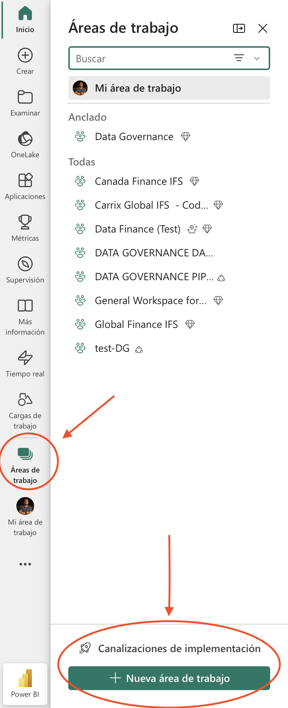{fig-align="center" width="130"}

Como siguiente paso, vamos a crear un objeto de Fabric (un notebook) mediante las siguientes opciones:

::: {layout-ncol="2"}
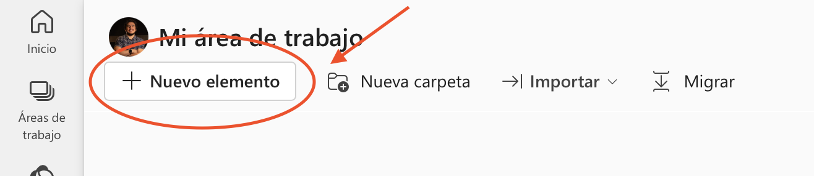{fig-align="center" width="300"}

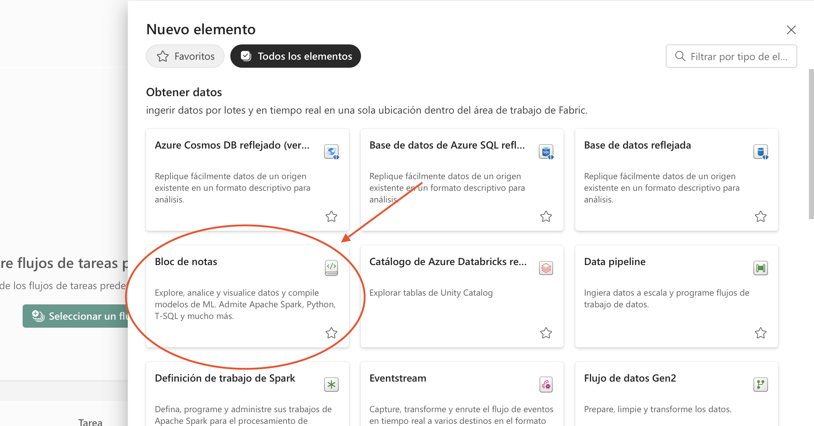{fig-align="center" width="300"}
:::

Una vez abierto, ya casi podemos comenzar a escribir nuestro código, pero antes de eso, los notebooks por defecto utilizan como motor Spark con Python (PySpark), por lo que tendremos que cambiarlo al lenguaje R mediante la siguiente opción:

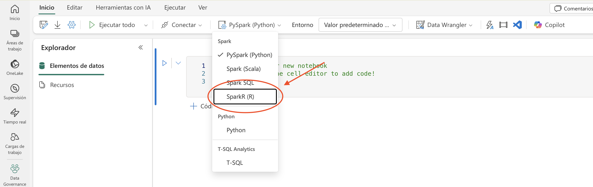{fig-align="center" width="300"}

Y ahora si, ya estamos listos para escribir (o en este caso, copiar y pegar) el código del proyecto. Para guardar los elementos adicionales, como archivos JSON referentes a la API key de Gmail, tendremos que ligar un lakehouse al proyecto. Esto lo podemos hacer mediante la siguiente opción, que se encuentra en un *sidebar* del lado izquierdo:

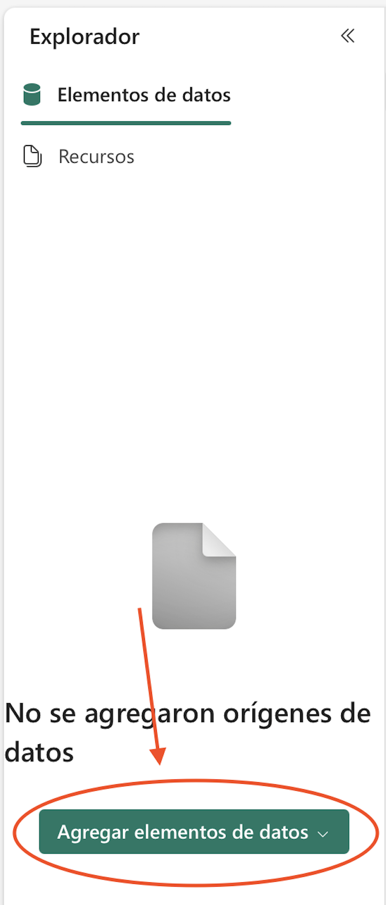{fig-align="center" width="150"}

Una vez creado, todos los archivos que guardemos se encontrarán en la subcarpeta `Files`, a la cual podremos acceder para escribir o leer elementos mediante la ruta genérica `/lakehouse/default/Files/mi_archivo`. Esta ruta siempre será la misma en los diversos notebooks y proyectos que armemos (exceptuando el nombre del archivo, lógicamente). Por lo tanto, el único cambio en el código original de nuestro ETL será agregar esta ruta a los archivos, siendo el caso del JSON para la API de Gmail:

```{r, eval=FALSE}
library(gmailr)

gm_auth_configure(path = "/lakehouse/default/Files/archivo_json_desc.json")
gm_auth(email = T, cache = ".secret")
```

Podremos ver todos los archivos que guardemos en la ruta de la imagen @fig-lakehouse.

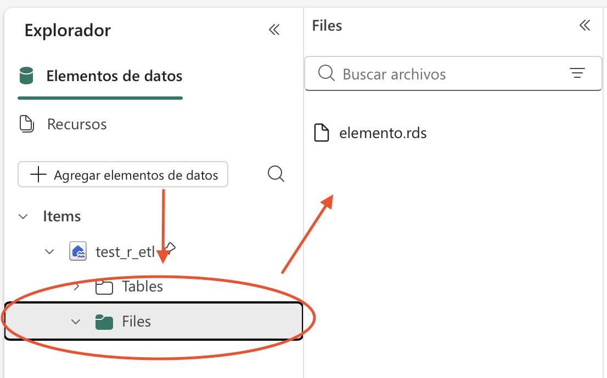{#fig-lakehouse fig-align="center" width="300"}

Como último paso, una vez que tengamos todo el código en nuestro notebook, será automatizar su ejecución mediante las siguientes opciones:

::: {layout-ncol="2"}
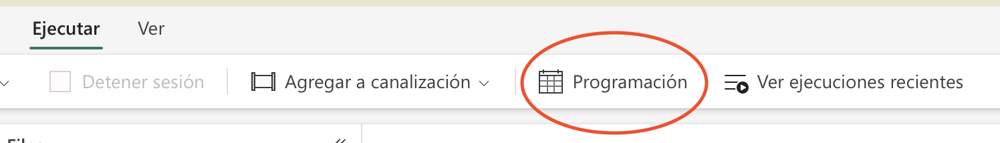{fig-align="center" width="300"}

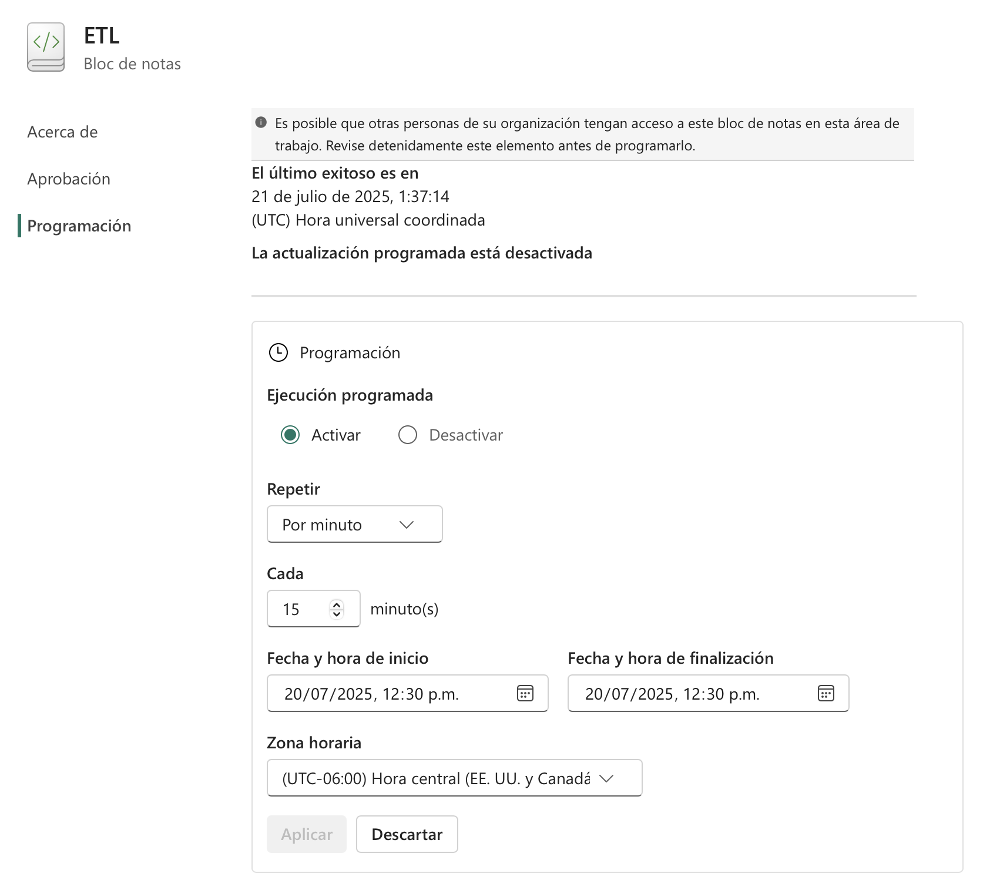{fig-align="center" width="300"}
:::

Simplemente estableciendo la frecuencia de ejecución y la zona horaria.



#### Github actions

Automatizar tareas mediante Github actions es bastante sencillo y, como un plus adicional, si son tareas que no consumen demasiados recursos, entonces es una opción completamente gratuita, ya que no tiene un límite de uso para repositorios públicos, mientras que para repositorios privados tenemos 2,000 minutos gratuitos de ejecución al mes (al momento en el que escribo este texto, espero que no haya cambiado eso cuando este libro esté publicado). Un aspecto particuarmente interesante de esta herramienta, es que podemos ejecutar los procesos que hagamos en servidores de Linux, Windows o MacOS, dependiendo de lo que necesitemos para cada caso.

Ahora bien, ¿cuál es el proceso para poder automatizar estas tareas? En realidad es bastante simple, ya que basta con definir un workflow, el cual no es más que un archivo de configuración escrito en formato **YAML**. Dicho archivo debe ubicarse en el repositorio, dentro del directorio `.github/workflows/`, y en él se especifican tres elementos fundamentales: 
- **El evento disparador**: define cuándo se ejecutará la automatización, por ejemplo, al hacer un push a una rama específica, al abrir un pull request, o de forma programada mediante una expresión *cron*.

- **El entorno de ejecución**: indica el sistema operativo y la versión del runner sobre el cual se ejecutarán las tareas.

- **Los pasos del proceso (steps)**: describen, de manera secuencial, los comandos o acciones que se desean ejecutar, como instalar dependencias, correr scripts, ejecutar pruebas o desplegar resultados.

Una vez que el archivo de workflow es añadido al repositorio, GitHub se encarga automáticamente de ejecutar el flujo de trabajo cada vez que se cumpla la condición definida en el disparador.

Para aterrizar estas ideas, vamos ahora a crear un ejemplo de un archivo YAML, basado en nuestro proyecto de recolección de datos climáticos. Como mencioné anteriormente, el guardar contraseñas e información sensible dentro del código de nuestro desarrollo y escribirlas explícitamente es una práctica bastante peligrosa, por lo que como primer paso vamos a enmascarar toda esta información como `secrets` en el repositorio de Github, de modo que estos valores no sean visibles ni en el código fuente ni en el historial del repositorio. Para ello, debemos ir a la sección **Settings** de nuestro repositorio, ingresar a **Secrets and variables**, dar click en **Actions** y definir ahí todas las credenciales necesarias para el correcto funcionamiento del data pipeline, tal como puedes ver en la siguiente imagen:

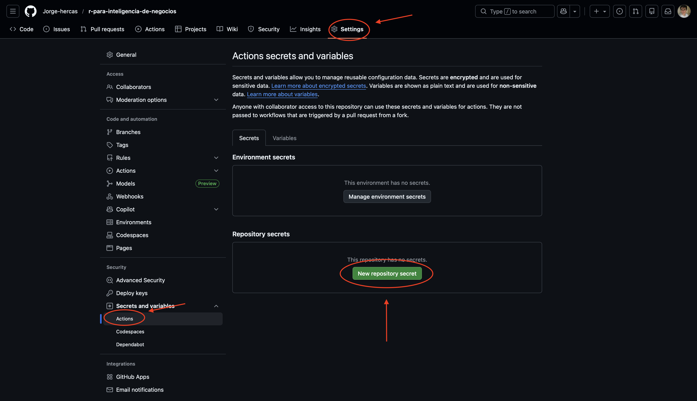{fig-align="center" width="300"}

En el caso de este proyecto, los secrets mínimos que necesitaremos son los siguientes: 

- `OPENWEATHER_API_KEY`: Nuestra API Key para openweather.
- `DB_HOST`, `DB_PORT`, `DB_NAME`, `DB_USER` y `DB_PASSWORD`: Credenciales de conexión a la base de datos MySQL donde estamos almacenando la información climática.

De igual forma necesitaríamos la información de la API Key de Gmail, sin embargo, la voy a obviar por el momento, ya que para una sesión no interactiva tendríamos que configurar una cuenta de servicio (Service Account), como mencioné anteriormente.

Regresando a nuestra información sensible, ya que terminamos de definir nuestros `secrets`, simplemente tendremos que llamarlos mediante nuestro archivo `YAML`, el cual tendrá definido este paso antes de llamar al código de R, porque obviamente estos valores deben existir para que el proceso pueda ser ejecutado. El archivo `YAML` se verá de la siguiente manera:

```{r, eval=FALSE}
name: Data pipeline de clima - OpenWeather

on:
  push:
    branches:
      - main
  schedule:
    - cron: "0 */6 * * *"   # Ejecución cada 6 horas
  workflow_dispatch:

jobs:
  pipeline-clima:
    runs-on: ubuntu-latest

    steps:
      - name: Clonar repositorio
        uses: actions/checkout@v4

      - name: Configurar R
        uses: r-lib/actions/setup-r@v2
        with:
          r-version: "4.3.2"

      - name: Instalar dependencias del sistema
        run: |
          sudo apt-get update
          sudo apt-get install -y libmysqlclient-dev

      - name: Instalar librerías de R
        run: |
          Rscript -e 'install.packages(
            c("DBI","RMySQL","dplyr","tidyr","OweatherR","gmailr"),
            repos = "https://cloud.r-project.org"
          )'

      - name: Ejecutar pipeline de clima
        env:
          OPENWEATHER_API_KEY: ${{ secrets.OPENWEATHER_API_KEY }}
          DB_HOST: ${{ secrets.DB_HOST }}
          DB_PORT: ${{ secrets.DB_PORT }}
          DB_NAME: ${{ secrets.DB_NAME }}
          DB_USER: ${{ secrets.DB_USER }}
          DB_PASSWORD: ${{ secrets.DB_PASSWORD }}
        run: |
          Rscript pipeline_clima.R
```

En este archivo se pueden identificar claramente los tres componentes fundamentales de un workflow de GitHub Actions. Primero, el evento disparador, que en este caso incluye tanto ejecuciones automáticas programadas cada seis horas y una ejecución manual. Segundo, el entorno de ejecución, definido mediante un *runner* con sistema operativo Windows. Y tercero, los pasos del proceso, donde se clona el repositorio, se configura el entorno de R, se instalan las dependencias necesarias y finalmente se ejecuta el script principal del pipeline.

Lógicamente, el código R original de nuestro pipeline debe ser actualizado para que, en lugar de escribir directamente la información sensible de acceso a los datos que estamos usando, lea los respectivos `secrets` de nuestro repositorio, cosa que podemos hacer de manera muy sencilla simplemente llamando a estos valores como variables de entorno:

```{r, eval=FALSE}
# OpenWeather
api_key <- Sys.getenv("OPENWEATHER_API_KEY")

# Base de datos
conexion <- DBI::dbConnect(
  RMySQL::MySQL(),
  dbname   = Sys.getenv("DB_NAME"),
  host     = Sys.getenv("DB_HOST"),
  port     = as.integer(Sys.getenv("DB_PORT")),
  user     = Sys.getenv("DB_USER"),
  password = Sys.getenv("DB_PASSWORD")
)
```

Con esto, nuestro data pipeline queda completamente integrado a GitHub Actions, permitiéndonos ejecutar de forma recurrente y controlada todo el proceso de extracción y carga, cerrando así el ciclo completo de automatización presentado en este capítulo.


